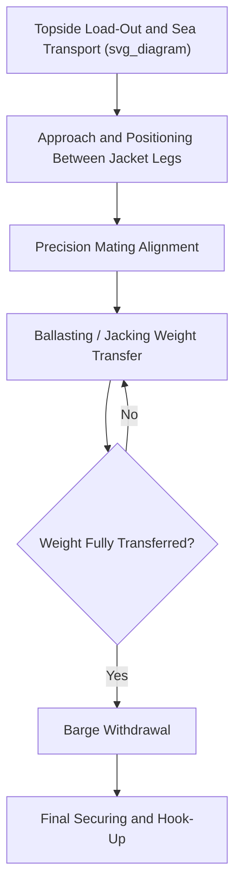

## Float-Over Installation of Platform Topsides

### Definition and Scope

Float-over installation is a method of placing large offshore platform topsides (the upper structure containing process equipment, living quarters, and operational facilities) directly onto a fixed jacket or substructure without using a heavy-lift crane vessel. Instead, the topside is transported on a barge or specialized vessel, floated into position between the legs of the substructure, and transferred onto it through a combination of ballasting operations and mechanical support systems. This method is typically used for topsides too heavy for available crane vessel capacity, or where using a crane vessel would be significantly more costly or logistically constrained.

### Why Float-Over Is Used

**Key Points**

- Float-over avoids the need for the world's largest heavy-lift crane vessels, which are limited in number and can carry substantial day rates and mobilization costs.
- It enables installation of very large, single-piece integrated topsides (sometimes exceeding 20,000–30,000 t) that would exceed or strain even major crane vessel capacities.
- Reducing the number of lift operations by installing a fully integrated topside in one float-over event can reduce offshore installation schedule compared to multiple crane lifts of topside modules.
- The method shifts engineering complexity from crane capacity to precise ballasting control, motion prediction, and mechanical support system design.

### Core Float-Over Methods

| Method | Description |
| --- | --- |
| Ballast system float-over | Barge ballasts down to lower the topside onto the jacket's support structure as the barge is floated between the jacket legs |
| Jacking system float-over | Topside is supported on jacks aboard the barge, which are used to precisely lower the topside onto the jacket after positioning |
| Deck support unit (DSU) method | Temporary support structures on the jacket receive the topside's legs/framing during transfer, later replaced or reinforced for permanent operation |
| Self-installing/integrated leg method | Jacket legs themselves incorporate mechanisms to receive and lock the topside during the float-over sequence |

### Float-Over Installation Sequence

1. **Topside load-out and sea transport** — the completed topside is loaded onto the transport barge at the fabrication yard and transported to the offshore installation site, with sea-fastening designed per the principles covered in the Marine Warranty Surveying chapter.
2. **Approach and positioning** — the barge is maneuvered, typically with tug assistance, into position between the jacket's legs, guided by pre-installed guidance/fendering systems on the jacket.
3. **Mating** — the barge is precisely positioned so the topside's support points align with the jacket's receiving structure, often to tolerances of centimeters despite the scale of the equipment involved.
4. **Ballasting/jacking transfer** — the barge's ballast tanks are systematically flooded (or jacks are operated) to transfer the topside's weight progressively from the barge onto the jacket structure.
5. **Barge withdrawal** — once weight transfer is complete and the topside is fully supported by the jacket, the barge is de-ballasted and withdrawn from between the jacket legs.
6. **Final securing and hook-up** — temporary support systems are replaced or reinforced with permanent connections, and topside utilities are connected to the substructure/pipeline infrastructure.

### Engineering Considerations

**Key Points**

- **Motion prediction and weather windows**: float-over mating operations require very calm sea states (often limited to significant wave heights of well under 1 m, though exact limits are project- and vessel-specific), making weather window analysis (see: Voyage Routing and Weather Window Analysis) especially critical.
- **Ballast system precision**: the ballasting sequence must transfer load smoothly and symmetrically to avoid inducing excessive stress on either the topside structure or the jacket during the transfer.
- **Fendering and guidance systems**: mechanical guide systems on the jacket help constrain the barge's position during approach and mating, reducing reliance on station-keeping alone under environmental loading.
- **Contact/impact load management**: even with guidance systems, some impact loading between barge and jacket during final positioning must be anticipated and designed for in both structures.

[Inference] Specific sea state limits and tolerances cited are representative of the scale of precision required in float-over operations rather than universal fixed values; actual limits are established through project-specific engineering analysis for each installation.

### Example: Float-Over Installation of an Integrated Topside

**Example**

A 25,000 t integrated topside is installed onto a fixed jacket using the ballast system method:

1. The topside is transported from the fabrication yard on a purpose-designed transport barge, with sea-fastening designed for the specific voyage route and season.
2. On arrival at the installation site, tugs maneuver the barge toward the jacket during a forecast calm weather window, guided by fender posts pre-installed on the jacket structure.
3. The barge is positioned so the topside's leg support points align precisely over the jacket's receiving structure — a process that may take several hours of careful maneuvering.
4. Ballast tanks are flooded in a pre-planned sequence, lowering the barge (and topside) at a controlled rate until the topside's full weight transfers onto the jacket's permanent support structure.
5. The now-unladen barge is de-ballasted and carefully withdrawn from between the jacket legs, and hook-up crews begin connecting the topside to substructure systems.

### Diagram: Float-Over Installation Sequence

### Comparison: Float-Over vs Crane Vessel Installation

| Factor | Float-Over | Heavy-Lift Crane Vessel |
| --- | --- | --- |
| Topside weight capability | Very high (tens of thousands of tonnes) | Limited by available crane vessel capacity |
| Weather sensitivity | Very high — requires calm, precise mating conditions | Generally lower, though still weather-limited |
| Equipment availability | Barge and jacket-specific systems, less globally scarce | Limited number of ultra-heavy-lift crane vessels worldwide |
| Engineering complexity | High — ballasting precision, motion prediction, guidance systems | High — rigging and crane capacity engineering |
| Typical use case | Very large, fully integrated topsides | Modular topsides or smaller integrated units |

### Common Risks and Mitigation

| Risk | Mitigation |
| --- | --- |
| Unfavorable weather delaying the mating window | Extended weather monitoring, flexible scheduling around forecast windows |
| Misalignment during mating | Precision guidance/fendering systems, real-time positioning monitoring |
| Uneven load transfer causing structural stress | Carefully sequenced, symmetric ballasting plan with continuous monitoring |
| Barge-jacket impact damage during positioning | Fender system design accounting for expected impact energy |
| Schedule risk from single-event dependency | Contingency planning for delayed mating attempts, barge station-keeping capability during holds |

### Conclusion

Float-over installation offers a means of placing very large, fully integrated platform topsides onto fixed substructures without relying on scarce heavy-lift crane vessel capacity, at the cost of significantly increased sensitivity to weather conditions and precision engineering requirements during the mating operation. Success depends heavily on accurate weather window analysis, precise ballasting control, and robust guidance/fendering system design.

**Related Topics**

- Voyage Routing and Weather Window Analysis
- Sea-Fastening Design and Lashing Calculations
- Role and Scope of the Marine Warranty Surveyor
- Jacket and Substructure Installation Methods
- Heavy-Lift Vessel Types and Onboard Crane Configurations
- Offshore Hook-Up and Commissioning Operations