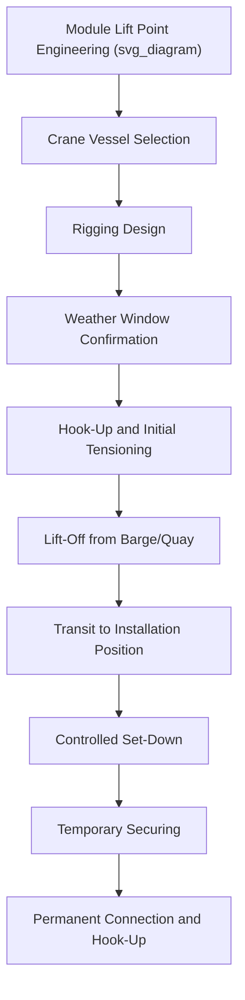

## Lift Installation for Offshore Modules

### Definition and Scope

Lift installation for offshore modules is the process of placing platform topside modules, jacket components, or other offshore structures onto their final position using heavy-lift crane vessels, as opposed to float-over or other non-crane methods. This remains the most widely used offshore installation technique globally, particularly for modular topsides, subsea structures, and smaller integrated units that fall within the capacity range of available crane vessels.

### Crane Vessel Types Used in Offshore Lift Installation

**Key Points**

- **Semi-submersible crane vessels (SSCVs)**: floating vessels with submersible hulls providing exceptional stability, typically fitted with revolving cranes rated from several hundred to over 10,000 t (in tandem for the largest units).
- **Monohull crane vessels**: ship-shaped hulls, generally offering higher transit speed than SSCVs but somewhat greater motion response in a seaway, with capacities spanning a wide range depending on vessel size.
- **Jack-up crane vessels**: self-elevating platforms that jack up out of the water for a fixed, motion-free lifting platform, commonly used in shallower water for smaller to medium modules requiring high precision.
- **Sheerleg crane vessels**: non-revolving or limited-slew crane vessels, often very high capacity but less flexible in lift geometry, used for specific heavy, straightforward lifts.

### Lift Installation Planning Process

1. **Module and lift point engineering** — verification that the module's designed lift points (padeyes, trunnions) are adequate for the intended crane vessel's rigging configuration and the calculated lift loads including dynamic amplification.
2. **Crane vessel selection** — matching required lift capacity (including safety factors) at the necessary lift radius and height to available crane vessel specifications.
3. **Rigging design** — engineering of slings, shackles, spreader bars, or lift frames appropriate to the module's geometry and center of gravity.
4. **Motion and weather analysis** — assessment of vessel motion limits for safe lift execution, feeding into weather window planning (see: Voyage Routing and Weather Window Analysis).
5. **Lift plan and method statement development** — detailed procedural document covering the full lift sequence, personnel roles, and contingency procedures, subject to review per method statement compliance verification processes.
6. **Execution** — the physical lift operation, from initial hook-up through final placement and initial securing on the receiving structure.
7. **Final connection and hook-up** — permanent structural connection of the module to the substructure or adjacent modules, followed by utility and systems hook-up.

### Dynamic Amplification in Offshore Lifts

Offshore lifts involve additional dynamic considerations beyond onshore crane operations, since the crane vessel itself is subject to wave-induced motion during the lift. The effective lift load must account for a Dynamic Amplification Factor (DAF):

$$W_{design} = W_{static} \times DAF$$

where $W_{static}$ is the module's static weight and $DAF$ accounts for additional dynamic loading from vessel motion, hook/wire dynamics, and lift-off/set-down impact effects. DAF values are typically derived from motion analysis specific to the crane vessel, sea state, and lift phase (lift-off from a transport barge is often more dynamically demanding than the final set-down phase).

[Inference] Specific DAF values vary substantially by crane vessel type, sea state, lift phase, and applicable engineering standard (such as DNV or class society lifting guidelines); actual project DAF values should be derived from the crane vessel operator's engineering analysis for the specific lift rather than a generic assumed factor.

### Skidding and Load Transfer for Deck-to-Deck Lifts

For modules being lifted directly from a transport barge (rather than from quay), an additional consideration is the lift-off dynamics as the module separates from the barge deck, which is influenced by the relative motion between the crane vessel and the transport barge. This is often managed through:

- Careful timing of the lift-off within the vessel motion cycle
- Use of soft slings or shock-absorbing rigging elements to reduce peak dynamic loads
- Real-time monitoring of relative vessel motions during the critical lift-off moment

### Example: Lift Installation of a Compression Module

**Example**

A 1,200 t gas compression module is to be lifted from a transport barge and installed onto a fixed platform jacket using a semi-submersible crane vessel rated at 1,600 t single-hook capacity.

1. Lift engineering confirms the module's four padeyes are each rated to accept the calculated leg loads, including a DAF of 1.3 derived from motion analysis for the anticipated sea state during the lift-off phase.
2. The rigging design uses a four-leg sling arrangement with sling angles verified to remain above the minimum acceptable angle from horizontal, keeping leg tensions within padeye capacity.
3. A weather window with significant wave height forecast below the crane vessel's approved lift operating limit is identified and confirmed close to the planned lift date.
4. The lift is executed in phases: hook-up and initial tensioning, lift-off from the barge (the most dynamically sensitive phase), transit to position over the jacket, and controlled set-down onto pre-installed receiving structure.
5. Once set down, the module is temporarily secured, followed by permanent structural welding/bolting and subsequent utility hook-up.

### Diagram: Offshore Module Lift Installation Sequence

### Comparison: Lift Installation vs Float-Over

| Factor | Crane Vessel Lift Installation | Float-Over Installation |
| --- | --- | --- |
| Module/topside size limit | Limited by crane vessel capacity | Can handle much larger, fully integrated topsides |
| Weather sensitivity | Moderate to high, phase-dependent | Very high, particularly during mating |
| Equipment availability | More crane vessels available across capacity ranges | Requires specific barge/jacket compatible systems |
| Installation flexibility | High — can install modules individually as fabrication completes | Lower — typically a single large installation event |
| Typical application | Modular topsides, subsea structures, smaller integrated units | Very large, fully integrated topsides |

### Common Risks and Mitigation

| Risk | Mitigation |
| --- | --- |
| Underestimated dynamic amplification during lift-off | Rigorous motion analysis specific to vessel, sea state, and lift phase |
| Rigging point failure under calculated leg loads | Independent verification of padeye/trunnion capacity against full design load range |
| Crane vessel unavailability delaying schedule | Early booking, contingency vessel identification for critical path lifts |
| Weather-related lift postponement | Conservative weather window planning, flexible scheduling buffer |
| Relative motion damage during barge lift-off | Real-time motion monitoring, optimized lift timing within motion cycle |

### Conclusion

Lift installation for offshore modules remains the predominant method for placing platform topsides, modules, and subsea structures using heavy-lift crane vessels, requiring careful integration of rigging engineering, dynamic amplification analysis, and weather window planning. While generally more flexible than float-over installation for individual module handling, it remains constrained by available crane vessel capacity and carries its own distinct dynamic loading and weather sensitivity considerations throughout each phase of the lift.

**Related Topics**

- Float-Over Installation of Platform Topsides
- Voyage Routing and Weather Window Analysis
- Sea-Fastening Design and Lashing Calculations
- Tandem and Multi-Crane Lift Planning
- Heavy-Lift Vessel Types and Onboard Crane Configurations
- Method Statement Compliance Verification