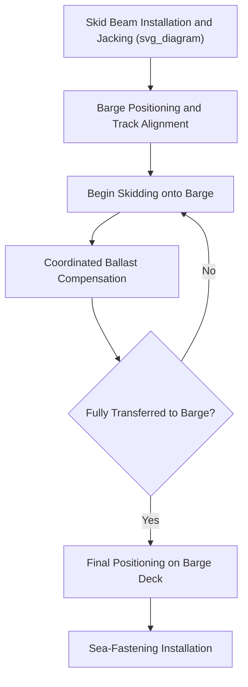

## Skidding and Load-Out onto Cargo Barges

### Definition and Scope

Skidding and load-out is the process of transferring a completed module, topside, or other large fabricated structure from its construction position at a fabrication yard onto a transport barge for sea voyage to the installation site. Skidding refers specifically to the technique of sliding the structure along a track system using low-friction skid shoes or rollers, as opposed to lifting it with a crane. This method is the dominant load-out technique for structures too heavy or physically awkward for practical crane lifting directly onto a barge.

### Why Skidding Is Used for Load-Out

**Key Points**

- Many topsides and modules exceed the practical lifting capacity available at a fabrication yard, making crane-based load-out infeasible.
- Skidding distributes the load over a continuous track and skid shoe system rather than concentrated crane hook points, reducing peak structural loads on the module during the operation.
- The technique allows precise, controlled, low-speed movement, which is valuable when transferring a very heavy structure across the yard-to-barge interface where alignment and timing (relative to tide and barge ballast) are critical.
- Skidding can be combined with strand jacks, hydraulic push/pull systems, or winches depending on the required force and control precision.

### Core Components of a Skidding System

| Component | Function |
| --- | --- |
| Skid beams/tracks | Fixed or semi-permanent rails along which the structure slides |
| Skid shoes | Low-friction interface elements (often PTFE-faced) attached beneath the structure's skid beams |
| Grease/lubrication system | Reduces friction coefficient between skid shoe and track surface |
| Pulling system (strand jacks/winches) | Provides the motive force to move the structure along the track |
| Jacking/lifting system (if used) | Raises the structure to transfer weight from construction supports onto the skid system initially |

### Load-Out Sequence

1. **Structure preparation** — skid beams or shoes are installed beneath the module at the fabrication position, and the structure is jacked or lifted slightly to transfer weight from construction supports onto the skid system.
2. **Barge positioning** — the transport barge is positioned and ballasted alongside the quay so its deck aligns with the skid track height and the fabrication yard's rail system.
3. **Skidding onto barge** — the structure is progressively skidded from the quay-side track onto the barge's onboard skid track, typically in a slow, continuous, monitored movement.
4. **Ballast compensation during transfer** — as weight progressively transfers onto the barge, the barge's ballast system is actively managed to maintain trim and freeboard within acceptable limits throughout the operation, since an unmanaged barge would otherwise list or trim as load shifts onto it.
5. **Final positioning on barge** — once fully aboard, the structure is skidded to its final planned position on the barge deck for the voyage.
6. **Sea-fastening installation** — the structure is secured for sea transport per the sea-fastening design principles covered in the Marine Warranty Surveying chapter.

### Ballast Management During Skidding

**Key Points**

- As the structure's weight progressively shifts from the fixed quay onto the floating barge, the barge would naturally trim and heel if ballast were not actively adjusted.
- Ballast compensation is calculated in coordination with the skidding sequence, so that for each increment of weight transferred, a corresponding ballast adjustment maintains the barge within acceptable trim and heel limits.
- This coordination is particularly critical to keep the skid track alignment between quay and barge consistent throughout the operation — misalignment could cause the structure to bind or derail from the track.
- Tidal changes during a lengthy load-out operation must also be accounted for, since a rising or falling tide changes the barge's relative deck height independent of ballast adjustments.

### Example: Load-Out of a 15,000 t Topside

**Example**

A 15,000 t integrated topside is loaded out from a fabrication yard onto a transport barge using a strand jack-assisted skidding system:

1. Skid shoes are installed beneath the topside's main support beams, and the structure is jacked slightly to transfer weight from temporary construction supports onto the skid shoes.
2. The transport barge is ballasted to align its deck skid track precisely with the quay-side track, accounting for the current tidal state.
3. Strand jacks progressively pull the topside along the track at a controlled rate (often on the order of a few meters per hour for very heavy structures), while the barge's ballast control team continuously adjusts ballast to compensate for the shifting weight and maintain trim within specified limits.
4. Once approximately 60% of the topside's weight has transferred onto the barge (a critical phase where the load distribution between quay and barge changes most rapidly), extra vigilance is applied to ballast response timing.
5. The topside reaches its final position fully aboard the barge, ballast is finalized for the sea-transport loading condition, and sea-fastening installation begins.

### Diagram: Skidding Load-Out Sequence

### Alternative and Complementary Load-Out Methods

| Method | Description | Typical Use Case |
| --- | --- | --- |
| Skidding (strand jack/winch) | Sliding on low-friction track system | Very heavy, large-footprint structures |
| Trailer/SPMT load-out | Structure driven onto barge via ramp using SPMTs | Structures compatible with SPMT support points and ramp access |
| Direct lift load-out | Crane lifts structure directly onto barge | Structures within crane capacity, simpler geometry |
| Float-on load-out | Barge submerges partially to receive a structure floated or rolled into position | Very large structures, or where skidding/SPMT access is impractical |

### Common Risks and Mitigation

| Risk | Mitigation |
| --- | --- |
| Skid track misalignment between quay and barge | Precise ballast and tide-coordinated alignment verification before and during skidding |
| Excessive friction or binding during skid movement | Adequate lubrication system maintenance, real-time pulling force monitoring |
| Barge trim/heel exceeding limits during weight transfer | Pre-calculated ballast sequence matched to skidding increments, real-time monitoring |
| Tidal change during extended operation affecting alignment | Operation scheduling around tidal windows, continuous tide monitoring during execution |
| Structural overstress during transfer phase | Engineering verification of skid beam and structure loading at each transfer increment |

### Conclusion

Skidding and load-out onto cargo barges provides a controlled, crane-independent method for transferring very heavy fabricated structures from land-based construction to sea transport, relying on precise coordination between the skidding pull system and the barge's ballast management. Success depends on careful engineering of the skid track system, tightly coordinated ballast compensation, and close monitoring throughout the weight transfer process to avoid misalignment or structural overstress.

**Related Topics**

- Sea-Fastening Design and Lashing Calculations
- Lift Installation for Offshore Modules
- Float-Over Installation of Platform Topsides
- Laydown Area Planning and Pre-Assembly Yards
- SPMT Axle Load Distribution and Route Engineering
- Vessel Stability and Ballast Management During Cargo Operations