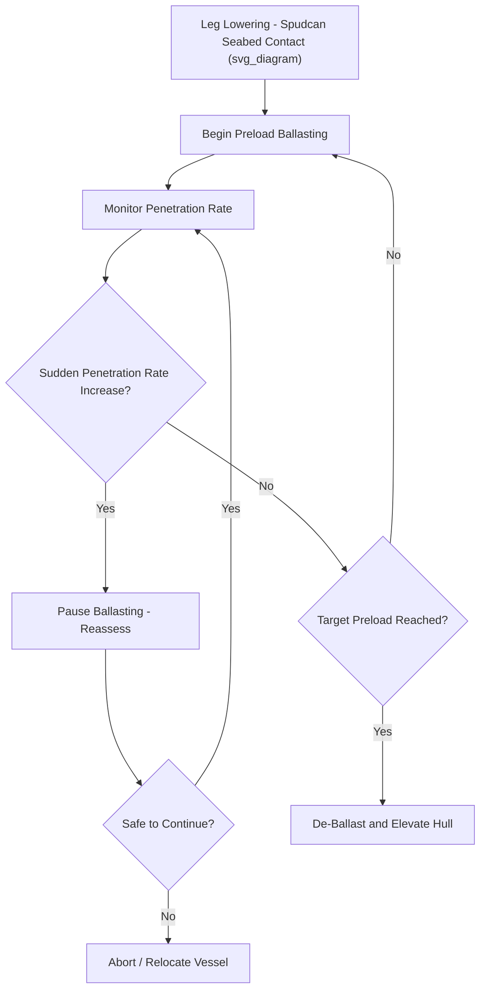

## Jack-Up Vessel Operations and Seabed Bearing Capacity

### Definition and Scope

A jack-up vessel (or jack-up rig/barge) is a mobile offshore platform equipped with movable legs that can be lowered to the seabed and used to elevate the hull above the water surface, providing a stable, motion-free working platform. Jack-up vessels are widely used in offshore installation, wind farm construction, and heavy-lift operations where a fixed, non-floating work platform offers significant advantages over a conventional floating crane vessel. Seabed bearing capacity assessment is the geotechnical engineering process that determines whether the seabed at a given location can safely support the jack-up's leg loads without excessive penetration, punch-through, or instability.

### Why Jack-Up Vessels Are Used

**Key Points**

- Once elevated, a jack-up provides a completely motion-free platform, eliminating the wave-induced motion challenges that affect floating crane vessels during precision lift operations.
- This stability makes jack-ups particularly well-suited to offshore wind turbine installation, where repetitive, precise lifts of towers, nacelles, and blades benefit from a stationary platform.
- Jack-ups are also used for platform installation, decommissioning, and maintenance work requiring stable access over an extended period.
- The trade-off for this stability is a dependency on suitable seabed conditions and water depth limits (jack-up legs have a maximum practical length, constraining operating water depth).

### Jack-Up Vessel Components

| Component | Function |
| --- | --- |
| Hull | Main buoyant structure housing equipment, accommodation, and (if applicable) cranes |
| Legs | Movable structural legs (typically 3–6 depending on design) that extend to the seabed |
| Spudcans | Foundation elements at the base of each leg that penetrate the seabed to provide bearing support |
| Jacking system | Mechanical or hydraulic system that raises/lowers the legs relative to the hull, elevating the hull once legs are seated |
| Preloading system | Ballast system used to apply additional load to the legs during preloading to verify seabed capacity before full elevation |

### Jack-Up Operation Sequence

1. **Site positioning** — the vessel is towed or self-propelled to the installation location and positioned using DP (dynamic positioning) or anchor systems as applicable.
2. **Leg lowering** — legs are lowered until the spudcans contact the seabed.
3. **Preloading** — ballast water is added to increase the effective load on the spudcans beyond the anticipated operational load, verifying the seabed can bear the required load with an appropriate margin before the vessel is fully elevated and dependent on that support.
4. **De-ballasting and elevation** — after successful preloading, ballast is removed and the jacking system raises the hull above the water surface to the required air gap.
5. **Operations** — installation, lifting, or maintenance work is conducted from the stable elevated platform.
6. **Lowering and leg retraction** — upon completion, the hull is lowered back to the water, legs are retracted, and the vessel is repositioned or demobilized.

### Seabed Bearing Capacity and Punch-Through Risk

**Key Points**

- Seabed bearing capacity assessment must account for soil stratigraphy — a strong surface layer overlying a much weaker layer creates a **punch-through risk**, where the spudcan can suddenly penetrate through the strong layer into the weak layer once a critical load is exceeded.
- Punch-through events can occur rapidly and cause sudden, significant vessel heel, posing serious safety risk to personnel and equipment aboard.
- The preloading process is specifically designed to identify punch-through risk before the vessel is fully elevated and dependent on the leg support — a sudden increase in penetration rate during preloading is a key warning indicator.
- Seabed assessment typically combines geophysical survey data, geotechnical borehole/cone penetration test (CPT) data, and established bearing capacity calculation methods (such as those published by SNAME or similar industry guidance).

### Bearing Capacity Calculation Fundamentals

A simplified bearing capacity concept for a spudcan foundation follows classical soil mechanics bearing capacity theory:

$$q_{ult} = c \times N_c + q \times N_q + 0.5 \times \gamma \times B \times N_\gamma$$

where $q_{ult}$ is ultimate bearing capacity, $c$ is soil cohesion, $q$ is effective overburden pressure, $\gamma$ is soil unit weight, $B$ is spudcan effective diameter, and $N_c$, $N_q$, $N_\gamma$ are bearing capacity factors dependent on soil friction angle. For layered soils (the punch-through scenario), specialized layered bearing capacity methods are applied rather than this simplified single-layer formula.

[Inference] This formula represents classical bearing capacity theory (a well-established geotechnical engineering foundation) rather than a project-specific calculation; actual jack-up site assessments use specialized methods addressing layered soils, spudcan geometry effects, and industry-recognized guidance documents, and should always be performed by a qualified geotechnical engineer using project-specific site investigation data.

### Example: Punch-Through Risk Assessment

**Example**

A jack-up vessel is planned for a site with a geotechnical profile showing a 4 m layer of dense sand overlying a thick layer of soft clay.

1. Geotechnical analysis identifies this stratigraphy as a classic punch-through risk configuration, since the dense sand layer could initially provide apparent adequate bearing capacity while masking the much weaker clay beneath.
2. A layered bearing capacity analysis calculates the load at which punch-through could initiate, and this is compared against the planned preload requirement.
3. Based on the analysis, the preload sequence is planned with closely monitored penetration rate tracking, with pre-defined action criteria (such as pausing ballasting) if penetration rate exceeds a threshold indicating potential punch-through onset.
4. During actual preloading, penetration rate is monitored in real time; if a sudden increase is observed, ballasting is paused immediately and the situation reassessed before proceeding further.

### Diagram: Jack-Up Preloading and Punch-Through Monitoring

### Applications in Heavy-Lift and Project Logistics

**Key Points**

- Offshore wind farm installation is a major application area, where jack-up vessels provide the stable platform needed for precise turbine tower, nacelle, and blade installation.
- Platform installation and decommissioning projects use jack-ups for both lift support and as stable work platforms for hook-up and disconnection activities.
- Jack-up barges are also used in nearshore and port-adjacent heavy-lift applications where a stable platform is needed but full floating crane vessel mobilization is not justified.

### Common Risks and Mitigation

| Risk | Mitigation |
| --- | --- |
| Punch-through during preloading | Comprehensive geotechnical site investigation, monitored preload sequence with abort criteria |
| Uneven leg penetration causing hull tilt | Sequenced, monitored leg-by-leg preloading with real-time level monitoring |
| Insufficient site investigation data | Adequate geotechnical survey scope (boreholes/CPTs) at all planned leg positions, not just the vessel centerpoint |
| Scour around spudcans during extended operations | Scour monitoring and protection measures for extended-duration deployments |
| Leg extraction difficulty after operations (suction effects) | Engineered extraction procedures accounting for soil suction, particularly in clay seabeds |

### Conclusion

Jack-up vessel operations provide a stable, motion-free platform highly valued for precision offshore installation work, but this stability is entirely dependent on adequate seabed bearing capacity assessment and careful preloading procedures to detect punch-through risk before full elevation. Rigorous geotechnical site investigation and monitored preloading remain essential safeguards against one of the most serious operational hazards in jack-up vessel deployment.

**Related Topics**

- Lift Installation for Offshore Modules
- Float-Over Installation of Platform Topsides
- Offshore Wind Component Port Infrastructure
- Quay Load-Bearing Capacity and Point Load Limits
- Voyage Routing and Weather Window Analysis
- Geotechnical Site Investigation Methods for Offshore Foundations