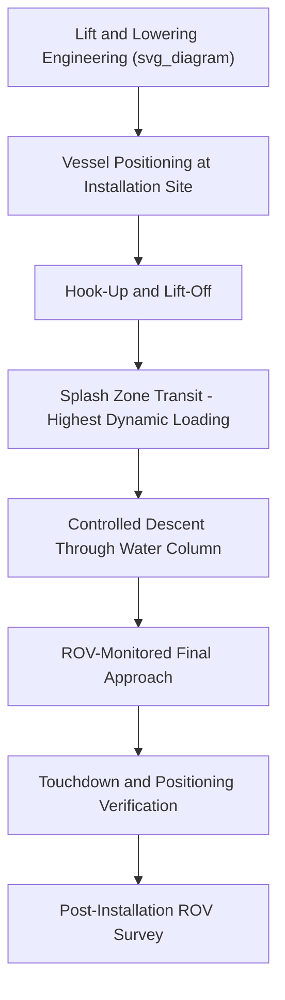

## Subsea and Heavy Module Installation Planning

### Definition and Scope

Subsea and heavy module installation planning is the engineering and logistics process for placing structures on or below the seabed — including subsea manifolds, protection structures, foundation templates, and heavy modules destined for underwater or seabed-supported positions — as distinct from topside installation onto a fixed or floating platform above the waterline. This discipline combines heavy-lift engineering, precise subsea positioning, and often remotely operated vehicle (ROV) support, since direct visual and physical access to the installation point is limited or impossible during final placement.

### Categories of Subsea and Heavy Module Installations

**Key Points**

- **Subsea manifolds and templates**: structures gathering or distributing fluid flow from multiple wells, installed on the seabed with precise orientation and connection point alignment requirements.
- **Protection structures**: covers or frames installed over subsea equipment to protect against fishing gear interaction or dropped object risk.
- **Foundation piles and mudmats**: structural foundations installed first to receive subsequent equipment, sometimes independently, sometimes integrated with the equipment itself.
- **Pipeline end terminations (PLETs) and manifolds**: specialized structures connecting pipelines to subsea infrastructure, often requiring very precise final orientation for subsequent tie-in operations.

### Installation Methods

| Method | Description | Typical Application |
| --- | --- | --- |
| Crane vessel lowering | Direct lowering via crane wire from surface vessel to seabed | Most common method for manifolds, templates, PLETs |
| Guideline/guidance system installation | Structure lowered along pre-installed guidewires for precise positioning | High-precision alignment requirements, congested seabed areas |
| ROV-assisted installation | ROV provides visual monitoring and manipulation support during final positioning | Virtually all deepwater installations, complementing crane lowering |
| Free-fall/controlled descent | Structure released to descend under gravity with minimal active guidance | Simple structures with generous positioning tolerance |

### Installation Planning Process

1. **Metocean and site data review** — current profiles, water depth, and seabed conditions at the installation location are reviewed to inform lowering method and vessel/crane selection.
2. **Lift and lowering engineering** — calculation of wire tension throughout the lowering profile, accounting for structure weight (both in air and submerged weight, since buoyancy significantly reduces effective load once submerged), and dynamic effects from vessel motion and wire dynamics.
3. **Positioning tolerance definition** — engineering definition of acceptable final position and orientation tolerances, driven by subsequent tie-in or connection requirements.
4. **ROV support planning** — determination of ROV requirements for monitoring, guidance assistance, and final connection verification.
5. **Method statement and contingency development** — detailed procedure covering the full lowering and positioning sequence, plus contingency actions for scenarios such as structure snagging, positioning failure, or weather deterioration mid-operation.
6. **Execution** — the physical installation, typically involving continuous ROV monitoring throughout the water column transit and final touchdown.
7. **Post-installation verification** — ROV survey confirming final position, orientation, and structural integrity, often supplemented by metrology survey for high-precision tie-in requirements.

### Submerged Weight and Wire Tension Considerations

**Key Points**

- A structure's effective weight while suspended in water is reduced by buoyancy according to Archimedes' principle, meaning wire tension during subsea lowering is generally lower than the equivalent lift in air, but this submerged weight must still be accurately calculated for crane and wire sizing.
- As a structure passes through the splash zone (the surface transition), it experiences complex dynamic loading from wave action on the crane vessel and the structure itself, often representing one of the highest-risk phases of the lowering sequence.
- Deep water lowering introduces additional wire weight and elasticity effects that must be accounted for in tension calculations, particularly for very deep installations where the wire's own weight becomes a significant factor.

$$W_{submerged} = W_{air} - (\rho_{water} \times V_{structure} \times g)$$

where $W_{submerged}$ is the effective weight underwater, $W_{air}$ is the structure's weight in air, $\rho_{water}$ is water density, $V_{structure}$ is the structure's submerged volume, and $g$ is gravitational acceleration.

### Example: Subsea Manifold Installation Planning

**Example**

A 150 t subsea manifold is planned for installation in 1,200 m water depth using a construction/lift vessel with ROV support:

1. Lowering engineering confirms wire tension throughout the descent, accounting for the manifold's submerged weight (significantly less than its 150 t weight in air due to buoyancy) plus the substantial weight of the deployed wire itself at that water depth.
2. Splash zone analysis identifies this phase as carrying the highest dynamic loading risk due to combined vessel heave and structure interaction with wave action at the surface, and a maximum sea state limit is established for commencing the lowering operation.
3. Positioning tolerance for the manifold's final orientation is specified based on subsequent pipeline tie-in requirements, informing the guidance system design.
4. ROVs monitor the manifold throughout its descent, providing real-time visual confirmation of orientation and clearance from any seabed obstructions as it approaches touchdown.
5. Following touchdown, an ROV survey confirms final position and orientation are within the specified tolerance, and the installation is recorded as complete pending subsequent tie-in operations.

### Diagram: Subsea Module Installation Sequence

### Interaction with Weather and Vessel Motion

Subsea installation operations are sensitive to weather conditions primarily through their effect on the surface vessel's motion, which is transmitted through the lifting wire to the structure, particularly during the splash zone transit phase. Weather window analysis (see: Voyage Routing and Weather Window Analysis) principles apply similarly here, with operation-specific limits often defined for significant wave height and vessel heave/roll during the critical splash zone period.

### Common Risks and Mitigation

| Risk | Mitigation |
| --- | --- |
| Excessive dynamic loading during splash zone transit | Conservative sea state limits for operation commencement, real-time motion monitoring |
| Positioning outside tolerance for tie-in requirements | Guidance systems, continuous ROV monitoring, pre-planned repositioning procedures |
| Wire tension miscalculation for deep water lowering | Comprehensive lowering engineering accounting for wire self-weight and elasticity at full deployment depth |
| Structure snagging on seabed obstructions during descent | Pre-installation seabed survey, ROV monitoring throughout descent |
| Loss of ROV support during critical phase | Redundant ROV capability or contingency procedures for temporary ROV loss |

### Conclusion

Subsea and heavy module installation planning requires integrating buoyancy-adjusted lift engineering, precise positioning methodology, and continuous ROV support to safely place structures at the seabed without direct human access to the installation point. The splash zone transit represents a particularly critical phase demanding conservative weather limits, while deep water lowering introduces distinct wire tension considerations not present in surface or topside lift operations.

**Related Topics**

- Lift Installation for Offshore Modules
- Voyage Routing and Weather Window Analysis
- Jack-Up Vessel Operations and Seabed Bearing Capacity
- ROV Operations in Offshore Construction
- Pipeline Tie-In and Subsea Connection Methods
- Geotechnical Site Investigation Methods for Offshore Foundations