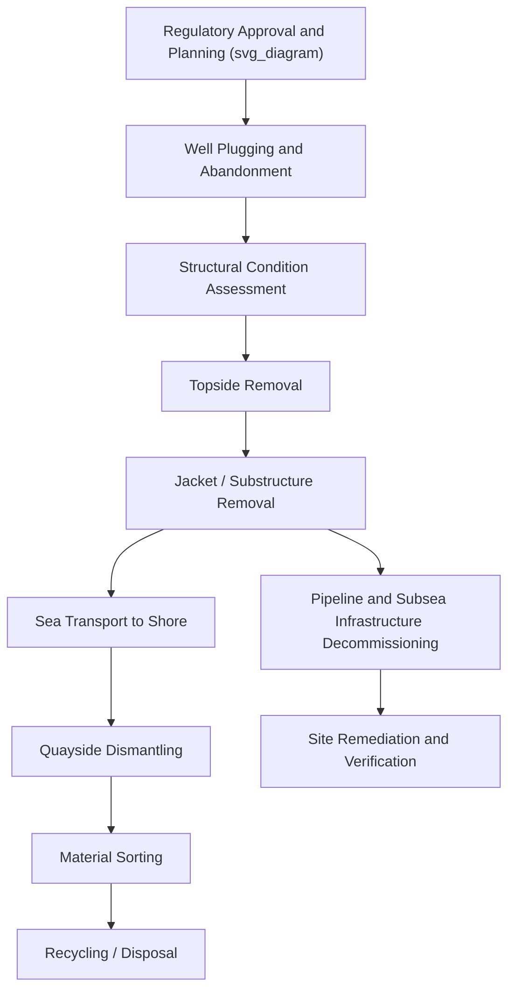

## Decommissioning and Reverse Logistics for Offshore Structures

### Definition and Scope

Decommissioning is the process of safely removing offshore platforms, subsea infrastructure, and associated structures at the end of their operational life, encompassing well plugging and abandonment, topside and jacket removal, pipeline and cable decommissioning, and site remediation. Reverse logistics in this context refers to the transport, handling, and disposal/recycling chain that moves removed structures from the offshore site back to shore, through dismantling, and ultimately to recycling, reuse, or disposal — effectively running the heavy-lift and marine logistics chain in the opposite direction from installation.

### Why Decommissioning Requires Distinct Planning

**Key Points**

- Unlike installation, where structures are new, well-documented, and designed for the lift/transport methods being used, decommissioning deals with aged structures whose current structural condition may differ significantly from original design records due to corrosion, marine growth, or unrecorded modifications.
- Regulatory frameworks for decommissioning are often more stringent and jurisdiction-specific than installation regulations, reflecting environmental and safety concerns around removing structures that have been in place for decades.
- Reverse logistics must plan for structures that may need to be cut into sections for removal and transport, since single-piece removal by reversing the original installation method is not always feasible with available heavy-lift assets or is not cost-effective.
- End-of-life material handling (recycling, hazardous material disposal, potential reef/reuse programs) adds a logistics dimension largely absent from installation planning.

### Key Phases of Offshore Decommissioning

**Planning and Regulatory Approval**

- Decommissioning program development, typically requiring regulatory approval detailing the proposed removal method, environmental impact assessment, and disposal plan.
- Comparative assessment of removal options (full removal vs partial removal/rigs-to-reefs programs, where permitted by the relevant jurisdiction).

**Well Plugging and Abandonment**

- Permanent sealing of wells to prevent future hydrocarbon migration, typically the first major technical phase before structural removal begins.

**Topside Removal**

- Removal of the platform's upper structure, using either reverse float-over, single or multi-lift crane vessel removal, or piece-small (module-by-module or component-by-component) removal depending on structure size, condition, and available equipment.

**Jacket/Substructure Removal**

- Removal of the supporting substructure, often requiring subsea cutting of piles and structural members, followed by lifting the jacket (whole or in sections) for transport.

**Pipeline and Subsea Infrastructure Decommissioning**

- Flushing, cleaning, and either removal or in-situ decommissioning (leaving in place, where regulations permit) of pipelines and subsea equipment.

**Site Remediation and Verification**

- Seabed clearance verification, debris removal, and environmental monitoring to confirm the site meets required post-decommissioning conditions.

### Structural Condition Assessment for Decommissioning

**Key Points**

- Before any lift or removal engineering can proceed, an updated structural assessment is required to establish the current condition of lift points, structural members, and overall integrity — original design lift points may have degraded and require re-assessment or reinforcement.
- Marine growth accumulation can add significant unplanned weight to subsea structural members, requiring removal or accounting for in weight estimates before lifting.
- Corrosion assessment, often informed by inspection data collected throughout the structure's operational life, feeds directly into decisions about whether original lift points remain usable or new lift points must be engineered.

### Removal Method Comparison

| Method | Description | Typical Application |
| --- | --- | --- |
| Single-lift removal | Entire topside or jacket removed in one lift by a heavy-lift crane vessel | Structures within crane vessel capacity, good structural condition |
| Reverse float-over | Structure floated off using a barge, reversing the float-over installation method | Very large integrated topsides originally installed by float-over |
| Piece-small removal | Structure cut and removed in multiple smaller sections | Structures exceeding available crane capacity, or poor structural condition preventing single-lift |
| Explosive/mechanical subsea cutting | Piles and structural members severed at or below seabed level | Jacket leg/pile removal, typically to a regulatory-specified depth below seabed |

### Reverse Logistics Chain

1. **Offshore removal** — structure or structural sections are lifted from their offshore position onto a transport barge or directly lifted ashore for very light components.
2. **Sea transport to disposal/recycling port** — reversing the sea-fastening and voyage planning principles used in installation, adapted for potentially irregular or damaged structural sections.
3. **Quayside receipt and further dismantling** — larger sections are typically further cut down at a receiving quay or yard equipped for heavy structural dismantling.
4. **Material sorting and processing** — steel, equipment, and hazardous materials are sorted for recycling, refurbishment, or specialized disposal as applicable.
5. **Recycling/disposal** — final processing of materials, with steel scrap typically representing the largest recyclable volume by weight.

### Example: Jacket Removal and Reverse Logistics Planning

**Example**

A four-legged steel jacket, installed 30 years ago, is being decommissioned:

1. Structural assessment reveals significant marine growth accumulation and localized corrosion at several original lift point locations, ruling out direct reuse of the original lift points without reinforcement.
2. Given the jacket's total weight exceeds available crane vessel single-lift capacity in good condition, and its uncertain current structural integrity, a piece-small removal method is selected: the jacket is cut into four leg sections plus bracing sub-assemblies.
3. Subsea cutting operations sever the piles at the regulatory-required depth below the seabed (commonly around 3–5 m below seabed level in many jurisdictions, though the applicable requirement is jurisdiction-specific) before each section is lifted.
4. Sections are transported by barge to a decommissioning yard, where further cutting reduces them to sizes suitable for standard scrap processing.
5. Steel is sorted and sent for recycling, while any hazardous materials identified during the process (such as legacy coatings) are handled through specialized disposal channels.

### Diagram: Decommissioning and Reverse Logistics Flow

### Regulatory and Environmental Considerations

[Inference] Decommissioning regulatory requirements vary substantially by jurisdiction (e.g., differing rules between the North Sea, Gulf of Mexico, and other offshore regions regarding full removal obligations, rigs-to-reefs allowances, and subsea infrastructure abandonment-in-place criteria); project-specific regulatory research with current authoritative sources is essential rather than relying on generalized assumptions, given the topic's jurisdiction-specific and evolving regulatory nature.

### Common Risks and Mitigation

| Risk | Mitigation |
| --- | --- |
| Structural failure due to unanticipated degradation | Comprehensive updated structural assessment before finalizing lift/removal method |
| Original lift points unusable due to corrosion/damage | Engineering of new, verified lift points as part of decommissioning planning |
| Underestimated weight from marine growth accumulation | Marine growth survey and weight allowance in lift engineering |
| Regulatory non-compliance in removal method or depth | Early and thorough regulatory engagement, jurisdiction-specific compliance verification |
| Hazardous material mishandling during dismantling | Pre-decommissioning hazardous material survey and specialized handling protocols |

### Conclusion

Decommissioning and reverse logistics for offshore structures apply heavy-lift and marine logistics principles in reverse, but with the added complexity of assessing aged, potentially degraded structures rather than new, well-documented ones. Careful structural condition assessment, appropriate removal method selection, and a well-planned reverse logistics chain from offshore removal through recycling are essential to executing decommissioning safely and in compliance with jurisdiction-specific regulatory requirements.

**Related Topics**

- Lift Installation for Offshore Modules
- Float-Over Installation of Platform Topsides
- Jack-Up Vessel Operations and Seabed Bearing Capacity
- Subsea and Heavy Module Installation Planning
- Sea-Fastening Design and Lashing Calculations
- Structural Integrity Assessment for Aged Offshore Assets