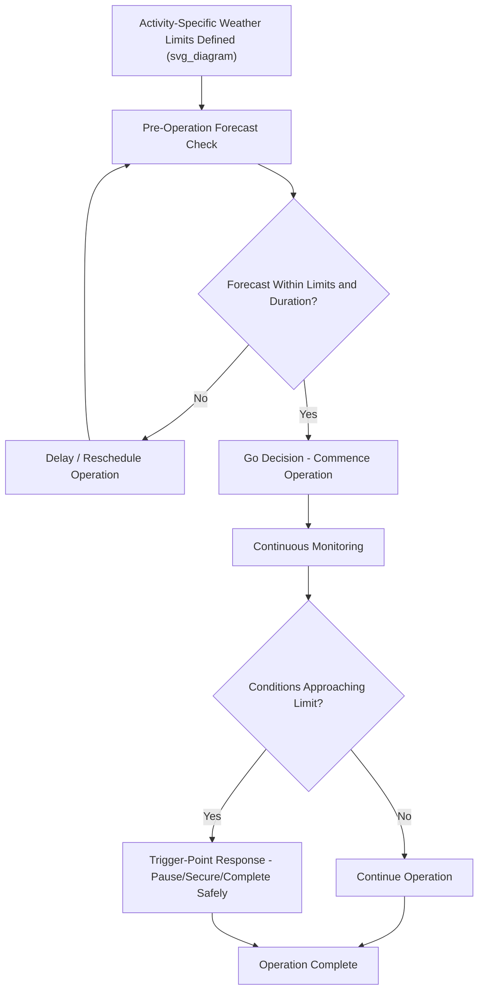

## Weather Downtime and Operational Windows Offshore

### Definition and Scope

Weather downtime refers to the periods during an offshore project when planned operations cannot proceed because environmental conditions (wave height, wind speed, current, visibility) exceed the safe operating limits defined for the specific activity. Operational windows are the converse concept — forecast or observed periods during which conditions remain within those limits, allowing work to proceed. Managing weather downtime and identifying operational windows is a distinct discipline from the voyage-specific weather routing covered elsewhere (see: Voyage Routing and Weather Window Analysis), focused instead on the ongoing, day-to-day and hour-to-hour operational decision-making throughout an offshore installation or construction campaign.

### Why Weather Downtime Management Is Critical

**Key Points**

- Offshore heavy-lift and installation campaigns are typically scheduled with an allowance for weather downtime, but underestimating this allowance is one of the most common causes of project schedule and cost overrun.
- Different operations aboard the same vessel or project often have different weather limits — a crane lift may have a stricter limit than general vessel transit, requiring activity-specific operational window definitions rather than a single blanket weather threshold.
- Weather downtime is not simply "bad weather stops work" — it includes the decision-making framework for when to start, when to pause, and when to abort an operation already in progress.
- Seasonal weather patterns significantly affect overall project scheduling, with some offshore regions having pronounced "weather seasons" that concentrate downtime risk in particular months.

### Operational Weather Limits by Activity Type

| Activity | Primary Weather Sensitivity | Typical Limiting Parameter |
| --- | --- | --- |
| Crane vessel lifting | Vessel motion affecting lift precision and dynamic loading | Significant wave height, vessel roll/pitch/heave |
| Personnel transfer (crew boat/helicopter) | Sea state and wind affecting transfer safety | Significant wave height, wind speed |
| Float-over mating | Requires extremely calm, precise conditions | Significant wave height (often sub-1 m limits) |
| Subsea lowering/splash zone transit | Dynamic loading from vessel heave during critical phase | Significant wave height, vessel heave |
| DP (dynamic positioning) operations | Current and wind affecting station-keeping | Current speed, wind speed |
| SPMT/heavy transport (quay-side) | Generally less weather-sensitive than marine operations | Wind speed (for tall/high windage cargo) |

### Weather Downtime Estimation in Project Planning

**Key Points**

- Weather downtime allowances are typically estimated using historical metocean data (hindcast or measured buoy/station data) for the specific location and season, expressed as an expected percentage of non-workable days or hours for each activity's specific weather limit.
- Persistence statistics — how long favorable conditions tend to last once they occur — are as important as simple exceedance probability, since some operations require a continuous window of a minimum duration.
- Statistical weather downtime estimates carry inherent uncertainty and are typically supplemented with contingency schedule buffer, since any given season's actual conditions can deviate meaningfully from historical averages.

### Weather Downtime Estimation Approach

A simplified planning approach expresses expected workable time as:

$$T_{workable} = T_{total} \times (1 - P_{exceedance})$$

where $T_{total}$ is the total campaign duration and $P_{exceedance}$ is the statistical probability (from historical metocean data) that conditions will exceed the activity's operating limit during the relevant season.

[Inference] This is a simplified planning heuristic; rigorous offshore project weather downtime estimation typically uses more sophisticated persistence-based statistical methods (accounting for window duration requirements, not just point-in-time exceedance probability) applied to long-term hindcast datasets, usually performed by specialized metocean consultants for significant offshore campaigns.

### Real-Time Operational Decision Framework

1. **Pre-operation forecast check** — confirm current forecast for the relevant activity-specific weather window meets the required duration and margin below operating limits.
2. **Go/no-go decision** — formal decision point, often involving multiple stakeholders (vessel master, lift supervisor, client representative, MWS where applicable) confirming the operation should proceed.
3. **Continuous monitoring during operation** — real-time weather and vessel motion monitoring throughout the operation's duration.
4. **Trigger-point response** — pre-defined action if conditions approach or exceed limits during an in-progress operation, which may include pausing, securing the current state, or in some cases continuing to a safe completion point if aborting mid-operation is riskier than completing it.
5. **Post-operation review** — comparison of actual conditions experienced against forecast, feeding back into forecast confidence calibration for future decisions.

### Example: Managing Weather Downtime During an Offshore Wind Installation Campaign

**Example**

An offshore wind turbine installation campaign using a jack-up vessel has distinct weather limits for different phases:

- Jack-up vessel jacking/positioning: wind speed limit of approximately 15 m/s
- Turbine blade lifting (highest windage sensitivity among the lift activities): wind speed limit of approximately 10 m/s
- General vessel transit between sites: higher wind and wave tolerance than the lifting activities

During a period of persistent moderate winds around 12 m/s, the campaign continues jack-up positioning and lower-windage component lifts (tower sections, nacelle), but blade installation is paused since it falls outside its stricter wind limit. This illustrates how activity-specific limits allow partial productivity to continue during conditions that would fully halt work if a single blanket weather limit were applied across all activities.

### Diagram: Weather Downtime Decision Flow

### Contractual and Commercial Aspects

**Key Points**

- Offshore contracts frequently include weather downtime clauses defining how delays due to weather are allocated commercially (e.g., whether downtime is compensable, and under what weather threshold definitions).
- Precise, unambiguous definition of weather limits and measurement methodology (which buoy/sensor data governs, what averaging period applies) is important to avoid disputes over whether a weather downtime clause was correctly invoked.
- Weather downtime risk is often a significant factor in offshore project insurance and contingency budget allocation.

### Common Risks and Mitigation

| Risk | Mitigation |
| --- | --- |
| Underestimated seasonal weather downtime in project schedule | Rigorous historical metocean data analysis, adequate contingency buffer |
| Ambiguous weather limit definitions causing contractual disputes | Clear, measurable weather threshold definitions specified in contracts and method statements |
| Blanket weather limits reducing achievable productivity | Activity-specific weather limit definitions allowing partial work continuation |
| Mid-operation weather deterioration beyond forecast | Real-time monitoring with pre-defined trigger-point response procedures |
| Forecast unreliability in certain regions/seasons | Conservative margin below limits, reliance on most current short-range forecasts for final decisions |

### Conclusion

Weather downtime and operational window management is a continuous, activity-specific discipline running throughout an offshore installation campaign, extending beyond the initial voyage-level weather routing decision into the daily and hourly operational rhythm of the project. Effective management requires clearly defined, activity-specific weather limits, robust statistical downtime estimation for planning purposes, and a disciplined real-time decision framework for go/no-go and in-progress operational decisions.

**Related Topics**

- Voyage Routing and Weather Window Analysis
- Jack-Up Vessel Operations and Seabed Bearing Capacity
- Lift Installation for Offshore Modules
- Float-Over Installation of Platform Topsides
- Subsea and Heavy Module Installation Planning
- Method Statement Compliance Verification