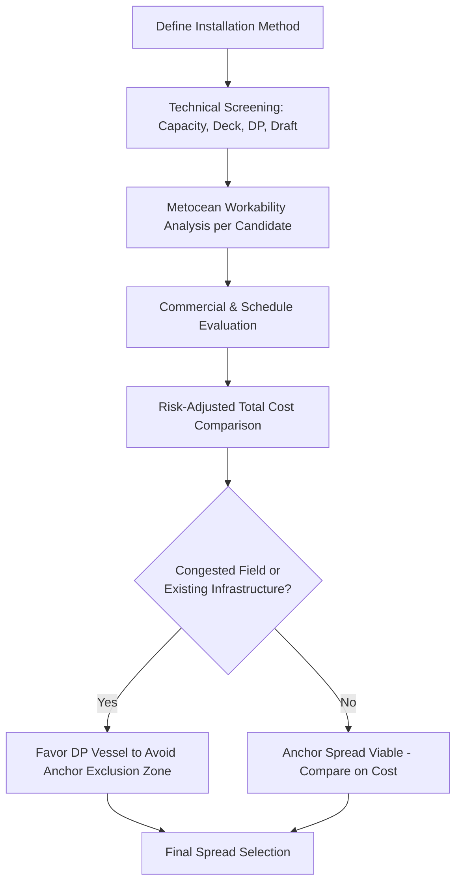

## Marine Spread Selection for Offshore Campaigns

### Overview

Marine spread selection is the process of assembling the optimal combination of vessels, marine equipment, and support craft to execute an offshore installation campaign safely, within schedule, and at the lowest achievable cost. A "spread" refers to the full suite of assets deployed together — typically a heavy-lift vessel (HLV) or derrick barge, tugs, anchor-handling vessels, cargo barges, survey vessels, and crew transfer vessels — configured to match the specific metocean environment, cargo characteristics, and installation methodology of the project.

The selection decision sits at the intersection of engineering (crane capacity, deck space, motion response), commercial strategy (charter cost vs. schedule risk), and logistics (mobilization routes, port constraints, permitting). A poorly matched spread is one of the most common root causes of offshore project overruns.

### Key Points

- **Fit-for-purpose, not maximum capability**: The largest available vessel is rarely the correct choice; over-specification wastes day rate, under-specification creates operational risk or outright infeasibility.
- **Spread composition is interdependent**: Selecting the main lift vessel constrains the choice of every support asset (tug bollard pull, barge freeboard, ROV support requirements).
- **Metocean data governs the operating envelope**: Significant wave height ($H_s$), wave period, current speed, and wind speed at the specific field location and season dictate workable weather windows for each candidate vessel.
- **Regulatory and flag-state constraints** can eliminate otherwise technically suitable vessels (cabotage laws, class society requirements, local content rules).
- **Availability and market rates** fluctuate significantly with global offshore activity cycles, meaning technically ideal spreads may be commercially or schedule-infeasible.

### Primary Selection Drivers

#### 1. Cargo and Structure Characteristics

- **Weight and center of gravity (CoG)**: Determines minimum required crane capacity with margin, and whether single-crane, dual-crane (tandem), or multi-crane lifts are needed.
- **Dimensions and footprint**: Governs deck space requirements on the installation vessel or accompanying cargo barge, and clearance during lift and set-down.
- **Lift points and rigging interface**: Padeyes, trunnions, or lift lugs must be compatible with available rigging and the vessel's hook/block configuration.
- **Sensitivity to dynamic loading**: Fragile or motion-sensitive cargo (e.g., subsea processing modules with instrumentation) may require vessels with superior motion characteristics (larger displacement, DP-2/DP-3) over raw capacity.

A commonly applied capacity margin is:

$$C_{required} = W_{cargo} \times DAF \times SF$$

Where $DAF$ is the dynamic amplification factor (accounting for crane tip motion, typically 1.1–1.3 for calm water lifts, higher offshore) and $SF$ is a project safety factor (commonly 1.25–1.33 per crane/rigging code, though this varies by classification society and lift criticality — [Unverified] exact values are project- and code-specific, e.g., DNV-ST-N001 vs. API RP 2A).

#### 2. Metocean Envelope and Location

- **Water depth**: Determines whether floating heavy-lift vessels, jack-up units, or a combination (float-over then jacking) is viable.
- **Wave climate**: Shallow, sheltered nearshore work may permit smaller, less expensive spreads; open ocean or harsh environments (North Sea, Gulf of Mexico hurricane season, offshore Philippines during typhoon season) demand vessels with higher seakeeping performance and larger workable $H_s$ thresholds.
- **Seasonal weather windows**: Campaigns are often scheduled around historical percentile exceedance data (e.g., a vessel rated for operations up to $H_s = 2.5\,m$ may only achieve 60% workability in a given month at a given location — [Unverified], workability percentages are highly location- and hindcast-dataset-specific).
- **Current and tidal regime**: Affects station-keeping requirements (anchor spread vs. dynamic positioning) and installation tolerances for pipelines, cables, and foundations.

#### 3. Vessel Capability Matching

| Parameter | Consideration |
| --- | --- |
| Crane capacity (main hook) | Must exceed required capacity with margin at the operating radius, not just at minimum radius |
| Revolving vs. fixed boom | Revolving cranes offer operational flexibility; fixed booms (common on very large HLVs) may require specific vessel heading during lift |
| Number of cranes | Tandem lift capability needed for long/flexible structures (e.g., bridge sections, long jacket sections) |
| Deck area and deck load capacity | Must accommodate cargo plus rigging, spreaders, and contingency space |
| Positioning system | DP-2/DP-3 for precision work near existing infrastructure; anchor spread acceptable in open, uncongested areas at lower cost |
| Draft and air draft | Must clear port approaches, under-keel clearance at field, and any overhead obstructions during mobilization |
| Accommodation capacity | Must house project personnel, marine crew, and any client/third-party representatives |

#### 4. Support Vessel Requirements

- **Tugs**: Bollard pull sized to the towed object's windage area and the transit route's design storm criteria; typically calculated using a tow bollard pull calculation incorporating wind drag, wave drift force, and current drag coefficients.
- **Anchor Handling Tugs (AHTs/AHTSVs)**: Required when the main vessel uses a mooring/anchor spread rather than DP.
- **Survey vessels**: Pre-lay and as-built surveys, often multibeam echosounder (MBES) and side-scan sonar equipped.
- **ROV support vessels**: For subsea intervention, foundation verification, and connection monitoring — capacity (work-class vs. observation-class ROV) driven by depth and task complexity.
- **Crew transfer / standby vessels**: Regulatory requirement in most jurisdictions for personnel safety during offshore operations.

### Selection Methodology

A structured spread selection process typically follows these stages:

**Step 1 — Define the Installation Method**

The chosen installation methodology (single-lift, float-over, module carrier + jack-up transfer, reverse installation) fundamentally dictates the class of vessel required before any specific unit is evaluated.

**Step 2 — Build the Technical Screening Matrix**

Filter the global or regional vessel market against hard constraints: minimum crane capacity, minimum deck space, DP class if required, draft limits, and classification requirements.

**Step 3 — Apply Metocean Workability Analysis**

For each shortlisted vessel, run workability simulations against site-specific metocean hindcast/forecast data to estimate the expected weather downtime and realistic campaign duration.

**Step 4 — Commercial and Schedule Evaluation**

Compare day rates, mobilization/demobilization costs and duration, and vessel availability windows against the project schedule.

**Step 5 — Risk-Adjusted Total Cost Comparison**

Combine charter cost, expected weather downtime cost, mobilization cost, and contingency to compare candidate spreads on a like-for-like total installed cost basis, not day rate alone.

$$TC_{spread} = C_{charter} \times (D_{op} + D_{weather} + D_{mob/demob}) + C_{mob} + C_{contingency}$$

Where $D_{op}$ is planned operational duration, $D_{weather}$ is expected weather-standby duration derived from workability analysis, and $D_{mob/demob}$ is mobilization/demobilization transit duration.

### Example

**Scenario**: Installation of a 1,800-tonne topside module on a fixed platform, water depth 65 m, in a moderate wave climate with an installation window during the calmer season ($H_s$ typically below 1.5 m for ~70% of days that month — [Unverified], illustrative figures).

**Candidate Spread A — Large Floating Heavy-Lift Vessel**

- Single-crane revolving lift, 5,000 t capacity
- DP-2, self-propelled, no tug required for station-keeping
- High day rate, but single mobilization, single lift operation (1–2 days)
- Best for schedule certainty and minimizing weather exposure

**Candidate Spread B — Derrick Barge + Anchor Spread + Tug Fleet**

- Barge-mounted crane, 3,000 t capacity, moored via 8-point anchor spread
- Requires 2–4 AHTs for anchor deployment and 1–2 line-handling tugs
- Lower day rate for the barge itself, but longer mobilization (anchor deployment/recovery adds 1–2 days each end) and higher aggregate spread cost once tug fleet is included
- Anchor spread also imposes an exclusion zone that may conflict with existing subsea infrastructure — a factor that can eliminate this option in brownfield sites

For this scenario, if the platform is in a congested field with existing pipelines, Spread A's DP capability removes anchor-proximity risk entirely, which often justifies its higher day rate despite the higher nominal cost — this is the kind of qualitative risk factor that a pure day-rate comparison misses.

### Spread Selection Decision Flow (svg_diagram)

### Common Pitfalls

- **Ignoring mobilization logistics**: A technically ideal vessel located on another continent can erase all cost savings once transit time and mob/demob costs are included.
- **Underestimating rigging and interface engineering lead time**: Spreader bars, lift frames, and padeye modifications often carry longer lead times than vessel charter itself.
- **Treating weather workability as a fixed percentage**: Workability should be recalculated for the specific month and specific vessel motion response, not assumed from generic industry figures.
- **Overlooking flag-state/cabotage restrictions**: In some jurisdictions (including Philippine coastal waters under cabotage-adjacent regulations), foreign-flagged vessel use for domestic point-to-point work may require specific permitting or local partnering — [Unverified], specific regulatory requirements should be confirmed against current local maritime authority rules for the project's jurisdiction and timeframe.
- **Single-point-of-failure spreads**: Relying on one crane vessel with no contingency for breakdown or unplanned drydock during a long campaign.

### Conclusion

Marine spread selection is a multi-variable optimization problem balancing cargo engineering requirements, site-specific metocean conditions, vessel technical capability, and total risk-adjusted cost. The most robust approach screens candidates against hard technical constraints first, quantifies weather-driven schedule risk through site-specific workability analysis, and only then compares spreads on total installed cost rather than headline day rate — with qualitative risk factors like field congestion and mobilization logistics weighed explicitly rather than left implicit.

**Related Topics**

- Heavy-Lift Vessel (HLV) Crane Capacity and Rigging Configurations
- Metocean Workability Analysis and Weather Window Forecasting
- Dynamic Positioning (DP) Classifications for Offshore Operations
- Float-Over Installation Methodology
- Anchor Handling and Mooring Spread Design
- Tow and Transportation Analysis for Offshore Structures
- Total Installed Cost Modeling for Marine Operations
- Offshore Regulatory and Cabotage Considerations by Jurisdiction