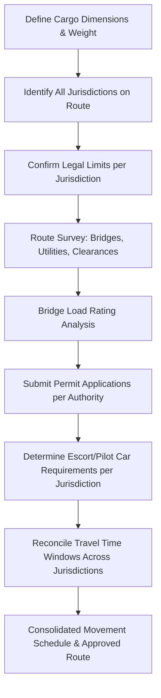

## Oversize and Overweight Permit Requirements by Jurisdiction

### Overview

Oversize/overweight (OS/OW) permitting is the regulatory process required to legally move cargo, equipment, or vehicle-load combinations that exceed a jurisdiction's standard legal limits for dimension (height, width, length, overhang) and/or weight (gross vehicle weight, axle load) on public roads. In heavy-lift and specialized logistics, nearly every land transport leg of a project — final-mile delivery of a transformer, wind turbine blade, pressure vessel, or module skid — depends on securing the correct permits before the move, since legal limits and permitting authority structures differ substantially by country, and even by state/province/region within a single country.

There is no single global standard; each jurisdiction defines its own base legal dimensions and weights, its own permit issuing authority (or authorities), its own escort/pilot-car requirements, and its own enforcement mechanisms. A permit valid in one jurisdiction has no legal standing in an adjacent one, even for the same continuous route.

### Key Points

- **Legal limits are jurisdiction-specific baselines**: Permits authorize exceptions above a "legal" (non-permit) threshold that varies by country/state.
- **Multiple permits are often required for a single route**: Crossing state, provincial, or national boundaries typically requires a separate permit from each jurisdiction traversed.
- **Weight and dimension are regulated somewhat independently**: A load can be overweight but within legal dimensions, or oversize but within legal weight — each triggers different permit categories and axle/bridge analysis requirements.
- **Route survey and permit application are interdependent**: Many authorities require a specific approved route as part of the permit application, meaning the transport engineering (route survey) must generally precede or accompany the permit request.
- **Divisible vs. non-divisible cargo** is a key regulatory distinction: many jurisdictions only grant overweight permits for non-divisible loads (loads that cannot reasonably be broken into smaller legal shipments) — a load that could be divided but wasn't may be denied a permit or charged different fees.

### Regulatory Structure by Jurisdiction Type

#### United States

- Permitting authority is decentralized to the **state level**, with each state Department of Transportation (DOT) issuing its own permits for state and county roads.
- **Federal Highway Administration (FHWA)** sets baseline federal legal limits for the Interstate Highway System (commonly cited as 80,000 lb gross vehicle weight, 102 in width, though states can grant exceptions and grandfather clauses vary — [Unverified], legal weight/width figures should be confirmed against current FHWA and state-specific regulations, as bridge formula calculations, state-specific exceptions, and periodic updates affect exact figures).
- Multi-state moves require a **separate permit per state**, and increasingly can be coordinated through consolidated permitting services or state-specific online portals.
- **Superload** classifications (loads exceeding a state-defined higher threshold, e.g., certain weight or width thresholds that vary by state) typically trigger additional requirements: engineering bridge analysis, specific route studies, and often law enforcement escort rather than only civilian pilot cars.

#### Canada

- Similarly decentralized to the **provincial/territorial level** (e.g., Ministry of Transportation Ontario, Alberta Transportation).
- Provinces maintain reciprocal or harmonized frameworks in some cases (e.g., the Memorandum of Understanding on Interprovincial Weights and Dimensions among several provinces) but permits themselves are still issued per province.
- Northern/remote route permitting can involve additional seasonal restrictions (spring weight restrictions/frost law periods limiting axle loads on certain roads).

#### European Union / United Kingdom

- The EU sets harmonized baseline standards for certain vehicle dimensions/weights under directives (e.g., Directive 96/53/EC and subsequent amendments governing maximum weights and dimensions for international traffic), but **abnormal load permits remain a national/member-state competency**.
- The UK operates a distinct system post-Brexit: **STGO (Special Types General Order)** categorizes abnormal loads into categories (commonly STGO Category 1, 2, and 3, with escalating notification and escort requirements based on weight and axle configuration), with **VR1 notifications** required to local police and highway authorities for certain movements, separate from any bridge-specific structural assessment requirements.
- Cross-border moves within the EU/Schengen area still typically require permits from each transited country's national authority.

#### Philippines (Local Context)

- Oversize/overweight road permitting in the Philippines generally involves coordination among the **Department of Public Works and Highways (DPWH)** for national roads and bridges, and **Local Government Units (LGUs)** for roads under municipal or city jurisdiction — since a typical heavy-haul route often transits both.
- **Land Transportation Office (LTO)** and local traffic management offices may additionally require route permits or traffic management plans, particularly for urban transits.
- Bridge load rating verification against DPWH standards is a common prerequisite step given the prevalence of older or lower-capacity bridge infrastructure on secondary routes — [Unverified] specific current bridge rating criteria should be confirmed with DPWH's latest design guidelines, as standards and bridge inventory conditions are periodically updated.
- Given LGU involvement, project teams working across multiple municipalities (a pattern consistent with multi-LGU heavy-haul routes) should expect the permitting process to require separate coordination with each LGU traversed, similar in structure to the multi-state model used in the US and Canada, even though the underlying legal framework differs.

### Permit Application Components (Common Across Jurisdictions)

| Component | Purpose |
| --- | --- |
| Vehicle/trailer configuration | Axle spacing, axle group weights, tire specifications |
| Cargo dimensions and weight | Overall length, width, height, and total weight including trailer/prime mover |
| Proposed route | Turn-by-turn route, often with GPS coordinates for permit system input |
| Bridge analysis / structural clearance | Verification that route bridges and overpasses can carry the load |
| Travel time restrictions | Many jurisdictions restrict oversize moves to daylight hours, off-peak periods, or specific days (e.g., no weekend/holiday travel) |
| Escort/pilot car requirements | Number and positioning of escort vehicles based on dimension thresholds |
| Insurance and bonding | Proof of liability coverage, sometimes a specific bond for potential road/bridge damage |
| Permit fee | Calculated by weight, dimension, mileage, or a flat administrative fee — structures vary significantly by jurisdiction |

### Escort and Pilot Car Threshold Logic

Most jurisdictions use tiered dimension/weight thresholds to determine escort requirements, following a general pattern:

$$\text{Escort Level} = f(\text{Width}, \text{Height}, \text{Length overhang}, \text{Weight})$$

Typical tiering logic (illustrative structure — exact thresholds are jurisdiction-specific):

- **Below legal limit**: No permit required.
- **Permit Tier 1**: Permit required, no escort (moderate oversize).
- **Permit Tier 2**: Permit + single pilot car (front or rear, depending on overhang direction).
- **Permit Tier 3**: Permit + front and rear pilot cars, possibly with height poles for overhead clearance verification.
- **Superload/Abnormal Tier**: Permit + law enforcement escort + advance bridge/route engineering + possible utility line lift coordination (power/telecom lines).

### Example

**Scenario**: Transporting a 4.2 m wide, 62-tonne transformer from a port in Luzon to a substation site, crossing two municipal LGU jurisdictions and one national highway segment.

**Step-by-step permitting logic**:

1. Confirm baseline legal width/weight limits for the specific national highway segment (DPWH) and each LGU-controlled segment.
2. Since 4.2 m width exceeds standard legal width by a substantial margin, this move falls into a high oversize tier requiring front and rear pilot vehicles at minimum, and likely a route survey confirming clearance past utility poles, low bridges, and roundabouts.
3. At 62 tonnes gross combination weight, a bridge load-rating check is required for every bridge on the proposed route — this is not automatically covered by a "standard" DPWH oversize permit and often needs a specific structural sign-off.
4. Separate permit applications submitted to: DPWH (national highway segment), and each traversed LGU (municipal roads), with the LGU-level applications additionally requiring coordination with local traffic enforcement for scheduling (commonly restricted to specific overnight or off-peak hours to reduce disruption).
5. Escort vehicle count and equipment (warning flags, height poles, amber beacons) confirmed against each authority's specific requirements, since LGU-level requirements can differ from DPWH's own.

This illustrates the core jurisdictional challenge: even a single, physically continuous route can require reconciling several *different* sets of rules, forms, fee structures, and scheduling constraints across authorities that do not automatically coordinate with one another.

### Permit Coordination Workflow (svg_diagram)

### Common Pitfalls

- **Assuming a single permit covers the full route**: Multi-jurisdiction moves almost always require multiple, separately filed permits.
- **Treating dimension and weight permits as automatically bundled**: Some authorities issue these as distinct permit types with different application processes.
- **Overlooking seasonal or time-of-day restrictions**: A permit may be valid but unusable during certain hours, days, or seasons (e.g., frost law periods, holiday travel bans).
- **Late bridge analysis**: Discovering a structurally inadequate bridge after route commitment can force a costly re-route or require temporary bridge reinforcement.
- **Fee and validity period assumptions**: Permit validity windows (single trip vs. annual blanket permits) and fee structures vary widely; assuming one jurisdiction's model applies to another leads to planning errors.

### Conclusion

Oversize and overweight permitting is fundamentally a jurisdiction-by-jurisdiction compliance exercise, not a single unified process, even within one country. Successful permitting for a heavy-lift road transport leg depends on early identification of every authority the route will cross, jurisdiction-specific legal limit and bridge analysis, and careful reconciliation of each authority's distinct escort, scheduling, and fee requirements into one coherent movement plan.

**Related Topics**

- Route Survey and Swept Path Analysis for Abnormal Loads
- Bridge Load Rating and Structural Clearance Verification
- Pilot Car and Escort Vehicle Operating Standards
- Multi-Axle Trailer Configuration and Load Distribution (SPMTs, Modular Trailers)
- Cross-Border Heavy Haul Coordination
- Utility Line Lifting and Temporary Infrastructure Modification for Oversize Moves
- DPWH and LGU Coordination for National vs. Local Road Permits