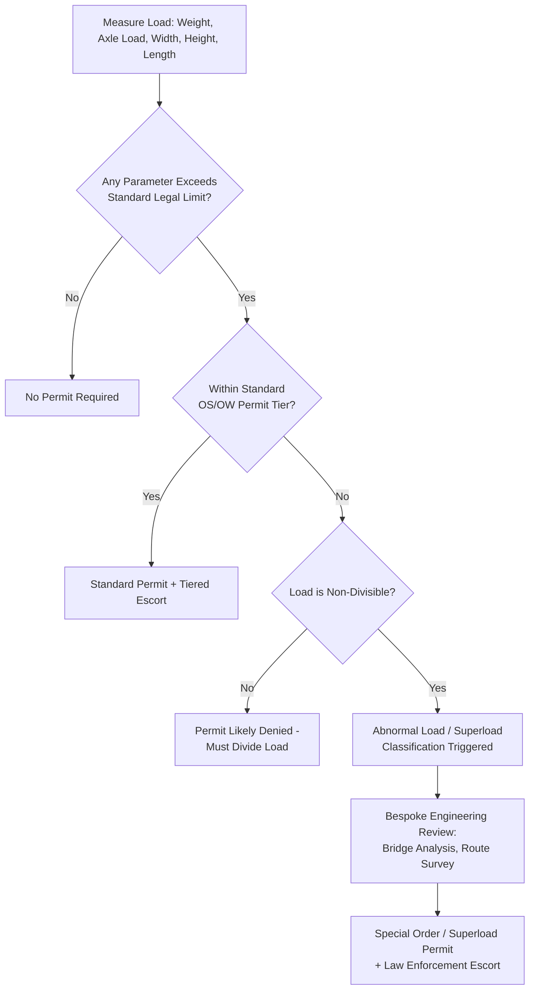

## Abnormal Load and Superload Definitions and Thresholds

### Overview

"Abnormal load" and "superload" are classification terms used by transport regulators to distinguish cargo movements that exceed standard legal dimension and weight limits from those that exceed even the *permit-tier* limits typically available under routine oversize/overweight (OS/OW) permitting. These classifications trigger progressively stricter regulatory, engineering, and operational requirements — additional route engineering, structural bridge analysis, law enforcement involvement, and often bespoke case-by-case approval rather than standard permit issuance.

The terminology itself is not globally standardized: "abnormal load" is the dominant term in UK/Commonwealth-influenced regulatory frameworks, while "superload" is more common in North American usage. Both describe the same underlying regulatory concept: a load so large, heavy, or structurally demanding that it falls outside the scope of routine permitting and requires elevated scrutiny.

### Key Points

- **Thresholds are jurisdiction-specific and tiered**: Nearly every regulatory framework uses multiple tiers rather than a single binary cutoff, with escalating requirements at each tier.
- **Classification depends on both absolute values and combinations**: A load can be classified as abnormal due to weight alone, dimension alone, or a combination that individually would not trigger the highest tier.
- **Divisibility matters as much as size**: Many regulators require proof that a load is non-divisible (cannot reasonably be broken into legal-sized shipments) before granting superload/abnormal load status — a divisible load exceeding legal limits may simply be refused a permit rather than escalated to superload category.
- **Classification determines the entire permitting pathway**: Standard permit desks typically cannot issue superload/abnormal load approvals; these usually require dedicated engineering review teams within the regulatory authority.
- **Bridge and structural analysis is the primary driver of the highest tier**: Weight-based superload thresholds are fundamentally about protecting bridge and pavement infrastructure from loads beyond design assumptions, not just about traffic disruption.

### Regulatory Frameworks by Jurisdiction

#### United Kingdom — STGO (Special Types General Order)

The UK's abnormal load framework centers on categorizing movements under STGO into three primary categories based on gross weight and axle weight:

| Category | General Basis | Notification Requirement |
| --- | --- | --- |
| STGO Category 1 | Lower weight/axle threshold | Reduced formalities |
| STGO Category 2 | Intermediate threshold | Police notification (VR1) typically required |
| STGO Category 3 | Highest STGO threshold | Police notification required, often with specific route/timing constraints |
| Beyond STGO (Special Order) | Exceeds even Category 3 limits | Requires a specific Special Order from the relevant highway authority — a bespoke, case-by-case authorization, not a standard permit |

[Unverified] — exact weight and axle load figures defining each STGO category should be confirmed against the current UK Department for Transport STGO regulations, as thresholds and category structures are subject to periodic regulatory update.

#### United States — Superload Classification

- Superload thresholds are set at the **state level**, meaning the same physical load may be classified as a superload in one state and a standard oversize permit load in an adjacent state.
- Common triggers for superload classification include exceeding a state-defined weight threshold (often cited in the range of 150,000–200,000 lb gross, though this varies significantly by state — [Unverified], specific figures must be confirmed per state DOT), exceeding a width or height threshold significantly above standard oversize limits, or exceeding axle group weight limits even if gross weight is within range.
- Superload permits typically require: a dedicated bridge analysis report (often requiring a professional engineer's stamp), a specific approved route (rather than a general corridor), law enforcement escort in addition to civilian pilot cars, and longer lead times for permit issuance (weeks rather than days).

#### European Union Member States

- Individual member states define "abnormal transport" (or equivalent national terminology) thresholds independently, layered on top of EU harmonized standard vehicle dimension/weight directives.
- Cross-border abnormal load movements within the EU require reconciling each country's distinct classification thresholds, since there is no unified EU-wide abnormal load category system.

#### Philippines (Local Context)

- The Philippines does not have a single nationally codified "superload" classification system equivalent to the US state-level model; oversize/overweight and heavy-haul movements are generally handled through DPWH bridge/road load-rating verification and case-by-case coordination for exceptionally heavy or large cargo — [Unverified], the absence or structure of a formal tiered classification system should be confirmed against current DPWH and LTO regulations, since permitting frameworks are periodically revised.
- In practice, for genuinely oversized cargo (large transformers, wind turbine components, process modules), a bridge-by-bridge load rating check functions as the practical equivalent of a superload threshold test — if any bridge on the route cannot certify the load, the move is functionally blocked regardless of formal classification terminology.

### General Threshold Logic

Across most frameworks, classification follows a layered decision structure based on the combination of governing variables:

$$\text{Classification} = f(W_{gross}, W_{axle}, L, W_{width}, H, \text{divisibility})$$

Where $W_{gross}$ is gross combination weight, $W_{axle}$ is the governing (highest-loaded) axle group weight, $L$ is overall length including overhang, $W_{width}$ is overall width, and $H$ is overall height including trailer deck height.

A load typically escalates to the highest classification tier (superload/abnormal/Special Order) when **any single parameter** exceeds its jurisdiction's top threshold — the classification is not an average or composite score across parameters, but effectively a "worst governing parameter" logic.

### Example

**Scenario**: A single-piece reactor vessel, 5.8 m in diameter, 48 m long, 220 tonnes, requiring an SPMT (self-propelled modular transporter) combination for road transport.

**Classification walkthrough**:

1. **Dimension check**: At 5.8 m width, the load exceeds virtually every jurisdiction's standard oversize permit width tier, immediately placing it in a high-tier or "wide load" category requiring front/rear escort at minimum, often triggering the top oversize tier before weight is even considered.
2. **Weight check**: At 220 tonnes plus the SPMT combination's own tare weight, gross combination weight will almost certainly exceed typical superload thresholds in most US states and UK STGO Category 3, placing this load into the "beyond standard permit" category requiring bespoke authorization.
3. **Axle group analysis**: SPMT configurations distribute weight across many axle lines specifically to keep individual axle group loads within bridge-safe limits — the SPMT's modularity (adding axle lines) is itself often the engineering solution to avoid triggering the most severe axle-load thresholds despite very high gross weight.
4. **Divisibility determination**: A single-piece reactor vessel is inherently non-divisible (cannot be split without destroying the equipment), which is typically a straightforward qualification for abnormal load/superload status once the technical thresholds are met — divisibility challenges arise more often for palletized or modular cargo than for genuinely monolithic equipment.
5. **Resulting pathway**: This load would almost certainly require a bespoke Special Order (UK) or state superload permit with dedicated bridge engineering sign-off (US) or full DPWH bridge load-rating verification (Philippines) rather than a standard permit desk approval — reinforcing that classification and permitting pathway are directly linked (see the related "Oversize and Overweight Permit Requirements by Jurisdiction" material for the full permitting workflow).

### Threshold Escalation Logic (svg_diagram)

### Common Pitfalls

- **Assuming classification thresholds transfer across jurisdictions**: A load classified as "standard oversize" in one state/country may be a superload elsewhere on the same continuous route.
- **Underestimating axle group weight as a separate trigger**: Teams sometimes focus only on gross weight and overlook that a single overloaded axle group can independently trigger superload classification even when gross weight is acceptable.
- **Late divisibility justification**: Failing to document why a load cannot be divided until late in the permit process can cause significant delay if the regulator questions non-divisibility.
- **Treating superload/abnormal load approval timelines like standard permits**: Bespoke approvals often require weeks of lead time for engineering review, not the days typical of standard permits — schedule risk if not planned early.
- **Ignoring the SPMT/trailer tare weight in gross weight calculations**: Gross combination weight (cargo + trailer + prime mover) is what regulators evaluate, not cargo weight alone.

### Conclusion

Abnormal load and superload classifications exist to route the highest-risk movements — by weight, dimension, or both — into a bespoke engineering and approval pathway distinct from routine oversize permitting. Because thresholds, terminology, and even the existence of formal tiered systems vary by jurisdiction, correctly classifying a load early (and documenting non-divisibility where required) is essential to selecting the right permitting pathway and avoiding schedule-critical delays discovered late in the process.

**Related Topics**

- Oversize and Overweight Permit Requirements by Jurisdiction
- Bridge Load Rating and Structural Clearance Verification
- SPMT (Self-Propelled Modular Transporter) Axle Load Distribution
- Non-Divisible Load Justification and Documentation
- Route Survey and Swept Path Analysis for Abnormal Loads
- Law Enforcement Escort Coordination for Superload Movements