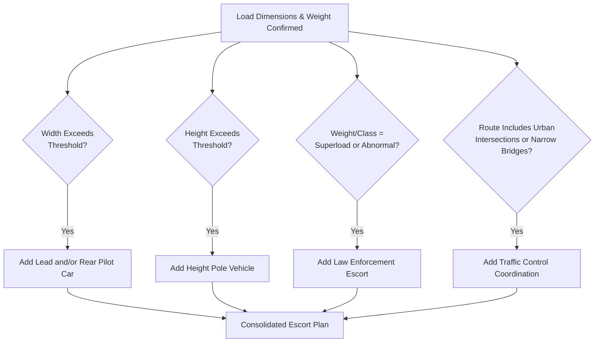

## Escort and Pilot Car Requirements

### Overview

Escort and pilot car requirements govern the number, positioning, equipment, and qualifications of support vehicles that accompany oversize, overweight, or abnormal loads on public roads. These requirements exist to protect the traveling public, warn other road users of an unusually large or slow-moving vehicle combination, and provide active route management functions — verifying overhead clearances, controlling traffic at pinch points, and coordinating with law enforcement where required.

Escort requirements are typically triggered by the same dimension and weight thresholds that govern permit tiers, meaning escort planning is directly linked to the load's OS/OW or abnormal load classification (see the related "Oversize and Overweight Permit Requirements" and "Abnormal Load and Superload" material). As with permitting generally, escort rules are set independently by each jurisdiction, so a multi-jurisdiction route can require reconciling several distinct escort standards into one coherent movement plan.

### Key Points

- **Escort requirements scale with dimension/weight tier, not a flat rule**: Most jurisdictions use a stepped structure — no escort, single escort, front-and-rear escort, then law enforcement escort — tied to specific thresholds.
- **Escort vehicle role differs by position**: A lead (front) escort primarily provides advance warning and route verification; a rear (trail) escort primarily protects the load from following traffic and manages overtaking.
- **Height poles are a distinct function from general escorting**: A height pole vehicle physically verifies overhead clearance ahead of the load and is required specifically when height (not just width or weight) is a governing factor.
- **Civilian pilot cars and law enforcement escorts serve different legal functions**: Civilian escorts generally warn and guide; law enforcement escorts often have legal authority to control intersections, stop opposing traffic, or enforce right-of-way that civilian escorts do not have.
- **Certification of pilot car operators is commonly required**: Many jurisdictions require escort drivers to hold jurisdiction-specific certification (completion of an approved pilot car training course), not just a standard driver's license.

### Escort Trigger Logic by Load Characteristic

| Governing Factor | Typical Escort Response |
| --- | --- |
| Width exceeding threshold | Lead and/or rear escort with oversize warning signage/flags |
| Height exceeding threshold | Height pole escort vehicle ahead of the load to verify clearance |
| Length/rear overhang exceeding threshold | Rear escort to warn following traffic of extended tail swing/overhang |
| Weight/superload classification | Often escalates to law enforcement escort in addition to civilian pilot cars |
| Route complexity (intersections, narrow bridges, urban transit) | Additional escorts or traffic control support regardless of raw dimension/weight tier |

### Regulatory Patterns by Jurisdiction

#### United States

- Escort requirements are set at the **state level**, with thresholds and required escort configuration varying by state DOT regulation.
- Superload movements (see related superload material) commonly require law enforcement escort in addition to, not instead of, civilian pilot cars.
- Many states require pilot car operators to complete a state-approved or nationally recognized certification course, with reciprocity agreements existing between some states — [Unverified], specific certification reciprocity should be confirmed against current state DOT requirements, as these arrangements are periodically updated.

#### United Kingdom

- Escort requirements are tied to STGO category and specific movement characteristics; VR1 police notification (see related abnormal load material) is often a prerequisite that determines whether police involvement in escorting or route control is required, separate from the civilian pilot car arrangement.
- Attendant/escort requirements are commonly specified based on width and length thresholds, with police escort typically reserved for the most demanding movements or complex urban routes.

#### European Union Member States

- Individual countries specify their own escort vehicle requirements, equipment standards (warning signage, beacon color and flash pattern, communication equipment), and operator qualification standards, layered on top of any EU harmonized vehicle standards.
- Cross-border movements require confirming escort equipment compliance in each country transited, since beacon colors, signage wording, and equipment specifications are not universally harmonized.

#### Philippines (Local Context)

- Escort requirements are generally established at the DPWH permit level (national roads) and coordinated with LGU traffic management offices (local roads) and, for urban transits, local traffic enforcement units — consistent with the multi-authority coordination pattern described in the related permitting material.
- For genuinely large project cargo, coordination with local police or traffic enforcement for intersection control during transit (particularly overnight movements through urban barangays) is a common practical requirement, though the specific formal escort vehicle equipment and certification standards should be confirmed against current DPWH/LTO/local traffic ordinance requirements — [Unverified], as these are periodically updated and can vary by LGU.

### Standard Escort Vehicle Equipment

Regardless of jurisdiction, escort vehicles typically carry a broadly consistent equipment set, though specific requirements (flag size, beacon color, sign wording) vary by jurisdiction:

- **Warning signage**: Front- or rear-mounted "OVERSIZE LOAD" or "WIDE LOAD" signage, sized and worded per jurisdictional standard.
- **Rotating or strobe beacon**: Amber in most jurisdictions, though exact color and flash-pattern requirements vary.
- **Warning flags**: Typically mounted on the load's extremities and sometimes on the escort vehicle itself.
- **Two-way radio communication**: For continuous communication between escort vehicles and the transport driver, particularly critical for coordinating stops at intersections, narrow bridges, or during backing maneuvers.
- **Height pole (when height is a governing factor)**: A rigid pole mounted at the load's maximum height, positioned on a lead vehicle, used to physically detect insufficient overhead clearance before the load itself reaches the obstruction.

### Example

**Scenario**: Transporting a 4.5 m wide, 5.2 m tall wind turbine nacelle from a port to an inland wind farm site via a route that includes two urban intersections and one narrow highway bridge.

**Escort planning walkthrough**:

1. **Width assessment (4.5 m)**: Exceeds standard oversize width threshold significantly, triggering front and rear civilian pilot car requirement at minimum in most jurisdictional frameworks.
2. **Height assessment (5.2 m)**: Exceeds typical legal height limits, triggering a dedicated height pole vehicle positioned ahead of the load to verify clearance under any overhead utility lines, signage gantries, or low bridges along the route — this is a separate requirement from the width-driven escort and both apply simultaneously.
3. **Urban intersection complexity**: Given two urban intersections on the route, coordination with local traffic enforcement (LGU-level, per the Philippines pattern above) is planned for temporary traffic control during transit through each intersection, likely requiring off-peak or overnight scheduling.
4. **Narrow highway bridge**: The rear escort's role here shifts from general traffic warning to actively holding opposing traffic clear while the load transits the bridge, since the bridge width may not accommodate simultaneous two-way traffic alongside the load.
5. **Resulting escort configuration**: Lead pilot car with height pole, rear pilot car, plus coordinated traffic enforcement support at the two urban intersections — a configuration assembled from multiple independently-triggered requirements (width, height, route complexity) rather than a single blanket "oversize escort package."

### Escort Configuration Decision Logic (svg_diagram)

### Common Pitfalls

- **Treating escort requirements as a single fixed package**: As shown above, escort needs are additive across independently triggered factors (width, height, weight class, route complexity), not a single lookup value.
- **Overlooking height pole necessity when height is only marginally over threshold**: Even a modest height exceedance can necessitate a height pole if the route includes low utility lines or signage structures not captured in generic road clearance data.
- **Assuming civilian pilot cars can perform law enforcement functions**: Stopping opposing traffic or controlling intersections is frequently a legal authority reserved for law enforcement, not civilian escorts, in many jurisdictions.
- **Uncertified escort drivers**: Using drivers without required jurisdiction-specific pilot car certification can invalidate the permit or expose the operation to enforcement action.
- **Failing to coordinate escort equipment standards across jurisdictions on multi-jurisdiction routes**: Beacon color, signage wording, and flag specifications can differ enough between adjacent jurisdictions that equipment compliant in one is non-compliant in the next.

### Conclusion

Escort and pilot car requirements are a direct operational consequence of a load's dimension, weight, and route characteristics, assembled additively rather than as a single fixed configuration. Effective escort planning requires evaluating each governing factor (width, height, weight/classification, and route complexity) independently, confirming jurisdiction-specific equipment and certification standards for every authority along the route, and distinguishing where civilian pilot car authority ends and law enforcement escort becomes necessary.

**Related Topics**

- Oversize and Overweight Permit Requirements by Jurisdiction
- Abnormal Load and Superload Definitions and Thresholds
- Route Survey and Swept Path Analysis for Abnormal Loads
- Traffic Management Planning for Urban Heavy-Haul Transits
- Pilot Car Operator Certification Standards
- Bridge Load Rating and Structural Clearance Verification