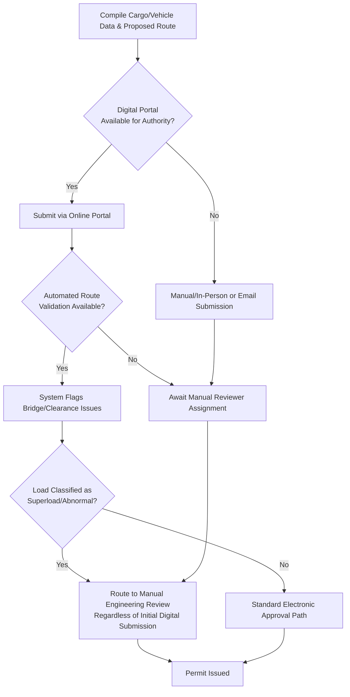

## Electronic Permit Systems and Route Notification Platforms

### Overview

Electronic permit systems and route notification platforms are the digital infrastructure through which oversize/overweight (OS/OW) and abnormal load permits are applied for, reviewed, issued, and communicated to affected stakeholders — including transport operators, escort providers, utility companies, and law enforcement. These platforms have progressively replaced paper-based, in-person permit application processes across most developed heavy-haul markets, and their capabilities directly shape how quickly and reliably a heavy-lift logistics operation can secure permits and coordinate route approvals.

Unlike the underlying permit rules themselves (which are jurisdiction-specific, as covered in the related permitting material), the *platforms* used to administer those rules vary in maturity: some jurisdictions operate sophisticated automated routing and permit-issuance systems, while others still rely substantially on manual review, email correspondence, or in-person submission — a distinction that has direct scheduling implications for project planning.

### Key Points

- **Platform maturity varies independently of regulatory strictness**: A jurisdiction with straightforward permit rules can still have a slow or unreliable digital system, and vice versa.
- **Automated routing engines are a distinct capability from permit issuance**: Some platforms simply digitize the paper application; more advanced systems automatically validate a proposed route against known bridge, clearance, and construction-closure data.
- **Real-time route notification is increasingly integrated with permitting**: Advanced platforms notify utility companies, other permit holders, and sometimes the traveling public (via changeable message signs or public-facing map layers) of scheduled abnormal load movements.
- **API/system integration enables multi-jurisdiction coordination**: In mature markets, some platforms allow a single application data set to be submitted to multiple state/provincial systems, reducing duplicate data entry.
- **System downtime and processing lag are practical project risks**: Digital systems are not immune to outages, backlogs, or seasonal surge delays (e.g., before major holiday travel restriction periods), and this should be factored into permit lead-time planning.

### Common Platform Capabilities

| Capability | Function |
| --- | --- |
| Online application submission | Digital form-based entry of vehicle configuration, cargo dimensions/weight, and proposed route, replacing paper or in-person submission |
| Automated route validation | Cross-references proposed route against a maintained database of bridge load ratings, known clearance restrictions, and construction closures |
| GIS-based route mapping | Allows applicants to draw or select a route visually, often auto-generating turn-by-turn permit documentation |
| Real-time permit status tracking | Provides visibility into application review stage, outstanding information requests, and estimated issuance timing |
| Multi-permit / blanket permit management | Supports annual or multi-trip blanket permits for repeat movements within defined parameter envelopes, separate from single-trip permits |
| Escort and notification integration | Some platforms auto-notify registered escort providers, utility companies, or law enforcement of scheduled movements tied to an issued permit |
| Payment processing | Online fee calculation and payment, often tied directly to submitted dimension/weight/mileage data |

### Regulatory Platform Patterns by Jurisdiction

#### United States

- Most state DOTs operate dedicated online OS/OW permitting portals; sophistication ranges from basic online forms to advanced automated routing systems that validate bridge clearances in real time as part of the application process.
- Some states participate in multi-state permitting consortia or shared platform infrastructure to reduce duplicate application burden for interstate movements — [Unverified], specific participating states and platform names should be confirmed against current state DOT publications, as consortium membership and platform vendors change over time.
- Superload applications (see related superload material) often still require supplemental manual engineering review even when initial application submission is electronic, meaning the "electronic" designation does not necessarily mean fully automated approval for the highest-tier loads.

#### United Kingdom

- The **Electronic Service Delivery for Abnormal Loads (ESDAL)** system is the established national platform through which abnormal load movement notifications and route registrations are submitted for movements requiring police/highway authority notification, serving as the primary vehicle for VR1-type notifications referenced in the related abnormal load material — [Unverified], current system name, scope, and specific submission requirements should be confirmed against the latest UK government publications, as government digital service platforms are periodically renamed, migrated, or restructured.

#### European Union Member States

- Digital permit platform maturity varies significantly by member state; some countries operate integrated national systems while others retain substantially manual or regional-office-based processes.
- No unified EU-wide electronic permitting platform exists for abnormal loads; cross-border movements require engaging each country's distinct system (or manual process) independently.

#/ Philippines (Local Context)

- Electronic permitting maturity for oversize/overweight and heavy-haul movements varies across the national (DPWH) and local (LGU) levels described in the related permitting material; national-level digital initiatives exist within broader government digitalization efforts, but the extent to which OS/OW permit application, route validation, and issuance are fully digitized versus requiring in-person or manual coordination should be confirmed against current DPWH and specific LGU practices — [Unverified], as digital government service rollout is uneven and actively evolving across different agencies and local government units.
- In practice, for multi-LGU routes, project teams should expect to encounter a mix of digital and manual coordination processes across different authorities on the same route, and should build permit lead times around the least digitized authority in the chain rather than assuming uniform processing speed.

### Example

**Scenario**: A logistics team needs to secure permits for a multi-state (US) heavy-haul move of a 200-tonne press machine crossing three states, and separately needs to plan a similar-scale move within the Philippines crossing two LGU jurisdictions and one national highway segment.

**US multi-state digital workflow**:

1. Vehicle configuration, cargo dimensions, and weight entered once into each state's respective online portal (assuming no shared consortium platform applies for all three states).
2. Each state's automated routing engine validates the proposed route segment against its own bridge database, flagging any bridges requiring supplemental engineering review — this can happen within the online system, often before a human reviewer is even engaged for straightforward oversize (non-superload) cases.
3. Given the 200-tonne weight likely triggers superload classification in at least one of the three states, that state's portion of the application is routed to manual engineering review even though the initial submission was electronic — team should build in additional lead time for this specific state segment rather than assuming uniform three-state processing speed.
4. Permit status tracked independently through each state's portal; team consolidates status manually since no single dashboard spans all three state systems.

**Philippines multi-authority workflow (contrast)**:

1. Bridge load rating verification for the national highway segment coordinated directly with DPWH, potentially involving a mix of digital submission and in-person or email-based follow-up depending on current DPWH digital service maturity for this specific permit type.
2. Each of the two LGU jurisdictions engaged separately, with the digitization level of each LGU's process potentially differing from the other and from the DPWH process — team should not assume that because one LGU has an online system, the neighboring LGU does as well.
3. Overall lead time planning anchored to the slowest/least-digitized authority in the chain, consistent with the general principle that multi-authority routes should be scheduled around the most conservative (not the most optimistic) processing assumption.

This contrast illustrates a core planning principle: digital platform maturity should be assessed *per authority*, not assumed uniform even within a single project's route, and project schedules should build in buffer based on the least mature system in the chain.

### Permit Platform Interaction Workflow (svg_diagram)

### Common Pitfalls

- **Assuming "electronic" equals "fast" or "fully automated"**: Superload and abnormal load applications frequently require manual engineering review regardless of digital submission, and this step is often the actual schedule bottleneck.
- **Assuming uniform digital maturity across a multi-jurisdiction route**: Each authority in a route (state, province, national road agency, LGU) may have a different level of platform sophistication; planning should anchor to the least mature system.
- **Underestimating system downtime/surge risk**: Digital systems can experience outages or seasonal application surges (e.g., ahead of holiday travel restriction periods) that delay processing independent of application quality.
- **Duplicate data entry errors across systems**: When no shared/consortium platform exists, re-entering the same vehicle/cargo data into multiple independent systems increases the risk of transcription inconsistencies between applications for the same physical move.
- **Not verifying current platform names/URLs before project kickoff**: Government digital service platforms are periodically renamed, migrated, or restructured; verifying current system details close to project start avoids planning around outdated system information.

### Conclusion

Electronic permit systems and route notification platforms have substantially modernized OS/OW and abnormal load permitting in many jurisdictions, but platform maturity is uneven both across and within countries, and digital submission does not eliminate manual engineering review for the highest-risk load classifications. Effective project planning treats platform capability as a per-authority variable to be verified early, anchors multi-jurisdiction lead-time estimates to the least digitized authority in the route, and distinguishes automated approval pathways from those that merely digitize the front-end of an otherwise manual review process.

**Related Topics**

- Oversize and Overweight Permit Requirements by Jurisdiction
- Abnormal Load and Superload Definitions and Thresholds
- Escort and Pilot Car Requirements
- Bridge Load Rating and Structural Clearance Verification
- Route Survey and Swept Path Analysis for Abnormal Loads
- Multi-Jurisdiction Heavy-Haul Schedule Risk Planning