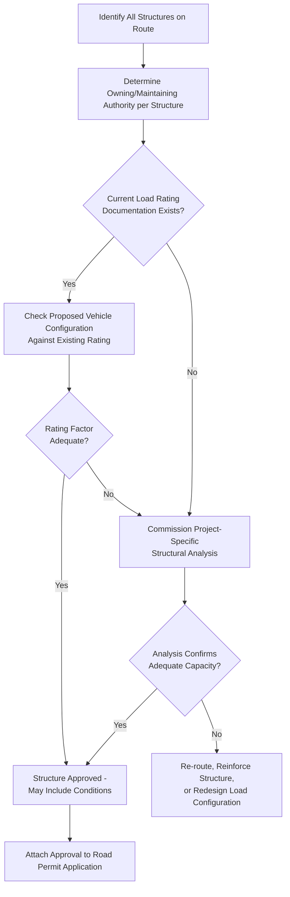

## Bridge and Structure Owner Notification Processes

### Overview

Bridge and structure owner notification processes are the formal communication and approval steps required before an oversize/overweight or abnormal load crosses a bridge, culvert, overpass, or other load-bearing structure whose design capacity may be challenged by the movement. While the permitting authority (state DOT, national road agency, LGU) typically governs the *road* permit itself, the *structure owner* — which is not always the same entity — must separately confirm that a specific structure can safely carry the specific load being proposed. This distinction between road permitting authority and structure ownership is one of the most frequently underestimated aspects of heavy-haul route planning.

Structure ownership is often fragmented: a single route can cross bridges owned by a national highway agency, a provincial/state agency, a municipal government, a railway company (for rail overpasses), or a private entity (for private access bridges or industrial estate infrastructure). Each owner may have its own notification process, review timeline, and approval criteria, independent of the road permit process running in parallel.

### Key Points

- **Structure ownership is often distinct from road permitting authority**: A road permit from the primary road authority does not automatically constitute bridge crossing approval if the bridge is owned or maintained by a different entity.
- **Bridge load rating is the technical basis for approval, not just administrative sign-off**: Structure owners assess whether the specific load configuration (weight, axle spacing, speed, positioning) falls within the bridge's rated capacity, often requiring a formal load rating analysis rather than a simple threshold check.
- **Notification lead time is frequently longer than road permit lead time**: Structural analysis, especially for older or non-standard bridges, can take substantially longer than administrative road permit review.
- **Some structures require load-specific engineering, not generic threshold checks**: Older or non-standard bridges may lack up-to-date load rating documentation, requiring project-specific structural assessment before an owner will approve a crossing.
- **Notification may trigger operational constraints beyond simple approval/denial**: Common outcomes include speed restrictions across the structure, requirements to cross at the structure's center line, prohibition on stopping on the structure, or requirements to maintain minimum following distance from other vehicles during crossing.

### Structure Owner Categories

| Owner Type | Typical Context | Notification Complexity |
| --- | --- | --- |
| National/federal highway agency | Bridges on national highways or expressways | Often integrated with the road permit process itself |
| State/provincial agency | Bridges on state or provincial roads | May require separate structural sign-off from a distinct engineering division |
| Municipal/local government (LGU) | Bridges on local/municipal roads | Frequently the least standardized process; may lack dedicated bridge engineering staff |
| Railway company | Overpasses/underpasses crossing rail infrastructure | Often a fully separate notification chain with its own clearance and timing windows (e.g., avoiding scheduled train movements) |
| Private entity | Industrial estate access bridges, private port infrastructure | Notification process determined entirely by the private owner; may be informal or contractually governed |
| Utility/pipeline company | Bridges co-located with major utility crossings | May require coordination beyond structural capacity, such as utility protection during crossing |

### Bridge Load Rating Fundamentals

Bridge load rating expresses a structure's safe load-carrying capacity, typically derived from structural analysis referencing standards such as AASHTO LRFR (Load and Resistance Factor Rating) in the US context or equivalent national/regional codes elsewhere. The general rating concept compares demand to capacity:

$$RF = \frac{C - \gamma_{DC}D_C - \gamma_{DW}D_W}{\gamma_{LL}(LL + IM)}$$

Where $RF$ is the rating factor, $C$ is structural capacity, $D_C$ and $D_W$ are dead load effects from structural components and wearing surface respectively, $LL$ is live load effect from the vehicle, $IM$ is dynamic (impact) allowance, and $\gamma$ terms are load factors specific to the rating code applied. An $RF \geq 1.0$ generally indicates the structure can safely carry the evaluated load; [Unverified] — the specific rating methodology, load factor values, and applicable code will vary by jurisdiction and structure type, and should be confirmed against the governing structural code for the specific bridge and region.

For abnormal/superload movements, the structure owner (or a retained bridge engineer) typically performs a specific-vehicle rating calculation using the actual axle configuration and spacing of the proposed transport combination, rather than relying on generic legal-load rating tables.

### Notification and Approval Workflow (General Pattern)

1. **Route identification**: All structures along the proposed route are identified, typically during route survey (see related route survey material).
2. **Ownership determination**: Each structure's owning/maintaining authority is identified — this step alone can require research if ownership records are fragmented or outdated.
3. **Existing load rating retrieval**: The owner is asked to provide the structure's current load rating documentation, if it exists.
4. **Gap assessment**: If no current rating exists, or if the rating does not cover the proposed vehicle configuration, a project-specific structural analysis is commissioned — potentially by the owner's engineering staff, a retained consultant, or the project's own structural engineer, depending on the owner's process.
5. **Approval and conditions**: The owner issues approval, denial, or conditional approval (e.g., speed restriction, lane positioning requirement, time-of-day restriction, escort requirement specific to the crossing).
6. **Integration with road permit**: Structure approval documentation is typically required as a supporting attachment to the overall road permit application, meaning delays in structure approval directly delay the road permit itself.

### Example

**Scenario**: A route for a 68-tonne SPMT-transported transformer crosses three structures: a national highway bridge, a municipal bridge on an LGU road, and a private access bridge into an industrial estate where the final delivery point is located.

**Notification walkthrough**:

1. **National highway bridge**: DPWH (or equivalent national agency) maintains current load rating documentation as part of its bridge management system; the 68-tonne SPMT configuration is checked against this existing rating. If the SPMT's axle spread adequately distributes the load, this structure may clear without requiring new analysis — the modularity of SPMT axle configuration (see related superload material) is often specifically leveraged to achieve this outcome.
2. **Municipal bridge**: The LGU may not maintain an up-to-date formal load rating for this structure, particularly if it is an older or lower-traffic bridge; this triggers a gap assessment, potentially requiring the project to commission a structural engineer to perform a project-specific rating calculation — a process that can take considerably longer than the national highway bridge check and should be identified as early as possible in the schedule.
3. **Private access bridge**: As a privately owned structure, the notification process is determined by the industrial estate operator directly rather than any government process; this may be faster (single point of contact, direct negotiation) or slower (no standardized process, ad hoc engineering review) depending entirely on the private owner's own capability and willingness to engage promptly.
4. **Schedule consolidation**: The overall permit timeline for this route is governed by whichever of the three structures has the slowest approval path — in this scenario, most likely the municipal bridge given the probable absence of existing rating documentation — reinforcing the general principle (also seen in the related electronic permit systems material) that multi-authority routes should be scheduled around the most conservative, not the most optimistic, processing assumption.

### Structure Notification Decision Flow (svg_diagram)

### Common Pitfalls

- **Assuming road permit approval implies bridge approval**: These are frequently separate processes with separate owners, and conflating them can lead to a road permit being issued while a critical bridge crossing remains unapproved.
- **Underestimating LGU/municipal bridge documentation gaps**: Smaller local authorities are statistically more likely to lack current, formal load rating documentation compared to national highway agencies, making this the most common source of unplanned schedule delay.
- **Overlooking private and railway-owned structures**: These fall outside standard government permitting chains entirely and require separate, sometimes informal, direct engagement.
- **Late structure identification**: Failing to comprehensively map every structure on the route during initial route survey can result in discovering an unapproved structure late in the process, forcing a schedule-critical re-route.
- **Treating "approval" as binary**: Conditional approvals (speed restrictions, positioning requirements, time-of-day limits) must be incorporated into the actual movement plan, not just filed as paperwork.

### Conclusion

Bridge and structure owner notification is a distinct workstream from road permitting, driven by structural engineering assessment rather than administrative threshold checks, and complicated by fragmented ownership across national, local, private, and railway entities. Because structure approval timelines — particularly for under-documented municipal or older structures — frequently become the critical path for the entire permitting schedule, early and comprehensive structure identification, ownership determination, and load rating gap assessment are essential to avoid late-stage, schedule-critical surprises.

**Related Topics**

- Oversize and Overweight Permit Requirements by Jurisdiction
- Abnormal Load and Superload Definitions and Thresholds
- Route Survey and Swept Path Analysis for Abnormal Loads
- Electronic Permit Systems and Route Notification Platforms
- SPMT (Self-Propelled Modular Transporter) Axle Load Distribution
- Bridge Load Rating Methodologies (AASHTO LRFR and Equivalent Codes)