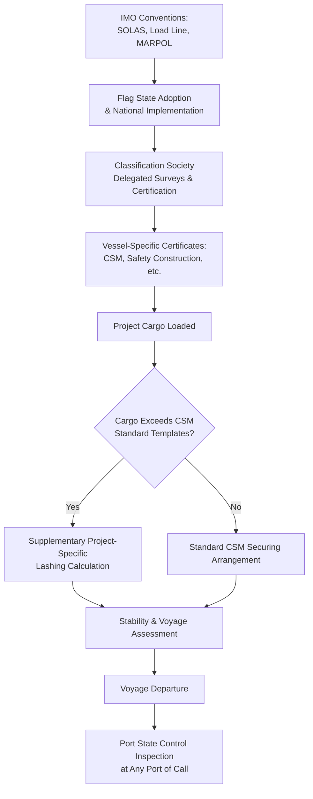

## International Maritime Regulations and SOLAS Compliance

### Overview

International maritime regulations governing heavy-lift and specialized cargo transport by sea are anchored primarily in the **International Convention for the Safety of Life at Sea (SOLAS)**, administered by the **International Maritime Organization (IMO)**, alongside a family of complementary conventions and codes that collectively govern vessel safety, cargo securing, and crew competency for project cargo movements. Unlike road-based OS/OW permitting (which is fragmented by national/subnational jurisdiction), maritime regulation operates on a layered model: broad international conventions set baseline safety requirements that flag states adopt and enforce through their own national maritime administrations, with port states additionally exercising inspection authority (Port State Control) over foreign-flagged vessels calling at their ports.

For heavy-lift and specialized logistics specifically, SOLAS compliance intersects most directly with cargo securing arrangements, vessel stability during heavy-lift operations, and the certification of lifting equipment — areas governed jointly by SOLAS chapters and subordinate IMO codes rather than SOLAS alone.

### Key Points

- **SOLAS is a framework convention, not a single all-encompassing rulebook**: Specific technical requirements for cargo securing, stability, and heavy-lift operations are found across multiple SOLAS chapters and referenced subordinate codes (CSS Code, IMDG Code, Grain Code, etc.), not in one consolidated section.
- **Flag state administration determines the direct regulatory authority over a vessel**: A vessel's compliance obligations flow from its flag state's ratification and implementation of SOLAS, though virtually all major maritime nations are SOLAS signatories.
- **Port State Control (PSC) provides an independent compliance check**: A vessel can be inspected, detained, or have deficiencies noted by the port state regardless of flag state certification, creating a practical dual-layer compliance environment.
- **Classification societies act as delegated technical authorities**: Flag states commonly delegate SOLAS survey and certification functions to classification societies (e.g., DNV, ABS, Lloyd's Register, ClassNK), meaning much day-to-day compliance verification happens through class surveys rather than direct flag state inspection.
- **Project cargo introduces securing and stability considerations beyond standard containerized/bulk cargo assumptions**: Heavy, high-value, or unusually shaped cargo often falls outside standard cargo securing manual templates, requiring project-specific securing calculations.

### Relevant SOLAS Chapters and Subordinate Codes

| Instrument | Relevance to Heavy-Lift/Project Cargo |
| --- | --- |
| **SOLAS Chapter VI** (Carriage of Cargoes and Oil Fuels) | Establishes general requirements for cargo stowage and securing, cargo information provision, and applies the CSS Code by reference |
| **SOLAS Chapter VII** (Carriage of Dangerous Goods) | Relevant when project cargo includes dangerous goods components (e.g., certain chemicals, batteries in equipment) via the IMDG Code |
| **CSS Code** (Code of Safe Practice for Cargo Stowage and Securing) | Provides detailed guidance on securing arrangements, lashing calculations, and the vessel-specific **Cargo Securing Manual (CSM)** requirement |
| **IMDG Code** (International Maritime Dangerous Goods Code) | Governs classification, packing, and stowage of dangerous goods that may be incidental to project cargo shipments |
| **IMSBC Code** (International Maritime Solid Bulk Cargoes Code) | Relevant if project logistics includes bulk cargo components alongside heavy-lift units |
| **Load Line Convention (1966/1988 Protocol)** | Governs vessel freeboard and reserve buoyancy, relevant to stability margins when carrying heavy deck cargo |
| **MARPOL** | Environmental compliance, generally parallel to rather than directly governing heavy-lift cargo securing, but relevant to overall vessel compliance status |

### Cargo Securing Manual and Project-Specific Lashing

For heavy-lift and breakbulk cargo, the vessel's **Cargo Securing Manual (CSM)** — required under SOLAS Chapter VI/CSS Code — provides the baseline securing methodology and approved lashing points, but heavy or unusually shaped cargo frequently requires supplementary, cargo-specific lashing calculations beyond the CSM's standard templates.

A simplified lashing force balance concept used in securing calculations follows the general form:

$$\sum F_{lashing} \geq F_{external}(a_{transverse}, a_{longitudinal}, a_{vertical}, \mu)$$

Where $F_{external}$ represents the combined force from vessel motion accelerations (transverse, longitudinal, and vertical, derived from the vessel's motion response and voyage routing/season) acting against the cargo's mass, offset partially by the friction coefficient $\mu$ between cargo and deck, with the required lashing arrangement sized to resist the residual force. [Unverified] — specific methodology (e.g., IMO's Annex 13 lashing calculation guidance within the CSS Code) and applicable safety factors should be confirmed against the current CSS Code text and the specific classification society's requirements, as calculation methodologies and referenced standards are periodically revised.

### Flag State, Port State, and Classification Society Roles

- **Flag State**: The country under whose flag a vessel is registered bears primary responsibility for SOLAS implementation and certificate issuance for that vessel.
- **Port State Control**: When a vessel calls at a foreign port, that port state's maritime authority may inspect the vessel for SOLAS (and other convention) compliance, potentially detaining the vessel for serious deficiencies — a mechanism that provides oversight independent of flag state performance, and is coordinated internationally through regional PSC memoranda of understanding (e.g., Paris MOU, Tokyo MOU) that share inspection data and target higher-risk vessels.
- **Classification Society**: Acting under authority delegated by the flag state (Recognized Organization status), class societies conduct surveys, issue SOLAS-related certificates (e.g., Cargo Ship Safety Construction Certificate), and maintain ongoing class status that is often a practical prerequisite for insurance and charter acceptability, independent of strict flag state enforcement.

### Example

**Scenario**: A heavy-lift vessel is chartered to transport a 450-tonne process module as deck cargo from a fabrication yard to an offshore-adjacent port, with the voyage transiting international waters and calling at one intermediate port for bunkering.

**Compliance walkthrough**:

1. **Vessel certification baseline**: The vessel's flag state SOLAS certificates (Cargo Ship Safety Construction, Safety Equipment, Safety Radio certificates, as applicable) are confirmed current, along with valid classification society certification confirming ongoing compliance status.
2. **Cargo Securing Manual review**: The vessel's approved CSM is reviewed to determine whether the 450-tonne module's dimensions and lashing point requirements fall within pre-approved securing arrangements, or whether the module's weight/shape requires a supplementary project-specific lashing calculation — commonly the case for cargo significantly exceeding the CSM's standard unit weight assumptions.
3. **Stability assessment**: The vessel's loading computer / stability software is used to verify that the module's weight and deck position do not exceed permissible stability margins under the vessel's Load Line certificate conditions for the intended voyage route and season, accounting for expected sea states.
4. **Port State Control exposure at intermediate port**: Since the vessel calls at an intermediate port for bunkering, it is subject to that port's PSC regime; if the vessel has any outstanding deficiencies flagged in prior PSC inspection history (accessible via regional PSC databases), this may increase inspection scrutiny or detention risk at that call — a factor project planners often verify when selecting or evaluating a chartered vessel's PSC/detention history as part of vessel vetting.
5. **Documentation package**: A voyage-specific package combining standard SOLAS certification, the CSM (or supplementary lashing calculation), and stability calculations is typically compiled and made available for both classification society confirmation and any PSC inspection during the voyage.

### SOLAS-Related Compliance Layers (svg_diagram)

### Common Pitfalls

- **Assuming standard CSM templates cover heavy-lift cargo automatically**: Project cargo frequently exceeds the weight, shape, or positioning assumptions built into a vessel's standard Cargo Securing Manual, requiring supplementary engineering.
- **Overlooking Port State Control exposure at intermediate/bunkering calls**: A voyage's primary load/discharge ports may have excellent compliance track records, but an intermediate call introduces independent PSC exposure that should be assessed.
- **Conflating classification society approval with full regulatory compliance**: Class certification is a critical and often delegated compliance layer, but does not eliminate flag state or port state regulatory authority.
- **Ignoring dangerous goods components within project cargo**: Ancillary items (batteries, hydraulic fluids, certain coatings) within an otherwise "heavy equipment" shipment can trigger IMDG Code requirements that are easy to overlook if the shipment is mentally categorized purely as project cargo.
- **Underestimating voyage/seasonal stability margin sensitivity**: Stability calculations performed for one season or route may not directly transfer to a different voyage routing or season with different expected sea states.

### Conclusion

International maritime regulation for heavy-lift cargo operates through a layered compliance system — IMO conventions implemented by flag states, delegated to classification societies for survey and certification, and independently checked through Port State Control — rather than a single unified rulebook. SOLAS itself provides the overarching framework, but practical heavy-lift compliance depends heavily on subordinate instruments like the CSS Code for cargo securing and the vessel's own Cargo Securing Manual, which frequently requires project-specific supplementation for cargo exceeding standard assumptions.

**Related Topics**

- Cargo Securing Manual (CSM) and Lashing Calculation Methodology
- Marine Spread Selection for Offshore Campaigns
- Vessel Stability and Loading Computer Verification for Heavy-Lift Voyages
- Port State Control Inspection Regimes and Vessel Vetting
- IMDG Code Classification for Project Cargo Ancillary Components
- Classification Society Roles in Heavy-Lift Vessel Certification