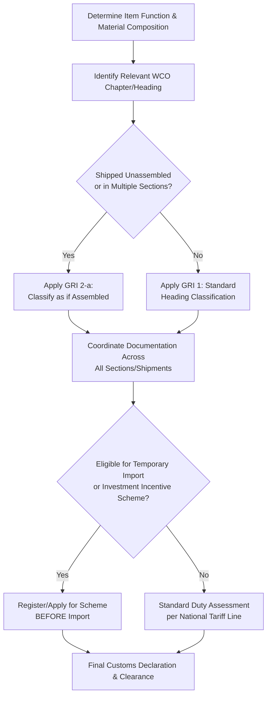

## Customs Classification and HS Codes for Project Cargo

### Overview

Customs classification is the process of assigning the correct **Harmonized System (HS) code** to imported or exported goods, which determines the applicable duty rate, taxes, import/export licensing requirements, and statistical reporting treatment for that shipment. The HS is maintained by the **World Customs Organization (WCO)** and provides a standardized 6-digit international classification structure that individual countries extend with additional digits (typically to 8 or 10 digits) for national tariff schedule purposes.

For heavy-lift and specialized logistics, HS classification presents distinctive challenges because project cargo — large industrial equipment, modules, and structures — often does not fit neatly into standard finished-goods categories, and is frequently shipped disassembled, in multiple pieces, or as part of a broader project import that may qualify for specialized customs treatment distinct from standard commercial goods classification.

### Key Points

- **HS codes are structured hierarchically**: The international 6-digit HS code is common globally, but the same physical item can carry different final classification digits (and therefore different duty rates) once national tariff schedule extensions are applied.
- **Classification is determined by the item's nature, not its declared value or project context**: Customs authorities classify based on the General Rules for Interpretation (GRI) applied to the good's material composition, function, and form, not based on how the shipment is described commercially.
- **Disassembled or unassembled equipment has specific classification rules**: The HS includes provisions (notably GRI 2(a)) addressing goods presented unassembled or disassembled, generally allowing classification as if assembled, provided this is not being used to circumvent proper classification.
- **Project cargo may qualify for specialized customs regimes**: Many jurisdictions offer temporary importation, bonded warehousing, or project-specific duty exemption/deferral schemes for large capital equipment imports tied to registered infrastructure or investment projects.
- **Incorrect classification carries direct financial and schedule risk**: Misclassification can result in incorrect duty assessment (over- or under-payment), customs holds pending reclassification, and potential penalties for undervaluation or misdeclaration.

### HS Code Structure

| Digit Group | Function |
| --- | --- |
| Chapter (digits 1–2) | Broad product category (e.g., Chapter 84 — Machinery and mechanical appliances; Chapter 85 — Electrical machinery and equipment) |
| Heading (digits 3–4) | Sub-category within the chapter |
| Subheading (digits 5–6) | International standard classification level — common across all WCO member countries |
| National tariff line (digits 7–10, varies by country) | Country-specific extension for national duty rate and statistical purposes |

For example, a heading such as 84.26 (ships' derricks, cranes, works trucks fitted with a crane) illustrates how heavy-lift-related equipment is captured within specific machinery headings — [Unverified], exact heading/subheading assignment for any specific piece of equipment must be verified against the current WCO Harmonized System nomenclature and the specific item's characteristics, since classification depends on precise technical specifications and periodic HS nomenclature revisions (the WCO updates the HS nomenclature periodically, most recently with HS 2022, and updates occur on a roughly five-year cycle).

### General Rules for Interpretation (GRI) — Relevance to Project Cargo

The GRI provide the legal framework customs authorities apply to determine classification, in sequential order:

- **GRI 1**: Classification is determined by the terms of the headings and relevant section/chapter notes — the starting point for any classification exercise.
- **GRI 2(a)**: Addresses incomplete or unfinished articles, and critically for project cargo, goods **presented unassembled or disassembled** — such goods are generally classified as if assembled, which is directly relevant when heavy equipment is shipped in multiple pieces or containers for transport/handling reasons.
- **GRI 2(b)**: Addresses mixtures and combinations of materials.
- **GRI 3**: Provides rules for classifying goods that could otherwise fall under two or more headings (essential character test, among others).
- **GRI 5**: Addresses classification of packing materials and containers.
- **GRI 6**: Extends the same principles to subheading-level classification.

[Unverified] — the precise application of GRI 2(a) and related rules to a specific disassembled shipment (e.g., what constitutes sufficient documentation that disassembly is for transport/handling reasons rather than an attempt to obtain more favorable classification for individual components) should be confirmed with a licensed customs broker or the relevant national customs authority, as interpretation and evidentiary requirements vary by jurisdiction.

### Project Cargo-Specific Customs Considerations

- **Multi-shipment / multi-container declarations**: Large equipment shipped across several containers, break-bulk lots, or multiple vessel calls often requires coordinated customs declarations referencing a single overall project or contract, rather than being treated as unrelated independent shipments — improper coordination can result in individual shipments being misclassified as complete standalone goods rather than components of a larger unassembled unit.
- **Temporary importation regimes**: Equipment imported temporarily (e.g., construction equipment, specialized lifting gear used only for the project duration and intended for re-export) may qualify for temporary import bonds or ATA Carnet-style mechanisms in some jurisdictions, deferring or eliminating duty liability contingent on re-export within a specified period.
- **Investment/project-registered duty incentives**: Many countries, including the Philippines, offer duty exemption or reduced-rate schemes for capital equipment imported under registered investment projects (e.g., through the Board of Investments or equivalent economic zone authorities) — [Unverified], specific current eligibility criteria, registration procedures, and applicable duty treatment should be confirmed against current Philippine Board of Investments/Bureau of Customs regulations or the equivalent authority in the relevant jurisdiction, since incentive schemes and qualifying criteria are periodically revised through legislation.
- **Valuation complexity for large custom-fabricated equipment**: Customs valuation (typically based on transaction value under WTO Valuation Agreement principles) for unique, custom-built heavy equipment can require more detailed documentation than standard commercial goods, particularly when no comparable "identical or similar goods" transaction value exists for reference.

### Example

**Scenario**: A 350-tonne pressure vessel is fabricated overseas and shipped to the Philippines in three sections (due to transport dimension constraints) for final assembly on-site at a registered industrial project.

**Classification walkthrough**:

1. **Initial HS heading determination**: The vessel's function and material composition are assessed against the relevant WCO chapter/heading (likely within Chapter 84's machinery/mechanical appliance provisions, with the exact heading dependent on the vessel's specific process function) — this determines the baseline 6-digit international classification.
2. **GRI 2(a) application**: Because the vessel is shipped in three sections for transport reasons (not to obtain more favorable treatment for individual sections), it is classified as if assembled — meaning all three sections should be declared with reference to the same HS classification as the complete unit, rather than each section potentially being misclassified as a "part" under a different, possibly higher-duty heading.
3. **Documentation coordination**: A packing list, bill of lading, and customs declaration are structured to clearly link all three sections as components of one project cargo unit, supporting the GRI 2(a) unassembled-goods treatment and avoiding the risk of individual sections being processed as unrelated shipments by different customs officers or at different points of entry.
4. **Duty incentive assessment**: If the destination facility is registered under a Philippine investment incentive scheme, the importer verifies whether the pressure vessel qualifies for duty exemption or reduced-rate treatment as registered capital equipment — this determination and its procedural requirements should be confirmed with the relevant incentive-granting authority and a customs broker before shipment, since incentive qualification often requires pre-import registration rather than being claimable retroactively after arrival.
5. **National tariff line and rate confirmation**: The Philippine Bureau of Customs' national tariff schedule extension of the international 6-digit subheading is confirmed to determine the exact applicable duty rate and any additional national-level documentation requirements.

### Project Cargo Classification Workflow (svg_diagram)

### Common Pitfalls

- **Classifying disassembled sections independently**: Without proper GRI 2(a) documentation linking multiple shipments as one unassembled unit, customs may classify individual sections as "parts," often resulting in a different (sometimes higher) duty rate than the complete unit would attract.
- **Applying for duty incentive schemes after import**: Many investment/project duty incentive schemes require pre-import registration; attempting to claim benefits retroactively after arrival frequently fails.
- **Assuming a single global HS code determines final duty**: The international 6-digit subheading is only the starting point; national tariff line extensions determine actual duty rates and can vary meaningfully between countries even for identically classified goods.
- **Inconsistent commercial documentation across shipment legs**: Packing lists, invoices, and bills of lading that describe the same physical equipment inconsistently across multiple shipments can undermine GRI 2(a) unassembled-goods treatment and trigger customs scrutiny or delay.
- **Overlooking valuation documentation for unique fabricated equipment**: Absence of comparable transaction value data for custom-built items can slow customs valuation review if supporting cost documentation is not proactively provided.

### Conclusion

Customs classification for project cargo requires navigating the standard WCO Harmonized System framework while accounting for the specific complexities of large, often disassembled or multi-shipment industrial equipment — particularly the GRI 2(a) unassembled-goods provision and the potential availability of temporary importation or investment-linked duty incentive schemes. Because classification errors and uncoordinated multi-shipment documentation carry direct duty cost and customs clearance delay risk, early engagement with a qualified customs broker and, where applicable, pre-import registration for incentive schemes are essential components of project cargo import planning.

**Related Topics**

- Oversize and Overweight Permit Requirements by Jurisdiction
- International Maritime Regulations and SOLAS Compliance
- Temporary Importation and Bonded Warehousing for Project Equipment
- Customs Valuation Methodology for Custom-Fabricated Equipment
- Philippine Board of Investments Capital Equipment Incentive Schemes
- Multi-Shipment Documentation Coordination for Disassembled Cargo