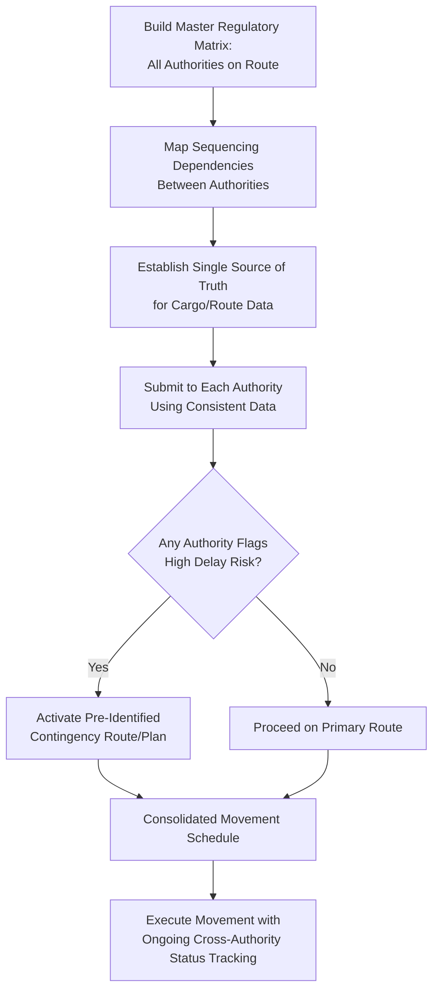

## Cross-Border and Multi-Jurisdictional Permit Coordination

### Overview

Cross-border and multi-jurisdictional permit coordination is the integrative planning discipline that consolidates the separate regulatory workstreams — oversize/overweight road permits, abnormal load classifications, escort requirements, bridge/structure notifications, electronic permit system engagement, customs clearance, and (where applicable) maritime compliance — into a single, schedule-coherent movement plan spanning multiple regulatory authorities. Where the preceding topics in this chapter each address one regulatory dimension in isolation, this topic addresses the practical reality that a single heavy-lift project route almost never involves only one authority, and the coordination burden of reconciling many independent processes is itself a distinct project risk requiring dedicated management.

The central challenge is that each authority along a route — a national road agency, multiple provincial/state agencies, municipal/LGU governments, a customs administration, and potentially a flag state or port state maritime regime — operates its own rules, timelines, documentation formats, and approval criteria, with little to no automatic coordination between them. Multi-jurisdictional coordination is therefore fundamentally a project management and communications discipline layered on top of the individual regulatory requirements already covered.

### Key Points

- **The critical path is set by the slowest authority, not the average**: As established in the related electronic permit systems and bridge notification material, overall schedule risk is governed by whichever jurisdiction or structure owner in the chain has the longest, least predictable, or least digitized process.
- **Authorities rarely communicate with each other automatically**: Absent a specific bilateral/multilateral agreement (e.g., certain US interstate compacts, EU harmonization directives), each jurisdiction typically requires independent engagement, even when the same physical cargo and route segment is involved.
- **Sequencing dependencies exist between permit types**: Customs clearance may need to precede road permit application (cargo must be released before its exact final configuration/weight is confirmed for road transport); bridge structural approval is often a prerequisite attachment to the road permit application itself.
- **A single point of coordination failure can cascade**: A delay or denial at one authority (e.g., a municipal bridge lacking load rating documentation) can invalidate or force rework of otherwise-completed approvals from other authorities if the route must change.
- **Documentation consistency across authorities is a recurring failure point**: Inconsistent cargo dimensions, weights, or descriptions across different permit applications (submitted to different authorities, sometimes by different personnel or agents) can trigger delays, rejections, or compliance questions even when each individual figure is technically accurate.

### Coordination Framework Components

| Component | Function |
| --- | --- |
| Master regulatory matrix | A consolidated register of every authority along the route, its specific requirements, lead times, and current application status |
| Sequencing/dependency map | Identifies which approvals must precede others (e.g., bridge approval before road permit submission, customs release before final road transport configuration is confirmed) |
| Single source of truth for cargo/route data | One authoritative dataset (dimensions, weight, axle configuration, route waypoints) referenced consistently across all authority submissions to prevent inconsistency |
| Escalation and contingency triggers | Pre-defined thresholds (e.g., "if bridge approval is not received by week X, activate alternate route Y") to avoid discovering critical-path delays too late to react |
| Local agent/broker network | Often essential where language, local regulatory nuance, or in-person submission requirements exist, particularly at the LGU/municipal or country-specific customs level |

### Regulatory Coordination Patterns

#### Federated National Systems (US, Canada, EU)

- Coordination challenge is primarily **horizontal** — reconciling multiple co-equal state/provincial/national authorities along a single route, each with independent rulebooks.
- Some regions have developed formal reciprocal frameworks (e.g., certain US interstate weight/dimension reciprocity arrangements, EU harmonization directives on vehicle dimensions) that reduce, but do not eliminate, the need for separate permits per jurisdiction — [Unverified], the specific scope and current participating jurisdictions of any reciprocity arrangement should be verified against current regulatory publications, as these arrangements evolve.
- Multi-state/multi-province US and Canadian moves commonly rely on specialized permit service providers or brokers who maintain current relationships and process knowledge across many jurisdictions simultaneously, effectively outsourcing part of the coordination burden.

#### Layered National-to-Local Systems (Philippines and similar structures)

- Coordination challenge is primarily **vertical and horizontal simultaneously** — reconciling a national road/bridge authority (DPWH), potentially a national customs administration, and multiple independent LGUs along the same route, each with potentially different levels of process formalization and digital maturity (as discussed in the related electronic permit systems material).
- The vertical dimension (national agency requirements layered against local government requirements) adds a coordination step not present in more horizontally federated systems, since national-level clearance does not automatically satisfy local-level requirements or vice versa.
- Given uneven digital maturity across LGUs (per the related electronic permit systems material), local project representation or an experienced local logistics/permitting agent familiar with specific LGU practices is often a practical necessity rather than an optional convenience.

#### International/Cross-Border Movements

- Introduces an additional coordination layer beyond domestic multi-jurisdictional complexity: customs clearance (see related customs classification material) at the border crossing point, potential differences in vehicle/trailer regulations between countries (axle configuration standards, escort equipment specifications per the related escort material), and, where sea transport is involved, flag state/port state maritime compliance (see related SOLAS material).
- Border-crossing timing itself becomes a schedule variable — customs processing windows, border facility operating hours, and any required pre-clearance documentation must be integrated into the overall movement schedule alongside road permit validity windows.

### Example

**Scenario**: A heavy-lift logistics team is coordinating the delivery of a 90-tonne generator set, imported by sea and requiring final overland delivery across one national highway segment and two LGU jurisdictions in the Philippines to reach an inland power plant site.

**Coordination walkthrough**:

1. **Sequencing determination**: Customs clearance (see related customs classification material) must be substantially resolved before the exact final road transport configuration (trailer type, axle spread, resulting overall dimensions) can be confirmed for the road permit application, establishing customs as an upstream dependency for the road permitting workstream.
2. **Master regulatory matrix construction**: A single consolidated register is built listing: Bureau of Customs (import clearance), DPWH (national highway segment permit and bridge load rating), LGU 1 and LGU 2 (municipal road permits, local traffic coordination, and municipal bridge notifications per the related bridge notification material), and any private port/access road authorities at the origin and destination.
3. **Identifying the likely critical path**: Based on patterns established in the related bridge notification material, the municipal bridges within the two LGU jurisdictions are flagged as the most likely source of unplanned delay, given the higher probability of absent or outdated load rating documentation compared to the national highway agency's typically more current bridge management records — this becomes the top priority item for early engagement.
4. **Documentation consistency control**: A single master dataset for the generator set's dimensions, weight, and trailer configuration is established and used verbatim across the customs declaration, DPWH permit application, and both LGU permit applications, preventing the common failure mode of inconsistent figures appearing across different submissions prepared by different team members or agents at different times.
5. **Contingency planning**: An alternate route avoiding the higher-risk municipal bridge is pre-identified and pre-costed (in terms of additional distance/time) before permit applications are submitted, so that if the municipal bridge load rating comes back unfavorable, the team can pivot immediately rather than restarting route planning from scratch under schedule pressure.
6. **Local agent engagement**: Given the vertical/horizontal coordination complexity and potential LGU-specific process variation, a local permitting agent with established relationships at both LGUs is engaged to manage in-person or LGU-specific submission requirements that a purely centralized project team might not efficiently navigate.

### Multi-Jurisdictional Coordination Structure (svg_diagram)

### Common Pitfalls

- **Managing each authority's process in isolation**: Without a consolidated master matrix, teams risk missing sequencing dependencies (e.g., submitting a road permit application before customs release fixes final cargo configuration).
- **Inconsistent data across submissions**: The single most common documentation failure in multi-jurisdictional coordination, often caused by different team members or agents preparing different applications independently without a shared source dataset.
- **No pre-identified contingency route**: Discovering a blocking issue (e.g., an inadequate bridge) without a pre-planned alternative forces reactive, schedule-compressed route replanning under pressure.
- **Underestimating vertical coordination complexity in layered systems**: Assuming national-level clearance or approval automatically satisfies local-level requirements, when in practice these are typically independent processes.
- **Late engagement of local agents/brokers**: Attempting to manage highly localized processes (particularly LGU-level or country-specific customs nuances) purely from a centralized project office, without local representation, often underestimates process time and local requirement specificity.

### Conclusion

Cross-border and multi-jurisdictional permit coordination is fundamentally a project management discipline that integrates the individually covered regulatory workstreams — road permitting, abnormal load classification, escorting, bridge notification, electronic systems, and customs — into one schedule-coherent plan. Because authorities rarely coordinate with each other automatically, and because the overall schedule is governed by the slowest link in the chain, successful coordination depends on building a consolidated regulatory matrix early, maintaining rigorous documentation consistency across all submissions, and pre-identifying contingency options for the most probable points of delay before they materialize as active schedule threats.

**Related Topics**

- Oversize and Overweight Permit Requirements by Jurisdiction
- Abnormal Load and Superload Definitions and Thresholds
- Escort and Pilot Car Requirements
- Electronic Permit Systems and Route Notification Platforms
- Bridge and Structure Owner Notification Processes
- Customs Classification and HS Codes for Project Cargo
- International Maritime Regulations and SOLAS Compliance
- Route Survey and Contingency Route Planning for Abnormal Loads