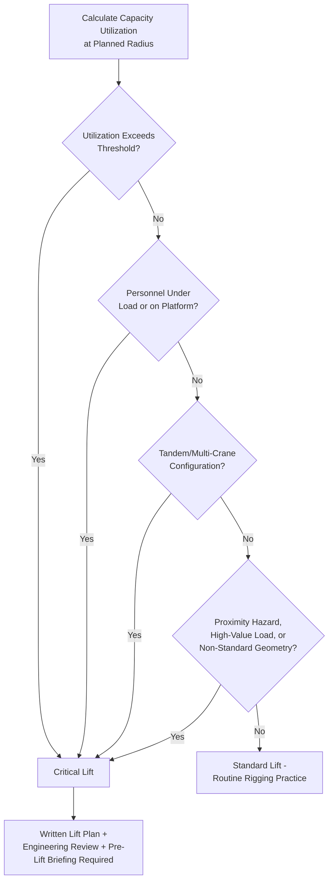

## Critical Lift Definition and Classification Criteria

### Overview

A critical lift is a lifting operation that, due to its load characteristics, configuration, or operating conditions, carries elevated risk of failure, personnel injury, or equipment damage relative to routine lifting operations, and therefore requires a formal, documented lift plan and enhanced engineering oversight beyond standard rigging practice. The term and its specific classification thresholds originate primarily from industry standards such as **ASME B30.5** (Mobile and Locomotive Cranes) and related ASME B30 series standards, as well as project-specific and client-specific criteria commonly applied in heavy industrial, oil and gas, and offshore construction sectors.

Unlike routine lifts governed by standard operator competency and general rigging practice, a critical lift triggers a structured planning process — typically involving a written lift plan, engineering review, and pre-lift meeting — because the consequences of an unplanned failure (dropped load, tip-over, structural overload) are judged to be disproportionately severe relative to a standard lift.

### Key Points

- **Classification is triggered by defined criteria, not subjective judgment alone**: Most organizations codify specific numerical and qualitative thresholds (percentage of crane capacity, proximity to hazards, personnel involvement) that automatically classify a lift as critical, reducing reliance on ad hoc determination.
- **Percentage of rated capacity is the most common quantitative trigger**: A lift utilizing a high percentage of the crane's rated capacity at the required radius (commonly cited thresholds are 75%, 80%, or 90% of rated capacity, depending on the specific standard or client procedure) is a standard classification trigger, though exact percentages vary by organization/standard — [Unverified], the precise percentage should be confirmed against the governing standard or project-specific procedure.
- **Multiple independent criteria can each independently trigger critical lift status**: A lift can qualify as critical due to capacity utilization alone, personnel-under-load alone, tandem lift configuration alone, or any combination — classification logic is typically an "any trigger applies" structure rather than requiring multiple simultaneous conditions.
- **Critical lift status changes the planning process, not just documentation volume**: Beyond paperwork, critical lift classification typically mandates specific engineering involvement (e.g., a lift plan prepared or reviewed by a qualified/competent person), rigging verification, and a documented pre-lift briefing that standard lifts may not require.
- **Classification criteria are frequently client- or project-specific in addition to industry standard baselines**: Many owner/operator organizations (particularly in oil & gas, offshore, and heavy industrial sectors) impose their own critical lift procedures with thresholds stricter than the baseline industry standard.

### Common Critical Lift Classification Triggers

| Trigger Category | Typical Criteria |
| --- | --- |
| Capacity utilization | Load exceeds a defined percentage of crane's rated capacity at the lift radius (commonly cited around 75–90%, varying by standard/organization) |
| Personnel involvement | Lift involves personnel working beneath a suspended load, or personnel lifted in a man-basket/personnel platform |
| Tandem/multi-crane lift | Two or more cranes lifting a single load simultaneously, due to load-sharing complexity and coordination risk |
| High-value or irreplaceable load | Load has exceptionally high replacement cost, long lead time, or is otherwise mission-critical to the project (e.g., a single large reactor with a multi-month fabrication lead time) |
| Proximity hazards | Lift occurs near energized power lines, occupied structures, other critical infrastructure, or in a congested/restricted working area |
| Non-routine lift geometry | Load center of gravity is difficult to determine, load is asymmetric, or rigging configuration is non-standard (e.g., unconventional sling angles, custom lift fixtures) |
| Environmental/site conditions | Elevated wind speed thresholds specific to the lift, adverse ground bearing conditions, or lifts conducted at night or in reduced visibility |
| Crane configuration | Lift requires the crane to operate at or near its maximum boom length/radius combination, or in a configuration outside its most stable operating envelope |

### Classification Logic

A generalized critical lift determination can be represented as an "any trigger" logic structure:

$$\text{Critical Lift} = T_{capacity} \lor T_{personnel} \lor T_{tandem} \lor T_{value} \lor T_{proximity} \lor T_{geometry} \lor T_{environment}$$

Where each $T$ represents a boolean trigger condition (true/false) for the corresponding category above. If **any** condition evaluates true, the lift is classified as critical and the enhanced planning process is invoked — this is distinct from a weighted scoring system, though some organizations do use point-based risk matrices as a supplementary refinement within their specific procedure.

The capacity utilization trigger itself is typically calculated as:

$$U = \frac{W_{load} + W_{rigging}}{C_{rated}(R)} \times 100\%$$

Where $W_{load}$ is the load weight, $W_{rigging}$ is the weight of rigging/spreader equipment (often overlooked in informal capacity checks but material to accurate utilization calculation), and $C_{rated}(R)$ is the crane's rated capacity at the specific operating radius $R$ from the load chart — since rated capacity varies significantly with radius, this calculation must use the actual planned radius, not the crane's maximum theoretical capacity at minimum radius.

### Regulatory and Standard References

- **ASME B30.5** (Mobile and Locomotive Cranes) and the broader **ASME B30 series** are widely referenced US industry standards addressing crane safety, though critical lift-specific procedures are often developed as supplementary organizational procedures rather than being exhaustively specified within B30.5 itself.
- **API RP 2D** (Recommended Practice for Operation and Maintenance of Offshore Cranes) is commonly referenced in offshore contexts and includes lift planning and critical lift considerations relevant to platform and vessel-based crane operations.
- Many national/regional occupational safety regulators (e.g., OSHA in the US) establish baseline crane operation safety requirements, though specific "critical lift" classification and procedural thresholds are more commonly a matter of industry standard practice and organizational procedure than direct regulatory mandate — [Unverified], the specific regulatory status of critical lift classification (mandatory regulation vs. industry best practice) varies by jurisdiction and should be confirmed against current applicable regulations for the specific project location.
- In the Philippine context, critical lift procedures on major industrial or infrastructure projects are commonly governed by project-specific or client-specific procedures (particularly on projects involving multinational EPC contractors or oil & gas/offshore work) referencing these same international standards, rather than a distinct codified Philippine national "critical lift" regulation — [Unverified], this should be confirmed against current DOLE occupational safety and health standards and any applicable project-specific contractual requirements.

### Example

**Scenario**: A 45-tonne heat exchanger is to be lifted and set using a 100-tonne mobile crane, at a working radius of 12 meters, in a plant area with a live 13.8 kV overhead line 8 meters from the lift path, with no personnel required beneath the load during the lift.

**Classification walkthrough**:

1. **Capacity utilization check**: Using the crane's load chart at 12 m radius, if the rated capacity at that radius is, for example, 52 tonnes, then $U = \frac{45 + 1.5(\text{estimated rigging weight})}{52} \times 100\% \approx 89\%$ — this exceeds a commonly applied 75–80% threshold, independently triggering critical lift classification through the capacity utilization criterion alone.
2. **Proximity hazard check**: The presence of an energized 13.8 kV line within the lift's working area independently triggers critical lift classification through the proximity hazard criterion, regardless of the capacity utilization outcome — meaning this lift would be classified as critical even if the capacity utilization had been well below any threshold.
3. **Personnel involvement check**: No personnel are required beneath the load, so this specific criterion does not independently trigger classification — illustrating that not every criterion needs to apply; only one is sufficient.
4. **Resulting classification and required actions**: With two independent triggers present (capacity utilization and proximity hazard), the lift is unambiguously classified as critical, requiring a written lift plan, review by a qualified/competent person, verification of minimum approach distance to the energized line per applicable electrical safety requirements, and a documented pre-lift briefing covering both the rigging plan and the specific electrical hazard mitigation measures.

### Critical Lift Classification Decision Logic (svg_diagram)

### Common Pitfalls

- **Omitting rigging weight from capacity utilization calculations**: Spreader bars, slings, and lift fixtures add weight that must be included in the utilization calculation; omitting this can mask a lift that should be classified as critical.
- **Using maximum crane capacity instead of radius-specific rated capacity**: Crane capacity varies substantially with radius; using a generic "maximum capacity" figure rather than the load chart value at the actual planned radius produces an inaccurate (typically dangerously optimistic) utilization percentage.
- **Treating classification criteria as requiring multiple simultaneous triggers**: Any single qualifying criterion is typically sufficient; assuming multiple criteria must apply together can result in under-classifying a lift that should be treated as critical.
- **Applying only the baseline industry standard when stricter client/project procedures apply**: Many owner organizations impose criteria stricter than baseline industry standards; defaulting to the more permissive standard when a stricter project-specific procedure governs the work is a common compliance gap.
- **Reassessing classification only at the planning stage, not when conditions change on the day of lift**: Wind speed, last-minute rigging changes, or radius adjustments on the day of the lift can shift a previously "standard" lift into critical territory, requiring reassessment rather than reliance on the original planning-stage classification alone.

### Conclusion

Critical lift classification exists to ensure that lifting operations carrying elevated risk — through capacity utilization, personnel exposure, proximity hazards, load value, or non-standard configuration — receive a level of engineering scrutiny and documented planning beyond routine rigging practice. Because classification typically operates on an "any trigger applies" basis and both industry standards and client-specific procedures may independently establish thresholds, accurate classification requires calculating capacity utilization correctly (including rigging weight, at the actual planned radius) and evaluating every qualifying criterion category rather than relying on a single dominant factor.

**Related Topics**

- Critical Lift Plan Documentation and Engineering Review Process
- Crane Load Chart Interpretation and Capacity Utilization Calculation
- Tandem and Multi-Crane Lift Coordination
- Rigging Engineering and Lift Fixture Design
- Minimum Approach Distance for Lifts Near Energized Power Lines
- Pre-Lift Briefing and Toolbox Talk Structure for Critical Lifts