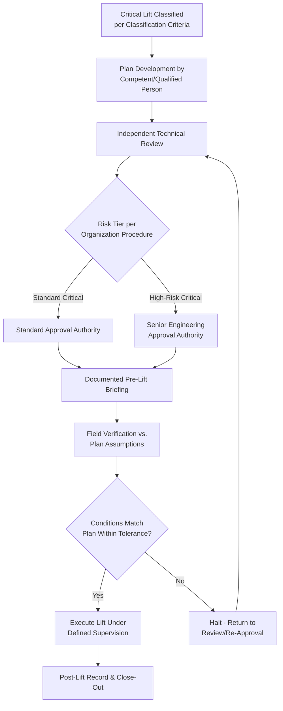

## Critical Lift Plan Documentation and Approval Workflow

### Overview

Once a lift has been classified as critical under the criteria covered in the related classification material, the critical lift plan (CLP) is the formal documentation artifact and approval process through which the lift is engineered, reviewed, and authorized before execution. The CLP transforms the classification decision into an actionable, auditable record — capturing crane selection and configuration, rigging design, ground/support conditions, environmental limits, and personnel roles — and routes that record through a defined review and sign-off chain before the lift is permitted to proceed.

The specific format and approval hierarchy vary by organization and industry standard (ASME B30 series guidance, API RP 2D for offshore cranes, and client-specific procedures all differ in detail), but the underlying workflow logic — document, review, approve, brief, execute, record — is broadly consistent across heavy-lift and specialized logistics operations.

### Key Points

- **The CLP is a standalone engineering document, not a checklist**: A properly developed CLP includes calculations (capacity utilization, rigging loads, ground bearing pressure) and configuration details sufficient for an independent reviewer to verify the lift's safety margins without needing to reconstruct the analysis from scratch.
- **Approval authority is typically tiered by lift risk level**: Higher-risk critical lifts (e.g., tandem lifts, lifts near energized lines, very high capacity utilization) commonly require a higher level of sign-off (e.g., chief engineer or corporate lift approval) than lifts that are critical but closer to the classification threshold.
- **The pre-lift briefing is a mandatory workflow step, not an optional courtesy**: Communicating the approved plan to the actual lift crew (crane operator, riggers, signal person, supervisor) before execution is treated as a required gate, distinct from the document approval itself.
- **Field verification against the plan is required before execution begins**: Ground conditions, rigging hardware, and crane setup must be confirmed to match the plan's assumptions on the day of the lift, since as-built site conditions can differ from planning-stage assumptions.
- **Deviation from an approved plan requires re-approval, not field improvisation**: If actual conditions differ materially from the plan (different radius, different ground bearing, different rigging availability), the standard workflow requires returning to the review/approval step rather than proceeding under field judgment alone.

### Standard Critical Lift Plan Contents

| Section | Typical Content |
| --- | --- |
| Lift description and classification basis | Which criterion/criteria triggered critical lift status, load description, lift sequence overview |
| Crane and equipment specification | Crane make/model, configuration (boom length, counterweight), load chart reference, rigging equipment specification (slings, shackles, spreader bars) with rated capacities |
| Load and rigging calculations | Load weight (including rigging weight), center of gravity determination, capacity utilization calculation at planned radius, sling angle and tension calculations |
| Ground/support conditions | Ground bearing pressure analysis, outrigger/crawler pad requirements, or vessel/barge stability considerations for marine lifts |
| Environmental limits | Maximum wind speed, visibility, or other environmental thresholds beyond which the lift is not to proceed |
| Personnel roles and responsibilities | Named or role-based assignment of crane operator, rigger-in-charge, signal person, lift supervisor, and any additional safety observer roles |
| Exclusion zone and access control | Defined boundary for the lift area, barricading requirements, and procedure for controlling access during the lift |
| Emergency and contingency procedures | Actions in the event of equipment malfunction, load instability, or environmental limit exceedance during the lift |
| Sign-off/approval record | Named approvers, dates, and revision history if the plan is modified |

### Approval Workflow Stages

1. **Plan development**: The lift plan is developed by a competent/qualified person — often the rigging engineer, lift supervisor, or a specialized rigging contractor, depending on organizational structure — incorporating the calculations and configuration details above.
2. **Technical review**: An independent reviewer (not the plan's author) verifies the calculations, crane selection, and rigging design, checking specifically for the classification-triggering risk factor(s) identified in the related classification material.
3. **Risk-tiered approval**: Depending on the organization's procedure, the plan is routed to the appropriate approval authority — this is commonly tiered, with the highest-risk lifts (e.g., tandem lifts, very high capacity utilization, lifts near energized infrastructure) requiring sign-off from a more senior engineering authority than lifts that are critical but present a single, more moderate risk factor.
4. **Pre-lift briefing**: The approved plan is communicated to all personnel directly involved in the lift execution — crane operator, riggers, signal person, supervisor — typically through a documented toolbox talk or pre-lift meeting where the plan, exclusion zones, and emergency procedures are reviewed and questions are addressed.
5. **Field verification**: Immediately before lift execution, site conditions (ground bearing, crane setup/level, rigging hardware condition, weather) are verified against the plan's assumptions; any material discrepancy triggers the deviation/re-approval step below rather than proceeding.
6. **Execution and monitoring**: The lift proceeds under the supervision structure defined in the plan, with the lift supervisor or designated authority empowered to halt the lift if conditions change or deviate from plan during execution.
7. **Post-lift record and close-out**: The completed lift is documented (often including confirmation that the lift proceeded as planned, or documentation of any deviations and how they were managed), closing the record for audit and lessons-learned purposes.

### Deviation and Re-Approval Logic

When field conditions differ from the approved plan's assumptions, the standard workflow requires evaluating whether the deviation is within pre-approved tolerance or requires return to the review/approval stage:

$$\text{Proceed} = \begin{cases} \text{Yes, as planned} & \text{if } |\Delta_{condition}| \leq \text{Tolerance defined in CLP} \\ \text{No — halt and re-approve} & \text{if } |\Delta_{condition}| > \text{Tolerance defined in CLP} \end{cases}$$

Where $\Delta_{condition}$ represents the deviation in any governing parameter (radius, wind speed, ground bearing capacity, load weight) from the plan's stated assumption. [Unverified] — specific tolerance thresholds for triggering mandatory re-approval versus proceeding under field supervisor judgment vary significantly by organizational procedure and should be defined explicitly within each project's specific critical lift procedure rather than assumed from general practice.

### Example

**Scenario**: Following the critical lift classification example from the related material (45-tonne heat exchanger, 100-tonne crane, 12 m radius, energized line proximity), a critical lift plan is developed and must proceed through approval before execution.

**Workflow walkthrough**:

1. **Plan development**: The rigging engineer prepares the CLP including the capacity utilization calculation (approximately 89% at 12 m radius, as calculated in the related classification example), rigging configuration (sling angles, spreader bar rating), ground bearing analysis for the crane's outrigger pads on the plant's paved surface, and a specific minimum approach distance calculation and mitigation plan for the 13.8 kV overhead line.
2. **Technical review**: An independent engineer not involved in the original plan development reviews the capacity utilization calculation, confirms the load chart reference matches the actual crane configuration to be used, and specifically scrutinizes the minimum approach distance calculation given that this was one of the two classification-triggering factors.
3. **Risk-tiered approval**: Given the presence of both a high capacity utilization (~89%) and an energized line proximity hazard — two independent triggers — this lift is routed to a senior engineering approval level per the organization's tiered approval procedure, rather than a lower-tier approval that might be sufficient for a lift with only one moderate risk factor.
4. **Pre-lift briefing**: The crane operator, riggers, signal person, and lift supervisor participate in a documented briefing covering the rigging plan, the exclusion zone boundary, the minimum approach distance requirement to the energized line, and the specific halt/no-go conditions (e.g., wind speed threshold, any observed change in ground conditions).
5. **Field verification**: On the day of the lift, the crane's actual outrigger setup position, ground surface condition, and rigging hardware are checked against the plan; if the crane's achievable set-up position results in a radius greater than the planned 12 m (common in congested plant environments), this constitutes a material deviation requiring re-verification of the capacity utilization calculation at the new actual radius — potentially requiring re-approval before proceeding rather than adjusting in the field without engineering review.
6. **Execution and post-lift record**: Assuming field verification confirms conditions match the plan, the lift proceeds under the defined supervision structure, and a post-lift record confirms execution as planned, closing out the documented workflow.

### Critical Lift Approval Workflow (svg_diagram)

### Common Pitfalls

- **Treating the pre-lift briefing as a formality rather than a substantive review**: A briefing that merely reads the plan aloud without engaging the crew on hazards and halt conditions undermines the purpose of the step.
- **Skipping field verification when conditions "look the same" as expected**: Subtle differences (a slightly different crane setup position, degraded ground surface from recent rain) can materially change the lift's risk profile even when nothing appears obviously wrong.
- **Field improvisation instead of re-approval when deviations occur**: Proceeding with a modified radius, different rigging, or changed conditions without returning to the review/approval workflow defeats the purpose of the entire critical lift process.
- **Approval routed to insufficient authority level for the actual risk tier**: Failing to escalate lifts with multiple independent risk triggers (as in the example) to the appropriately senior approval level specified in the organization's tiered procedure.
- **Incomplete calculation documentation**: A CLP that states a conclusion (e.g., "utilization acceptable") without showing the underlying calculation prevents the independent reviewer from actually verifying the safety margin, undermining the review step's purpose.

### Conclusion

The critical lift plan documentation and approval workflow exists to ensure that a lift identified as carrying elevated risk receives engineering-level scrutiny, appropriately tiered approval authority, and effective communication to the execution crew before work begins — and that any deviation from the approved plan's assumptions triggers re-review rather than field improvisation. Because the workflow's value depends entirely on rigor at each stage (complete calculations, genuine independent review, substantive briefing, honest field verification), organizations that treat any single stage as a formality undermine the safety benefit the entire critical lift classification system is designed to provide.

**Related Topics**

- Critical Lift Definition and Classification Criteria
- Crane Load Chart Interpretation and Capacity Utilization Calculation
- Rigging Engineering and Lift Fixture Design
- Ground Bearing Pressure Analysis for Crane Outrigger/Crawler Setup
- Minimum Approach Distance for Lifts Near Energized Power Lines
- Tandem and Multi-Crane Lift Coordination
- Emergency Response Procedures for Lift Equipment Failure