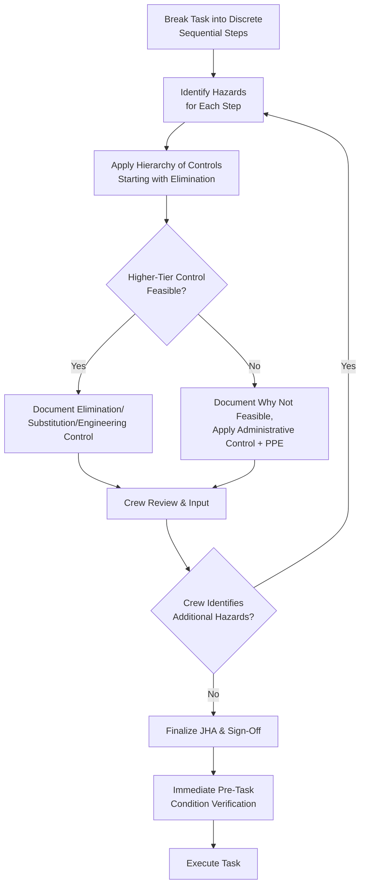

## Job Hazard Analysis for Heavy-Lift Operations

### Overview

A Job Hazard Analysis (JHA), also referred to as a Job Safety Analysis (JSA) in some organizational and regulatory frameworks, is a structured process for breaking down a task into its constituent steps, identifying the hazards present at each step, and defining specific control measures before work begins. For heavy-lift operations, the JHA serves a complementary but distinct function from the critical lift plan covered in the related material: where the CLP focuses on the engineering adequacy of the lift itself (crane capacity, rigging design, load calculations), the JHA focuses on the broader task-level safety picture — the sequence of human actions, environmental exposures, and site-specific hazards surrounding the lift, including steps before and after the actual lifting motion.

The JHA methodology originates from general industrial occupational safety practice (widely associated with OSHA guidance in the US context, and adapted globally under various national equivalents) and is applied across virtually all industries, but heavy-lift operations present a distinctive hazard profile — suspended load hazards, rigging failure modes, multi-party coordination, and often confined or congested working areas — that requires specific adaptation of the general JHA methodology.

### Key Points

- **JHA and critical lift plan are complementary, not duplicative**: The CLP addresses whether the lift is engineered safely; the JHA addresses whether the task as a whole — including pre-lift setup, positioning, communication, and post-lift breakdown — is executed safely, and both are commonly required together for critical lifts.
- **Task breakdown must be granular enough to expose step-specific hazards**: A JHA written at too high a level of generality (e.g., "perform the lift" as a single step) fails to surface hazards specific to individual sub-steps (rigging attachment, tag line handling, load landing) and undermines the method's purpose.
- **The hierarchy of controls governs how identified hazards are addressed**: Elimination and substitution are preferred over engineering controls, which are preferred over administrative controls and PPE — a JHA that defaults to PPE or "be careful" as the primary control for every hazard has not applied the methodology correctly.
- **JHAs are living documents, not one-time paperwork**: Site conditions, crew composition, and even weather can change between JHA preparation and task execution, requiring review and update immediately before work begins, not just at initial planning.
- **Worker/crew involvement in JHA development improves hazard identification**: Personnel who will actually perform the task frequently identify practical hazards that a desk-based planning process alone may miss, and many organizational procedures formally require crew input as part of JHA development.

### JHA Structure for Heavy-Lift Tasks

| Column/Element | Content |
| --- | --- |
| Task step | A discrete, sequential action within the overall lift operation (e.g., "position crane and set outriggers," "attach rigging to load," "conduct trial lift," "swing and travel with load," "land and unrig load") |
| Potential hazards per step | Specific hazards associated with that step — struck-by, caught-between, crush, fall, electrical contact, dropped load, equipment tip-over, as applicable |
| Existing/planned controls | Controls already in place or planned for that specific hazard, referenced to the hierarchy of controls |
| Residual risk assessment | Judgment of remaining risk level after controls are applied, sometimes using a simple risk matrix (likelihood × severity) |
| Responsible person | Who is accountable for ensuring the control is implemented for that step |

### Hierarchy of Controls Applied to Heavy-Lift Hazards

The general occupational safety hierarchy of controls, in descending order of preference, applied specifically to heavy-lift context:

1. **Elimination**: Removing the hazard entirely — e.g., de-energizing and grounding a nearby power line rather than maintaining minimum approach distance to an energized line, where feasible.
2. **Substitution**: Replacing a higher-risk method with a lower-risk one — e.g., using a longer boom configuration to increase working radius and avoid positioning the crane in a congested area, rather than accepting the congestion as a fixed constraint.
3. **Engineering controls**: Physical measures that reduce hazard exposure — e.g., exclusion zone barricading, tag lines to control load rotation/swing without requiring personnel proximity to the suspended load, or remote-controlled rigging release mechanisms.
4. **Administrative controls**: Procedural measures — e.g., defined communication protocols between signal person and operator, restricted access procedures, scheduling the lift during low-activity periods to reduce personnel exposure.
5. **Personal Protective Equipment (PPE)**: The last line of defense — hard hats, high-visibility clothing, cut-resistant gloves for rigging handling — necessary but insufficient as a primary control for suspended load hazards.

[Unverified] — specific regulatory requirements mandating hierarchy of controls application (versus it being industry best practice guidance) vary by jurisdiction; applicable local occupational safety regulations should be confirmed for the specific project location.

### Common Heavy-Lift Task Steps and Associated Hazard Categories

| Task Step | Primary Hazard Categories |
| --- | --- |
| Site preparation and crane positioning | Ground bearing failure, underground utility strikes, proximity to overhead hazards |
| Outrigger/crawler setup and leveling | Crush hazards during setup, ground subsidence under load |
| Rigging selection and attachment | Sling/shackle failure from incorrect selection, pinch points during attachment, working at height if load geometry requires elevated access |
| Trial lift (lifting load slightly to verify rigging and balance) | Load shift or rigging failure detection point — a critical safety step that should not be skipped even under schedule pressure |
| Main lift, swing, and travel | Struck-by from swinging load, dropped load from rigging or crane failure, crane tip-over from exceeding capacity at radius |
| Load landing and positioning | Crush hazards during final positioning, hand/foot placement near landing point |
| Rigging removal and load release | Stored energy release in rigging, pinch points during unrigging |
| Crane breakdown and demobilization | Similar hazards to setup, in reverse sequence, often under reduced attention as the perceived "critical" portion of the task is complete |

### Example

**Scenario**: Preparing a JHA for the heat exchanger lift discussed in the related critical lift plan material (45-tonne load, 100-tonne crane, energized line proximity, high capacity utilization).

**JHA development walkthrough**:

1. **Task breakdown**: The lift is broken into discrete steps: mobilize and position crane; set and verify outriggers; conduct site-specific hazard walk-down (including confirming energized line location and marking minimum approach boundary); rig the heat exchanger using the specified spreader bar; conduct trial lift to verify balance and rigging integrity; execute main lift and controlled swing away from the energized line's minimum approach boundary; land and position the heat exchanger at its foundation; remove rigging; demobilize crane.
2. **Hazard identification per step**: For the "execute main lift and controlled swing" step specifically, hazards identified include: struck-by from load swing if wind or crane operator input causes uncontrolled movement, electrical contact/arc flash risk if the load or crane boom encroaches the minimum approach distance to the energized line, and dropped load if the capacity utilization margin (calculated at ~89% in the related CLP example) is exceeded due to an unplanned radius increase during the swing.
3. **Control application via hierarchy**: For the electrical proximity hazard specifically, the JHA documents that elimination (de-energizing the line) was evaluated but determined infeasible given plant operational continuity requirements; the applied control is therefore an engineering control (physical marking/barricading of the minimum approach boundary combined with a dedicated spotter whose sole task is monitoring boom/load position relative to the line) layered with an administrative control (a defined stop-work signal if the spotter observes encroachment) — illustrating that even when elimination isn't feasible, the JHA should document that it was considered before defaulting to lower-tier controls.
4. **Trial lift emphasis**: The JHA explicitly calls out the trial lift step as a mandatory hold point, requiring visual confirmation of rigging integrity and load balance before proceeding to the main lift — reinforcing that this step should not be compressed or skipped even if schedule pressure exists, since it is a primary detection opportunity for rigging problems before the load is in motion over personnel or near hazards.
5. **Crew review and sign-off**: The rigger-in-charge, crane operator, and signal person review the JHA before work begins, with the opportunity to flag any practical hazard not captured in the desk-prepared draft (e.g., a rigger noting that the planned tag line attachment point creates an awkward hand position near a pinch point during rigging attachment), and the JHA is updated accordingly before proceeding.

### JHA Development Process (svg_diagram)

### Common Pitfalls

- **Writing task steps too broadly**: A JHA with steps like "perform lift" instead of granular sub-steps hides hazards specific to individual actions (rigging attachment vs. swing vs. landing each have distinct hazard profiles).
- **Defaulting to PPE or administrative controls without documenting consideration of higher-tier controls**: A JHA that lists "wear PPE, be cautious" as the primary control for a struck-by or electrical hazard has not genuinely applied the hierarchy of controls.
- **Treating the JHA as a static document prepared once and filed**: Site conditions, weather, and crew composition can change between preparation and execution; failing to review and update immediately before task start undermines the method's purpose.
- **Excluding the execution crew from JHA development**: Desk-based JHA preparation without rigger/operator/signal person input frequently misses practical hazards that hands-on personnel would identify.
- **Skipping or rushing the trial lift step under schedule pressure**: The trial lift is a key hazard-detection opportunity; treating it as optional or compressing it undermines a control the JHA specifically relies on for rigging/balance verification.
- **Treating JHA and critical lift plan as redundant/interchangeable**: The two documents serve complementary purposes (task-level hazard management vs. lift engineering adequacy); omitting one because the other exists leaves a gap in either the human-factors or engineering safety picture.

### Conclusion

Job Hazard Analysis for heavy-lift operations provides the task-level safety framework that complements the engineering focus of the critical lift plan, systematically breaking the lift task into discrete steps, identifying hazards specific to each step, and applying the hierarchy of controls rather than defaulting to administrative measures or PPE alone. Because a JHA's value depends on granular task breakdown, genuine hierarchy-of-controls application, and active crew involvement, treating it as a one-time paperwork exercise rather than a living, pre-task-verified document undermines the hazard identification and control benefit the method is designed to provide.

**Related Topics**

- Critical Lift Definition and Classification Criteria
- Critical Lift Plan Documentation and Approval Workflow
- Hierarchy of Controls in Occupational Safety Management
- Minimum Approach Distance for Lifts Near Energized Power Lines
- Rigging Engineering and Lift Fixture Design
- Trial Lift Procedures and Rigging Verification
- Stop-Work Authority and Emergency Halt Procedures