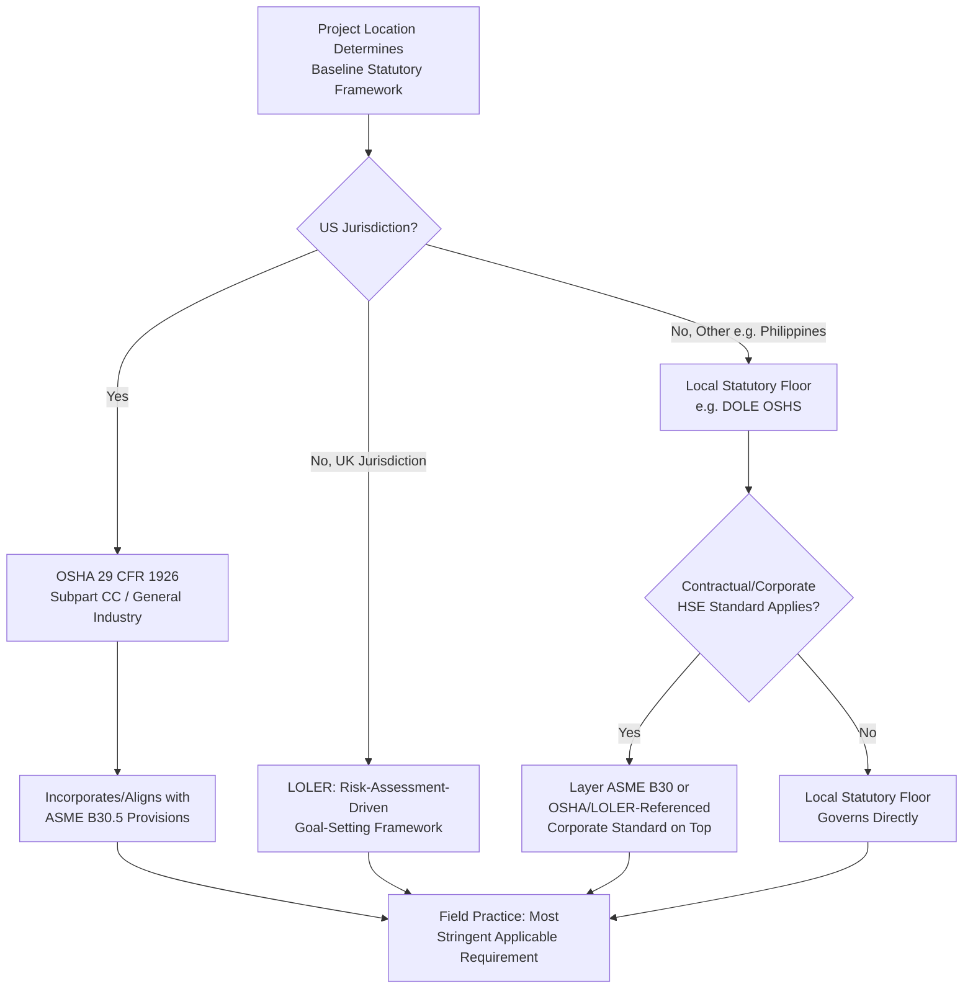

## OSHA, ASME B30, and LOLER Regulatory Frameworks

### Overview

Heavy-lift operations are governed by a combination of statutory occupational safety regulation and voluntary consensus industry standards, and understanding the distinction between these two instrument types — and how they interact — is essential for compliance planning across jurisdictions. In the United States, the **Occupational Safety and Health Administration (OSHA)** issues binding federal regulations under Title 29 of the Code of Federal Regulations, while the **American Society of Mechanical Engineers (ASME) B30 series** provides voluntary consensus standards that OSHA frequently references or incorporates by reference, giving them practical regulatory weight even though ASME itself is not a government regulatory body. In the United Kingdom and much of the Commonwealth-influenced regulatory sphere, **LOLER (Lifting Operations and Lifting Equipment Regulations)** serves an analogous statutory function to OSHA's crane-related regulations, but with a distinct structure and emphasis.

For project teams operating across multiple jurisdictions — as is common in heavy-lift and specialized logistics — recognizing which framework governs a given operation, and how local regulations reference or diverge from these frameworks, is a foundational compliance requirement distinct from (but related to) the critical lift and JHA practices covered elsewhere in this chapter.

### Key Points

- **OSHA and ASME B30 are legally distinct instrument types with a practical overlap**: OSHA regulations are binding federal law; ASME B30 standards are voluntary consensus documents, but OSHA's crane regulations (particularly 29 CFR 1926 Subpart CC for construction) incorporate significant portions of ASME B30.5 by reference or alignment, effectively giving much of B30.5 regulatory force in covered contexts.
- **LOLER operates on a different regulatory philosophy than prescriptive OSHA rules**: LOLER, part of the UK's broader goal-setting health and safety regulatory approach, emphasizes risk assessment, competent examination, and documented thorough examination intervals rather than prescriptive numerical thresholds for every scenario.
- **Neither framework is automatically applicable outside its home jurisdiction**: A project in the Philippines, for example, is not directly governed by OSHA or LOLER unless specifically incorporated by contract (common with multinational EPC contractors) or referenced by local regulation — local occupational safety law governs by default.
- **ASME B30 is a multi-part series, not a single document**: Different parts address different equipment types (B30.5 mobile cranes, B30.2 overhead/gantry cranes, B30.9 slings, B30.10 hooks, among others), and correctly identifying which part(s) apply to a given piece of equipment is a prerequisite to correct compliance reference.
- **Thorough examination under LOLER has specific defined intervals**: LOLER's thorough examination requirement (commonly cited as every 6 months for lifting equipment used for lifting persons, and every 12 months for other lifting equipment, or in accordance with an examination scheme) is a distinctive feature not directly mirrored in OSHA's framework in the same form — [Unverified], exact current intervals should be confirmed against the current LOLER regulations and HSE guidance, as specific requirements can be refined through guidance updates.

### OSHA Framework Overview

- OSHA's primary crane-related regulation for construction work is **29 CFR 1926 Subpart CC** ("Cranes and Derricks in Construction"), which substantially incorporates or aligns with ASME B30.5 provisions for mobile crane operation, and separately addresses operator certification, signal person qualification, ground condition assessment, and assembly/disassembly procedures.
- General industry crane operations (outside construction) fall under different, generally less prescriptive OSHA general industry standards — [Unverified], the specific applicable general industry standard and its scope relative to Subpart CC should be confirmed for the specific operational context, since applicability depends on whether the work is classified as construction or general industry activity.
- OSHA enforcement operates through inspection, citation, and penalty mechanisms, with employer responsibility for compliance regardless of whether a third-party crane rental company or contractor is directly operating the equipment — [Unverified], the specific allocation of compliance responsibility between equipment owner, rental provider, and operating contractor in multi-party arrangements should be confirmed against current OSHA guidance and the specific contractual relationships involved, as this determination can be fact-specific.

### ASME B30 Series Structure

| Standard | Scope |
| --- | --- |
| B30.2 | Overhead and gantry cranes (top running bridge, single or multiple girder, top running trolley hoist) |
| B30.5 | Mobile and locomotive cranes — the most frequently referenced part for heavy-lift road/site operations |
| B30.9 | Slings (wire rope, synthetic, chain, metal mesh) |
| B30.10 | Hooks |
| B30.20 | Below-the-hook lifting devices |
| B30.23 | Personnel lifting systems |
| B30.26 | Rigging hardware |

[Unverified] — this is not an exhaustive list of the full B30 series; the complete current list of parts, their exact scope boundaries, and current revision status should be confirmed against ASME's current published catalog, as the series is periodically expanded and individual parts are revised on their own update cycles.

### LOLER Framework Overview

LOLER (Lifting Operations and Lifting Equipment Regulations, made under the UK's Health and Safety at Work Act framework) establishes duties for employers and equipment owners regarding lifting equipment, structured around several core requirements:

- **Strength and stability**: Lifting equipment must be of adequate strength and stability for each load, having regard to the mode of use and stress imposed.
- **Positioning and installation**: Equipment must be positioned and installed to minimize risk (e.g., risk of the load or equipment striking a person, or the load drifting or falling).
- **Marking**: Equipment must be clearly marked with safe working load(s), and lifting accessories marked in a way that enables identification of characteristics necessary for safe use.
- **Organization of lifting operations**: Every lifting operation must be properly planned by a competent person, appropriately supervised, and carried out in a safe manner.
- **Thorough examination and inspection**: Lifting equipment must undergo periodic thorough examination by a competent person, at defined intervals or in accordance with an examination scheme, with records maintained.

LOLER's risk-assessment-driven, goal-setting character (rather than a purely prescriptive numerical rulebook) reflects the broader UK health and safety regulatory philosophy, distinguishing it structurally from OSHA's more prescriptive US approach even where both frameworks address substantially similar underlying hazards.

### Interaction with Local/National Frameworks (Philippine Context)

- The Philippines' own occupational safety and health framework is primarily governed by the **Department of Labor and Employment (DOLE)** through the Occupational Safety and Health Standards (OSHS) and related issuances — [Unverified], the specific current provisions governing crane operations, lifting equipment inspection, and operator certification under Philippine OSHS should be confirmed against current DOLE publications, as occupational safety regulations are periodically updated (notably following the Republic Act 11058 and its implementing rules, which strengthened OSH compliance mechanisms).
- On many major industrial, energy, and infrastructure projects in the Philippines — particularly those involving multinational EPC contractors, joint ventures, or foreign direct investment — project-specific safety procedures frequently incorporate or reference ASME B30 series standards, OSHA-aligned practices, or client corporate HSE standards (which may themselves draw on OSHA or LOLER-influenced practice) by contractual requirement, layered on top of the baseline DOLE regulatory floor — [Unverified], the specific contractual incorporation and its legal relationship to the DOLE regulatory floor should be confirmed for each specific project and contract.
- This layering means a Philippine-based project team may need to comply simultaneously with the DOLE regulatory floor and a stricter, internationally-referenced contractual safety standard, with the more stringent requirement generally governing actual field practice.

### Example

**Scenario**: A multinational EPC contractor is executing a heavy-lift campaign in the Philippines, using a mobile crane and rigging equipment, under a corporate HSE standard that explicitly references ASME B30.5 and B30.9.

**Framework interaction walkthrough**:

1. **Baseline regulatory floor**: Philippine DOLE occupational safety and health standards establish the minimum legal compliance floor for the operation, regardless of any contractual or corporate standard layered on top — [Unverified], specific applicable DOLE provisions for this operation type should be confirmed directly.
2. **Contractual standard incorporation**: The EPC contractor's corporate HSE standard, referencing ASME B30.5 (mobile crane operation practice) and B30.9 (sling selection and use), becomes a binding contractual requirement for the project even though it is not itself Philippine law — meaning field crews must comply with both the DOLE floor and the more detailed ASME-referenced corporate standard.
3. **Practical compliance approach**: Since the ASME B30.5/B30.9-referenced corporate standard is generally more detailed and often more stringent than the general DOLE floor in specific technical areas (e.g., specific sling angle calculation methodology, wire rope inspection criteria), field practice is built around the ASME-referenced standard as the operative day-to-day technical reference, while confirming no DOLE-specific requirement is inadvertently under-addressed.
4. **Equipment inspection and certification**: Crane and rigging inspection intervals and criteria follow the ASME B30-referenced corporate standard's specific requirements, documented separately from (but not in conflict with) any DOLE-mandated equipment certification or operator licensing requirement that independently applies under Philippine law.
5. **Cross-reference check if UK personnel or equipment are involved**: If any equipment or personnel with a UK/LOLER compliance history are involved (e.g., a piece of equipment previously certified under a LOLER thorough examination regime), the project team verifies that the equipment's certification/examination history and documentation are compatible with or can be reconciled against the ASME/DOLE framework governing the current project, since LOLER's examination certificates are not automatically equivalent to ASME-referenced inspection documentation.

### Regulatory Framework Relationship Structure (svg_diagram)

### Common Pitfalls

- **Assuming OSHA or LOLER applies outside its home jurisdiction without contractual incorporation**: Neither framework is automatically binding elsewhere; applicability outside the US/UK depends on specific contractual reference or local regulatory adoption.
- **Treating ASME B30 as government regulation**: ASME B30 standards are voluntary consensus documents; their regulatory force in the US comes specifically through OSHA's incorporation/alignment, not from ASME itself having regulatory authority.
- **Assuming a single B30 part covers all rigging/lifting equipment on a project**: Different equipment types (cranes, slings, hooks, below-the-hook devices) are governed by different B30 parts; applying B30.5 provisions to sling selection (properly B30.9's scope) without cross-referencing the correct part risks a compliance gap.
- **Assuming local regulatory floor and contractual standard are interchangeable**: A stricter corporate/contractual standard does not eliminate the independent obligation to comply with the local statutory floor (e.g., DOLE requirements), and vice versa — both apply, with the more stringent governing.
- **Assuming LOLER examination certification directly satisfies ASME/OSHA-referenced inspection requirements**: Equipment with a LOLER thorough examination history moving into an ASME/OSHA-referenced project context may require additional documentation reconciliation rather than automatic cross-recognition.

### Conclusion

OSHA, ASME B30, and LOLER represent three related but structurally distinct approaches to heavy-lift equipment and operation safety regulation — binding US federal regulation with incorporated consensus standards, a voluntary US industry standard series with regulatory force through incorporation, and a UK risk-assessment-driven statutory framework, respectively — none of which is automatically applicable outside its home jurisdiction absent specific contractual or regulatory incorporation. For projects operating in jurisdictions like the Philippines where none of these frameworks is the direct statutory floor, project teams should expect a layered compliance environment combining the local regulatory floor with any internationally-referenced contractual or corporate HSE standard, with field practice governed by whichever applicable requirement is most stringent.

**Related Topics**

- Critical Lift Definition and Classification Criteria
- Critical Lift Plan Documentation and Approval Workflow
- Job Hazard Analysis for Heavy-Lift Operations
- Crane Operator Certification and Signal Person Qualification Standards
- Rigging Equipment Inspection Intervals and Thorough Examination Requirements
- Philippine DOLE Occupational Safety and Health Standards for Construction and Lifting Operations