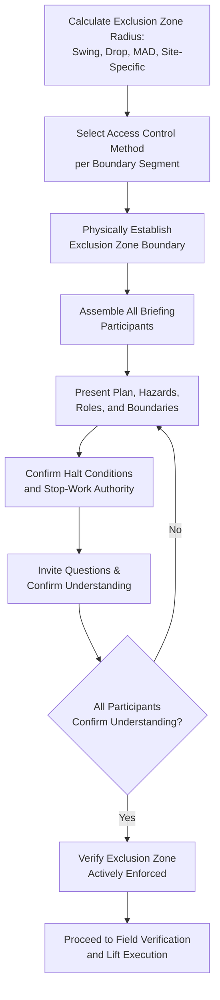

## Pre-Lift Briefings and Exclusion Zone Management

### Overview

Pre-lift briefings and exclusion zone management are the two operational safety controls that translate an approved critical lift plan and job hazard analysis into safe execution on the day of the lift. The pre-lift briefing is the structured communication step where the plan, hazards, and controls are conveyed to every person directly involved before work begins; exclusion zone management is the physical control measure that keeps non-essential personnel outside the area where a dropped load, crane failure, or swing hazard could cause injury. Both are referenced as required workflow steps in the related critical lift plan and JHA material, and this material provides the detailed operational guidance for executing them effectively.

While often treated as routine procedural steps, both controls sit at the engineering-control and administrative-control tiers of the hierarchy of controls discussed in the related JHA material — meaning their effectiveness depends entirely on rigorous, specific execution rather than generic or perfunctory application.

### Key Points

- **The pre-lift briefing is a two-way communication, not a one-way announcement**: An effective briefing invites questions and confirms understanding from participants, rather than simply reading the lift plan aloud.
- **Exclusion zone sizing must be calculated, not estimated**: The zone radius should account for the load's maximum swing radius, potential drop trajectory, and any specific hazard (e.g., minimum approach distance to energized lines) — not a generic "stay back" boundary.
- **Exclusion zones require active enforcement, not just marking**: Barricade tape or cones alone do not prevent entry; a defined access control method (dedicated watch person, physical barrier, or controlled gate) is necessary for zones where inadvertent entry is a realistic risk.
- **Briefing participants must include everyone with a role in the lift, not only the immediately obvious crew**: Beyond the crane operator and riggers, this includes signal persons, spotters, adjacent-area supervisors whose personnel might approach the zone, and any observers or client representatives who will be present during the lift.
- **Both controls must be re-verified for multi-day or multi-lift campaigns**: A briefing and exclusion zone appropriate for one lift configuration does not automatically remain valid if crane position, load, or site conditions change between lifts within the same campaign.

### Pre-Lift Briefing Structure

| Element | Content |
| --- | --- |
| Plan overview | Summary of the lift sequence, crane configuration, and rigging arrangement from the approved critical lift plan |
| Hazard review | Specific hazards identified in the JHA for this lift, with emphasis on any classification-triggering risk factor (high capacity utilization, proximity hazard, personnel-under-load) |
| Roles and responsibilities | Explicit confirmation of who is crane operator, rigger-in-charge, signal person, spotter(s), and lift supervisor, including designated communication method (radio channel, hand signals) |
| Exclusion zone boundaries | Physical description and, where practical, a walked or pointed-out boundary of the exclusion zone, including any restricted sub-zones (e.g., minimum approach distance to energized infrastructure) |
| Halt/no-go conditions | Specific, unambiguous conditions under which the lift must be halted (wind speed threshold, loss of communication, observed rigging issue, unauthorized entry into exclusion zone) |
| Stop-work authority confirmation | Explicit statement that any participant has authority and obligation to call a halt if they observe an unsafe condition, regardless of position or seniority |
| Questions and confirmation | Open opportunity for participants to ask questions, and a method (verbal confirmation, sign-off sheet) to confirm understanding before proceeding |

### Exclusion Zone Sizing Principles

Exclusion zone radius should be determined by the largest of several governing distances, rather than a single default value:

$$R_{exclusion} = \max(R_{swing}, R_{drop}, D_{MAD}, R_{sitespecific})$$

Where $R_{swing}$ is the maximum radius the load could reach if the crane experiences an uncontrolled swing (a function of boom length and load line length), $R_{drop}$ is the horizontal distance a dropped load or falling object could travel accounting for load height and any potential bounce/roll, $D_{MAD}$ is the minimum approach distance required by any nearby energized electrical infrastructure (per applicable electrical safety code), and $R_{sitespecific}$ is any additional distance required by site-specific hazards (e.g., a slope that could cause a dropped load to roll further than flat-ground assumptions). [Unverified] — the specific calculation methodology for $R_{swing}$ and $R_{drop}$, and any regulatory or code-mandated minimum values, should be confirmed against the applicable governing standard (e.g., ASME B30.5 provisions, or project-specific procedure) for the specific crane configuration and load height involved.

### Exclusion Zone Access Control Methods

| Method | Application |
| --- | --- |
| Physical barricade (fencing, hard barriers) | Higher-traffic or higher-consequence areas where inadvertent entry is a realistic risk |
| Barricade tape with signage | Lower-traffic areas, typically combined with an active watch method rather than used alone |
| Dedicated watch/spotter person | Areas where the boundary intersects a walkway, access route, or work area that cannot be fully closed |
| Controlled single-point access (gate with attendant) | Areas requiring occasional authorized entry (e.g., a technician needing brief access to an adjacent system) during the lift window |
| Radio/PA announcement combined with physical control | Larger industrial sites where broader area awareness supplements, but does not replace, physical boundary control |

### Example

**Scenario**: Continuing the heat exchanger lift example from the related critical lift plan and JHA material (45-tonne load, 100-tonne crane, 12 m radius, energized 13.8 kV line 8 meters from the lift path), the pre-lift briefing and exclusion zone are established immediately before execution.

**Walkthrough**:

1. **Exclusion zone calculation**: The zone radius is determined by comparing the maximum swing radius (based on the crane's boom length and load line length in the planned configuration), the drop trajectory distance (accounting for the load's lift height above ground), and the minimum approach distance to the 13.8 kV line per applicable electrical safety code — the governing (largest) distance is used to set the actual boundary, which in this scenario is likely the minimum approach distance requirement given the line's proximity, making this the practical constraint driving zone size on that side of the lift area.
2. **Access control method selection**: Given that the exclusion zone intersects a plant walkway used by personnel not involved in the lift, a dedicated watch person is assigned to that specific boundary segment (rather than relying on barricade tape alone), with physical barricading used for segments of the boundary not intersecting active walkways.
3. **Briefing execution**: The lift supervisor conducts the briefing with the crane operator, riggers, signal person, and the dedicated boundary watch person present, walking through the lift sequence, specifically highlighting the minimum approach distance boundary on the energized-line side of the zone, and confirming the halt condition that any observed encroachment into that specific boundary segment triggers an immediate stop regardless of lift progress.
4. **Stop-work authority confirmation**: The briefing explicitly confirms that the boundary watch person has authority to call a halt if they observe unauthorized entry, independent of the crane operator's or riggers' view of the situation, since the watch person's position gives them visibility the lift crew may not have during active lifting.
5. **Confirmation and questions**: Before proceeding, the supervisor asks each participant to confirm their role and the communication method to be used, and specifically invites questions about the electrical proximity hazard given its role as one of the lift's classification-triggering factors — surfacing, in this instance, a rigger's question about the exact radio channel to use if the boundary watch needs to call a halt, which is clarified before the briefing closes.

### Pre-Lift Briefing and Exclusion Zone Workflow (svg_diagram)

### Common Pitfalls

- **Using a generic "stay back" distance instead of a calculated exclusion zone**: A boundary not derived from the largest of swing radius, drop trajectory, and minimum approach distance may be inadequate for the specific lift configuration.
- **Marking a boundary without active enforcement**: Barricade tape alone does not prevent entry; areas with realistic inadvertent-entry risk require an active watch or physical barrier.
- **Briefing only the immediately obvious crew**: Omitting adjacent-area supervisors, spotters, or observers who will be present during the lift can leave gaps in hazard awareness for people within or near the zone.
- **Treating the briefing as one-way communication**: A briefing that does not invite questions or confirm understanding risks participants proceeding with an incomplete or incorrect picture of hazards and halt conditions.
- **Failing to re-verify briefing and zone validity for subsequent lifts in a multi-lift campaign**: Crane repositioning, load changes, or site condition changes between lifts can invalidate a previous briefing or zone boundary that is not explicitly reconfirmed.
- **Ambiguous stop-work communication method**: Not clarifying in advance exactly how a halt signal will be communicated (specific radio channel, hand signal, horn) can delay a critical stop when it matters most.

### Conclusion

Pre-lift briefings and exclusion zone management are the operational execution controls that carry an approved critical lift plan and job hazard analysis safely from paperwork into the field, and their effectiveness depends on calculated (not estimated) zone sizing, actively enforced (not merely marked) boundaries, and genuinely two-way (not one-way) communication with every participant who has a role in or proximity to the lift. Because site conditions and lift configurations can change even within a single multi-lift campaign, both controls should be treated as requiring fresh verification before each lift rather than a one-time setup carried forward by assumption.

**Related Topics**

- Critical Lift Definition and Classification Criteria
- Critical Lift Plan Documentation and Approval Workflow
- Job Hazard Analysis for Heavy-Lift Operations
- Minimum Approach Distance for Lifts Near Energized Power Lines
- Stop-Work Authority and Emergency Halt Procedures
- Trial Lift Procedures and Rigging Verification