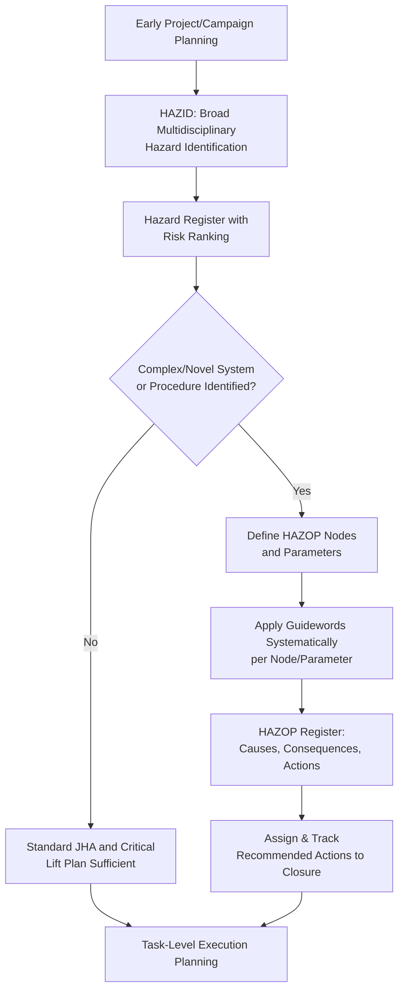

## HAZID and HAZOP Risk Assessment Techniques

### Overview

HAZID (Hazard Identification) and HAZOP (Hazard and Operability Study) are structured, team-based risk assessment techniques used to systematically identify hazards and operability problems in a system, process, or operation before they manifest as incidents. Both originate from process safety engineering (particularly the chemical and petrochemical industries) but are widely adapted for use in heavy-lift and specialized logistics, especially for complex, high-consequence, or first-of-a-kind operations where the more task-focused JHA methodology (covered in the related material) benefits from a preceding, broader systemic review.

Where a JHA breaks down a known task into steps and identifies hazards at each step, HAZID and HAZOP operate at a higher and typically earlier level of the planning process: HAZID casts a wide net across an entire project, system, or operational phase to identify what hazards exist at all, while HAZOP systematically interrogates a specific process or system design against defined deviation guidewords to find hazards and operability issues arising from deviations in intended operation. In heavy-lift logistics, these techniques are most commonly applied to complex offshore installation campaigns, novel or first-of-a-kind lift/transport configurations, and marine spread operations rather than to routine, well-precedented lifts.

### Key Points

- **HAZID is broad and exploratory; HAZOP is structured and systematic**: HAZID aims to comprehensively identify what hazards exist across a system or project phase with relatively open-ended discussion; HAZOP applies a disciplined guideword methodology to a defined process/system to find deviations and their consequences.
- **Both are team-based, multidisciplinary exercises, not single-analyst assessments**: The value of both techniques depends substantially on assembling a team with diverse expertise (engineering, operations, marine, rigging, safety) whose different perspectives surface hazards a single discipline would miss.
- **HAZOP's guideword structure is its defining methodological feature**: Applying standardized deviation guidewords (more, less, no, reverse, other than, as well as, etc.) to specific process parameters at defined nodes is what distinguishes HAZOP from more open-ended brainstorming.
- **Timing in the project lifecycle matters**: HAZID is typically most valuable early (concept/planning phase, before major decisions are locked in), while HAZOP is typically applied once a design or procedure is developed enough to have defined nodes/parameters to interrogate, but before it is finalized and difficult to change.
- **Both feed into, but are distinct from, the critical lift plan and JHA**: HAZID/HAZOP findings at the project or system level inform which specific lifts or operations may require critical lift classification or heightened JHA attention, rather than replacing the task-level analysis those tools provide.

### HAZID Methodology

HAZID is typically conducted as a structured workshop where a multidisciplinary team systematically reviews a project, system, or operational phase against categories of hazard, without the rigid guideword-per-node structure of HAZOP. Common HAZID approaches include:

- **Checklist-based review**: Working through a structured checklist of hazard categories (mechanical, electrical, environmental, human factors, marine/weather, logistics interface) relevant to the operation type.
- **What-if analysis**: Team members pose "what if" questions about potential failure modes or unexpected events at each stage of the operation, with findings captured and risk-ranked.
- **Drawing/document walk-through**: Reviewing project drawings, marine spread configurations, or route plans systematically to identify hazards embedded in the physical or procedural design.

Findings are typically captured in a hazard register, documenting the hazard, potential causes, potential consequences, existing/proposed controls, and a risk ranking (often via a likelihood × severity risk matrix) to prioritize which hazards require further, more detailed analysis (potentially including a HAZOP, critical lift plan, or JHA for the specific item).

### HAZOP Methodology

HAZOP applies a defined guideword-based interrogation to specific "nodes" (discrete sections of a process, system, or procedure) and "parameters" (relevant variables at that node, such as flow, pressure, timing, or — in a heavy-lift adaptation — load, position, sequence, or communication).

| Guideword | General Meaning | Heavy-Lift Adaptation Example |
| --- | --- | --- |
| No / Not | Complete negation of the intended function | No signal communication between crane operator and rigger during a critical phase |
| More | Quantitative increase | More load than expected due to rigging weight miscalculation |
| Less | Quantitative decrease | Less ground bearing capacity than assumed due to unexpected subsurface conditions |
| Reverse | Opposite of intended | Load swings in the opposite direction from the planned/expected path |
| As well as | An additional, unintended element occurs alongside the intended one | Wind gust occurs as well as the planned crane swing, compounding load control difficulty |
| Other than | Something entirely different from intended occurs | A different rigging configuration than specified is used due to equipment substitution on-site |
| Early / Late | Timing deviation | Trial lift confirmation communicated late, after main lift sequence has already begun |

For each guideword-parameter combination at each node, the HAZOP team identifies possible causes, consequences, existing safeguards, and any recommended additional action — a structured record typically maintained in a HAZOP worksheet or register.

### Applying HAZID/HAZOP to Heavy-Lift and Marine Operations

- **Marine spread selection and offshore campaigns** (see related marine spread material): HAZID is commonly applied early in campaign planning to identify hazards across the full spread — vessel interaction, weather exposure, subsea infrastructure proximity — before detailed lift engineering begins.
- **Novel or first-of-a-kind lift configurations**: A HAZOP-style systematic review of the lift sequence (treating each major phase — rigging, lift-off, transfer, set-down — as a node) can surface deviation scenarios a standard JHA checklist might not capture, particularly for configurations without significant prior operational precedent.
- **Multi-party interface points**: HAZID/HAZOP is particularly valuable at interfaces between different parties or systems (e.g., the interface between a heavy-lift vessel's crane operation and a fixed platform's structure during a module lift), since interface hazards often fall between the areas any single party's standard procedures cover.

### Example

**Scenario**: A HAZOP is conducted on a novel float-over installation procedure (a method where a barge carrying a topside module is floated into position between the legs of a jacket structure, then the barge is ballasted down to transfer the load onto the jacket) for an offshore campaign, given the operation has no significant prior precedent for this specific client/vessel combination.

**HAZOP walkthrough**:

1. **Node definition**: The float-over sequence is divided into nodes: barge approach and positioning between jacket legs; ballasting sequence and load transfer; barge withdrawal after transfer; final module securing on the jacket.
2. **Guideword application at "ballasting sequence and load transfer" node**: For the parameter "ballast rate," the team applies the "more" guideword — considering the consequence if ballast is taken on faster than planned, potentially causing an uneven or uncontrolled load transfer rate onto the jacket structure's support points, with a discussed cause being a valve control malfunction or miscommunication between ballast control and the load transfer monitoring team.
3. **Guideword application for "communication" parameter**: Applying "no" — considering the consequence if communication between the ballast control room and the deck team monitoring load transfer progress is lost during the transfer, potentially resulting in the ballast operation continuing without real-time confirmation that the load transfer is progressing as the calculated curve predicts; the team identifies a backup communication method and a pre-defined default action (halt ballasting) as a recommended safeguard if primary communication is lost.
4. **Guideword application for "timing"**: Applying "late" — considering the consequence if the barge withdrawal after load transfer is delayed relative to the tidal/weather window used in planning, potentially exposing the barge to different environmental conditions than assumed in the withdrawal maneuver's engineering basis.
5. **Register output and action tracking**: Each identified deviation, cause, consequence, existing safeguard, and recommended action is logged in the HAZOP register, with specific recommended actions (e.g., defining the backup communication protocol and halt-ballasting default) assigned to responsible parties for closure before the float-over is executed — findings that then inform the specific critical lift plan and JHA content for the ballasting and transfer phase.

### HAZID/HAZOP Application in Project Lifecycle (svg_diagram)

### Common Pitfalls

- **Conducting HAZID/HAZOP without adequate multidisciplinary representation**: A team lacking marine, rigging, or operations perspective (depending on the operation type) will systematically miss hazard categories outside the represented disciplines' expertise.
- **Applying HAZOP guidewords mechanically without genuine engineering judgment**: Rushing through guideword combinations to complete the exercise, rather than genuinely considering plausible causes and consequences, undermines the method's value.
- **Conducting HAZID/HAZOP too late to influence design or procedure**: Applying these techniques after a design or procedure is effectively finalized limits the ability to act on findings that would require significant rework to address.
- **Failing to track recommended actions to closure**: A HAZOP register full of identified deviations and recommended actions provides no safety benefit if those actions are not assigned, tracked, and verified complete before execution.
- **Treating HAZID/HAZOP as a substitute for task-level JHA or critical lift planning**: These systemic techniques identify what needs deeper task-level analysis; they do not themselves provide the step-by-step task hazard control that a JHA or critical lift plan delivers.
- **Applying the same technique regardless of operation novelty**: Investing HAZOP-level rigor in a well-precedented, routine operation (or conversely, skipping HAZID/HAZOP entirely for a genuinely novel or first-of-a-kind configuration) misallocates risk assessment effort relative to actual novelty and complexity.

### Conclusion

HAZID and HAZOP provide systemic, team-based risk assessment capability that complements the task-level focus of the JHA and the engineering focus of the critical lift plan, with HAZID offering broad early-stage hazard identification and HAZOP providing structured, guideword-driven interrogation of specific process or procedural deviations. These techniques deliver the most value when applied early enough in the project lifecycle to influence design and procedure decisions, staffed with genuinely multidisciplinary teams, and followed through with disciplined tracking of recommended actions to closure — particularly for novel, first-of-a-kind, or high-consequence heavy-lift and marine operations where standard task-level tools alone may not surface systemic or interface-level hazards.

**Related Topics**

- Job Hazard Analysis for Heavy-Lift Operations
- Critical Lift Definition and Classification Criteria
- Marine Spread Selection for Offshore Campaigns
- Float-Over Installation Methodology
- Risk Matrix Development and Likelihood-Severity Ranking
- Bowtie Analysis for Major Accident Hazard Management