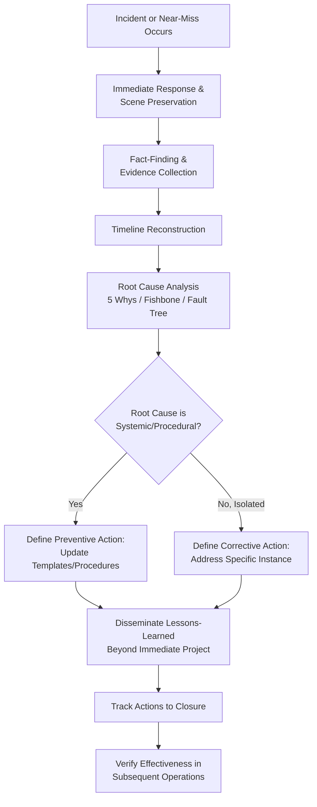

## Incident Investigation and Lessons-Learned Processes

### Overview

Incident investigation and lessons-learned processes are the structured discipline of determining what happened, why it happened, and what should change following an unplanned event — ranging from near-misses and minor equipment malfunctions to serious injuries or major heavy-lift failures. Where the preceding topics in this chapter (critical lift planning, JHA, HAZID/HAZOP) are forward-looking risk controls applied before work occurs, incident investigation is the backward-looking discipline that closes the loop: examining what actually happened against what was planned, identifying root causes rather than surface symptoms, and feeding findings back into the risk assessment and planning tools used for future operations.

In heavy-lift and specialized logistics, where operations often involve unique, non-repeated lift or transport configurations, effective incident investigation and lessons-learned capture is particularly important because the same exact operation may never be repeated — meaning findings must often be generalized to inform different but related future operations, rather than simply corrected for a repeat of the identical task.

### Key Points

- **Root cause analysis distinguishes investigation from simple incident reporting**: Effective investigation asks "why" repeatedly until reaching underlying systemic causes (procedural gaps, organizational pressures, design deficiencies), not just the immediate mechanical or human action that triggered the event.
- **Near-misses warrant the same investigative rigor as actual incidents**: A near-miss represents a failure that did not result in harm only by chance or by a control that happened to work; treating near-misses as low-priority undermines the opportunity to correct the underlying issue before it produces an actual injury or loss.
- **Investigation should be blame-neutral in methodology, even when individual accountability is separately addressed**: A methodology focused on identifying who to blame tends to suppress honest reporting and obscure systemic causes; effective processes separate the fact-finding investigation from any subsequent accountability determination.
- **Lessons-learned only have value if they are actually integrated into future planning tools**: Findings that remain in a closed investigation report without feeding back into updated JHA templates, critical lift procedures, or HAZID/HAZOP checklists provide no ongoing risk reduction benefit.
- **Investigation timeliness affects evidence quality**: Physical evidence, equipment condition, and witness recollection degrade over time; investigations initiated promptly after an event generally yield more reliable findings than delayed investigations.

### Root Cause Analysis Techniques

| Technique | Approach |
| --- | --- |
| 5 Whys | Iteratively asking "why" to an identified problem, typically five times (though not a fixed rule), progressively moving from immediate cause toward underlying systemic cause |
| Fishbone (Ishikawa) diagram | Visually organizing potential causes into categories (commonly people, process, equipment, environment, materials) to ensure comprehensive cause exploration across categories rather than fixation on one |
| Fault tree analysis | Working backward from the incident (top event) through a logic diagram of contributing conditions and failures, useful for more complex incidents with multiple contributing factors |
| Timeline/sequence of events reconstruction | Establishing a detailed chronological sequence of actions and conditions leading to the incident, often the foundational step before applying other root cause techniques |
| Barrier/control failure analysis | Examining which planned controls (from the JHA, critical lift plan, or HAZID/HAZOP) were present, and specifically why each either failed, was absent, or was not effective in preventing the incident |

### Common Root Cause Categories in Heavy-Lift Incidents

- **Procedural**: The JHA, critical lift plan, or standard procedure did not adequately address the actual hazard encountered, or was not followed as written.
- **Communication**: Breakdown in communication between crane operator, riggers, signal person, or across organizational/contractor boundaries — often surfacing as a root cause even when the immediate trigger was mechanical or environmental.
- **Equipment/mechanical**: Equipment failure, inadequate inspection or maintenance, or use of equipment outside its rated capacity or specification.
- **Environmental**: Weather, ground conditions, or site conditions that differed from planning assumptions, particularly when the deviation was not caught through field verification (see related critical lift plan material on field verification).
- **Organizational/systemic**: Schedule pressure, inadequate staffing, insufficient competency verification, or a broader organizational culture that discouraged stop-work authority use — often the most difficult category to surface but frequently the most impactful for genuine prevention.
- **Design/engineering**: Rigging design, lift fixture design, or crane/vessel selection that contained an inadequacy not caught during the planning and review stages covered in the related critical lift plan material.

### Incident Investigation Process

1. **Immediate response and scene preservation**: Ensuring safety of personnel, providing any needed medical response, and preserving the physical scene and equipment condition to the extent practicable before investigation begins.
2. **Fact-finding and evidence collection**: Gathering physical evidence, equipment inspection records, weather data, witness statements, and any relevant documentation (the specific JHA, critical lift plan, or permit in effect at the time).
3. **Timeline reconstruction**: Establishing the sequence of events and conditions leading up to, during, and immediately after the incident.
4. **Root cause analysis**: Applying one or more of the techniques above to move from immediate cause to underlying systemic cause(s), typically identifying multiple contributing factors rather than a single root cause for most significant incidents.
5. **Corrective and preventive action development**: Defining specific, assignable, and verifiable actions addressing each identified root cause — distinguishing corrective actions (addressing the specific incident) from broader preventive actions (addressing the systemic issue across future operations).
6. **Lessons-learned dissemination**: Communicating findings and corrective/preventive actions beyond the immediate project team to the broader organization, particularly to inform updates to standard JHA templates, critical lift procedures, or HAZID/HAZOP checklists referenced in the related material.
7. **Action tracking and closure verification**: Confirming that corrective/preventive actions are actually implemented and effective, not merely documented as planned.

### Example

**Scenario**: During a heavy-lift operation similar to the heat exchanger lift discussed in the related critical lift plan, JHA, and pre-lift briefing material, a near-miss occurs: the crane's boom approaches within a smaller-than-planned distance of the energized 13.8 kV line during the swing phase, triggering an immediate halt by the boundary watch person before actual contact occurs.

**Investigation walkthrough**:

1. **Immediate response**: The lift is halted (as the pre-lift briefing's halt condition specified), the crane is secured in a safe position, and the scene (crane position, load position, boundary watch person's location at time of the call) is documented before any equipment is moved.
2. **Fact-finding**: The investigation team reviews the critical lift plan's minimum approach distance calculation, the JHA's identified controls for the electrical proximity hazard, the pre-lift briefing record, and interviews the crane operator, boundary watch person, and signal person about the sequence of events during the swing.
3. **Timeline reconstruction**: The team establishes that the crane operator began the swing at the planned rate, but a gust of wind (not accounted for in the original lift plan's wind speed assumptions, though within the plan's stated maximum threshold) caused the load to drift further than anticipated during the swing, reducing the actual clearance to the energized line boundary.
4. **Root cause analysis via 5 Whys**: Why did the boom approach closer than planned? — Wind caused load drift during swing. Why did wind cause more drift than expected? — The lift plan's swing radius and exclusion zone calculation used a standard wind allowance rather than one specifically validated for this load's wind-exposed profile (a large, flat-sided heat exchanger presents more wind resistance than a compact load of similar weight). Why was the wind allowance not load-profile-specific? — The critical lift plan template used for this class of lift did not include a step for evaluating load windage area distinctly from load weight in the swing radius calculation. This surfaces a procedural/design root cause (an incomplete lift plan template) rather than stopping at the immediate cause (a wind gust) or attributing the event to operator error.
5. **Corrective and preventive action**: The immediate corrective action for any remaining lifts in this campaign is to add a load-specific windage assessment before continuing; the broader preventive action is to update the organization's critical lift plan template to require windage area evaluation for swing radius/exclusion zone calculations whenever a load presents significant surface area, not only for loads that are unusually light relative to their surface area.
6. **Lessons-learned dissemination**: The finding and template update are communicated beyond the immediate project team to other projects using the same critical lift plan template, since the underlying template gap would affect any future lift with a similar load profile, not just this specific project.
7. **Closure verification**: The organization verifies, in a subsequent audit or review, that the updated template is actually being used on new critical lift plans, rather than assuming the update alone guarantees the gap is closed in practice.

### Incident Investigation and Lessons-Learned Flow (svg_diagram)

### Common Pitfalls

- **Stopping root cause analysis at the first identified cause**: Halting at "wind caused the drift" without continuing to ask why the plan didn't adequately account for that risk misses the systemic, more impactful finding.
- **Deprioritizing near-miss investigation relative to actual-harm incidents**: A near-miss that didn't result in injury only because a control happened to work deserves the same investigative rigor as an incident that did cause harm.
- **Blame-focused investigation methodology**: An investigation process perceived as assigning individual blame tends to suppress honest witness accounts and can obscure systemic causes that a blame-neutral fact-finding approach would surface.
- **Failing to disseminate findings beyond the immediate project**: A lessons-learned finding that stays within a single project's files provides no benefit to other projects or future operations facing a similar underlying risk.
- **Documenting corrective/preventive actions without verifying actual implementation**: An action plan that exists on paper but is never confirmed as implemented and effective in practice does not close the loop the investigation process is meant to complete.
- **Delayed investigation initiation**: Waiting to begin fact-finding allows physical evidence to degrade and witness recollection to fade, reducing the reliability of findings.

### Conclusion

Incident investigation and lessons-learned processes complete the risk management cycle by examining what actually happened against what was planned, using structured root cause analysis to move beyond immediate triggers to underlying systemic causes, and feeding findings back into the JHA, critical lift plan, and HAZID/HAZOP tools used for future operations. Because heavy-lift operations often involve unique, non-repeated configurations, the value of investigation lies substantially in generalizing findings to inform different future operations — which requires blame-neutral fact-finding, genuine root cause depth, and disciplined dissemination and closure tracking rather than treating the investigation report itself as the end product.

**Related Topics**

- Critical Lift Definition and Classification Criteria
- Critical Lift Plan Documentation and Approval Workflow
- Job Hazard Analysis for Heavy-Lift Operations
- HAZID and HAZOP Risk Assessment Techniques
- Pre-Lift Briefings and Exclusion Zone Management
- Stop-Work Authority and Emergency Halt Procedures
- Safety Management System Continuous Improvement Cycles