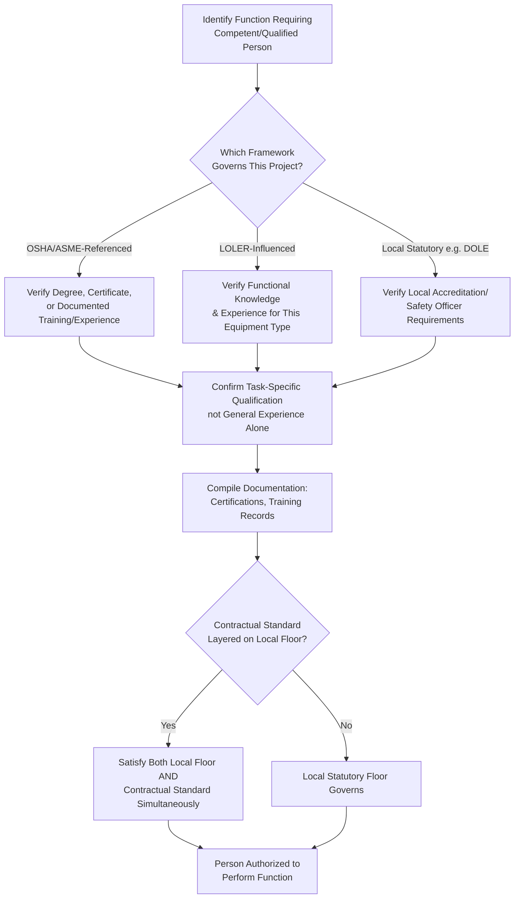

## Competent Person and Qualified Rigger Requirements

### Overview

"Competent person" and "qualified rigger" are defined regulatory and industry-standard roles that establish who is legally and technically authorized to perform, supervise, or approve specific functions within heavy-lift operations — including lift plan development, equipment inspection, rigging design, and hazard assessment. These designations are not honorary titles or general experience claims; they are specific, criteria-based classifications referenced throughout the frameworks and processes covered elsewhere in this chapter (critical lift plans, JHAs, HAZID/HAZOP, incident investigation), each of which assumes that a person meeting the relevant definition is performing the associated function.

The specific definitions, criteria, and documentation requirements for these roles vary by regulatory framework (OSHA, ASME B30, LOLER) and by organizational procedure, but the underlying purpose is consistent: ensuring that safety-critical judgments in heavy-lift operations are made by individuals with verified, specific competency rather than general experience or seniority alone.

### Key Points

- **"Competent person" and "qualified person" are often distinct, though related, classifications**: Under OSHA's general framework, a competent person is typically defined by the ability to identify hazards and the authority to take corrective action, while a qualified person is typically defined by possession of a recognized degree, certificate, or professional standing, or extensive knowledge/training/experience — the two are not automatically interchangeable, and different regulatory provisions may require one, the other, or both for different functions.
- **Qualified rigger status is task/load-specific, not a blanket certification**: A rigger qualified for routine rigging tasks may not automatically be qualified for a specific complex or critical lift configuration; qualification is generally tied to the demonstrated ability to perform the specific rigging task at hand.
- **Documentation of competency/qualification is a distinct requirement from possessing the competency itself**: Many frameworks require not just that a competent/qualified person exists, but that their qualification is documented and verifiable (training records, certification, demonstrated experience log).
- **These roles are referenced as prerequisites throughout other chapter topics**: The critical lift plan must be developed or reviewed by a qualified/competent person (per the related CLP material); rigging attachment must be performed by a qualified rigger (referenced in the related JHA material); equipment thorough examination under LOLER must be performed by a competent person (per the related regulatory frameworks material).
- **Employer/organizational responsibility to verify competency is a recurring theme**: Across frameworks, the burden generally falls on the employer or operating organization to ensure that personnel assigned to competent person or qualified rigger roles genuinely meet the applicable criteria, not merely to assume competency based on job title or years of service.

### OSHA Framework Definitions

- **Competent person** (a term used across various OSHA standards, not exclusively crane-related): Generally defined as an individual who is capable of identifying existing and predictable hazards in the surroundings or working conditions, and who has authorization to take prompt corrective measures to eliminate them.
- **Qualified person**: Generally defined as an individual who, by possession of a recognized degree, certificate, or professional standing, or who by extensive knowledge, training, and experience, has successfully demonstrated the ability to solve or resolve problems relating to the subject matter, the work, or the project.
- **Qualified rigger** (specifically under 29 CFR 1926 Subpart CC, the construction crane standard): A rigger who meets the criteria for a qualified person specifically with respect to rigging tasks, with the standard distinguishing between rigging tasks that require a qualified rigger and other rigging tasks that may be performed by a rigger who does not meet the full qualified rigger criteria — [Unverified], the exact scope distinction between tasks requiring a qualified rigger versus other rigging tasks should be confirmed against the current text of 29 CFR 1926 Subpart CC, as this distinction is specific and detailed within the regulation.

### ASME B30 Series Definitions

- ASME B30.5 and related B30 series parts define roles including qualified rigger, lift director, and signal person with criteria generally aligned with, but independently stated from, the OSHA definitions — [Unverified], specific ASME B30 series definitions and any differences from OSHA's definitions for the same terms should be confirmed against the current text of the applicable B30 part, since consensus standard definitions are maintained independently from regulatory text and can differ in detail or scope.
- The **lift director** role (referenced in some ASME B30-aligned procedures and many organizational critical lift procedures) is often defined as the person with overall authority and responsibility for a specific lift, distinct from but coordinating with the crane operator, rigger-in-charge, and signal person roles referenced in the related pre-lift briefing material.

### LOLER Framework: Competent Person for Thorough Examination

- LOLER's "competent person" for the purpose of thorough examination (referenced in the related regulatory frameworks material) is defined functionally rather than through a specific credential list: a person with appropriate practical and theoretical knowledge and experience of the lifting equipment to detect defects or weaknesses and assess their importance in relation to the safety and continued use of the equipment.
- This functional, knowledge-and-experience-based definition reflects LOLER's broader risk-assessment-driven regulatory philosophy (discussed in the related regulatory frameworks material) rather than a prescriptive credential or certification list — [Unverified], any specific accepted certification schemes or professional body recognitions that are commonly used in practice to demonstrate this competency should be confirmed against current UK Health and Safety Executive (HSE) guidance.

### Philippine Context

- Philippine occupational safety and health regulation under DOLE, informed by Republic Act 11058 and its implementing rules, establishes safety officer and related competent person requirements within its occupational safety and health framework — [Unverified], the specific current DOLE definitions, certification requirements (e.g., accredited safety officer training and certification schemes), and their specific application to crane operation, rigging, and lifting equipment inspection roles should be confirmed against current DOLE issuances, as these requirements and accreditation schemes are subject to periodic regulatory update.
- On projects where international contractual standards (OSHA-aligned, ASME B30-referenced, or LOLER-influenced corporate HSE standards, per the related regulatory frameworks material) are layered on top of the DOLE regulatory floor, competent person and qualified rigger requirements may need to satisfy both the DOLE-mandated safety officer/competency framework and the more specific contractual definition simultaneously — [Unverified], the specific reconciliation approach should be confirmed for each specific project and contract, as this is a fact-specific determination.

### Example

**Scenario**: Continuing the heat exchanger critical lift example used throughout this chapter's related material, the project must confirm that the personnel assigned to develop the critical lift plan, perform rigging attachment, and conduct the pre-lift equipment inspection each meet the applicable competent person / qualified rigger criteria before work proceeds.

**Verification walkthrough**:

1. **Critical lift plan developer/reviewer**: The individual preparing the capacity utilization calculation and rigging design (referenced in the related CLP material) must meet the "qualified person" criteria applicable under the project's governing framework — verified through review of their engineering credentials, relevant training records, and documented prior experience with similar lift configurations, rather than assumed based on job title alone.
2. **Rigger performing attachment**: The rigger attaching the spreader bar and slings to the heat exchanger must meet the applicable "qualified rigger" criteria for this specific rigging task — the project verifies this through the rigger's training certification and, per the qualified rigger concept's task-specific nature, confirms the rigger has demonstrated competency specifically with the type of rigging configuration involved (custom spreader bar attachment to an asymmetric load), not merely general rigging experience.
3. **Equipment inspection**: The pre-lift crane and rigging hardware inspection, referenced in the related JHA and pre-lift briefing material's field verification step, is confirmed to be performed by a person meeting the applicable "competent person" criteria for equipment inspection — under a LOLER-influenced framework this would emphasize demonstrated knowledge and experience to detect defects specifically in this equipment type, while under an OSHA/ASME-referenced framework this would emphasize the individual's documented qualification credentials.
4. **Documentation compilation**: Rather than relying on verbal assurance that "the rigger is experienced" or "the engineer is qualified," the project compiles the specific documentation (certifications, training records, demonstrated experience log) supporting each competency determination, since documentation of qualification is treated as a distinct requirement from the underlying competency itself under most frameworks.
5. **Reconciliation with local regulatory floor**: Given the Philippine project context, the project separately confirms that DOLE-mandated safety officer or competent person requirements applicable to this operation are also satisfied, layered alongside (not replaced by) the international contractual standard's qualified rigger/competent person criteria — consistent with the layered compliance pattern discussed in the related regulatory frameworks material.

### Competent Person / Qualified Rigger Verification Flow (svg_diagram)

### Common Pitfalls

- **Assuming general experience or seniority satisfies specific qualification criteria**: Years of experience in an adjacent role does not automatically satisfy a specific "qualified rigger" or "competent person" definition tied to a particular task or equipment type.
- **Treating qualified rigger status as a blanket, permanent certification**: A rigger qualified for standard rigging tasks may not be qualified for a specific complex or novel rigging configuration without task-specific demonstrated competency.
- **Relying on verbal assurance instead of documented verification**: Most frameworks treat documentation of competency as a distinct requirement from the underlying competency; undocumented verbal assurance does not satisfy this documentation requirement.
- **Applying only one framework's definition when multiple apply**: On projects layering an international contractual standard over a local statutory floor (as in the Philippine example), satisfying only one framework's competent person criteria while overlooking the other leaves a compliance gap.
- **Confusing "competent person" and "qualified person" as interchangeable terms**: Under frameworks like OSHA's that define both terms distinctly, using the wrong term or applying the wrong criteria for a given function can result in an incorrect competency determination.
- **Assigning competent person/qualified rigger roles based on organizational hierarchy rather than demonstrated criteria**: Assuming a supervisor or senior team member automatically meets the applicable definition due to their position, rather than verifying against the specific criteria, undermines the purpose of the classification.

### Conclusion

Competent person and qualified rigger requirements establish specific, criteria-based (not title-based or seniority-based) standards for who may perform or approve safety-critical functions throughout the critical lift planning, JHA, rigging, and equipment inspection processes covered elsewhere in this chapter. Because definitions and documentation requirements differ across OSHA, ASME B30, LOLER, and local regulatory frameworks like DOLE, and because these frameworks are frequently layered together on international projects, verifying and documenting the applicable competency criteria for each specific function — rather than relying on general experience, job title, or verbal assurance — is a foundational prerequisite that the rest of this chapter's safety processes assume is already in place.

**Related Topics**

- OSHA, ASME B30, and LOLER Regulatory Frameworks
- Critical Lift Plan Documentation and Approval Workflow
- Job Hazard Analysis for Heavy-Lift Operations
- Pre-Lift Briefings and Exclusion Zone Management
- Rigging Equipment Inspection Intervals and Thorough Examination Requirements
- Philippine DOLE Occupational Safety and Health Standards for Construction and Lifting Operations
- Crane Operator Certification and Signal Person Qualification Standards