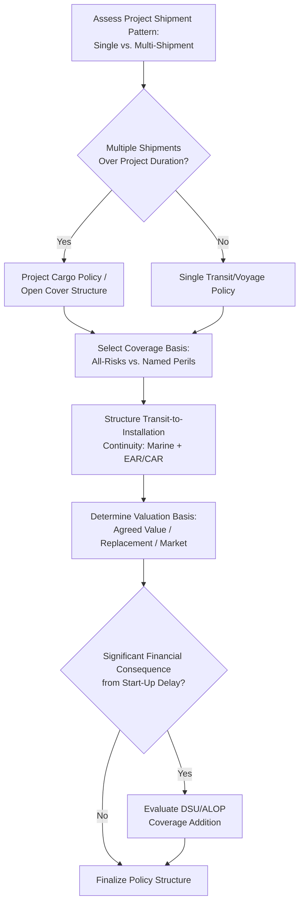

## Project Cargo Insurance Policy Structures

### Overview

Project cargo insurance policy structures are the frameworks through which financial risk for loss or damage to heavy-lift and specialized cargo during transport, storage, and installation is transferred to insurers. Unlike standard commercial cargo insurance — which typically covers relatively homogeneous, high-volume, lower-unit-value shipments under simplified policy forms — project cargo insurance must accommodate the unique characteristics of heavy-lift logistics: high individual unit values, extended and multi-modal transit periods, complex handling and installation phases, and often first-of-a-kind or irreplaceable equipment with long fabrication lead times.

Policy structure decisions made at the outset of a project — single transit policy vs. annual/open cover, named perils vs. all-risks, and how installation/erection risk is incorporated — have direct consequences for claims handling, coverage gaps, and cost, making this a foundational commercial risk management decision distinct from (but related to) the operational risk controls covered in the preceding safety chapter.

### Key Points

- **Policy structure choice depends on project shipment pattern**: A single large one-off shipment is typically insured differently than a project involving many shipments over an extended campaign, where an open cover or annual policy structure may be more appropriate.
- **"All-risks" is a defined insurance term, not a literal guarantee of unlimited coverage**: All-risks policies cover loss or damage from any fortuitous cause not specifically excluded, which is broader than named-perils coverage but still subject to specific policy exclusions (war, inherent vice, wear and tear, and others).
- **Transit and installation/erection risk are often structured as distinct coverage phases**: Marine cargo insurance traditionally covers the transit phase; heavy-lift and EPC project cargo frequently requires an extension or separate policy (Erection All Risks/Construction All Risks) to cover the period during offloading, storage, and installation until commissioning.
- **Valuation basis fundamentally shapes claims outcomes**: Whether a policy insures on an "agreed value," "replacement cost," or "market value" basis determines how a total or partial loss claim is calculated, and this should be settled at policy inception, not after a loss occurs.
- **Deductibles and sub-limits can materially affect the practical coverage available for specific risk types**: A policy's headline coverage limit does not guarantee that specific risk categories (e.g., mechanical breakdown during commissioning, delay in start-up) are covered at the same level, or at all, without a specific extension.

### Common Policy Structure Types

| Structure | Application |
| --- | --- |
| Single transit / voyage policy | Covers one specific shipment or movement from a defined origin to destination, appropriate for isolated, non-repeated heavy-lift movements |
| Open cover / annual policy | Covers multiple shipments over a policy period under pre-agreed terms, appropriate for ongoing or high-frequency project cargo movement programs |
| Project cargo policy (multi-shipment, project-specific) | A dedicated policy covering all shipments associated with a specific project from a defined start to completion, common for large EPC projects with numerous heavy-lift movements over an extended timeline |
| Marine Cargo + Erection All Risks (EAR) combination | Marine cargo policy covering transit, transitioning to or combined with an EAR/Construction All Risks policy covering the installation/erection phase through to commissioning |
| Delay in Start-Up (DSU) / Advance Loss of Profits (ALOP) | A specialized, typically higher-value add-on policy covering the financial consequence (lost revenue, ongoing fixed costs) of a project cargo loss delaying a facility's commercial start-up, distinct from the physical damage coverage itself |

### All-Risks vs. Named Perils Coverage

- **All-risks (or "all risks of physical loss or damage")**: Covers loss or damage from any fortuitous external cause unless specifically excluded in the policy — the broader and more commonly used basis for project cargo given the complexity and variety of potential loss causes across a multi-modal heavy-lift movement.
- **Named perils**: Covers only loss or damage arising from specifically listed causes (e.g., fire, sinking, collision) — narrower coverage, generally less common for project cargo given the range of handling, positioning, and installation risks involved, though sometimes used for specific limited-risk legs or as a cost-reduction measure for lower-value components.
- [Unverified] — the specific standard exclusions applicable to an "all-risks" project cargo policy (inherent vice, wear and tear, war and strikes unless specifically bought back, insufficient/unsuitable packing) vary by insurer, market, and specific policy wording, and should be confirmed against the actual policy document rather than assumed from the general "all-risks" label.

### Transit-to-Installation Coverage Continuity

A critical structural consideration for heavy-lift project cargo is ensuring there is no gap in coverage as cargo transitions from marine/inland transit, through offloading and storage, into installation/erection, and finally to commissioning:

$$\text{Coverage Continuity} = C_{transit} \cup C_{storage} \cup C_{installation} \cup C_{commissioning}$$

Where each $C$ term represents the coverage in force during that phase, and the structural goal is ensuring these phases overlap or connect without a gap — a common practical mechanism is structuring the marine cargo policy to extend coverage until the cargo reaches its "final resting place" or is positioned for installation, with the EAR/CAR policy then providing coverage from that point (or an overlapping point) through commissioning, explicitly defined in both policies' wording to avoid a coverage gap at the handoff point. [Unverified] — the specific wording mechanisms used to achieve this continuity (warehouse-to-warehouse clauses, specific transit termination definitions, EAR incept triggers) vary by insurer and policy form, and should be reviewed specifically in the actual policy documents for the project.

### Valuation Basis Options

| Basis | Description |
| --- | --- |
| Agreed value | The insured value is fixed and agreed between insurer and insured at policy inception, providing certainty for claims settlement but requiring accurate valuation at the outset |
| Replacement cost | Claims are settled based on the cost to replace the damaged/lost item at the time of loss, which can differ significantly from original cost given fabrication lead times and cost escalation for unique heavy equipment |
| Market value | Claims are settled based on the item's market value at the time of loss — less commonly used for unique, custom-fabricated project cargo given the absence of a liquid market for comparable items |

For unique, custom-fabricated heavy equipment with long fabrication lead times, agreed value or replacement cost bases are generally more appropriate than market value, given the practical difficulty of establishing a market value for one-of-a-kind equipment — [Unverified], the specific valuation basis appropriate for any given project cargo item should be determined through consultation with a qualified insurance broker or underwriter familiar with the specific equipment and project context.

### Example

**Scenario**: An EPC contractor is planning insurance for a project involving fabrication overseas, sea transport, and installation of a large process module at a Philippine industrial facility, with the module's replacement lead time estimated at approximately 14 months if lost or destroyed.

**Policy structure walkthrough**:

1. **Structure selection**: Given this is one component within a broader multi-shipment EPC project (with the process module being one of several heavy-lift items moved over the project's duration), a project cargo policy covering all project shipments from fabrication through installation is selected over a single transit policy, providing consistent terms across all project movements rather than requiring separate policy placement for each shipment.
2. **All-risks basis selection**: Given the module's transit involves multiple handling points (fabrication yard, port loading, sea transport, port discharge, inland heavy-haul transport, site offloading, and installation), an all-risks basis is selected over named perils, given the range of potential loss causes across these varied phases.
3. **Transit-to-installation continuity structuring**: The marine cargo policy is structured to extend coverage through inland transport to the site and until the module is positioned at its foundation ("delivered, unloaded" or equivalent defined term), with the Erection All Risks policy incepting from that point through mechanical completion and commissioning — with both policies' wording specifically cross-referenced to confirm no gap exists at the handoff point.
4. **Valuation basis determination**: Given the module's 14-month replacement lead time and custom fabrication (no comparable market value exists), an agreed value basis is negotiated with the insurer at policy inception, fixing the insured value to avoid valuation disputes in the event of a total loss claim.
5. **Delay in Start-Up consideration**: Given the module's 14-month replacement lead time would translate directly into a significant delay to the facility's commercial start-up if lost, the project evaluates whether a separate DSU/ALOP policy is warranted to cover the financial consequence of such a delay, distinct from and in addition to the physical damage coverage under the project cargo and EAR policies — this decision typically depends on the facility owner's specific risk tolerance and the magnitude of potential lost revenue relative to the additional premium cost.

### Project Cargo Policy Structure Decision Flow (svg_diagram)

### Common Pitfalls

- **Assuming "all-risks" means literally all causes of loss are covered**: All-risks policies still contain specific exclusions; assuming unlimited coverage without reviewing actual policy exclusions can result in an uncovered claim.
- **Leaving a coverage gap at the transit-to-installation handoff**: Without explicit cross-referencing between the marine cargo and EAR/CAR policy wordings, a gap can exist at the point cargo transitions from transit coverage to installation coverage.
- **Using market value basis for unique, custom-fabricated equipment**: Given the absence of a liquid market for one-of-a-kind heavy equipment, a market value basis can result in significant claims settlement disputes or inadequate recovery relative to actual replacement cost.
- **Overlooking Delay in Start-Up exposure for long-lead-time equipment**: Physical damage coverage alone does not address the financial consequence of a facility start-up delay caused by equipment replacement lead time; this requires separate, specific consideration.
- **Determining valuation basis only after a loss occurs**: Valuation basis should be settled and documented at policy inception; attempting to establish agreed value or negotiate replacement cost basis after a loss has already occurred significantly weakens the insured's negotiating position.
- **Treating policy structure as a purely administrative/legal matter separate from project risk planning**: Insurance structure decisions should be informed by the same risk assessment processes (HAZID, critical lift classification, route/jurisdiction risk) covered elsewhere in this material, since these operational risk factors directly inform appropriate coverage structure and limits.

### Conclusion

Project cargo insurance policy structure decisions — single transit vs. multi-shipment project policy, all-risks vs. named perils, transit-to-installation coverage continuity, and valuation basis — must be made deliberately at the outset of a project rather than defaulted to standard commercial cargo insurance assumptions, given the unique characteristics of heavy-lift cargo: high unit value, extended multi-phase movement, and often long replacement lead times. Because coverage gaps and valuation disputes are most damaging when discovered only after a loss has occurred, aligning policy structure with the project's actual shipment pattern, risk profile, and financial exposure (including potential start-up delay consequences) at policy inception is essential to ensuring the insurance program actually performs as intended when needed.

**Related Topics**

- Marine Cargo Insurance Clauses and Institute Cargo Clauses (ICC)
- Erection All Risks and Construction All Risks Policy Coverage
- Delay in Start-Up and Advance Loss of Profits Coverage
- Cargo Valuation and Total/Partial Loss Claims Methodology
- Insurance Survey and Warranty Requirements for Heavy-Lift Shipments
- Marine Spread Selection for Offshore Campaigns
- International Maritime Regulations and SOLAS Compliance