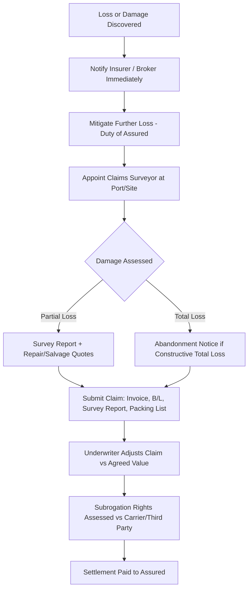

## Marine Cargo Insurance and Institute Cargo Clauses

### Overview

Marine cargo insurance is a contract of indemnity that transfers the financial risk of physical loss or damage to goods in transit from the cargo owner (or party bearing risk under the sale/shipping contract) to an underwriter, in exchange for a premium. For heavy-lift and specialized logistics — project cargo, out-of-gauge (OOG) consignments, abnormal loads, and high-value single-lift items — cargo insurance is not a generic commodity product; it is individually underwritten because standard hull/cargo actuarial tables do not apply to one-off shipments of transformers, reactors, cranes, yachts, or modular plant equipment.

The **Institute Cargo Clauses (ICC)**, drafted and maintained by the International Underwriting Association (IUA) in London (historically the Institute of London Underwriters), are the standard wording sets incorporated into marine cargo policies worldwide. They define what perils are covered, what is excluded, and under what conditions a claim is payable. The current editions are the **ICC 2009** clauses (A, B, C), which superseded the 1982 editions, though 1982-wording policies still circulate in some markets and legacy contracts.

---

### Regulatory and Market Context

- Marine cargo insurance sits within marine insurance law, historically governed in common-law markets by the UK **Marine Insurance Act 1906 (MIA 1906)**, which remains the reference framework even for non-UK-domiciled policies because so much of the wording and case law derives from it.
- The **Insurance Act 2015** (UK) modernized duties of disclosure and warranties for policies incepted after August 2016, replacing the harsher "utmost good faith" remedies of the 1906 Act with a "fair presentation of risk" standard and proportionate remedies for breach.
- Non-marine (inland) transit insurance in some jurisdictions uses parallel but distinct wordings (e.g., Institute of London Underwriters' Air Cargo Clauses, or country-specific inland transit clauses), but heavy-lift project cargo almost universally references ICC because most movements include an ocean leg.

---

### Institute Cargo Clauses: The Three Tiers

The ICC 2009 set provides three alternative levels of cover, layered from broadest to narrowest. They are **not cumulative** — a policy is written under exactly one clause set (A, B, or C) unless clauses are specifically blended or amended by endorsement.

#### ICC (A) — All Risks (Broadest)

- Covers **all risks of physical loss or damage** to the subject-matter insured, **except** those specifically excluded.
- This is an "all risks" basis, not "all perils" — the distinction matters legally: the insured must still prove the loss occurred during the insured transit and was fortuitous (accidental), but does not need to identify the specific peril, unlike (B) and (C).
- Standard choice for heavy-lift and project cargo because of the higher exposure to handling damage, multiple transshipments, and non-standard stowage.

#### ICC (B) — Named Perils, Broader List

Covers loss or damage reasonably attributable to:

- Fire or explosion
- Vessel/craft stranding, grounding, sinking, or capsizing
- Overturning or derailment of land conveyance
- Collision or contact of vessel/craft/conveyance with any external object other than water
- Discharge of cargo at a port of distress
- Earthquake, volcanic eruption, lightning
- General average sacrifice
- Jettison
- Washing overboard
- Entry of sea, lake, or river water into vessel, craft, hold, conveyance, container, or place of storage
- Total loss of any package lost overboard or dropped while loading/unloading

#### ICC (C) — Named Perils, Narrowest

Covers the same list as (B) **minus**:

- Earthquake, volcanic eruption, lightning
- Washing overboard
- Entry of water into vessel/conveyance/container
- Total loss overboard/during loading/unloading

(C) is rarely used for heavy-lift project cargo given the catastrophic exposure of a single high-value unit; it is more common for bulk commodities of lower unit value where basic marine perils cover is sufficient.

**[Inference]** In practice, virtually all heavy-lift and OOG project cargo placements default to ICC (A) with negotiated endorsements, because the cost differential between (A) and (B)/(C) is small relative to the value concentration in a single lift, and lenders/EPC contracts frequently mandate all-risks cover as a condition precedent to financing or contract execution.

---

### Common Exclusions (All Three Clause Sets)

These apply across (A), (B), and (C) unless specifically bought back by endorsement:

1. **Wilful misconduct** of the assured
2. **Ordinary leakage, loss in weight/volume, or ordinary wear and tear**
3. **Inadequate or unsuitable packing or preparation** (packing performed by the assured or their employees before attachment of risk, or by others before loading)
4. **Inherent vice or nature** of the subject-matter
5. **Delay**, even if caused by an insured peril (delay is fundamentally excluded, with narrow general average/salvage exceptions)
6. Insolvency or financial default of vessel owners/operators/charterers
7. Deliberate damage/destruction by wrongful act of any person (ICC A covers malicious damage; B/C exclude it)
8. Unseaworthiness and unfitness exclusion (where the assured is privy to the defect)
9. **War exclusion** — hijacking, capture, seizure, hostilities, civil war, revolution
10. **Strikes exclusion** — riots, civil commotion, terrorism, persons acting from political motive

Items 9 and 10 are excluded from the base ICC A/B/C wordings but are almost always **bought back** via the companion **Institute War Clauses (Cargo)** and **Institute Strikes Clauses (Cargo)**, which are separate clause sets attached by endorsement for an additional premium. For project cargo transiting high-risk corridors (Gulf of Aden, Red Sea, certain West African or South Asian ports), war and strikes buy-back is standard practice, not optional.

---

### Heavy-Lift Specific Underwriting Considerations

#### Survey and Warranty Requirements

Because heavy-lift cargo often exceeds standard vessel/crane capacity thresholds, underwriters typically impose **special conditions precedent** to cover, including:

- **Independent marine warranty surveyor (MWS)** approval of the lift/loading/securing plan before shipment — common providers include class-society-affiliated surveyors (e.g., from the major classification societies' marine warranty divisions) or specialist firms.
- Approval of **rigging plans, lashing/securing calculations, and lifting equipment certification** (crane certificates, sling/shackle SWL documentation).
- **Route survey and weather routing** compliance for open-deck or barge transport.
- Compliance with **CTU Code** (IMO/ILO/UNECE Code of Practice for Packing of Cargo Transport Units) principles for securing, even though the CTU Code itself is non-mandatory guidance.

Failure to obtain MWS approval where required by the policy is typically a **condition precedent to liability** — breach voids the specific shipment's cover even under an otherwise valid open policy.

#### Valuation Basis

- **Agreed Value** policies are standard for heavy-lift/project cargo: the insured value is fixed at policy inception (replacement cost, contract value, or invoice value plus an uplift), removing valuation disputes at claim time except for total constructive loss determinations.
- Typical uplift: **invoice/contract value + 10%** to cover incidental costs (freight, duty, anticipated profit) — this is the conventional CIF+10% formula seen in general cargo but is frequently customized upward for project cargo given re-manufacture lead times.
- For OOG/breakbulk single-lift items (e.g., a power transformer or press), **Increased Value (IV)** or **Duty & Increased Value (DIV)** clauses may be layered on top of the primary hull-equivalent value to cover the gap between insured value and true replacement/business-interruption exposure.

#### Sue and Labour / Duty of Assured

ICC clauses (all three tiers) include a **"Duty of Assured" (Sue and Labour) clause**, obliging the insured to take reasonable measures to avert or minimize loss, with underwriters reimbursing reasonable costs incurred in doing so — separate from and in addition to the claim settlement itself. For heavy-lift cargo this is operationally significant: emergency re-lashing, port-of-refuge costs, or emergency crane mobilization to prevent total loss are recoverable sue-and-labour expenses, not deductions from the insured value.

#### General Average (GA)

Heavy-lift/breakbulk shipments are disproportionately exposed to **General Average** declarations (under York-Antwerp Rules) because:

- Jettison or sacrifice of deck cargo to save the vessel affects all cargo interests proportionally, not just the sacrificed unit.
- Salvage operations involving specialized heavy-lift vessels (semi-submersibles, heavy-lift cranes) generate high GA contribution values.
- ICC (A), (B), and (C) all cover GA contribution, but the insured typically must still provide a **GA guarantee/bond** or **Average Bond and Deposit** to release cargo at destination pending adjustment — a logistics/cash-flow issue distinct from the insurance claim itself.

---

### Claims Process Flow

---

### Institute Cargo Clauses vs. Related Wordings — Comparison

| Clause Set | Basis | Typical Use in Heavy-Lift |
| --- | --- | --- |
| ICC (A) 2009 | All risks except listed exclusions | Standard for single-lift/OOG project cargo |
| ICC (B) 2009 | Named perils, broader | Bulk/lower-value project components |
| ICC (C) 2009 | Named perils, narrow | Rarely used; low-value bulk only |
| Institute War Clauses (Cargo) | War perils buy-back | Added by endorsement for high-risk transits |
| Institute Strikes Clauses (Cargo) | SRCC/terrorism buy-back | Added by endorsement, common on all project cargo |
| Institute Cargo Clauses (Air) | All-risks equivalent for air freight | Used for urgent spare parts, not typical heavy-lift |

---

### Practical Example

**Scenario:** A 180-tonne gas turbine stator is shipped breakbulk from Rotterdam to a power plant site in Southeast Asia via heavy-lift vessel, followed by barge transfer and SPMT (self-propelled modular transporter) road delivery to site.

- **Policy basis:** ICC (A) 2009, Agreed Value = contract value $14,200,000 + 10% = $15,620,000
- **War/Strikes buy-back:** Added given transit through a designated high-risk area
- **Conditions precedent:** MWS approval of lashing/securing plan for ocean leg and SPMT route survey for inland leg
- **Incident:** During SPMT transfer, a wheel-set failure causes the transporter to list, resulting in minor structural distortion to the stator's outer casing.
- **Claim path:** Sue and Labour clause funds emergency re-cribbing and crane standby to prevent further tilt (recoverable separately); a marine surveyor assesses repair feasibility; claim settled as a **partial loss** against the agreed value basis, since full functional repair (not replacement) is achievable.

---

**Related Topics**

- Institute War Clauses (Cargo) and Strikes Clauses (Cargo) — buy-back mechanics
- Marine Warranty Surveying and MWS approval workflows for heavy-lift
- General Average and York-Antwerp Rules 2016
- CTU Code (IMO/ILO/UNECE) for cargo securing compliance
- Duty & Increased Value (DIV) and business-interruption layering for project cargo
- Subrogation and carrier liability limits (Hague-Visby Rules, Hamburg Rules) vs. cargo insurance recovery
- Open Cover / Open Policy structures for recurring heavy-lift program cargo
- Total Constructive Loss and abandonment procedure under MIA 1906 s.60–63