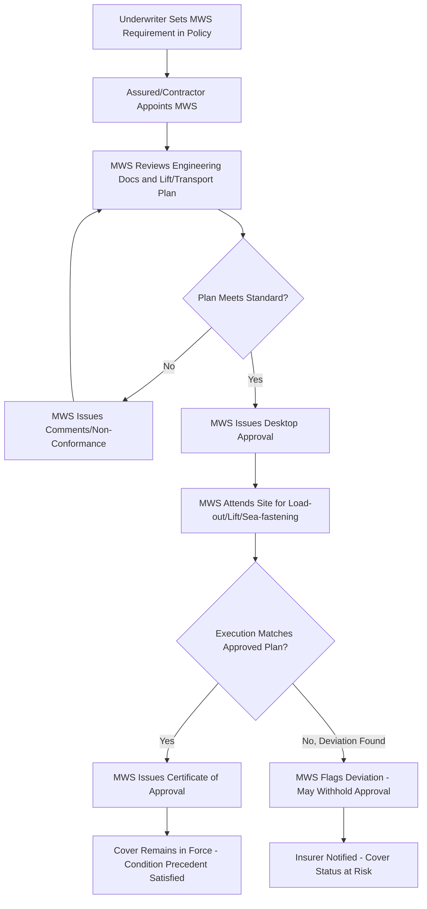

## Warranty Surveyor Involvement in Underwriting

### Overview

A **Marine Warranty Surveyor (MWS)** is an independent third-party technical authority appointed by, or on behalf of, an insurance underwriter to review, approve, and monitor high-value or high-risk marine operations before and during execution — most commonly heavy-lift transport, offshore installation, load-out, sea-fastening, and marine construction. The MWS does not work for the assured (the insured party); the MWS's role is to protect the underwriter's exposure by independently verifying that an operation is planned and executed to an acceptable engineering and industry standard.

MWS approval is typically written into the cargo/marine policy as a **condition precedent to liability** (also called a "warranty" in the strict marine insurance sense, distinct from a general commercial warranty). If the assured proceeds with an operation requiring MWS approval without obtaining it, the insurer may be entitled to decline the claim entirely for that operation — regardless of whether the MWS's absence had any causal connection to the loss, under the traditional strict-compliance doctrine of the Marine Insurance Act 1906. This makes MWS involvement a hard operational gate in heavy-lift project execution, not a courtesy inspection.

---

### Regulatory and Legal Basis

- **Marine Insurance Act 1906 (MIA 1906), s.33–41** — governs warranties in marine insurance contracts; historically, breach of warranty automatically discharged the insurer from liability from the date of breach, irrespective of materiality.
- **Insurance Act 2015 (UK)** — for policies incepted after 12 August 2016, breach of warranty **suspends** rather than **discharges** cover; the insurer is not liable for losses occurring during the period of breach, but cover automatically resumes once the breach is remedied. This materially changes the consequence of a missed or late MWS approval but does not remove the requirement to obtain it.
- MWS practice is not itself a statutory regime — it is a **market practice** standardized primarily through underwriter requirements and guidance published by bodies such as **IMCA (International Marine Contractors Association)**, and individual major MWS providers' internal technical standards (e.g., those historically associated with class societies' marine warranty divisions and independent firms such as Global Maritime, Matthews Daniel, and others operating in this space).

---

### When MWS Involvement Is Triggered

Underwriters typically mandate MWS approval for:

- Cargo or units exceeding a specified **weight, value, or dimensional threshold** set out in the policy wording (thresholds vary by underwriter and market cycle; commonly triggered for single lifts above roughly 100–200 tonnes or insured values above a stated figure).
- **Heavy-lift ocean transport** on open deck, barges, or semi-submersible vessels.
- **Offshore installation and marine construction** operations — pipelay, subsea lifts, topside installations, jacket launches.
- **Load-out and float-off operations** (ro-ro, skidding, ballasting sequences).
- **Towage operations** exceeding specified distance, sea-state exposure, or tow value.
- Voyages through **seasonal weather windows** or geographically defined high-risk zones (cyclone/typhoon seasons, specific latitude bands).

**[Inference]** Exact trigger thresholds are set individually per policy/binder and are not standardized market-wide; the ranges above reflect commonly cited industry norms rather than a fixed regulatory figure.

---

### Scope of MWS Review

The MWS conducts a staged technical review, typically covering:

1. **Engineering and design review**
   - Lifting plans, rigging arrangements, sling/shackle/spreader-bar certification and safe working load (SWL) verification
   - Sea-fastening and grillage design calculations (motion criteria, accelerations, structural adequacy of seafastenings vs. vessel motion response)
   - Ballast and stability calculations for load-out/float-off
   - Crane/vessel capacity charts vs. actual lift radius and load
2. **Route and weather review**
   - Route survey for barge/heavy-lift vessel passage (draft restrictions, air draft, channel clearances)
   - Weather routing and seasonal weather window analysis
   - Contingency/refuge port identification along the route
3. **Procedural documentation review**
   - Method statements and lift plans
   - Emergency response and contingency procedures
   - Vessel/barge certification, class status, and seaworthiness documentation
   - Towmaster and personnel competency verification
4. **On-site attendance and sign-off**
   - Physical attendance at load-out, lift, sea-fastening completion, and/or installation
   - Issuance of a **Certificate of Approval** (or "Statement of Fact"/"Warranty Survey Report") confirming the operation was conducted in accordance with the approved plan

---

### Process Flow

---

### Relationship Between MWS, Assured, and Underwriter

| Party | Role | Relationship to MWS |
| --- | --- | --- |
| Underwriter | Sets the MWS requirement as a policy condition | Appoints or approves the MWS list; receives approval reports |
| Assured / Contractor | Executes the operation; bears cost of MWS engagement | Provides engineering documentation; must obtain sign-off before/during operation |
| MWS | Independent technical reviewer | Reports findings to both parties but owes its duty of independent judgment primarily to protect the risk the underwriter is exposed to |

The independence of the MWS is structurally important: although the assured typically pays the MWS's fees (as a cost of doing the insured operation), the MWS is not permitted to be a subordinate check subject to commercial pressure from the contractor — approval is withheld if engineering standards are not met, irrespective of schedule pressure.

---

### Consequences of Non-Compliance

- **Condition precedent breach**: if MWS approval is a stated condition precedent and is not obtained, the insurer may deny the claim for that specific operation.
- **Partial compliance / late approval**: under Insurance Act 2015-governed policies, if the breach is remedied (approval subsequently obtained) before the loss occurs, cover resumes; losses occurring during the gap period remain unrecoverable.
- **Deviation from approved plan without re-approval**: executing an operation materially differently from the MWS-approved method statement (e.g., different lift geometry, different vessel, altered sea-fastening) without seeking updated MWS sign-off can itself constitute a breach even if the original approval was validly obtained.
- **[Inference]** In practice, contractors build MWS lead time and re-submission cycles into project schedules as a critical path item, since late-stage plan changes (common in heavy-lift due to weather delays or vessel substitution) frequently require re-approval, which can itself become a scheduling bottleneck.

---

### Practical Example

**Scenario:** A 300-tonne offshore platform jacket is to be load-out via skidding onto a heavy-lift barge, transported 1,200 nautical miles, and float-off installed at an offshore site.

1. **Pre-load-out:** MWS reviews skidding calculations, barge ballast plan, and grillage design against the jacket's structural drawings; issues comments requiring additional seafastening at two nodes.
2. **Revised submission:** Contractor updates seafastening design; MWS issues desktop approval.
3. **Site attendance:** MWS attends load-out, verifies actual skid forces and ballast sequence match the approved plan, and inspects completed sea-fastening welds/bolting.
4. **Certificate issued:** MWS issues a Certificate of Approval for the transport voyage, a condition precedent under the cargo/marine policy.
5. **Weather deviation:** Forecast deterioration forces a route change through a higher sea-state corridor; contractor notifies MWS, who re-assesses motion criteria against the original seafastening design margins and either confirms adequacy or requires additional securing before departure is permitted to proceed under the existing approval.

---

**Related Topics**

- Institute Cargo Clauses (A/B/C) and condition precedent structures
- Load-out, Skidding, and Float-off Engineering Fundamentals
- Sea-fastening Design and Motion Response Criteria (RAO-based analysis)
- Marine Insurance Act 1906 vs. Insurance Act 2015 — warranty consequence comparison
- Towmaster and Marine Superintendent roles in heavy transport operations
- Weather Routing and Seasonal Weather Window Planning for Ocean Transport
- IMCA Guidance Documents for Marine Warranty Surveying