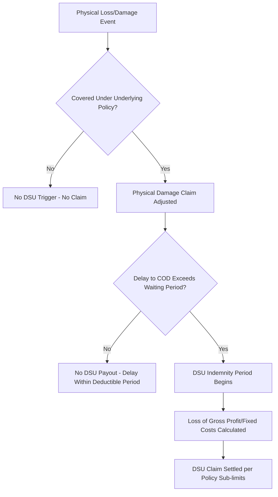

## Delay-in-Start-Up and Business Interruption Coverage

### Overview

**Delay-in-Start-Up (DSU)**, also called **Advance Loss of Profits (ALOP)** in some markets, is a specialized insurance coverage that indemnifies a project owner (or, in some structures, an EPC contractor or lender) for financial loss arising from a **delay to commercial operations** caused by physical loss or damage to insured property during transport, construction, or installation. It is a financial consequential-loss cover layered on top of — and contingent upon — an underlying physical damage claim under a marine cargo, construction all-risks (CAR), or erection all-risks (EAR) policy.

DSU is distinct from operational **Business Interruption (BI)** insurance, which covers loss of profit/revenue after a plant is already operating and subsequently suffers a covered physical loss. DSU applies during the **pre-completion phase** — before the facility has ever generated revenue — and indemnifies the *projected* profit/revenue stream that is delayed, not an established historical one. This is a critical underwriting distinction because there is no operating history to benchmark against; DSU claims are assessed against **projected financial models**, making them inherently more complex and dispute-prone than standard BI claims.

For heavy-lift and specialized logistics, DSU is directly relevant because a single damaged or delayed critical shipment (e.g., a gas turbine, transformer, or reactor vessel) can push back an entire project's commercial operation date (COD) by months, even though the physical repair/replacement cost of the item itself may be relatively small compared to the resulting revenue delay.

---

### Relationship to Underlying Physical Damage Cover

DSU/ALOP does **not** stand alone — cover only attaches following an **indemnifiable physical loss** under the underlying policy (marine cargo, CAR/EAR, or a combined Construction "Wrap-Up" policy). The typical structure:

- **Waiting Period (Time Deductible)**: DSU policies apply a deductible expressed in time (commonly 30–90 days, project-dependent) rather than (or in addition to) a monetary deductible — no DSU indemnity is payable for delay within this initial period.
- **Indemnity Period**: the maximum period for which DSU will pay, typically capped (e.g., 12–24 months), running from expiry of the waiting period until commercial operations commence or the indemnity period cap is reached, whichever is first.

---

### What DSU Covers

- **Loss of anticipated gross profit** (or, per policy definition, standing charges/fixed costs plus loss of projected revenue less variable costs saved) during the delay period attributable to the insured physical damage.
- **Continuing fixed costs** during the delay — debt service/interest during construction (IDC), ongoing lease/land costs, standing project management costs, insurance premiums for extended construction period.
- **Extra expenses** reasonably incurred to reduce the delay (expediting freight, air-freighting a replacement part, overtime labor) — subject to the standard insurance principle that such costs are recoverable only up to the value of loss avoided (i.e., the "least cost" principle mirrored from sue-and-labour).

### What DSU Typically Excludes

- Delay not resulting from an insured physical damage event (e.g., pure schedule slippage, permitting delays, labor disputes, force majeure unrelated to physical loss)
- Delay attributable to **defects in design, plan, or specification** unless specifically bought back
- Delay caused by **late delivery** absent physical loss/damage (a shipment simply arriving late due to congestion, with no damage, is not a DSU trigger — this is a critical distinction from freight/logistics delay penalties under a commercial contract)
- Consequential loss beyond the indemnity period cap
- Currency fluctuation and market price risk unrelated to the physical event

---

### Underwriting Basis and Valuation

Because there is no operating history, DSU sums insured are underwritten against:

- **Financial models/pro formas** submitted by the project sponsor, reviewed by the insurer's forensic accountants and often an independent **loss adjuster/forensic accounting firm** engaged at policy inception to pre-agree methodology.
- **Debt service schedules** (for project-financed developments) — lenders frequently require DSU cover as a condition of financing, since delayed COD directly threatens debt service coverage ratios (DSCR).
- **Standing charges** — the fixed costs that continue to accrue regardless of delay (project financing interest, management fees, lease payments) form the baseline recoverable amount even before projected profit is factored in.

**[Inference]** Insurers typically require the DSU sum insured methodology to be pre-agreed at underwriting stage precisely because post-loss disputes over "what profit would have been earned" are a leading source of DSU claim friction; a pre-agreed formula (often tied to the bankable financial model used for project financing) substantially reduces adjustment disputes.

---

### Heavy-Lift and Specialized Logistics Relevance

DSU exposure is disproportionately concentrated on **critical path items** in project cargo schedules:

- A single damaged gas turbine, generator stator, or pressure vessel — items with long re-manufacture lead times (often 6–18 months) — can trigger DSU exposure far exceeding the physical repair/replacement cost.
- **Contingency and spare strategy** decisions (e.g., whether to pre-position a spare rotor or hold long-lead components in regional warehousing) are frequently driven by DSU risk mitigation economics, not just logistics cost.
- Marine warranty surveyor (MWS) involvement (see related topic) indirectly protects DSU exposure: rigorous pre-transit engineering review reduces the probability of a physical damage event that would trigger the DSU waiting period and indemnity calculation in the first place.
- **Multi-item shipments**: where several long-lead components ship together or sequentially, insurers scrutinize whether damage to one item genuinely delays COD, or whether schedule float/parallel work streams absorb the delay — this "critical path" analysis is central to DSU claim causation disputes.

---

### Claims Complexity Factors

| Factor | Why It Complicates DSU Claims |
| --- | --- |
| No operating history | Loss must be measured against a projected, not historical, profit baseline |
| Critical path causation | Insurer must be satisfied the specific damage genuinely delayed COD (not absorbed by schedule float) |
| Mitigation obligation | Assured must show reasonable steps were taken to expedite repair/replacement (duty akin to sue and labour) |
| Concurrent causes | Delay is often multi-causal (weather, damage, permitting); apportionment between insured and uninsured causes is frequently disputed |
| Currency/market movement | Underlying commodity or power price assumptions in the financial model may be challenged as speculative |

---

### Practical Example

**Scenario:** A heavy-lift shipment carries the sole gas turbine generator for a combined-cycle power plant under construction. During ocean transport, the turbine casing suffers impact damage in heavy weather, requiring return to the manufacturer for a 9-month repair and re-test cycle.

1. **Physical damage claim**: Adjusted under the marine cargo policy (ICC A basis) — repair costs, freight back to manufacturer, freight to site, re-installation costs.
2. **DSU trigger assessment**: Project's critical path schedule confirms the turbine was on the critical path; COD is delayed by 7 months net of the applicable 60-day waiting period.
3. **DSU calculation**: Forensic accountants apply the pre-agreed financial model — projected power sales revenue during the delay period, less variable costs (fuel) that were not incurred because the plant was not operating, plus continuing standing charges (construction loan interest, O&M mobilization costs already committed).
4. **Mitigation credit**: Project expedited a partial-load testing arrangement using a rented interim generation unit for a portion of the delay period; the reduced revenue shortfall during that period lowers the net DSU indemnity, and the rental cost is separately recoverable as a mitigation expense up to the value of loss avoided.
5. **Settlement**: DSU indemnity paid for the net delay period within the policy's indemnity period cap, separate from and in addition to the underlying physical damage settlement.

---

**Related Topics**

- Construction All Risks (CAR) and Erection All Risks (EAR) policy structures
- Marine Cargo Insurance and Institute Cargo Clauses (underlying trigger policy)
- Warranty Surveyor Involvement in Underwriting (loss-prevention linkage)
- Critical Path Method (CPM) Scheduling and Delay Causation Analysis
- Project Finance Lender Insurance Requirements and DSCR Protection
- Spare Parts and Contingency Strategy for Long-Lead Heavy Components
- Forensic Accounting Methodology in Business Interruption Claims