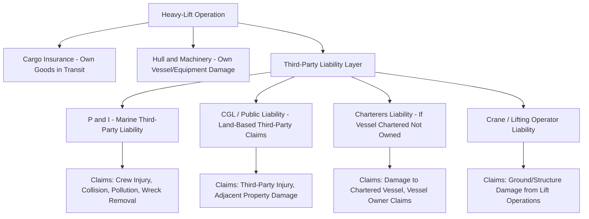

## Third-Party Liability and Property Damage Coverage

### Overview

Third-Party Liability (TPL) and Property Damage coverage indemnifies a heavy-lift or specialized logistics operator against claims made by **parties outside the direct contractual chain** — port authorities, adjacent property owners, other vessel operators, members of the public, or third-party contractors — for bodily injury, death, or physical damage to property caused by the insured's operations. This is legally and structurally distinct from cargo insurance (which protects the goods being transported) and from Hull & Machinery insurance (which protects the transporting vessel/equipment itself). TPL responds to the operator's **legal liability** to others, not to loss of the insured's own property.

In heavy-lift and project cargo work, TPL exposure is elevated relative to standard freight because operations routinely involve heavy cranes working over or adjacent to third-party structures, SPMT (self-propelled modular transporter) movements through public roads and port infrastructure, and marine operations in congested waterways — all of which carry meaningful potential for third-party injury or property damage claims independent of any loss to the cargo itself.

---

### Core Coverage Lines

#### Protection & Indemnity (P&I)

- **P&I insurance**, typically provided through mutual **P&I Clubs** (e.g., the International Group of P&I Clubs member clubs) rather than conventional commercial insurers, covers a vessel operator's third-party liabilities: crew injury/death, cargo liability to third parties, collision liability (the portion not covered under Hull & Machinery's "Running Down Clause"), wreck removal, pollution liability, and stevedore/third-party injury.
- P&I is **mutual, not fixed-premium** in its classic form — members pay calls based on the club's claims experience, though "fixed premium P&I" products exist for smaller or non-standard operators (relevant for specialized heavy-lift barges/tugs that may not fit traditional P&I Club membership criteria).
- For heavy-lift operations using chartered or owned marine assets (barges, tugs, heavy-lift vessels), P&I is typically arranged by the **vessel owner/operator**, with the cargo interest's exposure addressed separately through cargo and general liability placements.

#### Commercial General Liability (CGL) / Public Liability

- Covers third-party bodily injury and property damage arising from the insured's operations on land — crane operations, SPMT transport, load-out yards, warehousing, and site work.
- Typically written with **per-occurrence and aggregate limits**, and may include **Products/Completed Operations** extensions if the operator's work involves installation (e.g., a heavy-lift contractor also performing final positioning/installation of equipment).
- **Contractual liability** extensions are critical in project cargo: most transport and lifting contracts contain indemnification clauses requiring the contractor to hold the client harmless for certain third-party claims, and CGL policies must be reviewed to confirm contractual liability assumed under these clauses is actually insured, not excluded.

#### Marine Third-Party Liability / Charterers' Liability

- Where the heavy-lift operator **charters** rather than owns the transporting vessel, **Charterers' Liability insurance** covers the charterer's liability exposure (damage to the chartered vessel, third-party claims arising from the charterer's use of the vessel) that would otherwise fall on the vessel owner's P&I.
- **Terminal Operators' Liability (TOL)** coverage is relevant where the heavy-lift contractor operates or uses a load-out/quayside facility, covering liability for damage to the terminal infrastructure or third-party cargo at the facility.

#### Crane/Lifting Operator's Liability

- Often written as a specific extension or standalone policy addressing the elevated liability exposure of heavy-lift crane operations — damage to adjacent structures, underground utilities, or third-party property from crane outriggers, ground-bearing pressure failure, or boom/load contact.
- Frequently required to carry specific sub-limits and may mandate **ground-bearing pressure (GBP) calculations** and **lift plan approval** (overlapping with Marine Warranty Surveyor scope where the lift is also marine-insured) as a condition of cover.

---

### Coverage Architecture — How the Layers Interact

---

### Key Legal and Contractual Concepts

#### Knock-for-Knock Liability Allocation

- Standard in offshore and heavy marine contracting: each party agrees to bear liability for **injury to its own personnel and damage to its own property**, regardless of fault, rather than pursuing fault-based claims against the other contracting party.
- Widely used in bareboat charters, towage contracts (e.g., **BIMCO Towcon/Towhire**), and offshore construction contracts to avoid protracted fault litigation and to align with each party's own insurance program.
- **[Inference]** Knock-for-knock allocation is generally considered efficient because it lets each party insure its own risk rather than litigate fault after the fact, but it can leave gaps where a party's own insurance sub-limits are lower than the actual loss, making the underlying insurance adequacy (not just the contractual allocation) the real risk-transfer mechanism.

#### Himalaya Clause

- A contractual clause extending the benefit of liability limitations/exclusions in a bill of lading or transport contract to the carrier's servants, agents, and subcontractors (e.g., stevedores, crane operators engaged by the carrier) — relevant where a third-party subcontractor performing part of a heavy-lift operation seeks to rely on the primary contract's liability limits.

#### Limitation of Liability Conventions

- Maritime liability is frequently capped under international conventions incorporated into national law, notably the **1976 Convention on Limitation of Liability for Maritime Claims (LLMC)** and its 1996 Protocol, which caps a shipowner's aggregate liability by vessel tonnage for claims including property damage — relevant background for structuring TPL limits against the statutory caps that may apply to the marine leg.

---

### Coverage Comparison Table

| Coverage | Protects Against | Typical Arranged By |
| --- | --- | --- |
| P&I | Crew injury, collision liability, pollution, wreck removal, cargo liability to third parties | Vessel owner/operator |
| Charterers' Liability | Damage to chartered vessel, claims by vessel owner | Charterer (if not vessel owner) |
| CGL / Public Liability | Third-party injury/property damage from land operations | Heavy-lift/logistics contractor |
| Crane/Lifting Operator's Liability | Damage to adjacent structures, utilities, third-party property from lifting | Crane/heavy-lift contractor |
| Terminal Operators' Liability | Damage to terminal infrastructure or third-party cargo at facility | Terminal/load-out facility operator |

---

### Practical Example

**Scenario:** A heavy-lift contractor transports a 250-tonne reactor vessel by SPMT through a public port area to a quayside load-out point, then loads it onto a chartered heavy-lift vessel using a mobile crane, for onward ocean transport.

1. **SPMT road movement**: A wheel-set malfunction causes the SPMT to drift, damaging a section of port authority fencing and an adjacent third-party warehouse wall. This is a **CGL/Public Liability** claim — third-party property damage from land-based operations, unrelated to the cargo itself.
2. **Crane load-out**: During lifting, outrigger ground-bearing pressure exceeds the quay's rated capacity (a GBP calculation error), causing localized quay pavement failure. This falls under **Crane/Lifting Operator's Liability**, potentially triggering scrutiny of whether lift plan approval requirements (mirroring MWS-style review) were properly followed.
3. **Ocean transport, chartered vessel**: During the voyage, the heavy-lift vessel (chartered, not owned, by the contractor) is involved in a minor collision with a harbor tug during berthing at destination. Liability here is split: the vessel owner's **P&I** responds to collision liability as the operating owner, while the contractor's **Charterers' Liability** policy responds to the extent the charter party assigns any liability exposure to the charterer.
4. **Contractual allocation**: Under a knock-for-knock clause in the transport contract, the port authority's own property (fencing/pavement) claims are pursued against the contractor's liability program directly, while the vessel-to-vessel collision is resolved between the respective vessel interests' P&I/H&M programs, with the charter party's knock-for-knock terms determining any residual allocation to the charterer.

---

**Related Topics**

- Marine Cargo Insurance and Institute Cargo Clauses (own-cargo risk, distinct from third-party liability)
- Warranty Surveyor Involvement in Underwriting (lift plan and ground-bearing pressure review overlap)
- Hull & Machinery Insurance and the Running Down Clause
- BIMCO Standard Contract Forms (Towcon, Towhire, Heavycon) and Knock-for-Knock Provisions
- 1976 LLMC Convention and Statutory Limitation of Liability
- General Average and York-Antwerp Rules (property damage cost-sharing distinct from TPL)
- Contractual Risk Allocation in EPC and Transport Contracts