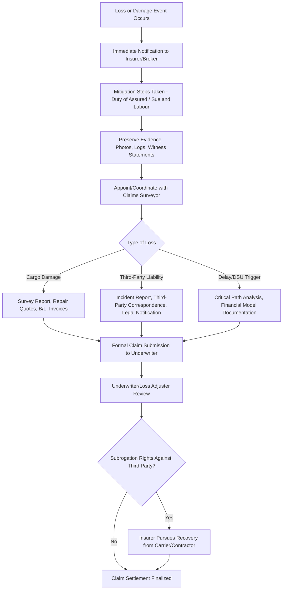

### Overview

Claims Handling and Loss Prevention represent the two operational disciplines that determine the real-world financial outcome of a heavy-lift or specialized logistics insurance program — distinct from the underwriting and policy-wording topics covered elsewhere in this chapter. **Loss prevention** is the set of proactive engineering, procedural, and contractual controls applied *before* and *during* an operation to reduce the probability and severity of loss. **Claims handling** is the reactive, structured process applied *after* a loss occurs to preserve rights, quantify damage, and recover indemnity efficiently. The two are interdependent: weak loss prevention increases claims frequency/severity, while poor claims handling erodes recovery even on otherwise legitimate losses — and insurers increasingly price risk based on demonstrated maturity in both areas, not policy wording alone.

---

### Loss Prevention Framework

#### Pre-Operation Controls

- **Engineering review and lift/transport plan approval** — overlapping directly with Marine Warranty Surveyor scope (see related topic): rigging calculations, sea-fastening design, ground-bearing pressure verification, and route surveys performed before mobilization.
- **Method statements and risk assessments (MSRA)** — documented, task-specific procedures identifying hazards and controls, typically required by both the insurer and the client/EPC contractor as a condition of mobilization.
- **Equipment certification verification** — crane test certificates, sling/shackle SWL documentation, SPMT axle load ratings, and vessel class certificates checked for currency before use, not merely on file.
- **Weather window and seasonal risk planning** — voyage/lift scheduling against historical weather data and forecast routing to avoid known high-risk periods (cyclone seasons, monsoon windows).
- **Survey of packing and securing** — pre-shipment condition surveys (often photographic/video) establishing an evidentiary baseline of cargo condition at origin, critical for rebutting "inherent vice" or "inadequate packing" exclusion arguments later if a claim arises.

#### During-Operation Controls

- **Independent oversight/attendance** — MWS or client-appointed marine superintendent attendance at critical operations (load-out, lift, sea-fastening completion), providing real-time verification against the approved plan.
- **Continuous monitoring** — motion monitoring instrumentation on barges/vessels during heavy-weather transits, load cell monitoring during critical lifts, and GPS/AIS tracking for route compliance.
- **Deviation control procedures** — formal change-management process requiring re-approval when actual conditions or methods diverge from the approved plan (directly protecting the condition-precedent status of MWS-linked cover).

#### Organizational and Contractual Controls

- **Competency assurance** — verified qualifications for riggers, crane operators, towmasters, and lashing supervisors, often audited against recognized industry competency schemes.
- **Contractual risk allocation** — ensuring indemnification, knock-for-knock, and limitation-of-liability clauses in transport/lift contracts align with the actual insurance program in place, avoiding gaps where contractual exposure assumed exceeds insured limits.
- **Lessons-learned feedback loops** — systematic incorporation of near-miss and prior claims data into updated method statements and risk assessments for future operations.

---

### Claims Handling Process

#### Immediate Notification

- Most cargo and liability policies impose a **notification condition** — prompt notice to the insurer/broker upon discovery of loss, often within a specified number of days. Late notification can itself become a coverage dispute point, independent of the merits of the underlying loss.
- Notification should be in writing and should trigger simultaneous notice to any other potentially responsible party (carrier, stevedore, contractor) to preserve time-barred rights under transport conventions (e.g., Hague-Visby notice periods for cargo claims against carriers).

#### Mitigation (Duty of Assured / Sue and Labour)

- The assured has an active **duty to take reasonable measures** to avert or minimize further loss once damage is discovered — failure to mitigate can reduce recoverable indemnity even where the underlying event is fully covered.
- Reasonable mitigation costs are separately recoverable under the Sue and Labour clause, distinct from the main claim settlement (see Marine Cargo Insurance topic).

#### Evidence Preservation

- **Photographic and video documentation** of damage in situ, before any repair or disturbance.
- **Retention of damaged components/packaging** where feasible, pending surveyor inspection.
- **Log and instrumentation data** — motion monitoring records, load cell data, GPS tracks — increasingly central to modern claims, particularly for disputes over whether damage occurred within the insured transit period or resulted from an excluded cause (e.g., inherent vice vs. handling damage).
- **Witness statements** taken promptly from crew, riggers, or site personnel while recollection is fresh.

#### Surveyor Appointment

- A **claims surveyor** (distinct from the pre-loss Marine Warranty Surveyor, though sometimes the same firm) is appointed jointly or by the insurer to assess cause, extent, and reasonable cost of repair/replacement.
- For heavy-lift/project cargo, surveys often require specialized engineering input (structural, mechanical, or metallurgical assessment) beyond a standard marine cargo surveyor's typical scope — particularly for internal damage to rotating machinery, pressure vessels, or electrical equipment where damage may not be visually apparent externally.

#### Documentation Package

Typical claim submission requirements:

- Bill of lading / transport documents
- Commercial invoice and insured value documentation
- Survey report(s)
- Repair or replacement cost quotations
- Correspondence with carriers/subcontractors regarding the incident
- For DSU/liability claims: critical path schedule analysis, financial models, or third-party correspondence as applicable

#### Subrogation

- Upon settling a claim, the insurer acquires **subrogation rights** — the right to pursue recovery from a third party responsible for the loss (a carrier, stevedore, or subcontractor) in the assured's name.
- The assured has a contractual duty to **preserve these rights** — avoiding settlement, waiver, or release of the responsible third party without the insurer's consent, and complying with notice/time-bar requirements under the relevant transport contract or convention.
- **[Inference]** Subrogation recovery is a significant factor in overall claims cost for cargo insurers, which is why policies typically require the assured's active cooperation (providing documentation, supporting litigation/arbitration) even after the assured's own claim has been paid in full.

---

### Common Claims Handling Pitfalls

| Pitfall | Consequence |
| --- | --- |
| Late notification to insurer | Coverage dispute independent of loss merits |
| Disturbing/repairing damage before survey | Loss of evidentiary basis for cause-of-loss determination |
| Settling or releasing a carrier without insurer consent | Breach of subrogation preservation duty; may prejudice recovery |
| Missing carrier notice/time-bar deadlines (e.g., Hague-Visby) | Loss of the insurer's subrogated recovery rights against the carrier |
| Inadequate pre-loss condition documentation | Difficulty rebutting inherent vice/packing exclusion arguments |
| Failure to mitigate | Reduced recoverable indemnity even on a covered loss |

---

### Practical Example

**Scenario:** During ocean transport, a heavy-lift vessel encounters unexpectedly severe weather, and post-voyage inspection at destination reveals denting and coating damage to a 220-tonne pressure vessel that was deck-stowed.

1. **Notification**: Receiving agent notifies the insurance broker within 48 hours of discovery, per policy notification requirements; simultaneous notice is issued to the ocean carrier to preserve time-barred cargo claim rights.
2. **Mitigation**: Temporary protective covering is applied to prevent corrosion progression at the damaged coating area — a Sue and Labour expense, separately recoverable.
3. **Evidence preservation**: Photographs taken immediately upon discharge, motion-monitoring data from the voyage retrieved showing peak accelerations experienced, and the original pre-shipment survey report retrieved for comparison.
4. **Surveyor appointment**: A marine cargo surveyor with structural engineering support is jointly appointed to assess whether the denting is consistent with the recorded motion data (supporting a weather-related insured peril) versus a pre-existing condition.
5. **Claim submission**: Repair quotations (coating rectification, structural assessment, non-destructive testing to confirm no sub-surface damage) submitted alongside the survey report and voyage data.
6. **Subrogation assessment**: Insurer reviews whether the vessel operator's seafastening/stowage decisions contributed to the damage, potentially giving rise to a subrogated recovery claim against the carrier independent of the cargo claim settlement to the assured.

---

**Related Topics**

- Marine Cargo Insurance and Institute Cargo Clauses (Sue and Labour, exclusions relevant to cause-of-loss disputes)
- Warranty Surveyor Involvement in Underwriting (pre-loss controls feeding into claims evidentiary base)
- Delay-in-Start-Up and Business Interruption Coverage (claims documentation requirements specific to DSU)
- Third-Party Liability and Property Damage Coverage (parallel claims process for liability events)
- Hague-Visby Rules and Carrier Notice/Time-Bar Requirements
- General Average Adjustment Process
- Risk Management and HSE Integration in Heavy-Lift Operations