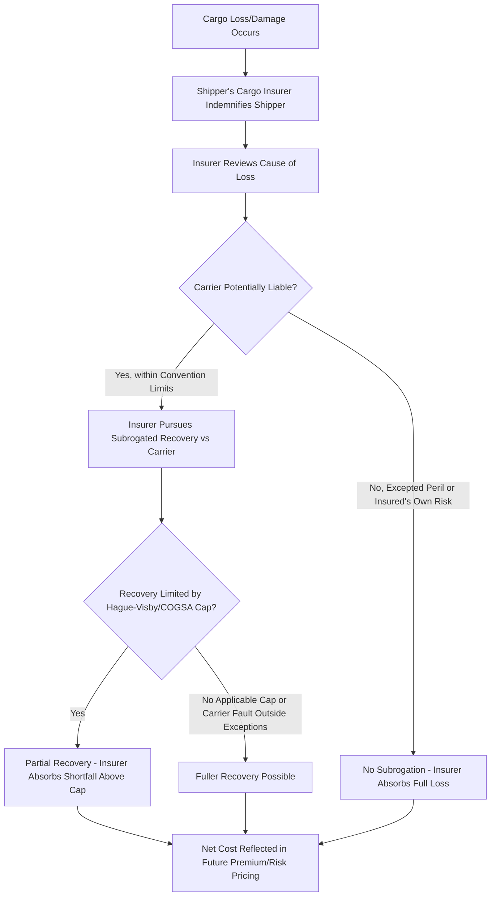

### Overview

Risk allocation in heavy-lift and specialized logistics is the structural framework determining **which party bears the financial consequence of loss, damage, or delay at each point in a shipment's lifecycle**, and through what mechanism (contractual liability, statutory limitation, or insurance transfer) that risk is ultimately funded. Three parties sit at the center of this framework — the **shipper** (cargo owner/consignor), the **carrier** (the party physically transporting the goods, contractually or operationally), and the **insurer** (the risk-transfer mechanism standing behind one or more of the other parties). Understanding how these three interact is foundational to the rest of this chapter, because every other topic — cargo clauses, MWS conditions, DSU, third-party liability, claims handling — operates within the allocation structure established here.

The central tension: carriers generally benefit from **statutory and contractual limitation of liability** (capping their exposure regardless of actual loss value), while shippers bear the **residual risk** above those caps. Insurance exists precisely to bridge this gap — the shipper insures the full value of the cargo rather than relying on the carrier's limited liability as its primary protection.

---

### The Default Liability Position: Carrier Limitation

#### Statutory Frameworks Governing Carrier Liability

- **Hague Rules (1924) / Hague-Visby Rules (1968 Protocol)** — the dominant international framework for ocean carriage under a bill of lading, capping carrier liability per package or per kilogram (whichever is higher under Hague-Visby), unless the shipper declares a higher value and pays additional freight.
- **Hamburg Rules (1978)** — a shipper-favorable alternative regime adopted by a smaller number of jurisdictions, with higher liability limits and a broader carrier fault basis, but with limited global uptake relative to Hague-Visby.
- **Rotterdam Rules (2008)** — a more modern multimodal framework, not yet in force with sufficient ratifications for widespread application, but relevant as an emerging reference point.
- **Carriage of Goods by Sea Act (COGSA)** — the US enactment of Hague Rules principles, with its own specific per-package limitation figures and procedural requirements (including the one-year suit time-bar).
- **CMR Convention** — governs international road carriage in Europe, with its own weight-based liability caps distinct from the maritime regimes, relevant for the inland leg of multimodal heavy-lift moves.

**[Inference]** These per-package/per-kilogram limits are typically far below the actual value of a single heavy-lift unit (a multi-million-dollar transformer or turbine component would vastly exceed a Hague-Visby per-kilogram cap), which is precisely why cargo insurance — not carrier liability — is the primary risk-transfer mechanism the shipper relies upon for heavy-lift cargo, with carrier liability recovery treated as a secondary subrogation target for the insurer after settling the shipper's claim.

#### Carrier Defenses and Exceptions

Under Hague-Visby-style regimes, carriers are typically **exempted from liability** for loss/damage arising from:

- Perils of the sea, act of God, act of war
- Inherent defect/quality/vice of the goods
- Insufficiency of packing
- Latent defects not discoverable by due diligence
- **Nautical fault** — errors in navigation or management of the vessel (a notably carrier-favorable exception under Hague-Visby, though narrowed or removed in some alternative regimes)

This exceptions list closely mirrors the cargo insurance exclusions covered in the Marine Cargo Insurance topic — not coincidentally, since ICC wordings were drafted with awareness of the carrier liability landscape the cargo interest would otherwise be exposed to.

---

### Contractual Risk Allocation Mechanisms

#### Incoterms and Transfer of Risk

- **Incoterms® rules** (published by the ICC, most recently the 2020 edition) define the point at which risk of loss/damage transfers from seller to buyer in a sale contract — critically, this is a **risk transfer point between commercial parties**, distinct from and not determinative of carrier liability under the transport contract.
- For heavy-lift/project cargo, commonly used terms include **FCA, CIP, DAP, and DDP**, with the specific choice affecting who is contractually obligated to arrange (and therefore typically insure) the transport.
- **Critical distinction**: Incoterms determine *who bears risk commercially* (and who must therefore hold insurance), not *who the carrier is liable to* or *how much the carrier's liability is capped at* — these are governed separately by the bill of lading/transport contract and the applicable carriage convention.

#### Bills of Lading and Contracts of Carriage

- The **bill of lading** (or, for non-negotiable arrangements, a sea waybill) is simultaneously a receipt for goods, evidence of the contract of carriage, and (in negotiable form) a document of title — its terms, together with the incorporated convention (Hague-Visby, etc.), define the carrier's liability exposure to the cargo interest.
- **Charter parties** (for chartered heavy-lift vessels) govern the relationship between vessel owner and charterer, often on **BIMCO standard forms** (e.g., Heavycon for heavy-lift/project cargo voyage charters), and may allocate risk differently between owner and charterer than the bill of lading allocates between carrier and shipper — creating potential misalignment that sophisticated project cargo operations must reconcile.

#### Knock-for-Knock and Contractual Indemnities

- As covered in the Third-Party Liability topic, **knock-for-knock** allocation (each party bears its own personnel/property risk regardless of fault) is standard in offshore and heavy marine contracting, shifting the practical risk-bearing burden away from fault-based liability litigation and onto each party's own insurance program.
- **Limitation of liability clauses** in transport/logistics service agreements frequently cap the carrier/contractor's liability at a multiple of the freight charged (rather than the cargo's actual value) — a contractual mirror of the statutory package limitation concept, reinforcing that the shipper's own cargo insurance, not the transport contract, is the primary financial protection for full cargo value.

---

### Insurer's Role: Bridging the Gap

The insurer's subrogation right (covered in the Claims Handling topic) is the mechanism by which the *ultimate* cost of a loss is reallocated back toward the carrier where the carrier was actually at fault and not protected by an exception or below the statutory cap — but because those caps are typically far below heavy-lift cargo values, insurers structurally absorb a significant portion of loss cost themselves, which is reflected in the premium charged to the shipper for cargo cover.

---

### Allocation Summary Table

| Risk Layer | Primary Bearer | Mechanism |
| --- | --- | --- |
| Loss within carrier's statutory/contractual cap, carrier at fault | Carrier (ultimately) | Convention liability (Hague-Visby/COGSA/CMR), recovered via insurer subrogation |
| Loss above carrier's cap | Shipper (via its insurer) | Cargo insurance (ICC A/B/C) absorbs the shortfall |
| Loss from an excepted peril (perils of sea, inherent vice, nautical fault) | Shipper (via its insurer) | Cargo insurance responds; no carrier recovery available |
| Third-party injury/property damage from operations | Operator/contractor | CGL, P&I, Crane Liability (see Third-Party Liability topic) |
| Delay to project COD from insured physical loss | Project owner/sponsor | DSU/ALOP cover (see related topic) |
| Commercial risk of loss per sale contract terms | Buyer or seller per Incoterm | Incoterms® rules determine who must insure |

---

### Practical Example

**Scenario:** A shipper sells a wind turbine nacelle to an overseas buyer under **CIP** Incoterms (Carriage and Insurance Paid To), with ocean transport performed by a carrier under a Hague-Visby bill of lading, and the shipper (obligated to insure under CIP) places cargo cover on ICC (A) terms.

1. **Incoterms allocation**: Under CIP, the seller/shipper is contractually obligated to arrange and pay for both carriage and insurance to the named destination, but **risk transfers to the buyer** once the goods are handed to the first carrier — meaning the insurance policy, though arranged by the seller, is structured to protect the buyer's insurable interest from that point forward.
2. **Carriage contract**: The bill of lading incorporates Hague-Visby, capping the ocean carrier's liability per package/kilogram — far below the nacelle's actual value.
3. **Loss event**: The nacelle suffers water ingress damage during a heavy-weather transit due to inadequate hatch securing by the vessel's crew — arguably a carrier fault (poor stowage/care of cargo) rather than an excepted peril.
4. **Insurance response**: The cargo insurer indemnifies the buyer (as the party with insurable interest at time of loss) in full under ICC (A), without needing to first establish carrier fault.
5. **Subrogation**: The insurer, having paid the claim, pursues subrogated recovery against the ocean carrier — but recovery is capped at the Hague-Visby per-package limit, recovering only a fraction of the total indemnity paid; the insurer absorbs the remainder as a net claims cost.

---

**Related Topics**

- Marine Cargo Insurance and Institute Cargo Clauses (the shipper's primary risk-transfer instrument)
- Third-Party Liability and Property Damage Coverage (operator-side risk allocation)
- Claims Handling and Loss Prevention Practices (subrogation mechanics in practice)
- Incoterms® 2020 Rules and Risk/Cost Transfer Points
- Hague-Visby Rules, COGSA, and CMR Convention Liability Limits
- BIMCO Standard Charter Party Forms for Heavy-Lift/Project Cargo (e.g., Heavycon)
- Bills of Lading, Sea Waybills, and Documents of Title