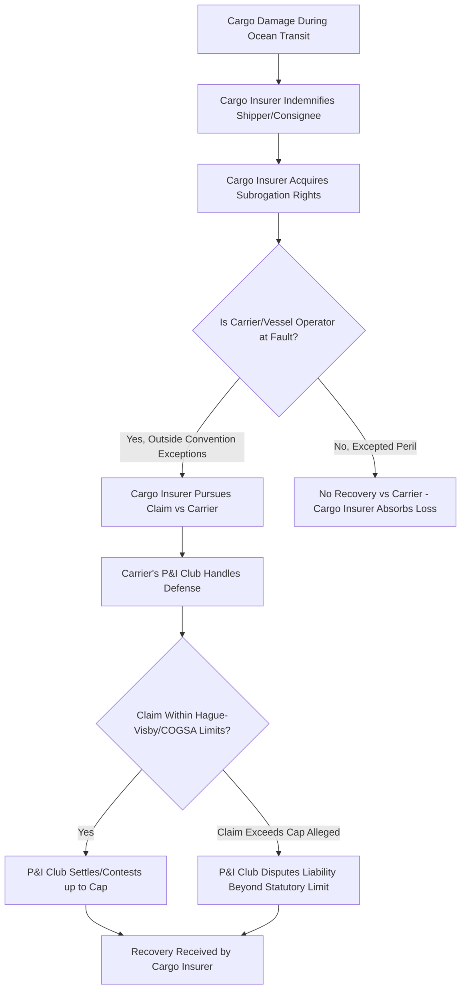

## P&I Club Involvement in Project Cargo Claims

### Overview

**Protection & Indemnity (P&I) Clubs** are mutual, member-owned insurance associations that provide third-party liability cover to shipowners and operators, distinct from the hull/machinery and cargo insurance covered elsewhere in this chapter. In project cargo and heavy-lift operations, P&I involvement becomes relevant whenever a claim implicates the **vessel operator's liability** — as opposed to the cargo owner's own loss, which is addressed under the cargo policy. Understanding when and how a P&I Club engages with a project cargo claim is essential because the club's interests, claims-handling philosophy, and procedural requirements differ materially from a commercial cargo underwriter's.

---

### Structure of the P&I System

- P&I Clubs operate on a **mutual, non-profit basis**: members (shipowners/operators) are also, in effect, the insurers of one another, contributing "calls" (premiums) based on the club's claims experience across the pooled membership, rather than paying a fixed premium to a third-party risk carrier.
- Most large, oceangoing tonnage is insured through clubs belonging to the **International Group of P&I Clubs (IG)**, a collective of clubs that pool claims above certain retention levels and jointly purchase reinsurance for very large claims (the "Pooling Agreement" and "General Excess of Loss" reinsurance program).
- **Fixed-premium P&I** products exist outside the traditional mutual clubs, more commonly used by smaller vessels, barges, and specialized craft — relevant for heavy-lift operations using non-mutual-club-eligible tonnage such as dumb barges or specialized transport craft that may not meet traditional IG club entry criteria.
- P&I cover is arranged and paid for by the **vessel owner or operator**, not the cargo interest — a heavy-lift contractor chartering tonnage typically does not have direct access to the vessel owner's P&I cover except through the separate **Charterers' Liability** product (see Third-Party Liability topic).

---

### What P&I Covers That Is Relevant to Project Cargo

- **Cargo liability to third parties** — where the vessel operator, as carrier, is liable to the cargo owner (or an onward third party such as a consignee or subsequent buyer) for loss or damage to cargo, subject to the applicable carriage convention (Hague-Visby, COGSA) and any exceptions/limitations the carrier is entitled to rely on.
- **Crew injury, illness, and death** — relevant where heavy-lift operations involve elevated risk to riggers, lashing crews, and vessel personnel during complex load-out or sea-fastening work.
- **Collision liability** (the portion not covered under the vessel's Hull & Machinery "Running Down Clause," typically the last quarter of collision liability under the standard four-fourths collision liability apportionment convention in English/London market hull wordings).
- **Wreck removal** — a potentially very large exposure if a heavy-lift or barge casualty results in a sunk or grounded vessel requiring removal, particularly relevant given the specialized, often older or bespoke tonnage used in heavy-lift trades.
- **Pollution liability** — bunker spill or cargo-related pollution from a casualty.
- **General Average contribution shortfalls** — where cargo interests fail to provide GA security, the shipowner (and by extension the P&I Club, which typically handles GA administration on the owner's behalf) bears exposure to the resulting funding gap.
- **Fines and penalties** — customs, immigration, or pollution-related fines arising from the carrying vessel's operations.

---

### P&I vs. Cargo Insurer — Divergent Interests

This is the most operationally important concept in this topic: **the P&I Club and the cargo insurer are not aligned parties** in a claim — they frequently sit on opposite sides of the same incident.

- The **cargo insurer** (having indemnified the shipper) acts as subrogated claimant seeking recovery from the carrier.
- The **P&I Club** (standing behind the vessel operator/carrier) defends the claim, typically asserting every available exception and limitation under the applicable carriage convention to minimize the club's members' exposure.
- This adversarial dynamic means P&I correspondents and surveyors appointed by the club may reach different causation conclusions than the cargo insurer's own surveyor — a common source of dispute in heavy-lift cargo damage claims where causation (e.g., inherent stowage/lashing inadequacy vs. genuine heavy-weather peril) is technically contestable.

---

### Specific Project Cargo Scenarios Triggering P&I Involvement

#### Deck Cargo and "Said to Contain" Disputes

- Heavy-lift and OOG cargo is frequently carried on deck, which under many bills of lading is subject to different (often more limited) liability terms than under-deck cargo, particularly regarding **"unseaworthiness" and unique deck-stowage risk**.
- P&I Clubs scrutinize whether the bill of lading properly disclosed deck stowage (a "deck cargo" clause) — if cargo was stowed on deck without proper disclosure/agreement, the carrier may lose the benefit of package limitation, significantly increasing the club's exposure and prompting more aggressive club involvement in the causation investigation.

#### General Average Security and Project Cargo Value Concentration

- Given the high unit value typical of heavy-lift cargo, a single project cargo shipment can represent a disproportionately large share of a vessel's total GA-contributing value.
- The **P&I Club typically coordinates the GA security process** on behalf of the shipowner (average bonds, guarantees, cash deposits) — for project cargo, the club and the average adjuster will scrutinize the declared value of heavy-lift units closely, since GA contribution is assessed on sound value at the port of discharge.

#### Multi-Party Casualty Involving Chartered Heavy-Lift Tonnage

- Where a heavy-lift vessel is time- or voyage-chartered (common in project cargo, given the specialized and limited global heavy-lift fleet), a casualty can trigger claims across multiple insurance programs simultaneously: the **owner's P&I and H&M**, the **charterer's Charterers' Liability**, the **cargo interests' cargo policies**, and potentially **third-party liability** claims from other affected parties.
- **[Inference]** Coordinating these programs efficiently often falls to the charterer/project cargo contractor's insurance broker, since the P&I Club's primary duty runs to its own member (the vessel owner), not to the charterer or cargo interests, meaning the charterer cannot assume the club will proactively protect the charterer's separate commercial interests in the casualty response.

---

### Correspondents and Claims Handling Process

- P&I Clubs maintain a global network of **correspondents** — local agents (often lawyers, surveyors, or specialized claims firms) who respond on the club's behalf at the port of loss or discharge to investigate, appoint surveyors, and manage local legal/regulatory requirements.
- For a project cargo incident, the club's correspondent will typically:
  - Attend jointly with (or independently of) the cargo insurer's surveyor
  - Review stowage/securing documentation against the approved plan (relevant overlap with MWS-approved lift/lashing plans — see Warranty Surveyor topic)
  - Assess whether the carrier has valid defenses under the applicable convention
  - Coordinate GA security collection if General Average has been declared
- **[Inference]** Because correspondents are appointed by and report to the club (representing the carrier's interest), cargo interests and their insurers should treat correspondent survey findings as one input rather than a neutral, binding assessment — independent survey representation for the cargo side remains standard practice precisely because of this structural divergence in interest.

---

### Practical Example

**Scenario:** A chartered heavy-lift vessel carrying two large process modules on deck encounters severe weather; one module's sea-fastening partially fails, causing structural damage, and the vessel's master declares General Average given emergency measures taken to secure the cargo and preserve the voyage.

1. **Immediate response**: The vessel owner notifies its P&I Club, which dispatches a correspondent to the next port of call; the charterer (heavy-lift contractor) separately notifies its Charterers' Liability insurer and the cargo interests' cargo insurer.
2. **Causation investigation**: The P&I correspondent's surveyor and the cargo insurer's independent surveyor both inspect the damaged sea-fastening — the P&I side examines whether the original securing (performed under the charterer's arrangements, potentially MWS-approved) met an adequate standard, since inadequate securing could expose the carrier to liability beyond package limitation if deck stowage disclosure or seaworthiness issues are implicated.
3. **General Average**: The P&I Club coordinates GA security collection from all cargo interests aboard, including average bonds/guarantees for the high-value process modules, working with the appointed average adjuster.
4. **Divergent findings**: The cargo insurer's surveyor attributes the failure to inadequate sea-fastening design; the P&I correspondent's position emphasizes the exceptional/unforeseeable severity of the weather encountered (a "peril of the sea" defense) — this divergence becomes the substance of subsequent subrogation negotiation or, if unresolved, arbitration/litigation between the cargo insurer and the carrier (defended by the P&I Club).
5. **Charterer's position**: The charterer's Charterers' Liability insurer separately assesses whether the charter party's knock-for-knock or indemnity provisions expose the charterer to any liability toward the vessel owner arising from the incident, independent of the cargo subrogation dispute.

---

**Related Topics**

- Third-Party Liability and Property Damage Coverage (Charterers' Liability distinction from P&I)
- Marine Cargo Insurance and Institute Cargo Clauses (the cargo interest's own recovery mechanism)
- Risk Allocation Between Shipper, Carrier, and Insurer (statutory limitation context)
- Claims Handling and Loss Prevention Practices (subrogation and evidence-preservation overlap)
- General Average and York-Antwerp Rules — Adjustment Process
- International Group of P&I Clubs — Pooling Agreement and Reinsurance Structure
- BIMCO Charter Party Forms and Liability Allocation Between Owner and Charterer