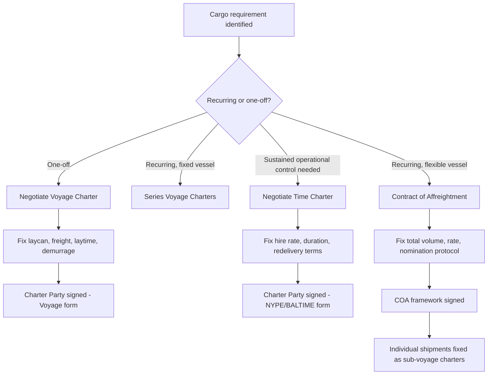

## Voyage Charter, Time Charter, and Contract of Affreightment

### Overview

These three commercial structures represent the primary contractual frameworks under which heavy-lift and specialized cargo owners procure ocean transportation capacity. Each allocates operational control, cost responsibility, and risk differently between the shipowner (or operator) and the charterer. Selecting the correct structure is a foundational commercial decision in heavy-lift logistics because project cargoes — modules, reactors, cranes, yachts, wind turbine components — often require dedicated tonnage, flexible scheduling, and specialized gear, all of which interact directly with how the contract allocates time, cost, and risk.

### Voyage Charter (VC)

**Definition**

A Voyage Charter is a contract to carry a specified cargo (or cargoes) between named ports for a lump-sum or per-unit freight rate. The shipowner retains full operational control of the vessel — crewing, navigation, bunkering, and management — while the charterer's obligation is essentially to supply the agreed cargo and pay freight.

**Key Points**

- **Freight basis**: Lump sum, per freight ton, or per unit (e.g., per piece for heavy-lift units), agreed prior to fixture.
- **Laytime and demurrage**: The charterer is allowed a fixed number of days (laytime) to load and discharge. Exceeding laytime triggers demurrage payments to the owner; finishing early may earn despatch (typically half the demurrage rate).
- **Owner's costs**: Owner bears voyage costs — bunkers, port dues, canal transits — embedded into the freight rate.
- **Single or consecutive voyages**: Can cover one voyage or a series of consecutive voyages under one contract.
- **Common in heavy-lift**: Widely used for one-off or infrequent project shipments where the charterer does not need recurring capacity.

**Typical Clauses**

- NOR (Notice of Readiness) tendering conditions
- Laycan (laydays/cancelling date) window
- Loading/discharging rate warranties (e.g., "SHINC" — Sundays and Holidays Included; "WWD" — Weather Working Days)
- Heavy-lift-specific riders: lashing/securing responsibility, crane/gear specifications, cargo-securing certification requirements

**Example**

A charterer books a semi-submersible heavy-lift vessel for a single voyage to move a 3,000-tonne process module from Ulsan to Batangas. Freight is a lump sum of $1.8 million, laytime is 5 days total (load + discharge) SHINC, demurrage at $25,000/day, despatch at $12,500/day. The vessel owner arranges bunkering, crew, and port agency; the charterer arranges cargo delivery to berth and receiving arrangements at destination.

### Time Charter (TC)

**Definition**

A Time Charter hires the vessel for a defined period (months to years), giving the charterer commercial control over the vessel's employment (which voyages, which cargoes, which ports) while the owner retains technical/nautical management (crewing, maintenance, seaworthiness).

**Key Points**

- **Hire basis**: Daily or monthly hire rate, paid in advance (typically 15- or 30-day increments), regardless of cargo carried.
- **Cost split**: Owner bears capital costs, crew wages, insurance (H&M), and maintenance. Charterer bears voyage costs — bunkers, port charges, canal dues — plus commercial risk of idle time.
- **Off-hire**: Periods when the vessel cannot perform (breakdown, dry-docking, deficiency) suspend hire payments under the off-hire clause.
- **Redelivery**: Vessel returned to owner at contract end in a specified condition (bunkers on board, class status, hull condition) at a redelivery port within an agreed range.
- **Employment control**: Charterer issues voyage instructions ("employment and indemnity" clause); Master remains owner's employee but follows charterer's lawful orders on employment.
- **Heavy-lift application**: Preferred when a project cargo owner or EPC contractor needs sustained access to specialized tonnage (e.g., a heavy-lift ship over a multi-shipment campaign, or a jack-up/DP vessel for an offshore installation program).

**Standard Forms**

- NYPE (New York Produce Exchange) — general dry cargo/heavy-lift time charters
- BALTIME — Baltic and International Maritime Council form
- Project-specific riders addressing crane capacity guarantees, DP-class warranties, or ballasting/trim requirements for float-on/float-off (FLO-FLO) operations

**Example**

An offshore wind developer time-charters a heavy-lift jack-up installation vessel for 9 months at $185,000/day hire to install foundations and turbines across a wind farm. The developer directs the vessel's daily work schedule and site sequencing; the owner supplies a certified crew, maintains the jacking system and crane, and keeps the vessel in class. Bunkers and port costs during the charter period are for the developer's account.

### Contract of Affreightment (COA)

**Definition**

A Contract of Affreightment is a framework agreement to carry a specified total quantity of cargo (or a series of shipments) over a defined period, without designating specific vessels in advance. The carrier commits to lift agreed tonnage across multiple voyages, using vessels of its choosing (subject to agreed specifications), rather than fixing one named ship.

**Key Points**

- **Volume commitment, not vessel commitment**: The obligation is expressed in total tonnage or number of shipments (e.g., "10 shipments of approximately 5,000 tonnes each over 24 months") rather than a single voyage or a named vessel's calendar time.
- **Vessel substitution flexibility**: Carrier nominates vessels meeting agreed technical criteria (deck strength, crane capacity, DP rating) for each shipment; this gives the carrier fleet-scheduling flexibility while giving the charterer supply security.
- **Rate structure**: Often a per-tonne or per-shipment rate, sometimes with escalation clauses tied to bunker indices (BAF) or currency adjustment factors (CAF).
- **Programme cargo fit**: Well suited to recurring heavy-lift/project flows — e.g., a manufacturer repeatedly shipping transformers, wind blades, or modules from one fabrication yard over a multi-year programme.
- **Risk allocation resembles a hybrid**: Each individual shipment under a COA is typically performed as a voyage charter (laytime, demurrage, NOR provisions apply per shipment), while the overarching COA sets the volume, rate, and nomination mechanics.

**Example**

A turbine manufacturer signs a 3-year COA with a heavy-lift operator to move approximately 60 nacelle-and-blade sets annually from a fabrication port to various installation hubs. The operator commits to lifting the agreed annual tonnage using suitable vessels from its fleet or chartered-in tonnage, nominated per shipment; the manufacturer commits to tendering that cargo volume. Each shipment is invoiced and laytime-calculated as an individual voyage under the COA's standard terms.

### Comparative Structure

| Feature | Voyage Charter | Time Charter | Contract of Affreightment |
| --- | --- | --- | --- |
| Commitment unit | Single voyage/cargo | Vessel for a time period | Cargo volume over a period |
| Vessel identified | Yes, specific vessel | Yes, specific vessel | Not necessarily fixed |
| Operational control | Owner | Charterer (commercial), Owner (technical) | Owner/Carrier |
| Cost responsibility | Owner (voyage costs in freight) | Charterer (voyage costs), Owner (vessel costs) | Carrier (per shipment, as voyage charters) |
| Payment basis | Freight (lump sum/per unit) | Hire (daily/monthly) | Per-tonne or per-shipment rate |
| Idle-time risk | Owner | Charterer | Carrier |
| Best fit | One-off project shipments | Sustained access to specialized tonnage | Recurring programme cargo |

### Decision Diagram (svg_diagram)

<svg xmlns="http://www.w3.org/2000/svg" viewBox="0 0 900 480">
\<style\>
.box { fill: #f4f6f8; stroke: #33475b; stroke-width: 1.5; }
.decision { fill: #eaf2fb; stroke: #2c6ba0; stroke-width: 1.5; }
.result { fill: #eafaf0; stroke: #2f9e56; stroke-width: 1.5; }
.txt { font-family: Arial, sans-serif; font-size: 14px; fill: #1a1a1a; }
.lbl { font-family: Arial, sans-serif; font-size: 12px; fill: #444; }
.title { font-family: Arial, sans-serif; font-size: 16px; font-weight: bold; fill: #1a1a1a; }
\</style\>
<text x="450" y="28" text-anchor="middle" class="title">Charter Structure Selection (svg_diagram)</text>
<rect x="370" y="50" width="160" height="50" rx="8" class="decision" />
<text x="450" y="80" text-anchor="middle" class="txt">Recurring cargo</text>
<line x1="420" y1="100" x2="250" y2="160" stroke="#33475b" stroke-width="1.5" />
<text x="290" y="135" class="lbl">No</text>
<line x1="480" y1="100" x2="650" y2="160" stroke="#33475b" stroke-width="1.5" />
<text x="610" y="135" class="lbl">Yes</text>
<rect x="150" y="160" width="200" height="50" rx="8" class="decision" />
<text x="250" y="190" text-anchor="middle" class="txt">Need sustained</text>
<text x="250" y="206" text-anchor="middle" class="txt" dy="-2">vessel control?</text>
<rect x="550" y="160" width="200" height="50" rx="8" class="decision" />
<text x="650" y="190" text-anchor="middle" class="txt">Vessel identity</text>
<text x="650" y="206" text-anchor="middle" class="txt" dy="-2">fixed per shipment?</text>
<line x1="200" y1="210" x2="120" y2="280" stroke="#33475b" stroke-width="1.5" />
<text x="130" y="250" class="lbl">No</text>
<line x1="300" y1="210" x2="380" y2="280" stroke="#33475b" stroke-width="1.5" />
<text x="360" y="250" class="lbl">Yes</text>
<rect x="30" y="280" width="180" height="50" rx="8" class="result" />
<text x="120" y="305" text-anchor="middle" class="txt">Single-voyage need</text>
<text x="120" y="321" text-anchor="middle" class="txt">→ Voyage Charter</text>
<rect x="290" y="280" width="180" height="50" rx="8" class="result" />
<text x="380" y="305" text-anchor="middle" class="txt">Ongoing project ops</text>
<text x="380" y="321" text-anchor="middle" class="txt">→ Time Charter</text>
<line x1="600" y1="210" x2="500" y2="280" stroke="#33475b" stroke-width="1.5" />
<text x="510" y="250" class="lbl">No</text>
<line x1="700" y1="210" x2="780" y2="280" stroke="#33475b" stroke-width="1.5" />
<text x="760" y="250" class="lbl">Yes</text>
<rect x="420" y="280" width="180" height="50" rx="8" class="result" />
<text x="510" y="305" text-anchor="middle" class="txt">Fleet-flexible carrier</text>
<text x="510" y="321" text-anchor="middle" class="txt">→ Contract of Affreightment</text>
<rect x="700" y="280" width="180" height="50" rx="8" class="result" />
<text x="790" y="305" text-anchor="middle" class="txt">Repeated fixed-vessel</text>
<text x="790" y="321" text-anchor="middle" class="txt">→ Series Voyage Charters</text>
</svg>

### Freight Cost Comparison (Illustrative)

$$\text{VC Freight} = F_{lump} + \max(0, (t_{actual} - t_{laytime}) \times R_{demurrage})$$

$$\text{TC Cost} = (R_{hire} \times D_{charter}) + C_{voyage}$$

$$\text{COA Cost} = \sum_{i=1}^{n} (Q_i \times R_{per\text{-}tonne})$$

Where $F_{lump}$ is the lump-sum freight, $t_{actual}$ and $t_{laytime}$ are actual and allowed cargo-handling time, $R_{hire}$ is the daily hire rate, $D_{charter}$ is charter duration in days, $C_{voyage}$ is charterer-borne voyage cost under TC, and $Q_i$ is the cargo quantity of shipment $i$ under a COA.

### Charter Party Workflow

### Risk and Liability Notes

- **[Inference]** In practice, heavy-lift COAs frequently incorporate a "most favored nation" or rate-review clause tied to bunker cost indices, since multi-year programme cargo is exposed to significant fuel price volatility; exact mechanisms vary by contract and are commercially negotiated on a case-by-case basis.
- Under all three structures, cargo-securing responsibility for heavy or out-of-gauge units is typically negotiated as a rider clause specifying whether the owner's crew, the charterer's rigging contractor, or a third-party marine warranty surveyor (MWS) performs and approves lashing calculations — this is a heavy-lift-specific overlay not found in standard bulk/tanker charter forms.
- **[Unverified]** Specific demurrage/despatch ratios (commonly 2:1) are an industry convention rather than a universal legal requirement; actual ratios and rates are subject to individual fixture negotiation.

### Next Steps

- **Laytime, NOR, and Demurrage/Despatch Calculations**
- **Off-Hire Clauses and Speed/Consumption Warranties in Time Charters**
- **Charter Party Riders for Cargo Securing and Lashing Responsibility**
- **Marine Warranty Survey (MWS) Requirements in Charter Agreements**
- **BIMCO Standard Forms: GENCON, HEAVYCON, and Heavy-Lift-Specific Riders**
- **Freight Derivatives and Bunker Adjustment Factors (BAF/CAF) in COAs**
- **Force Majeure and War Risk Clauses in Project Cargo Charters**