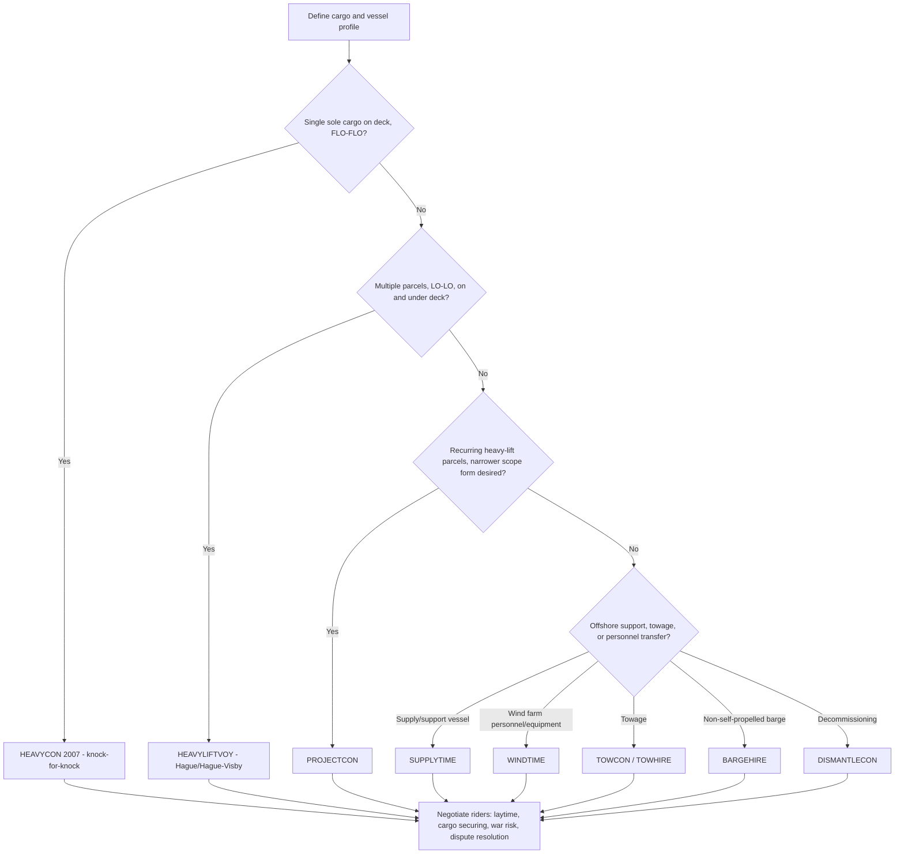

## BIMCO Heavy-Lift Charter Party Forms

### Overview

BIMCO (the Baltic and International Maritime Council) publishes the standard charter party forms that the heavy-lift and project cargo sector treats as its default contractual starting point. Rather than parties drafting bespoke agreements from scratch, they fix on a BIMCO base form and negotiate riders and amendments on top of it. Each form is purpose-built for a distinct vessel type, cargo profile, or liability regime, so form selection is itself a substantive risk-allocation decision rather than a mere administrative choice.

### HEAVYCON 2007

**Key Points**

- **Purpose**: BIMCO's standard voyage charter party for the super-heavy-lift trade, primarily serving semi-submersible vessels performing float-on/float-off (FLO-FLO) operations.
- **Cargo profile**: Almost exclusively single, very large cargo units carried on deck — jack-up rigs, FPSOs, large modules, other vessels — rather than multiple parcel shipments.
- **Liability regime**: A knock-for-knock structure, under which each contracting party bears the responsibility for its own personnel and property without recourse to its counterparty, irrespective of fault. This departs from conventional cargo liability regimes and shifts substantial risk onto the charterer for cargo damage even where the carrier may have been negligent. [Incegdlaw](https://www.incegdlaw.com/en/knowledge-bank/heav-lift-cargoes-contractual-issues)
- **Companion bill of lading**: A standard bill of lading, HEAVYCONBILL, is intended to be used with it. [BIMCO](https://www.bimco.org/contractual-affairs/bimco-contracts/contracts/heavycon-2007/)
- **Lineage**: HEAVYCON – BIMCO's Standard Transportation Contract for Heavy and Voluminous Cargoes – was originally adopted by BIMCO's Documentary Committee at its meeting in Copenhagen in November 1985, and the 2007 revision brought the original form's provisions up to date with current commercial practice. [BIMCO](https://www.bimco.org/contractual-affairs/bimco-contracts/contracts/heavycon-2007/)
- **Scope boundary**: Installation operations are excluded from P&I cover, and risks introduced in installation projects were generally felt to fall outside HEAVYCON's intended scope — a critical drafting distinction for offshore installation work, which is better addressed under offshore-specific forms. [BIMCO](https://www.bimco.org/contractual-affairs/bimco-contracts/contracts/heavycon-2007/)

**Example**

An owner of a semi-submersible heavy-lift vessel fixes a HEAVYCON 2007 charter to transport a single 12,000-tonne jack-up drilling rig from a fabrication yard to an offshore field on a FLO-FLO basis. Because the form is knock-for-knock, the charterer's rig remains at the charterer's risk for damage during the voyage regardless of fault, while the vessel and crew remain at the owner's risk — each side insures its own asset rather than relying on cross-claims.

### HEAVYLIFTVOY

**Key Points**

- **Purpose**: A voyage charter party for the mid-sized heavy-lift sector carrying specialist cargo, intended for lift-on/lift-off vessels rather than semi-submersibles. [BIMCO](https://www.bimco.org/contracts-and-clauses/bimco-contracts/heavyliftvoy)
- **Cargo profile**: Designed for lift-on/lift-off vessels loading parcel cargoes on and under deck, in contrast to HEAVYCON's single sole-cargo, on-deck-only FLO-FLO profile. [Heavyliftpfi](https://www.heavyliftpfi.com/sectors/bimco-adopts-new-specialised-heavy-lift-charter-party-code/3638.article)
- **Liability regime**: HEAVYLIFTVOY operates on the basis of the Hague/Hague-Visby Rules liability regime, which imposes on the carrier an obligation to exercise due diligence to provide a seaworthy vessel and to properly carry, keep and care for the cargo — a materially different risk posture from HEAVYCON's knock-for-knock approach. [Incegdlaw](https://www.incegdlaw.com/en/knowledge-bank/heav-lift-cargoes-contractual-issues)[Incegdlaw](https://www.incegdlaw.com/en/knowledge-bank/heav-lift-cargoes-contractual-issues)
- **Loading/discharging terms**: The form offers a variety of loading and discharging options, providing for free-in or liner in-hook terms for loading and free-out or liner out-hook terms for discharging. [Heavyliftpfi](https://www.heavyliftpfi.com/sectors/bimco-adopts-new-specialised-heavy-lift-charter-party-code/3638.article)
- **Cargo suitability provisions**: Provision is made for the suitability for transportation and proper presentation of the cargo, including lifting and securing devices, and for the timely submission of drawings. [Heavyliftpfi](https://www.heavyliftpfi.com/sectors/bimco-adopts-new-specialised-heavy-lift-charter-party-code/3638.article)
- **Origins**: Originally developed from the BIMCO CONLINEBOOKING Note and intended to create a booking note for the heavy-lift industry, its provisions were ultimately expanded beyond liner terms into a specialist voyage charter rather than a booking note. The HEAVYLIFTVOY form was adopted by BIMCO in early 2007. [Incegdlaw](https://www.incegdlaw.com/en/knowledge-bank/heav-lift-cargoes-contractual-issues)[Incegdlaw](https://www.incegdlaw.com/en/knowledge-bank/heav-lift-cargoes-contractual-issues)
- **Companion bill of lading**: HEAVYLIFTVOYBILL — a bill of lading form incorporating all terms, conditions, liberties, clauses and exceptions of the underlying charter party, including its dispute resolution clause. [Maritimecyprus](https://maritimecyprus.com/wp-content/uploads/2022/06/BIBCO-Sample-copy-HEAVYLIFTVOY.pdf)
- **Standard clause suite**: The contract contains the full suite of BIMCO standard clauses covering issues such as dispute resolution, war risks, ISPS, and trading in ice. [Heavyliftpfi](https://www.heavyliftpfi.com/sectors/bimco-adopts-new-specialised-heavy-lift-charter-party-code/3638.article)
- **Development pedigree**: BIMCO worked with key operators in the trade — including BigLift, Jumbo, SAL Shipping, and Liebherr — with support from specialist brokers Larsen and Partners and the Standard P&I Club in developing the form. [Heavyliftpfi](https://www.heavyliftpfi.com/sectors/bimco-adopts-new-specialised-heavy-lift-charter-party-code/3638.article)

**HEAVYCON vs. HEAVYLIFTVOY — Selection Logic**

| Factor | HEAVYCON 2007 | HEAVYLIFTVOY |
| --- | --- | --- |
| Vessel type | Semi-submersible | Multipurpose lift-on/lift-off |
| Cargo pattern | Single sole cargo, on deck | Multiple parcels, on and under deck |
| Loading method | FLO-FLO (float) | LO-LO (crane/derrick lift) |
| Liability regime | Knock-for-knock | Hague/Hague-Visby Rules |
| Typical cargo | Rigs, other vessels, very large single units | Transformers, generators, modules, project parcels |

### PROJECTCON

**Key Points**

- **Purpose**: A BIMCO contract developed specifically for heavy-lift cargo, sitting alongside SUPPLYTIME and WINDTIME as part of BIMCO's broader push to create more narrowly tailored offshore/project forms rather than relying solely on generalist templates. Perhaps to "break up" the market, BIMCO has released more specifically tailored contracts like WINDTIME for crew transfer vessels, PROJECTCON for heavy-lift cargo, and an updated TOWHIRE 2008. [The Maritime Executive](https://maritime-executive.com/features/supplytime-an-essential-charter-party-instrument)
- **Market position**: Contracts such as PROJECTCON take a back seat to SUPPLYTIME in terms of industry reach and frequency of practical application, meaning it is a narrower, more specialized instrument rather than a market-dominant default. [The Maritime Executive](https://maritime-executive.com/features/supplytime-an-essential-charter-party-instrument)
- **[Unverified]** Detailed clause-by-clause architecture for PROJECTCON was not independently confirmed in the sources reviewed; parties considering this form should obtain the current published text and explanatory notes directly from BIMCO before relying on any summarized clause structure.

### Offshore and Adjacent BIMCO Forms Relevant to Heavy-Lift Projects

Heavy-lift project work frequently interfaces with offshore installation and support operations, where BIMCO maintains a parallel family of forms:

- **SUPPLYTIME**: SUPPLYTIME 2005 is a basic building block of offshore services, used for ships as varied as crew transfer vessels, tugs, and modern offshore service vessels (OSVs), with its versatility being, in a way, a product of its complexity. SUPPLYTIME originated in the mid-1970s. [SUPPLYTIME: An Essential Charter Party Instrument +2](https://maritime-executive.com/features/supplytime-an-essential-charter-party-instrument)
- **WINDTIME**: Issued by BIMCO in 2013 as a standard time charter party form designed for transferring wind farm personnel and equipment to and from offshore wind farm installations, modeled on SUPPLYTIME 2005. Many of the adjustments made for WINDTIME were later incorporated into SUPPLYTIME 2017, and changes such as removing cargo-specific clauses reflect that WINDTIME serves personnel/equipment transfer rather than cargo carriage. Under WINDTIME, owners also agree a liability cap based on a percentage of hire, to balance the increased liability exposure opportunities compared with SUPPLYTIME. [A comparative review of BIMCO's WINDTIME and SUPPLYTIME - The Shipowners' Club +3](https://www.shipownersclub.com/latest-updates/news/comparative-review-bimcos-windtime-and-supplytime/)
- **TOWCON / TOWHIRE**: Standard forms for ocean towage contracts (lump-sum and daily-hire variants respectively), relevant when heavy-lift or project cargo movement is executed by tow rather than self-propelled carriage.
- **BARGEHIRE**: A time charter party for the hire of non-self-propelled barges, frequently used in project logistics for inland or coastal segments of a multimodal heavy-lift move. [Lexology](https://www.lexology.com/library/detail.aspx?g=7782b461-508c-4fb0-9716-fe5e5a9349ff)
- **DISMANTLECON**: A newer contract developed for decommissioning projects, relevant where heavy-lift capacity is procured to remove rather than install offshore structures. [Amnautical](https://www.amnautical.com/products/offshore-heavylift-and-project-cargo-contracts-2020-edition)
- **ASVTIME**: A time charter party for accommodation support vessels, introduced as part of BIMCO's continuing expansion of offshore-sector forms. [Lexology](https://www.lexology.com/library/detail.aspx?g=7782b461-508c-4fb0-9716-fe5e5a9349ff)
- **NYPE / BARECON**: General-purpose time charter and bareboat charter forms respectively, sometimes adapted with heavy-lift riders when a dedicated heavy-lift time-charter form is not used.

**[Inference]** Because HEAVYCON explicitly excludes installation operations from its intended scope, project teams combining a heavy-lift transport leg with an offshore installation scope typically need to pair a transport-focused form (HEAVYCON or HEAVYLIFTVOY) with a separate installation or offshore-services form (e.g., an adapted SUPPLYTIME or a bespoke installation contract), rather than expecting one form to cover both phases; the precise combination is negotiated per project.

### Form Selection Logic

### Practical Drafting Notes

- **Forms are frameworks, not complete contracts**: The forms are not the entire contract; charterer and owner negotiate riders and amendments on top of the base form. The form is the framework. [WCM Worldwide](https://wcmchs.com/blogs/when-to-charter-a-vessel-heavy-lift-decisions)
- **Form choice drives downstream risk allocation**: Understanding which charter form applies to a given move is the first decision in the process, because it dictates how risk, liability, and operational control are allocated between the parties for everything that follows. [WCM Worldwide](https://wcmchs.com/blogs/when-to-charter-a-vessel-heavy-lift-decisions)
- **Recommended riders regardless of base form**: Riders commonly negotiated on top of the base form cover laytime, demurrage, off-hire conditions, cancellation rights, deviation, sub-charter rights, and war and piracy risk, along with any cargo-specific exclusions relevant to the particular unit being transported. [WCM Worldwide](https://wcmchs.com/blogs/when-to-charter-a-vessel-heavy-lift-decisions)
- **Vessel and route acceptance checks**: Confirming vessel acceptance at load and discharge ports — air draft restrictions, berth length, crane availability if shore lifts are required, terminal handling tariffs, and escort and pilot arrangements — is a necessary complement to form selection, since the charter party alone does not guarantee physical feasibility at the ports named. [WCM Worldwide](https://wcmchs.com/blogs/when-to-charter-a-vessel-heavy-lift-decisions)
- **Specialist advice**: Charter party drafting is a specialized legal discipline, and engaging brokers and counsel experienced in the relevant form materially reduces dispute exposure. [WCM Worldwide](https://wcmchs.com/blogs/when-to-charter-a-vessel-heavy-lift-decisions)
- **[Unverified]** Exact current edition years, clause numbering, and whether any of these forms have been revised since the sources reviewed here were published should be confirmed against BIMCO's live contract library (bimco.org) before use in an actual fixture, as standard forms are periodically updated.

### Related Topics

- **HEAVYCON 2007 Knock-for-Knock Clause Mechanics and Insurance Implications**
- **Hague/Hague-Visby Rules Cargo Liability Regime in Practice**
- **HEAVYLIFTVOYBILL and HEAVYCONBILL: Bill of Lading Interaction with Charter Parties**
- **SUPPLYTIME vs. WINDTIME: Comparative Clause Analysis for Offshore Support**
- **Marine Warranty Survey (MWS) Requirements Across BIMCO Heavy-Lift Forms**
- **Free-In/Free-Out vs. Liner In-Hook/Out-Hook Loading Terms**
- **Dispute Resolution and Arbitration Clauses in BIMCO Standard Forms**