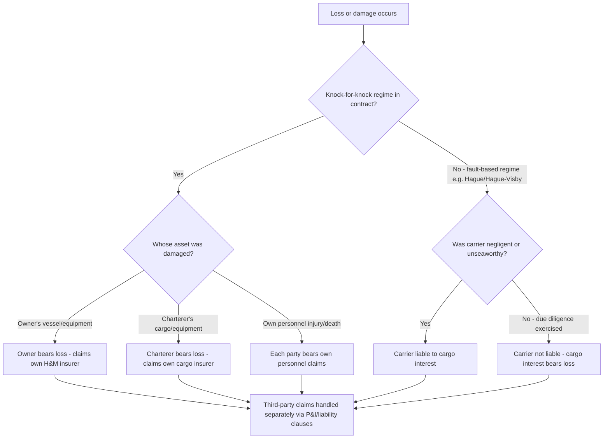

## Knock-for-Knock Liability Regimes

### Overview

A knock-for-knock liability regime is a contractual risk-allocation mechanism under which each party to a contract agrees to bear responsibility for damage to its own personnel, property, and equipment, regardless of fault or negligence — without recourse to the other party. Rather than establishing which party caused a loss and assigning liability accordingly (as under a fault-based regime like the Hague/Hague-Visby Rules), knock-for-knock draws a line based on ownership: each side insures and absorbs its own losses. This structure is foundational to offshore, marine, and heavy-lift contracting, most prominently embedded in BIMCO's HEAVYCON 2007 form and widely used across offshore energy contracts (drilling, well services, SUPPLYTIME-family agreements).

### Core Mechanics

**Key Points**

- **Definition**: Under a knock-for-knock contract, each contracting party bears the responsibility for its own personnel and property without recourse to its counterparty, irrespective of fault.
- **No-fault basis**: Liability allocation does not depend on proving negligence. Even if Party A's negligence causes damage to Party B's property, Party B bears that loss under its own insurance — it cannot claim against Party A for it.
- **Mutual indemnity structure**: Each party typically indemnifies the other against claims arising from damage to its own (the indemnifying party's) people or property, effectively creating reciprocal "walls" around each side's own risk pool.
- **Categories typically split**:
  - **Personnel**: Each party is responsible for injury or death of its own employees and subcontractors' employees.
  - **Property/equipment**: Each party is responsible for damage to its own equipment, vessel, or cargo (depending on contract).
  - **Consequential loss**: Often mutually excluded — each party waives claims against the other for its own consequential/economic losses (loss of use, loss of production, loss of hire).
- **Third-party and pollution risk carve-outs**: Knock-for-knock typically does not extend to third-party claims or certain pollution liabilities, which are usually addressed by separate clauses (e.g., owners are generally liable for pollution damage caused by discharge, spills, or leaks from the vessel, except as may emanate from cargo).

### Why Knock-for-Knock Exists

**Key Points**

- **Commercial predictability**: Because fault-finding in complex multi-party offshore and heavy-lift operations (multiple contractors, subcontractors, vessel crews, cargo interests) is often slow, expensive, and uncertain, knock-for-knock avoids protracted litigation over causation by fixing risk allocation in advance.
- **Insurability**: Each party insures its own known asset base (its own vessel, its own personnel, its own cargo) rather than attempting to underwrite open-ended liability for a counterparty's assets — this aligns risk-bearing with the party best positioned to know and insure that asset.
- **Enables high-risk, high-value operations**: Heavy-lift and offshore work involves extremely high-value assets operating in close proximity (e.g., a semi-submersible vessel and a jack-up rig during a FLO-FLO load). Without knock-for-knock, the potential cross-liability exposure could make such operations commercially unworkable or uninsurable at reasonable premiums.
- **Speed of claims resolution**: Because there is no need to establish fault before a party can look to its own insurer, claims resolve faster, reducing the working-capital and operational drag of a protracted dispute.

### Application in HEAVYCON 2007

**Key Points**

- The HEAVYCON voyage charter party is a "knock for knock" contract designed primarily for semi-submersible vessels serving the super-heavy-lift market, where cargoes are almost exclusively carried on deck and are, in most cases, sole cargoes.
- Under a knock-for-knock contract in this context, each contracting party bears the responsibility for its own personnel and property without recourse to its counterparty, irrespective of fault — meaning the charterer's rig or module remains at the charterer's own risk for the voyage, and the vessel and crew remain at the owner's own risk, even where damage might otherwise be attributable to the other side's negligence.
- This is explicitly contrasted with the mid-sized heavy-lift sector: in that sector, cargo is often regarded as conventional cargo where the Hague/Hague-Visby liability regime appropriately applies, whereas HEAVYCON is based on a knock-for-knock regime, which is why BIMCO developed HEAVYLIFTVOY as a separate form operating on Hague/Hague-Visby principles instead.

### Knock-for-Knock vs. Hague/Hague-Visby: Comparative Risk Allocation

| Factor | Knock-for-Knock (e.g., HEAVYCON) | Hague/Hague-Visby (e.g., HEAVYLIFTVOY) |
| --- | --- | --- |
| Basis of liability | Ownership of asset, not fault | Fault / due diligence standard |
| Carrier's cargo duty | No general duty to indemnify charterer for cargo damage | Duty to exercise due diligence for seaworthiness and proper cargo care |
| Claims speed | Faster — no fault-finding required | Slower — often requires establishing breach of due diligence |
| Insurance structure | Each party insures its own asset (H&M, cargo insurance separately) | Carrier's liability insurance responds to proven cargo claims |
| Typical cargo/vessel fit | Single high-value unit, semi-submersible FLO-FLO | Multiple parcel cargoes, LO-LO multipurpose vessel |
| Negligence relevance | Largely irrelevant to recovery | Central to recovery |

### Worked Example

A semi-submersible vessel is loaded with a single 8,000-tonne floating production unit under a HEAVYCON 2007 charter. During ballasting operations, a crew error causes the unit to shift and sustain hull damage. Under a knock-for-knock regime:

- The charterer cannot claim against the owner for the damage to its production unit, even though the damage arguably resulted from the owner's crew's error, because the charterer's property is the charterer's own risk under the contract.
- The charterer instead recovers (if at all) from its own cargo/hull insurance for the production unit.
- Separately, if the vessel itself is damaged during the same incident (e.g., deck structure), the owner bears that loss under its own hull and machinery (H&M) insurance, with no claim against the charterer.
- Each party's P&I or liability insurer may still be engaged for third-party claims (e.g., a stevedore injured in the incident), since knock-for-knock as between owner and charterer does not automatically resolve third-party liability.

Compare this with the same incident occurring under a HEAVYLIFTVOY (Hague/Hague-Visby) charter: the charterer could potentially pursue a cargo damage claim against the carrier if it can show the carrier failed to exercise due diligence (e.g., in vessel operation or ballasting procedure), because fault is directly relevant to recovery under that regime.

### Risk Allocation Flow

### Drafting and Negotiation Considerations

**Key Points**

- **Mutual hold-harmless/indemnity clause**: The core operative language is typically a mutual indemnity — each party agrees to indemnify, defend, and hold harmless the other against claims arising from its own personnel or property, irrespective of the indemnifying party's negligence, including sole or concurrent negligence in some drafting variants. Parties should scrutinize whether the indemnity extends to gross negligence or willful misconduct, as some jurisdictions or negotiated forms carve these out.
- **Consequential loss waivers**: Typically paired with knock-for-knock is a mutual waiver of consequential loss (loss of use, loss of production, loss of hire, loss of contract) — parties should confirm the definition of "consequential loss" used, since this term is interpreted differently across jurisdictions (e.g., under English law, certain "normal" losses flowing directly from a breach may not be classed as consequential and could fall outside the waiver).
- **Interaction with insurance placement**: Because knock-for-knock relies on each party insuring its own risk, charter parties commonly include an obligation to maintain specified insurance (H&M, P&I, cargo, liability) and to procure waivers of subrogation from insurers, preventing an insurer from stepping into its insured's shoes to pursue a claim the insured itself waived under the knock-for-knock clause.
- **Enforceability considerations**: **[Inference]** Enforceability of broad knock-for-knock indemnities (particularly where they purport to cover a party's own negligence) can be subject to jurisdiction-specific statutory or common-law limits — some jurisdictions restrict or invalidate indemnities against a party's own negligence unless drafted with sufficient clarity; this varies significantly by governing law and is a matter for legal counsel review on each fixture rather than a fixed universal rule.
- **Scope boundaries**: Parties should confirm what falls outside the knock-for-knock wall — commonly third-party claims, certain pollution liabilities, and, in some forms, installation-phase risks are explicitly excluded from the regime and addressed by separate clauses (as seen in HEAVYCON's express exclusion of installation operations from its intended scope).

### Related Topics

- **HEAVYCON 2007 vs. HEAVYLIFTVOY: Full Clause-by-Clause Liability Comparison**
- **Hague/Hague-Visby Rules: Carrier Due Diligence and Seaworthiness Obligations**
- **Mutual Indemnity Drafting and Gross Negligence Carve-Outs**
- **Waiver of Subrogation Clauses in Marine Insurance Placement**
- **Consequential Loss Definitions Across Governing Law Jurisdictions**
- **P&I Club Cover and Third-Party Liability Outside Knock-for-Knock Walls**
- **Pollution Liability Allocation in Heavy-Lift and Offshore Charters**