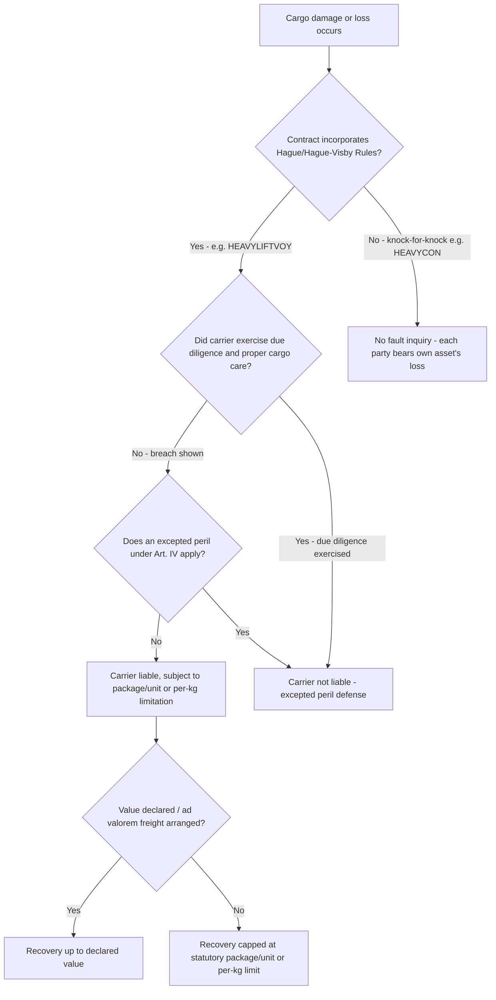

## Hague and Hague-Visby Rules Application

### Overview

The Hague Rules and their amended successor, the Hague-Visby Rules, are the foundational international conventions governing carrier liability for loss of or damage to cargo carried under a bill of lading. In heavy-lift and specialized logistics, these rules matter because they define the default fault-based liability standard that applies whenever a charter party or bill of lading incorporates them — most notably under BIMCO's HEAVYLIFTVOY form — in direct contrast to the knock-for-knock regime used in HEAVYCON. Understanding where and how these rules bite is essential to correctly pricing risk, arranging insurance, and negotiating exclusions in project cargo contracts.

### Historical Development

**Key Points**

- **Hague Rules (1924)**: Originated from the International Convention for the Unification of Certain Rules of Law relating to Bills of Lading, signed in Brussels in 1924. They were developed to standardize and limit carrier liability internationally after a period in which carriers used broad exemption clauses in bills of lading to escape almost all liability for cargo loss or damage.
- **Hague-Visby Rules (1968/1979)**: Amended the original Hague Rules via the Visby Protocol (1968) and a further SDR (Special Drawing Rights) Protocol (1979), primarily updating the package/unit limitation of liability and clarifying certain procedural and scope provisions.
- **Hamburg Rules and Rotterdam Rules**: Later conventions (Hamburg Rules 1978, Rotterdam Rules 2008) attempted further reform and expanded carrier liability, but achieved far less international uptake; the Hague-Visby Rules remain the dominant regime incorporated into commercial contracts and national legislation in most major maritime jurisdictions.

### Core Liability Framework

**Key Points**

- **Due diligence obligation (Article III)**: The carrier must exercise due diligence to make the ship seaworthy before and at the beginning of the voyage, properly man, equip, and supply the ship, and make the holds and other parts of the ship in which goods are carried fit and safe for their reception, carriage, and preservation.
- **Proper care of cargo**: The carrier must properly and carefully load, handle, stow, carry, keep, care for, and discharge the goods carried.
- **Fault-based recovery**: Unlike knock-for-knock, a cargo claimant must generally show that damage or loss resulted from the carrier's failure to meet these due diligence and cargo-care obligations. If the carrier can show it exercised due diligence and that the loss falls within an excepted peril, liability may be avoided.
- **Excepted perils (Article IV)**: The Rules provide a list of circumstances for which the carrier is not liable, including perils of the sea, act of God, act of war, act of public enemies, inherent defect/quality/vice of the goods, insufficiency of packing, and — notably — the "nautical fault" exception covering negligence in the navigation or management of the ship (as opposed to negligence in the care of cargo, which remains actionable).
- **Package/unit limitation of liability**: The carrier's liability is capped per package or unit (or per kilogram, whichever calculation is more favorable to the cargo claimant under Hague-Visby's dual limitation), unless the nature and value of the goods have been declared by the shipper before shipment and inserted in the bill of lading.
- **Time bar**: Claims against the carrier are generally time-barred one year after delivery of the goods (or the date they should have been delivered), unless suit is brought within that period.

### Application to Heavy-Lift Charters: HEAVYLIFTVOY

**Key Points**

- HEAVYLIFTVOY operates on the basis of the Hague/Hague-Visby Rules liability regime and is designed for multiple shipments both above and below deck, in the mid-sized lift-on/lift-off heavy-lift sector.
- This is a deliberate contrast to HEAVYCON: in the mid-sized sector, cargo is often regarded as conventional cargo where the Hague/Hague-Visby liability regime appropriately applies, whereas HEAVYCON is based on a knock-for-knock regime — the difference in cargo profile (multiple parcels vs. a single super-heavy unit) drove BIMCO to develop a separate form with a different liability foundation.
- Under the Hague/Hague-Visby Rules impose on the carrier an obligation to exercise due diligence to provide a seaworthy vessel and to properly carry, keep and care for the cargo — meaning a charterer shipping project cargo under HEAVYLIFTVOY retains a real prospect of recovery against the carrier where cargo damage results from a breach of that due diligence obligation, unlike under HEAVYCON's knock-for-knock wall.
- **Package limitation and heavy-lift units**: **[Inference]** Because heavy-lift units are typically shipped as one very large "package" or "unit" (e.g., a single transformer or module), the per-package limitation calculation under Hague-Visby can produce a liability cap that is grossly inadequate relative to the actual value of the unit; this is a well-recognized commercial concern in the sector, which is why charterers routinely negotiate ad valorem freight arrangements (declaring cargo value and paying an enhanced freight rate) to secure a higher liability cap, or arrange full cargo insurance independent of any carrier liability recovery. Specific negotiated outcomes vary by fixture.

### Hague-Visby vs. Knock-for-Knock: Where the Line Falls

| Factor | Hague/Hague-Visby (HEAVYLIFTVOY) | Knock-for-Knock (HEAVYCON) |
| --- | --- | --- |
| Trigger for carrier liability | Breach of due diligence / improper cargo care | Not applicable — no-fault, ownership-based |
| Carrier's key defenses | Due diligence exercised; excepted perils (Art. IV) | Not fault-dependent; defense is simply "not my asset" |
| Liability cap | Per-package/unit or per-kg SDR limitation | No equivalent cap mechanism — each side self-insures fully |
| Cargo claimant's burden | Must show carrier fault/breach | No claim against carrier for own cargo damage |
| Suitable cargo/vessel profile | Multiple parcels, LO-LO, on/under deck | Single super-heavy unit, FLO-FLO, on deck |
| Nautical fault exception | Applies (navigation/management of ship excepted) | Not relevant — no fault inquiry at all |

### Worked Example

A heavy-lift operator carries a 400-tonne transformer as one of several parcel shipments aboard a multipurpose vessel under a HEAVYLIFTVOY charter incorporating Hague-Visby terms. During discharge, the transformer's bushings are damaged when a crane wire parts due to inadequate wire inspection.

- The charterer/cargo interest can pursue a claim against the carrier on the basis that the carrier failed to properly and carefully handle and discharge the goods — a breach of the Article III cargo-care obligation.
- The carrier's potential defense would require showing either that it exercised due diligence throughout (e.g., the wire failure was a latent defect not discoverable by reasonable inspection) or that the loss falls within an excepted peril under Article IV.
- If liability is established, recovery is subject to the per-package/unit or per-kilogram limitation unless the transformer's value was declared and inserted in the bill of lading, or ad valorem freight was arranged — meaning the charterer's actual recovery could be capped well below the transformer's real value absent such a declaration.
- Compare this to the same wire-failure incident occurring under a HEAVYCON (knock-for-knock) charter carrying a single large unit: the charterer would have no claim against the carrier for the cargo damage at all, regardless of the cause, and would rely entirely on its own cargo insurance.

### Application Decision Flow

### Practical Drafting and Risk Management Notes

**Key Points**

- **Confirm which regime is actually incorporated**: Charter parties and bills of lading may incorporate the Hague Rules, the Hague-Visby Rules, or a national statutory variant (e.g., COGSA in the United States, which is based on the Hague Rules with some modifications) — parties should confirm the specific regime and any paramount clause language, since the differences (particularly limitation amounts and scope) are commercially material.
- **Ad valorem declarations**: For high-value heavy-lift units, declaring cargo value on the bill of lading and paying enhanced freight is a standard mechanism to avoid being capped at the default per-package/unit limitation.
- **Cargo insurance remains essential regardless of regime**: **[Inference]** Because both knock-for-knock and Hague-Visby regimes leave meaningful gaps in a charterer's ability to fully recover cargo value (no carrier recourse at all under knock-for-knock; capped recovery absent declared value under Hague-Visby), cargo interests in the heavy-lift sector typically maintain independent cargo insurance (marine cargo policies, sometimes with installation floater extensions) as the primary loss-recovery mechanism rather than relying on charter party liability provisions alone. Specific insurance arrangements are negotiated per shipment and per client risk appetite.
- **Deck cargo considerations**: Historically, the Hague/Hague-Visby Rules applied by default only to cargo carried under deck for "goods" as defined, with deck cargo often excluded unless the bill of lading expressly states the goods are stated to be carried on deck and are so carried — a point of particular relevance to heavy-lift shipments, which are frequently carried on deck. Parties should confirm whether the specific charter party or bill of lading extends Hague-Visby coverage to on-deck cargo or addresses it separately.
- **Nautical fault exception scope**: The distinction between "negligence in navigation or management of the ship" (excepted) and "negligence in the care of cargo" (not excepted) has generated significant case law; heavy-lift cargo claims involving crane, lashing, or stowage failures are more likely to fall on the cargo-care side of this line rather than the excepted nautical-fault side, but this is fact-specific and should be assessed by counsel on the particular incident.

### Related Topics

- **BIMCO Heavy-Lift Charter Party Forms: HEAVYCON, HEAVYLIFTVOY, PROJECTCON**
- **Knock-for-Knock Liability Regimes**
- **Ad Valorem Freight and Declared Cargo Value Mechanisms**
- **Deck Cargo Liability and On-Deck Carriage Clauses**
- **Package/Unit Limitation Calculations Under Hague-Visby (SDR Conversion)**
- **Marine Cargo Insurance and Installation Floater Policies for Heavy-Lift**
- **Hamburg Rules and Rotterdam Rules: Comparative Carrier Liability Regimes**