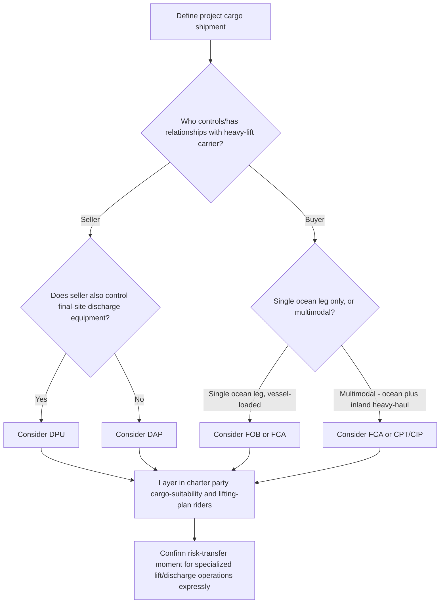

## Incoterms Selection for Project Cargo Shipments

### Overview

Incoterms (International Commercial Terms), published by the International Chamber of Commerce (ICC), define the point at which risk, cost, and delivery obligations transfer between seller and buyer in a sale of goods contract. For project cargo and heavy-lift shipments, Incoterms selection carries outsized commercial consequences compared to general cargo: the units involved are high-value, often require specialized loading/discharge equipment, and typically move through multiple modes (ocean, barge, heavy-haul road, rail) before reaching a final installation site. Choosing the wrong term can leave one party bearing costs or risks it never priced into its contract — particularly around who arranges and pays for the ocean/heavy-lift transport leg, who is responsible for cargo readiness and lifting gear, and where risk transfers relative to loading operations.

### The Incoterms 2020 Framework

**Key Points**

- **Two rule groups**: Incoterms 2020 organizes eleven terms into rules for any mode of transport (EXW, FCA, CPT, CIP, DAP, DPU, DDP) and rules for sea and inland waterway transport only (FAS, FOB, CFR, CIF).
- **Three variables each term fixes**: (1) the point of delivery/risk transfer, (2) which party arranges and pays for carriage, and (3) which party is responsible for export/import clearance and associated costs.
- **Not a complete contract**: Incoterms govern only the seller-buyer delivery relationship; they do not address payment terms, title transfer, or the substantive terms of the carriage contract itself — a separate charter party (voyage charter, time charter) governs the actual transport relationship between the cargo interest and the carrier.

### Terms Most Relevant to Project Cargo

**Key Points**

- **EXW (Ex Works)**: Seller's minimum obligation — makes goods available at its premises; buyer arranges and bears all cost/risk from that point, including loading. For heavy-lift units, EXW places significant risk on the buyer at the earliest and often least-controlled point (the manufacturer's yard), including the complex task of arranging specialized loading equipment the seller may be best positioned to provide.
- **FCA (Free Carrier)**: Seller delivers goods to a carrier or another party nominated by the buyer at a named place, with risk transferring at that point. FCA is frequently favored for project cargo because it allows the delivery point to be defined precisely (e.g., "on truck at seller's factory" or "at the heavy-lift vessel's rail") and avoids the ambiguity of on-board delivery terms.
- **FOB (Free On Board)**: Seller delivers when goods are placed on board the vessel; risk transfers at that point. FOB is a sea/inland-waterway-only term and is often used for project cargo, but the ICC and industry commentary have long noted FOB is frequently misapplied to non-vessel or containerized shipments where FCA would be more appropriate; for genuine break-bulk/heavy-lift loading onto a nominated vessel, FOB remains commonly used.
- **CFR (Cost and Freight) / CIF (Cost, Insurance and Freight)**: Seller arranges and pays for carriage (and, under CIF, minimum insurance) to the named port of destination, but risk transfers to the buyer once goods are on board at the port of shipment — creating a split between where risk transfers (origin) and where the seller's cost obligation ends (destination). This split is a frequent source of disputes on project cargo when damage occurs mid-voyage and the buyer discovers it bore the risk despite the seller having arranged the shipment.
- **CPT (Carriage Paid To) / CIP (Carriage and Insurance Paid To)**: The any-mode equivalents of CFR/CIF — seller arranges and pays carriage (and, under CIP, insurance to a higher minimum level than CIF under Incoterms 2020) to a named destination, with risk transferring when goods are handed to the first carrier. Useful for multimodal project cargo movements combining ocean and inland heavy-haul legs.
- **DAP (Delivered at Place)**: Seller bears cost and risk until goods arrive ready for unloading at the named destination; buyer handles unloading and import clearance. For project cargo delivered to a job site, DAP shifts substantial responsibility onto the seller for the entire heavy-lift voyage and delivery, which may suit buyers (EPC contractors) wanting cost/risk certainty but requires the seller to have strong control over the chosen carrier and heavy-lift logistics provider.
- **DPU (Delivered at Place Unloaded)**: Like DAP, but the seller is also responsible for unloading at the named destination — the only Incoterm requiring the seller to unload. This is particularly significant for heavy-lift cargo, since "unloading" a multi-hundred-tonne module may require specialized cranes, SPMTs (self-propelled modular transporters), or FLO-FLO discharge, meaning the seller effectively takes on discharge-method risk and cost.
- **DDP (Delivered Duty Paid)**: Seller's maximum obligation — delivers goods cleared for import, ready for unloading, at the named destination, bearing all costs and risks including import duties and taxes. Rarely used for project cargo, since sellers are often unwilling to take on unfamiliar import compliance risk in the buyer's jurisdiction, particularly for the specialized customs/HS classifications applicable to large industrial equipment.

### Why Standard Incoterms Fall Short for Heavy-Lift Cargo

**Key Points**

- **Loading/discharge method ambiguity**: Most Incoterms assume relatively conventional loading (containerized or standard break-bulk). Heavy-lift cargo often requires FLO-FLO ballasting, SPMT roll-on, or heavy crane lifts — the standard terms do not explicitly address who arranges, certifies, and pays for this specialized handling, making it essential to supplement the chosen Incoterm with express contractual riders.
- **Risk during specialized lifting operations**: The precise moment of "delivery" under FOB/FCA-family terms (goods "on board") can be commercially awkward when loading a single super-heavy unit takes many hours and involves significant lifting risk — parties frequently negotiate bespoke risk-transfer language (e.g., "risk transfers upon the unit being safely landed and secured on deck") rather than relying solely on the Incoterm's default moment.
- **Interaction with charter party terms**: The Incoterm governs the seller-buyer relationship, while a separate charter party (e.g., HEAVYCON, HEAVYLIFTVOY) governs the shipper/charterer-carrier relationship. Mismatches between these two contracts — for example, an Incoterm assuming the buyer arranges carriage while the actual charter party is fixed by the seller — are a recurring source of confusion in project cargo transactions and require careful cross-referencing.
- **Multimodal complexity**: Project cargo frequently moves via a combination of ocean leg, barge transfer, and heavy-haul road/rail to a final inland site. Any-mode terms (FCA, CPT, CIP, DAP, DPU, DDP) are generally better suited to this reality than the sea-only terms (FOB, CFR, CIF), which fix risk transfer at a port that may be far from the cargo's true origin or ultimate destination.
- **Cargo readiness and documentation obligations**: Heavy-lift cargo requires specific pre-shipment documentation (lifting plans, center-of-gravity certificates, sling/spreader bar specifications) that standard Incoterms do not address; these obligations are typically layered on via the charter party's cargo-suitability clauses (as seen in HEAVYLIFTVOY's provisions for the suitability for transportation and proper presentation of the cargo, including lifting and securing devices and the timely submission of drawings) rather than the Incoterm itself.

### Comparative Selection Table

| Incoterm | Risk Transfer Point | Carriage Arranged By | Best Fit for Project Cargo | Key Caution |
| --- | --- | --- | --- | --- |
| EXW | Seller's premises | Buyer | Rarely ideal — buyer bears loading risk at origin | Buyer may lack access/control at seller's yard |
| FCA | Named place (e.g., on carrier/vessel) | Buyer (or seller if so agreed) | Common — precise delivery point definable | Must clearly define "named place" for heavy-lift loading |
| FOB | On board vessel | Buyer | Common for genuine vessel-loaded break-bulk/heavy-lift | Ambiguous if cargo isn't truly loaded aboard a vessel |
| CFR / CIF | On board at port of shipment | Seller | Occasionally used; risk/cost split can confuse | Buyer bears ocean-transit risk despite seller booking transport |
| CPT / CIP | Handed to first carrier | Seller | Suited to multimodal moves | Confirm insurance level (CIP requires higher minimum cover) |
| DAP | Arrival at destination, ready to unload | Seller | Favored by buyers wanting cost/risk certainty to site | Seller must control heavy-lift carrier performance end-to-end |
| DPU | Arrival at destination, unloaded | Seller | Useful when seller controls specialized discharge equipment | Seller assumes discharge-method risk (crane/SPMT/FLO-FLO) |
| DDP | Cleared for import, ready to unload | Seller | Rare — import compliance risk often unacceptable to seller | HS classification/duty risk for large industrial equipment |

### Worked Example

An EPC contractor (buyer) purchases a 300-tonne heat exchanger from a manufacturer (seller) in South Korea for delivery to a refinery project site in Batangas, Philippines.

- Under **FOB Busan**, the seller's obligation ends once the unit is loaded aboard the nominated heavy-lift vessel; the buyer (EPC contractor) then separately fixes the ocean charter (e.g., under HEAVYLIFTVOY) and bears risk from the moment of on-board delivery, including the ocean voyage and discharge at Batangas.
- Under **DAP Batangas site**, the seller bears cost and risk for the entire movement — arranging the ocean charter itself — until the unit arrives at the site ready for unloading; the buyer then arranges and bears the risk/cost of the final unloading (e.g., SPMT transfer from quay to foundation).
- Under **DPU Batangas site**, the seller goes one step further and is also responsible for the unloading itself — meaning the seller's chosen logistics provider must plan and execute the SPMT or crane discharge at the final site, not just the vessel discharge at the port.

The EPC contractor's choice among these hinges on which party has stronger existing relationships with heavy-lift carriers and specialized inland transport providers in the destination country, and which party is better positioned to insure the higher-risk legs (ocean voyage, final discharge).

### Selection Decision Flow

### Practical Drafting Notes

- **Always supplement, never rely solely on the Incoterm**: **[Inference]** Given the specialized handling involved, project cargo sale contracts typically incorporate the chosen Incoterm by reference but add express riders addressing lifting plan approval, center-of-gravity certification, and the precise moment risk transfers during multi-hour loading/discharge operations; the exact drafting approach varies by transaction and legal counsel.
- **Align Incoterm with charter party structure**: Before fixing the Incoterm, confirm which party will actually be entering into the ocean charter party (voyage charter, HEAVYCON, HEAVYLIFTVOY, or COA) — the Incoterm should be consistent with that commercial reality rather than assumed independently.
- **Insurance coverage gaps**: Even where an Incoterm like CIP requires the seller to arrange minimum insurance, that minimum level is frequently inadequate for high-value heavy-lift units; buyers commonly arrange supplementary marine cargo and installation floater insurance regardless of the Incoterm's baseline requirement.
- **Named place precision**: For FCA, DAP, and DPU, the "named place" must be defined with enough operational precision (e.g., a specific berth, quay, or foundation location) to avoid disputes over exactly where delivery/risk transfer occurs — vague geographic references (e.g., just "the port") are a common source of downstream disagreement on project cargo shipments.

### Related Topics

- **BIMCO Heavy-Lift Charter Party Forms: HEAVYCON, HEAVYLIFTVOY, PROJECTCON**
- **Cargo Readiness Documentation: Lifting Plans, Center-of-Gravity Certificates, Sling/Spreader Bar Specs**
- **Marine Cargo Insurance and Installation Floater Policies for Heavy-Lift**
- **Voyage Charter, Time Charter, and Contract of Affreightment**
- **Risk Transfer Timing During FLO-FLO and SPMT Discharge Operations**
- **Export/Import Compliance and HS Classification for Oversized Industrial Equipment**
- **Multimodal Transport Contracts for Project Cargo: Ocean-to-Inland Handoffs**