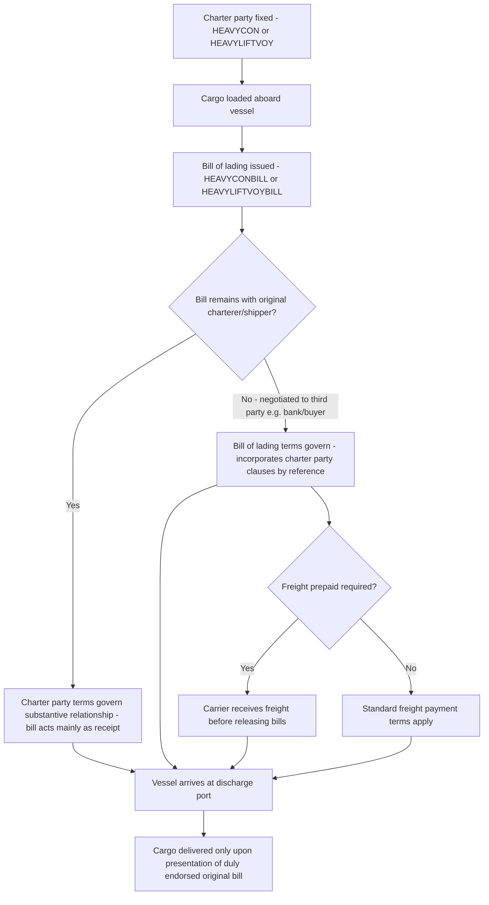

## Bills of Lading and Booking Note Documentation

### Overview

Bills of lading and booking notes are the core transport documents governing the carriage of cargo by sea, each serving distinct but complementary functions. A booking note is the preliminary contract confirming space reservation and key commercial terms before shipment; a bill of lading is issued once cargo is actually received or loaded and serves simultaneously as a receipt for goods, evidence of the contract of carriage, and (in its negotiable form) a document of title. In heavy-lift and project cargo, these documents interact closely with the underlying charter party, and BIMCO has developed specific companion forms — HEAVYCONBILL and HEAVYLIFTVOYBILL — tailored to the sector's distinctive cargo and liability profiles.

### The Booking Note

**Key Points**

- **Function**: A booking note is the contract formed when a shipper reserves cargo space aboard a vessel, typically used in liner and parcel trades before a full charter party or bill of lading is issued. It fixes key terms — vessel, port pair, cargo description, freight rate, laycan — in advance of loading.
- **Precursor role in heavy-lift**: HEAVYLIFTVOY's own origins illustrate this relationship: it was originally developed from the BIMCO CONLINEBOOKING Note and was intended to create a booking note for the heavy-lift industry, but its provisions were ultimately expanded beyond liner terms and the result was a specialist voyage charter rather than a booking note — meaning in practice the heavy-lift sector often skips a standalone booking note stage in favor of fixing a full charter party directly, given the bespoke nature of most heavy-lift shipments.
- **When still used**: Booking notes remain relevant for parcel heavy-lift shipments carried on a multipurpose vessel alongside other cargo, where the heavy-lift shipper is not chartering the whole vessel and instead books space under liner-type terms.

### The Bill of Lading: Core Functions

**Key Points**

- **Receipt for goods**: The bill of lading evidences that the carrier has received the goods described, in the apparent order and condition stated, and — once issued as a "shipped" bill — that the goods have been loaded on board the named vessel.
- **Evidence of the contract of carriage**: Between carrier and a third-party holder of the bill (e.g., a bank or buyer who was not party to the original charter negotiation), the bill of lading is generally treated as the contract of carriage itself, since that party was not privy to the underlying charter party terms.
- **Document of title**: A negotiable ("order") bill of lading allows the holder to claim delivery of the goods at destination and to transfer that right by endorsement and delivery of the bill — a function critical to letter-of-credit financed international trade, since possession of the original bill of lading is typically what allows the buyer (or its bank) to obtain the cargo.
- **Delivery mechanics**: The Master shall deliver the cargo only upon presentation of duly endorsed original bills of lading — meaning cargo cannot lawfully be released to a party unable to produce (or otherwise account for) an original negotiable bill, which has significant practical implications for demurrage and delay if bills are lost, delayed in the banking chain, or not yet issued when the vessel arrives.

### Interaction with the Underlying Charter Party

**Key Points**

- **Charter party governs between owner and charterer**: Where a bill of lading is issued to the charterer itself (or the charterer remains the cargo owner throughout), the underlying charter party terms typically govern the substantive relationship, with the bill of lading serving primarily as a receipt.
- **Bill of lading governs against third-party holders**: Once the bill is negotiated to a third party (a bank, a buyer under a sale contract), that third party's rights and the carrier's obligations are generally governed by the bill of lading's own terms — which is why heavy-lift bills of lading are drafted to incorporate the charter party's substantive provisions by express reference.
- **Incorporation by reference in HEAVYLIFTVOYBILL**: The HEAVYLIFTVOYBILL form is issued in accordance with a charter party that incorporates all terms, conditions, liberties, clauses and exceptions of the underlying charter party, including its dispute resolution clause — ensuring that a third-party bill holder is bound by (and can rely on) the same substantive terms as the original charterer, including the Hague/Hague-Visby liability basis on which HEAVYLIFTVOY operates.
- **"More onerous" protection clause**: Bills of lading other than the vessel's own standard form (e.g., a bill imposed by an intermediate freight forwarder) are typically addressed by a clause limiting the carrier's exposure to the extent such other bills would impose more onerous liabilities upon the carrier than those the carrier assumed under the charter party — protecting the carrier from inadvertently accepting broader liability than it priced into the original fixture.

### BIMCO Companion Bill Forms for Heavy-Lift

**Key Points**

- **HEAVYCONBILL**: The standard bill of lading intended to be used together with the HEAVYCON 2007 voyage charter party, carrying forward HEAVYCON's knock-for-knock liability structure into the bill of lading relationship for the super-heavy-lift, semi-submersible FLO-FLO trade.
- **HEAVYLIFTVOYBILL**: The companion bill of lading form for HEAVYLIFTVOY, incorporating the terms, conditions, liberties, clauses and exceptions of the HEAVYLIFTVOY charter party (including its dispute resolution clause), and operating on the Hague/Hague-Visby liability basis consistent with the underlying charter.
- **Freight and payment provisions**: Companion bill forms typically address prepaid freight mechanics directly — for example, if the merchant requires pre-paid bills of lading, freight shall be received by the carrier prior to release of the bills, tying the commercial payment obligation to the physical release of the negotiable document.
- **Definitional conventions**: Standard BIMCO bill forms include interpretive conventions such as providing that the singular includes the plural and vice versa as the context admits or requires — a routine but important drafting mechanic for construing the document's other clauses.
- **Late payment/interest provisions**: Companion bills commonly include a stipulated interest rate on amounts not paid when due under the charter party (e.g., a fixed monthly percentage rate, pro-rated for part months), giving the carrier a contractual remedy for late freight or hire-related payments tied to the bill.

### Comparative Roles: Booking Note vs. Bill of Lading vs. Charter Party

| Document | Stage | Primary Function | Negotiability | Heavy-Lift Example |
| --- | --- | --- | --- | --- |
| Booking Note | Pre-shipment | Reserves space, fixes preliminary terms | Not negotiable | Rare standalone use in heavy-lift; historical basis for HEAVYLIFTVOY |
| Charter Party | Fixture stage | Full contract of carriage between owner and charterer | Not a document of title | HEAVYCON 2007, HEAVYLIFTVOY |
| Bill of Lading | At loading | Receipt, evidence of contract (esp. vs. third parties), document of title | Negotiable (if "to order") | HEAVYCONBILL, HEAVYLIFTVOYBILL |

### Bill of Lading Lifecycle in a Heavy-Lift Shipment

### Practical Documentation Notes

- **Match the bill to the charter form**: Using a generic bill of lading with a HEAVYCON or HEAVYLIFTVOY charter risks a mismatch between the liability regime the parties negotiated (knock-for-knock or Hague/Hague-Visby) and what a third-party bill holder can actually rely on — using the matched companion bill (HEAVYCONBILL/HEAVYLIFTVOYBILL) avoids this gap.
- **Dispute resolution consistency**: Because the bill of lading incorporates the charter party's dispute resolution clause, confirming that clause is appropriately drafted at the charter party stage effectively locks in the forum/arbitration mechanism for any downstream third-party cargo claim as well.
- **Documentary letter-of-credit interface**: **[Inference]** For project cargo financed by letter of credit, banks typically require strict compliance between the bill of lading's cargo description, quantity, and shipped-on-board date and the terms of the credit; given the unique, often single-unit nature of heavy-lift cargo, parties should confirm bill of lading wording against LC requirements well before shipment to avoid discrepancies that could delay payment release, though exact LC terms vary by transaction and issuing bank.
- **Original bill logistics for time-sensitive heavy-lift moves**: **[Inference]** Because heavy-lift project cargo often has a fixed installation window (e.g., a scheduled crane lift or foundation date), delays in physical bill of lading circulation through a banking chain can create tension with the cargo's operational schedule; parties sometimes address this via letters of indemnity for delivery without original bills, though this carries its own legal and P&I coverage implications, and practice varies by carrier and P&I club policy.

### Related Topics

- **BIMCO Heavy-Lift Charter Party Forms: HEAVYCON, HEAVYLIFTVOY, PROJECTCON**
- **Knock-for-Knock Liability Regimes**
- **Hague and Hague-Visby Rules Application**
- **Letters of Indemnity for Delivery Without Original Bills of Lading**
- **Documentary Letters of Credit and Bill of Lading Compliance**
- **Dispute Resolution and Arbitration Clauses in BIMCO Standard Forms**
- **Freight Prepayment Mechanics and Release of Negotiable Bills**