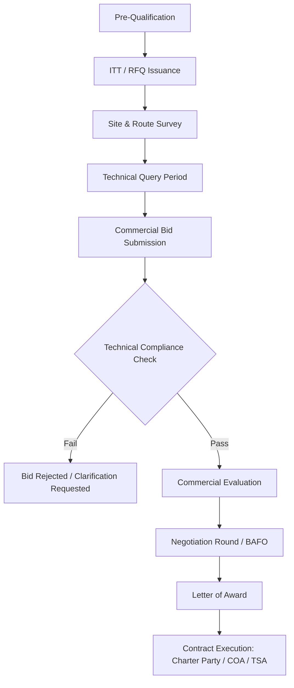

## Freight Rate Negotiation and Tender Processes

### Overview

Freight rate negotiation and tender processes in heavy-lift and specialized (project) logistics differ fundamentally from commodity/container freight pricing. Rates are not derived from published tariffs or index-linked benchmarks (e.g., no equivalent to a Container Freight Index for a 400-tonne reactor move); each quotation is a bespoke engineering-and-commercial exercise built bottom-up from route survey data, equipment mobilization economics, and project-specific risk allocation. The tender process therefore functions less like a spot-market RFQ and more like a mini engineering procurement exercise conducted in parallel with the commercial bid.

### Rate Formation Fundamentals

**Core cost components** that feed into a heavy-lift freight quotation:

- **Mobilization/demobilization (Mob/Demob)** — positioning of vessels, SPMTs (self-propelled modular transporters), cranes, barges, or specialized rail wagons to/from the project location
- **Line-haul freight** — the actual transport leg cost (ocean freight, inland haulage, barge transit)
- **Engineering and survey costs** — route surveys, lift plans, rigging studies, ground-bearing-pressure (GBP) analysis
- **Permits and escorts** — abnormal load permits, police/pilot escorts, road closure fees, bridge/culvert strengthening
- **Port and terminal charges** — heavy-lift berth dues, quay reinforcement, stevedoring with specialized cranes
- **Insurance** — marine cargo insurance, warehouse-to-warehouse coverage, often with a heavy-lift loading premium
- **Standby/waiting time** — day rates for weather delays, permit delays, or client-caused holds
- **Contingency and margin** — risk-loaded buffer plus commercial margin

A general rate build-up can be expressed as:

$$\text{Quoted Rate} = C_{mob} + C_{freight} + C_{permit} + C_{insurance} + C_{contingency} + M$$

where $C_{mob}$ through $C_{contingency}$ are direct/indirect cost components and $M$ is the margin, often expressed as a percentage of total direct cost:

$$M = m \times (C_{mob} + C_{freight} + C_{permit} + C_{insurance} + C_{contingency})$$

Typical margin percentages ($m$) vary by market conditions, competitive intensity, and risk profile of the cargo; there is no universal industry-standard figure. [Inference] Margins in the 8–15% range are commonly cited in project logistics commercial practice, but this varies significantly by trade lane, cargo criticality, and carrier bargaining position.

### Rate Structure Types

| Structure | Description | Typical Use Case |
|---|---|---|
| **Lump Sum (LS)** | Single fixed price covering the full scope (door-to-door or port-to-port) | Well-defined scope with surveyed route and known cargo characteristics |
| **Cost-Plus / Open Book** | Actual costs reimbursed plus an agreed management fee | High-uncertainty projects, evolving scope, long-term framework agreements |
| **Day Rate** | Fixed daily rate for equipment/vessel regardless of tonnage moved | Standby, charter vessels, SPMT rental for extended campaigns |
| **Unitized / Per-Tonne-KM** | Rate applied per tonne (or per unit) per kilometer/nautical mile | Repetitive moves of similar cargo along a fixed corridor |
| **Hybrid (Base + Variable)** | Fixed base covering mob/demob and survey, variable component tied to actual haul distance or weather days | Projects with a known fixed scope but variable execution duration |

**Escalation and adjustment clauses** commonly layered onto any of the above:
- **BAF** (Bunker Adjustment Factor) — passes through fuel price volatility on marine legs
- **CAF** (Currency Adjustment Factor) — hedges exchange rate exposure when costs and revenue are in different currencies
- **CPI/Index-linked escalation** — for multi-year framework or long-duration charter agreements

### Tender / RFQ Process Structure

The typical heavy-lift tender lifecycle:

1. **Pre-qualification (PQ)** — carrier/forwarder demonstrates HSE record, relevant equipment fleet, insurance capacity, and track record on comparable cargo
2. **Invitation to Tender (ITT) / RFQ issuance** — client issues cargo specifications (dimensions, weight, center of gravity, lifting points), origin/destination, delivery window, and commercial terms template
3. **Site and route survey** — physical or desk-based survey of load-out point, transport corridor (bridge weight limits, turning radii, overhead clearances), and discharge point
4. **Technical query (TQ) period** — bidders raise clarification questions; client issues addenda
5. **Commercial bid submission** — sealed or electronic bid including rate breakdown, assumptions, exclusions, and validity period
6. **Bid evaluation** — technical compliance check first (pass/fail), then commercial evaluation (lowest compliant bid, or weighted technical/commercial scoring)
7. **Negotiation round(s)** — clarification of assumptions, scope alignment, rate negotiation, often via a Best and Final Offer (BAFO) round
8. **Award and contract execution** — Letter of Award (LOA), followed by formal contract (Charter Party, Contract of Affreightment, or a project-specific Transport Services Agreement)

### Negotiation Strategy and Leverage Points

**Carrier-side leverage:**
- Equipment scarcity (limited global fleet of heavy-lift vessels/SPMTs for the required capacity class)
- Backhaul opportunity — a carrier with an empty return leg can price more aggressively
- Seasonal weather windows — narrow permit/tide windows reduce carrier flexibility and can increase rates
- Reputation and track record on comparable high-value, high-risk cargo

**Client-side leverage:**
- Volume commitment (framework agreements across multiple shipments)
- Competitive tension (multiple qualified bidders)
- Flexibility on delivery windows (reduces carrier's need to reposition assets on short notice)
- Willingness to accept carrier-favorable risk allocation in exchange for lower rate

**Key negotiation variables beyond headline rate:**
- Demurrage and detention rates for delays outside carrier control
- Force majeure definitions and notice periods
- Liability caps and consequential damage exclusions
- Payment terms (advance mobilization payment vs. milestone-based vs. net terms post-delivery)
- Validity period of the quoted rate against fuel/FX volatility

### Risk Allocation in Rate Structures

Heavy-lift contracts typically allocate risk through a combination of:
- **Incoterms** (or project-specific equivalents) defining transfer of risk and cost responsibility at each handover point
- **Force majeure clauses** — explicitly listing weather, permit authority delays, and port congestion as excusable delay events
- **Liability caps** — often expressed as a multiple of freight value rather than full cargo replacement value, given the disproportionate value of heavy-lift cargo relative to freight cost
- **Named risk premiums** — insurers may apply loading factors for cargo with high value-to-weight ratios or non-standard lifting configurations

[Unverified] Specific liability cap multiples and insurance loading percentages are commercially negotiated and vary by insurer, cargo type, and market cycle; no single benchmark applies universally across the industry.

### Worked Example: Rate Build-Up

**Scenario:** A 320-tonne reactor vessel, break-bulk heavy-lift ocean freight plus 40 km inland SPMT haul to an inland refinery site.

**Cost breakdown (illustrative):**

| Component | Cost (USD) |
|---|---|
| Vessel mobilization/demobilization | 180,000 |
| Ocean freight (line-haul) | 420,000 |
| Port heavy-lift crane/stevedoring | 95,000 |
| SPMT mobilization + 40 km haul | 260,000 |
| Permits, escorts, road survey | 65,000 |
| Cargo insurance | 40,000 |
| Contingency (5% of direct costs) | 53,000 |
| **Subtotal (direct costs)** | **1,113,000** |
| Margin (10%) | 111,300 |
| **Total Quoted Lump Sum** | **1,224,300** |

Sensitivity check — if bunker prices rise 15% during the validity period and a BAF clause applies to the ocean freight component only:

$$\Delta C = 0.15 \times 420{,}000 = 63{,}000$$

The BAF clause passes this $\$63{,}000$ increase through to the client rather than eroding the carrier's margin — illustrating why escalation clauses are a critical negotiation point independent of the headline lump sum.

### Cost Structure Visualization

<svg xmlns="http://www.w3.org/2000/svg" viewBox="0 0 700 420">
<title>Heavy-Lift Freight Rate Cost Breakdown (svg_diagram)</title>
<text x="350" y="30" text-anchor="middle" font-size="18" font-weight="bold" fill="#1a1a1a">Freight Rate Cost Breakdown (svg_diagram)</text>
<g font-family="sans-serif" font-size="13">
<rect x="60" y="60" width="580" height="30" fill="#2b6cb0" />
<text x="70" y="80" fill="#fff">Ocean Freight (Line-Haul) — 420,000 (34%)</text>
<rect x="60" y="100" width="371" height="30" fill="#2c7a7b" />
<text x="70" y="120" fill="#fff">SPMT Mobilization + Haul — 260,000 (21%)</text>
<rect x="60" y="140" width="257" height="30" fill="#6b46c1" />
<text x="70" y="160" fill="#fff">Vessel Mob/Demob — 180,000 (15%)</text>
<rect x="60" y="180" width="136" height="30" fill="#c05621" />
<text x="70" y="200" fill="#fff">Port Crane/Stevedoring — 95,000 (8%)</text>
<rect x="60" y="220" width="93" height="30" fill="#b83280" />
<text x="70" y="240" fill="#fff">Permits/Escorts — 65,000 (5%)</text>
<rect x="60" y="260" width="76" height="30" fill="#718096" />
<text x="70" y="280" fill="#fff">Insurance — 40,000 (3%)</text>
<rect x="60" y="300" width="76" height="30" fill="#975a16" />
<text x="70" y="320" fill="#fff">Contingency — 53,000 (4%)</text>
<rect x="60" y="340" width="159" height="30" fill="#276749" />
<text x="70" y="360" fill="#fff">Margin — 111,300 (9%)</text>
</g>
<text x="350" y="400" text-anchor="middle" font-size="12" fill="#555">Total Quoted Lump Sum: $1,224,300 (illustrative worked example)</text>
</svg>

### Common Negotiation Pitfalls

- **Incomplete route survey before bid submission** — leads to costly re-negotiation mid-project when bridge or clearance restrictions surface after award
- **Ambiguous scope boundaries** — unclear handover points between ocean and inland legs create disputes over who bears delay costs
- **Underpricing standby/waiting time** — narrow permit windows and weather dependency make demurrage/detention terms as commercially important as the headline rate
- **Ignoring currency mismatch** — quoting in a currency different from major cost inputs (fuel, local labor) without a CAF clause exposes the carrier to FX risk that eventually gets repriced into future bids
- **Treating the LOA as final** — many disputes originate from gaps between the Letter of Award's summary terms and the fully executed Charter Party/TSA

**Key Points**
- Heavy-lift freight rates are cost-build-up-driven, not index-driven, and require a validated route/site survey before a reliable quote can be issued
- Lump sum, cost-plus, day rate, and hybrid structures each shift risk differently between carrier and client
- Escalation clauses (BAF/CAF) and liability caps are frequently more consequential in total contract value than the headline rate
- The tender process is inseparable from technical qualification — commercial evaluation only proceeds after technical compliance is confirmed

**Related Topics**
- Charter Party Agreements and Contract of Affreightment Structuring
- Incoterms Application in Heavy-Lift and Project Cargo
- Demurrage, Detention, and Laytime Calculations
- Route Survey Methodology and Permit Acquisition
- Insurance and Liability Allocation in Project Cargo Contracts
- Framework Agreements and Multi-Shipment Rate Cards