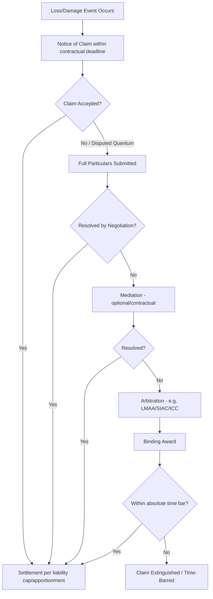

## Claims, Disputes, and Liability Limitation Clauses

### Overview

Claims, disputes, and liability limitation clauses form the risk-allocation backbone of heavy-lift and specialized logistics contracts. Because a single heavy-lift transport (jack-up rig components, refinery modules, wind turbine nacelles, transformers) can carry cargo values in the tens or hundreds of millions of dollars alongside catastrophic third-party exposure (capsize, dropped load, route infrastructure damage), the contractual claims and liability regime is often more consequential to a carrier's or forwarder's survival than the freight rate itself.

### Foundational Concepts

**Key Points**

- **Claim**: a formal assertion by one party that the other has caused loss or damage, entitling the claimant to compensation, an indemnity, or a contractual remedy.
- **Dispute**: arises when a claim is contested — either liability itself or quantum (the amount) is not agreed.
- **Liability limitation**: a contractual (or statutory) ceiling on the compensation a party must pay, distinct from liability *exclusion* (which removes liability entirely for a category of loss).
- These three concepts are sequential in practice: a loss event → a claim is notified → if rejected or under-settled, a dispute → resolution is bounded by whatever limitation clauses apply.

### Sources of Liability Exposure in Heavy-Lift Operations

- **Cargo damage/loss**: during lifting, load-out, sea-fastening, transport, or discharge — often the highest-frequency claim type
- **Delay**: schedule slippage cascading into project-wide delay damages far exceeding the transport contract value
- **Third-party property damage**: quay cranes, jetties, roads, bridges, overhead cables struck during abnormal load movement
- **Personal injury/death**: rigging failures, SPMT (self-propelled modular transporter) incidents, crane collapses
- **Environmental damage**: pollution from vessel casualty, especially relevant under MARPOL and regional environmental liability regimes
- **Pure economic loss**: consequential losses claimed by cargo owners (e.g., lost production revenue from a delayed module) — typically the most fiercely negotiated category

### The Knock-for-Knock Principle

Heavy-lift and offshore-adjacent logistics contracts overwhelmingly favor **knock-for-knock (KfK)** indemnity structures over fault-based liability, a convention inherited from offshore energy contracting (e.g., LOGIC, BIMCO SUPPLYTIME lineage).

**Key Points**

- Under KfK, each party indemnifies the other against losses to *its own* personnel and property, **regardless of fault, negligence, or cause** — including the other party's negligence.
- Cargo owner covers its own cargo/personnel; carrier covers its own vessel/equipment/personnel — each side insures its own risk rather than litigating fault.
- Rationale: it eliminates costly, slow fault-finding litigation in favor of predictable, insurable risk pools. Each party is expected to carry insurance matched to its own KfK exposure.
- KfK is typically carved out for: gross negligence, willful misconduct, and sometimes pollution/wreck removal, which may fall outside the mutual indemnity and instead follow separate (often uncapped or differently capped) regimes.

[Inference] The prevalence of KfK in heavy-lift contracting specifically (as opposed to general cargo carriage) reflects the offshore/EPC project origins of much heavy-lift work, where LOGIC/BIMCO-style templates are the customary starting point for negotiation.

### Standard Contract Frameworks

| Framework | Typical Use | Liability Approach |
| --- | --- | --- |
| BIMCO HEAVYCON | Voyage charter of heavy-lift tonnage | Hybrid — carrier liability for negligence, capped; KfK elements for war/collision |
| BIMCO HEAVYLIFTVOY | Heavy-lift voyage charter (revised HEAVYCON successor) | Similar hybrid, updated Hague-Visby referencing |
| LOGIC General Conditions of Contract | Offshore/marine services incl. heavy transport support | Full knock-for-knock |
| FIDIC Yellow/Silver Book (referenced indirectly) | EPC contracts where heavy-lift is a subcontracted scope | Liability flows down from main contract's limitation-of-liability clause |
| Hague-Visby Rules / Hamburg Rules | Where bill of lading carriage applies (rare for project cargo, common for breakbulk legs) | Per-package or per-kg limitation |
| National Multimodal Transport regimes | Door-to-door movements spanning multiple legs | Network liability system — liability regime of the leg where loss occurred applies |

### Anatomy of a Liability Limitation Clause

A typical liability limitation clause in a heavy-lift transport agreement contains several layered mechanisms:

**Example**



```
9.1 Limitation of Liability
Subject to Clause 9.3, the Carrier's aggregate liability arising out of
or in connection with this Agreement, whether in contract, tort
(including negligence), or otherwise, shall not exceed the greater of:
  (a) the Contract Price; or
  (b) [USD 5,000,000],
in respect of any one event or series of connected events.

9.2 Exclusion of Consequential Loss
Neither Party shall be liable to the other for any indirect,
incidental, special, or consequential loss or damage, including but
not limited to loss of profit, loss of use, loss of production,
loss of contract, or business interruption, howsoever arising.

9.3 Carve-Outs
The limitations in Clause 9.1 and exclusions in Clause 9.2 shall not
apply to loss or damage arising from:
  (a) gross negligence or willful misconduct;
  (b) death or personal injury caused by a Party's negligence;
  (c) fraud or fraudulent misrepresentation;
  (d) breach of confidentiality obligations under Clause 14.
```

**Key Points**

- **Aggregate cap**: sets a ceiling per event or in total across the contract term — heavy-lift contracts often use the greater/lesser of contract value or a fixed USD figure.
- **Consequential loss exclusion**: the single most contested clause in project logistics, because cargo owners' real exposure (schedule-driven project delay costs) is almost always classified as "consequential" and thus excluded by the carrier.
- **Carve-outs**: gross negligence, willful misconduct, fraud, death/personal injury, and sometimes pollution/wreck removal are customarily excluded from the cap — these are matters that insurers and courts in most jurisdictions will not allow a party to cap or exclude entirely as a matter of public policy.

### Consequential Loss: The Central Battleground

**Key Points**

- Definitions of "consequential loss" diverge sharply between UK/Commonwealth case law (narrow, *Hadley v Baxendale* second-limb definition — losses not naturally flowing from breach) and US practice (broader, often including lost profits by default unless carved back in).
- Because of this divergence, well-drafted heavy-lift contracts **enumerate** excluded loss types explicitly (loss of profit, loss of use, loss of production, business interruption) rather than relying on the bare word "consequential," to avoid jurisdiction-dependent reinterpretation.
- [Unverified] Whether a given loss item is classified as "direct" or "consequential" can still be litigated even under an enumerated list, since categorization disputes (e.g., is idle-crew standby cost direct or consequential?) persist regardless of drafting precision.

### Claims Notification and Time-Bar Mechanisms

Heavy-lift contracts nearly always impose strict, short notification and time-bar periods, since evidence (rigging condition, weather logs, stability calculations) degrades quickly and insurers require prompt notice.

**Key Points**

- **Notice of claim**: typically 24–72 hours after the claimant becomes aware of the event, in writing, to a named contract address.
- **Full particulars/substantiation**: usually required within 30–90 days, including surveys, photographs, and quantified loss.
- **Absolute time bar**: many contracts (and the Hague-Visby Rules where applicable, Art. III r.6) extinguish the right to claim entirely — not merely as a limitation defense but as a substantive bar — if suit is not brought within one year of delivery (or non-delivery).
- Failure to meet notice deadlines is one of the most common reasons legitimate cargo claims fail in practice, independent of the merits.

### Force Majeure Interaction

- Force majeure clauses interact directly with claims/liability regimes by suspending performance obligations (and associated delay liability) for defined uncontrollable events (extreme weather, port closure, war, pandemic).
- **Key Points**
  - Heavy-lift operations are unusually weather-sensitive (sea-fastening limits, crane wind-speed cutoffs, tidal windows), so weather-related force majeure triggers are drafted with specific, measurable thresholds (e.g., "significant wave height exceeding 2.5m") rather than vague "adverse weather" language, to reduce dispute potential.
  - A party invoking force majeure typically must still demonstrate it used reasonable efforts to mitigate — failure to do so can void the defense and expose the party to full delay/consequential claims.

### Insurance Interface

**Key Points**

- Liability caps are calibrated to available insurance capacity — carriers typically set the cap at or near their P&I (Protection & Indemnity) club cover or Cargo Legal Liability policy limits, since uninsured exposure above the cap is commercially meaningless to negotiate.
- Cargo interests separately insure via **Marine Cargo Insurance** (often Institute Cargo Clauses (A) for heavy/project cargo, "all risks" basis) rather than relying solely on the carrier's limited contractual liability — this is standard industry practice precisely *because* contractual caps are set low relative to cargo value.
- Warranty of Seaworthiness / Cargoworthiness surveys (e.g., by a marine warranty surveyor, MWS) are frequently a condition precedent to cargo insurance coverage on heavy-lift moves, and MWS approval failures are themselves a common source of disputes distinct from cargo damage claims.

### Dispute Resolution Mechanisms

| Mechanism | Characteristics | Typical Use in Heavy-Lift |
| --- | --- | --- |
| Negotiation/escalation ladder | Tiered internal escalation before formal process | Standard first step, often contractually mandated |
| Mediation | Non-binding, facilitated | Common for preserving commercial relationships on repeat-charter arrangements |
| Arbitration (LMAA, LCIA, SIAC, ICC) | Binding, confidential, enforceable under the New York Convention | Dominant mechanism — LMAA (London Maritime Arbitrators Association) especially common given English law's prevalence in charterparty drafting |
| Litigation | Binding, public | Less common due to confidentiality preference and cross-border enforcement difficulty |
| Expert determination | Binding on narrow technical questions (e.g., stability calculation disputes) | Used for discrete technical quanta rather than full liability disputes |

**Key Points**

- English law and London arbitration (LMAA terms) remain the dominant governing law/forum choice for heavy-lift charterparties, largely due to the depth of maritime case law and arbitrator expertise — a legacy of BIMCO's drafting origin and the London marine insurance market's centrality.
- [Inference] The strong preference for arbitration over litigation in this sector likely reflects both confidentiality needs (parties do not want cargo damage disputes публично affecting reputation with other project clients) and the technical/nautical subject matter benefiting from specialist arbitrators rather than generalist judges.

### Dispute Resolution Flow



### Apportionment in Multi-Cause Loss Events

- Heavy-lift casualties frequently involve contributory causes (e.g., inadequate sea-fastening design *and* unexpectedly severe weather *and* a rigging defect).
- **Key Points**
  - Apportionment clauses allocate liability proportionally where multiple parties/causes contributed, often by reference to expert marine surveyor findings.
  - Absent an apportionment clause, governing law defaults apply — English law uses contributory negligence apportionment in tort but generally does not apportion in pure contract claims, making the choice of cause of action (contract vs. tort) itself a strategic element of the dispute.

### Practical Drafting Checklist

- **Next Steps**
  - Define "Event," "Party," and "Group Companies" precisely, since KfK indemnities typically extend to each party's subcontractors, agents, and affiliates — undefined scope here is a frequent litigation trigger.
  - Align the liability cap explicitly with the insurance program's limits and deductibles, reviewed at each contract renewal since insurance market capacity shifts year to year.
  - Enumerate excluded consequential loss categories explicitly rather than relying on the single word "consequential."
  - Set weather/operational force majeure triggers using measurable technical thresholds tied to the vessel's/equipment's certified operating envelope.
  - Specify claims notice periods that align with, not exceed, the P&I/cargo insurer's own notification requirements upstream.
  - Confirm the interaction between the limitation clause and any statutory carriage regime (Hague-Visby, Hamburg, national multimodal law) that may override contractual caps as a matter of mandatory law.

**Related Topics**

- Force Majeure and Weather Downtime Clauses in Heavy-Lift Charters
- Marine Cargo Insurance and Institute Cargo Clauses for Project Cargo
- BIMCO HEAVYCON/HEAVYLIFTVOY Clause-by-Clause Analysis
- Marine Warranty Surveys and Conditions Precedent
- General Average and Salvage in Heavy-Lift Casualties
- Multimodal Liability Networks and the Hague-Visby/Hamburg Rules Interface
- LMAA Arbitration Procedure for Charterparty Disputes