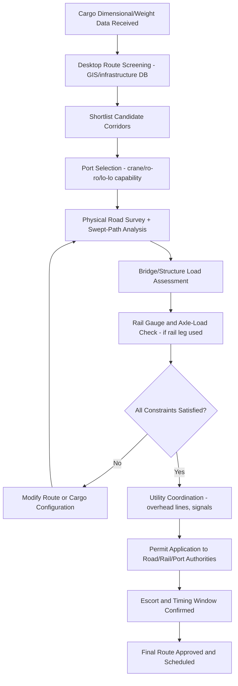

## Multimodal Route Planning Across Sea, Rail, and Road


### Overview

Multimodal route planning for heavy-lift and project cargo is the process of engineering a sequence of transport legs — sea, rail, road, and often inland waterway — that moves an out-of-gauge (OOG) or overweight unit from origin to final site while satisfying the most restrictive physical, regulatory, and infrastructure constraint on the entire route. Unlike containerized multimodal logistics, where route options are largely interchangeable, heavy-lift routing is dominated by the *single worst bottleneck*: one low bridge, one weak culvert, or one tight roundabout can eliminate an otherwise optimal corridor entirely.

### Core Planning Principle: The Weakest-Link Constraint

**Key Points**

- Route feasibility for abnormal/OOG cargo is governed by the most restrictive point along the entire corridor, not the average capacity of the route.
- Route survey work therefore proceeds in reverse from conventional logistics planning: engineers first identify hard constraints (fixed bridges, tunnels, overhead lines, weight-restricted culverts), then build the route around what survives those filters, rather than optimizing distance/cost first and checking feasibility after.
- [Inference] This constraint-first methodology is likely why heavy-lift routing timelines (often 3–12 months for route survey and permitting) are so much longer relative to transit time than in standard freight, since the search space is filtered by hard engineering limits rather than optimized by cost curves.

### Modal Characteristics Relevant to Routing Decisions

| Mode | Dimensional Ceiling | Weight Ceiling | Key Constraints | Typical Role |
| --- | --- | --- | --- | --- |
| Sea (breakbulk/heavy-lift vessel) | Effectively unlimited (deck/hold space dependent) | Very high (thousands of tonnes via semi-submersible) | Port draft, quay crane/SPMT capacity, berthing schedule, weather windows | Long-haul trunk leg |
| Inland waterway (barge) | High | High, but draft-limited | River depth/season, lock dimensions, bridge air-draft | Inland trunk leg where available |
| Rail | Moderate (loading-gauge dependent) | High per well-car/Schnabel car | Tunnel/bridge clearance, curve radius, axle load limits, gauge changes at borders | Inland trunk leg, especially long overland distances |
| Road (SPMT/modular trailer/conventional lowboy) | Highest flexibility, but infrastructure-dependent | High with sufficient axle lines, but bridge-limited | Bridge weight rating, road width, turning radius at junctions, overhead utility lines, permit windows | First/last-mile, and only viable option for true "door-to-site" delivery |

### The Route Survey Process

**Key Points**

1. **Desktop survey**: GIS-based preliminary screening using known infrastructure databases (bridge registries, rail clearance diagrams, port capability data) to shortlist candidate corridors.
2. **Physical route survey**: engineers and surveyors physically traverse the candidate road route, measuring overhead clearances (traffic signals, power lines, gantries), road width at pinch points, roundabout geometry, and bridge condition/load rating — typically using laser rangefinders, GPS, and swept-path software.
3. **Swept-path (turning) analysis**: software simulation (e.g., AutoTURN or equivalent) models the actual path the combination vehicle and cargo will trace through corners, verifying it stays within available road width without striking curbs, signage, or structures.
4. **Bridge and structure assessment**: structural engineers verify or recalculate load ratings for bridges/culverts along the route, since posted ratings are often conservative and may need a bespoke assessment (via bridge owner/authority) to certify a heavier one-off movement.
5. **Utility coordination**: identification of overhead lines, traffic signals, and street furniture requiring temporary removal/relocation, with the relevant utility owner engaged for scheduling and cost.
6. **Permit application and route approval**: submission to national/regional road authorities, often triggering a formal escort and timing-window requirement (night moves, police escort, rolling road closures).

### Port and Sea-Leg Considerations

**Key Points**

- Port selection is driven by: quay-side crane/SPMT lifting capacity, availability of ro-ro or lo-lo (lift-on/lift-off) infrastructure matched to the cargo, sufficient open laydown area for pre-assembly or temporary storage, and channel/berth draft sufficient for the heavy-lift vessel class.
- **Ro-ro vs. lo-lo** selection depends on cargo type: self-propelled or SPMT-mounted units favor ro-ro (roll-on/roll-off) to avoid crane lift limits; static modules favor lo-lo using shore cranes, floating cranes, or the vessel's own gear (semi-submersible float-on/float-off for the heaviest units).
- Weather windows matter disproportionately at the sea leg: heavy-lift vessel loading/discharge operations have defined wave-height and wind-speed operating envelopes, and voyage scheduling must build in contingency for seasonal weather patterns (monsoon, typhoon season, North Atlantic winter storms) along the specific trade route.

### Rail-Leg Considerations

**Key Points**

- Rail routing depends on **loading gauge** (the cross-sectional envelope a rail network permits) and **axle load limits**, both of which vary by country/network and can force cargo onto specialized rolling stock (well cars, Schnabel cars that cradle the load between two bogies to distribute weight and reduce effective height).
- Gauge changes at international borders (e.g., Iberian vs. standard gauge in parts of Europe, or break-of-gauge in parts of Africa/Asia) can force a transload rather than through-running, adding cost and handling risk.
- [Unverified] The relative cost-efficiency of rail vs. road for a given inland leg depends heavily on route-specific factors (terminal transload costs, distance, cargo dimensions relative to loading gauge) and does not generalize reliably across regions — this is typically modeled per-project rather than assumed.

### Road-Leg Considerations

**Key Points**

- **SPMT (Self-Propelled Modular Transporter)** platforms are the dominant tool for the heaviest/largest road moves, since axle lines can be added/configured to distribute load and steer independently, enabling movement through constrained geometries that a rigid trailer could not navigate.
- Route timing windows are frequently restricted to low-traffic hours (overnight moves) and may require police/pilot vehicle escort, temporary traffic signal removal, and coordination with local authorities for road closures.
- Alternate/contingency routes are typically surveyed in parallel with the primary route, since a single point of failure (unexpected road closure, weather damage to the primary bridge) can otherwise strand the movement.

### Route Optioneering and Trade-off Framework

When multiple viable corridors exist, planners typically evaluate options against a weighted matrix:

**Example**



```
Route Comparison Matrix (illustrative weighting)
| Criterion              | Weight | Route A (Sea+Road) | Route B (Sea+Rail+Road) |
|-------------------------|--------|---------------------|---------------------------|
| Total transit time      | 20%    | 8/10                | 6/10                      |
| Total cost               | 25%    | 7/10                | 8/10                      |
| Infrastructure risk      | 25%    | 6/10                | 8/10                      |
| Permitting complexity    | 15%    | 7/10                | 5/10                      |
| Weather/seasonal exposure| 15%    | 6/10                | 7/10                      |
| Weighted Score           | —      | 6.75                | 7.05                      |
```

**Key Points**

- Infrastructure risk (bridge condition, permit uncertainty) is frequently weighted heavily because a route failure discovered mid-transit is far more costly than a longer but well-surveyed alternative.
- Cost comparisons must include indirect costs — utility relocation, police escort fees, road authority bonds/deposits, and potential liquidated damages for schedule slippage — not just carrier freight rates.

### Multimodal Route Planning Sequence



### Transload and Interface Points

**Key Points**

- Every mode transition (sea-to-road, rail-to-road) is an interface point requiring compatible lifting/handling equipment, adequate laydown space, and schedule synchronization between the two legs' operators.
- Interface points are common sources of schedule slippage, since a delay on one mode (vessel arrival, rail slot) cascades into demurrage or storage costs at the transload point if the receiving mode's capacity/window was booked independently.
- Pre-assembly or partial disassembly of the cargo (e.g., removing protruding sub-components) sometimes occurs specifically at a transload point to convert an otherwise infeasible dimensional profile for the next leg — a technique that shifts constraint-solving from route selection to cargo configuration.

### Regulatory and Permitting Landscape

**Key Points**

- Road abnormal-load permitting regimes vary widely: some jurisdictions use a case-by-case route-specific permit tied to the physical survey, others use a banded permit system (weight/dimension categories with pre-approved standard routes).
- Cross-border multimodal moves multiply regulatory complexity — customs clearance procedures, differing national abnormal-load definitions/thresholds, and potentially differing insurance/liability regimes per jurisdiction must all be reconciled into a single schedule.
- [Inference] The trend toward banded/standardized abnormal-load permitting in some regions likely reflects a policy effort to reduce the multi-month lead times that case-by-case route surveys impose on project schedules, though case-by-case survey remains necessary for the largest/heaviest cargo regardless of jurisdiction.

**Related Topics**

- SPMT Configuration and Axle-Load Distribution Engineering
- Bridge and Culvert Load Rating Assessment for Abnormal Loads
- Port Selection Criteria for Heavy-Lift and Project Cargo
- Cross-Border Customs Coordination for Multimodal Project Cargo
- Weather Window Planning for Heavy-Lift Sea Voyages
- Schnabel Car and Specialized Rail Rolling Stock for OOG Cargo
- Contingency and Alternate Route Planning Methodology