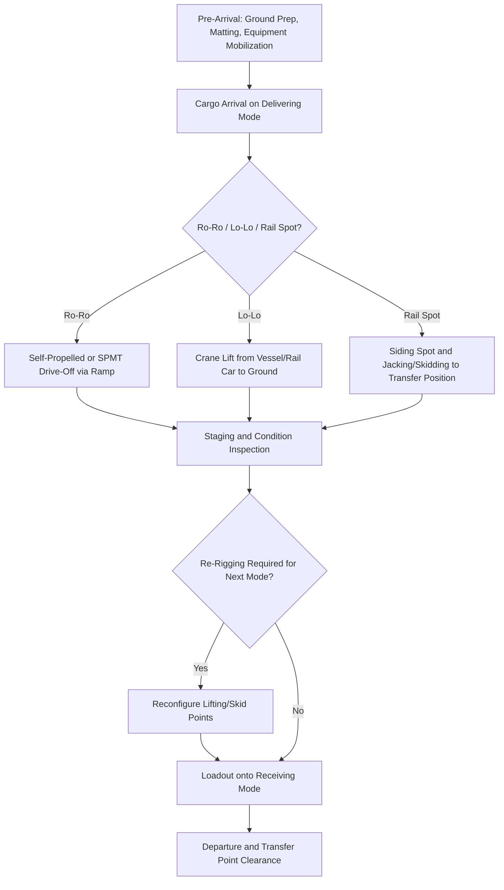

## Intermodal Transfer Point Design and Sequencing

### Overview

An intermodal transfer point (ITP) is the physical location — port, rail terminal, or designated road laydown area — where heavy-lift or out-of-gauge (OOG) cargo moves from one transport mode to another. Unlike containerized intermodal transfer, which is standardized around crane-compatible ISO footprints, heavy-lift transfer points must be individually engineered around the specific cargo's geometry, weight, and the lifting/skidding equipment available on site. Transfer point failure — inadequate ground bearing capacity, insufficient laydown area, or equipment mismatch — is one of the most common causes of schedule slippage in multimodal project logistics.

### Core Design Objectives

**Key Points**

- Provide sufficient **ground bearing capacity** to support the cargo's point loads (whether via SPMT axle lines, crane outrigger loads, or static grillage) without settlement or failure.
- Provide adequate **laydown/staging area** for the cargo plus maneuvering clearance for the handling equipment and any support vehicles.
- Enable **synchronized handoff** between the delivering mode's schedule and the receiving mode's capacity/booking window, minimizing dwell time and demurrage exposure.
- Maintain **structural and dimensional continuity** — the cargo's rigging/lifting points and orientation must remain compatible with both the outgoing and incoming mode's equipment without requiring unplanned reconfiguration.

### Types of Intermodal Transfer Points

| Type | Typical Equipment | Common Use Case |
| --- | --- | --- |
| Port ro-ro ramp | SPMT self-propulsion, linkspan/ramp | Self-propelled or SPMT-mounted units transferring vessel-to-quay |
| Port lo-lo quay | Shore crane, floating crane, vessel's own gear | Static modules lifted from hold/deck to quay |
| Rail siding/transload yard | Gantry crane, mobile crane, hydraulic jacking/skid system | Rail-to-road or road-to-rail transfer of well-car/Schnabel cargo |
| Inland barge terminal | Shore crane, ro-ro ramp | River/canal leg interfacing with road or rail |
| Temporary laydown yard | SPMT, mobile/crawler crane | Interim staging between two road legs, or pre-assembly point |

### Ground Engineering and Load-Bearing Design

**Key Points**

- Transfer points supporting SPMT or grillage-based loads require a geotechnical assessment of bearing capacity, since point loads from axle lines or grillage footings can be an order of magnitude higher per unit area than the surrounding pavement or ground is rated for.
- **Load-spreading mats** (timber, steel, or composite mats) are commonly used to distribute concentrated point loads over a wider ground footprint when native bearing capacity is insufficient, avoiding the cost of permanent ground improvement.
- For crane-based transfer, outrigger/crawler ground bearing pressure must be checked against the specific quay, yard, or embankment condition — quay aprons in particular often have posted load limits that are exceeded by modern heavy-lift crane configurations, requiring either load-spreading or crane repositioning further from the quay edge.
- [Inference] The frequent need for temporary ground reinforcement at project-specific transfer points (rather than relying on permanent terminal infrastructure) likely reflects the fact that few facilities are purpose-built for the largest heavy-lift cargo, since demand for such capacity is intermittent and project-specific rather than continuous.

### Sequencing Principles

Sequencing refers to the planned order and timing of operations at the transfer point — arrival, handling, staging, and departure — engineered to minimize dwell time and avoid conflicting equipment movements.

**Key Points**

1. **Pre-arrival preparation**: ground preparation (matting, grillage placement), equipment mobilization, and utility/escort coordination completed before the cargo's arrival to avoid idle time upon arrival.
2. **Arrival and offload**: the delivering mode's cargo is landed (ro-ro drive-off, lo-lo lift, rail siding spot) according to a pre-agreed method statement.
3. **Staging/inspection**: cargo undergoes condition inspection, and if needed, re-rigging or reconfiguration for the next leg's equipment (e.g., changing from vessel lashings to SPMT skid shoes).
4. **Loadout onto next mode**: cargo is transferred onto the receiving mode (SPMT drive-under, crane lift onto rail car) per its own method statement.
5. **Departure and site clearance**: the transfer point is cleared for the next operation, particularly critical at high-utilization port berths or rail sidings shared across multiple projects.

**Key Points**

- Sequencing is typically documented in a **method statement** with a **critical path schedule**, since even a short delay at the transfer point (e.g., late tide window for ro-ro, or crane unavailability) can cascade into missed downstream windows on rail or road.
- Where the transfer point has constrained space, sequencing must also account for **equipment interference** — e.g., an SPMT maneuvering path crossing a crane's working radius must be scheduled to avoid simultaneous conflicting operations.
- Weather and tidal windows often gate the sequencing at port-based transfer points specifically, since ro-ro ramp angle and lo-lo crane operations both have defined operational limits tied to tide state and wind/wave conditions.

### Transfer Point Sequencing Flow

### Equipment Compatibility and Interface Engineering

**Key Points**

- Rigging and lifting-point compatibility must be verified across both the outgoing and incoming mode's equipment during the design phase, not discovered at the transfer point — a lifting lug rated for vessel gear may not suit a mobile crane's hook geometry without an engineered adapter.
- **Skid shoe and SPMT deck compatibility**: cargo transferring from a static grillage to SPMT transport requires skid beams or a jacking-and-skidding system engineered specifically to the cargo's support-point spacing.
- Where cargo transfers between rail and road, differences in loading gauge/height between the rail car deck and the road trailer bed can require intermediate jacking towers to adjust cargo elevation during the transfer.

### Contingency and Risk Management at Transfer Points

**Key Points**

- **Weather contingency**: alternate tide/weather windows are pre-identified for port-based transfers, since a missed window at a shared-use berth can mean a multi-day wait for the next available slot.
- **Equipment backup**: critical-path equipment (primary crane, SPMT units) typically has a documented backup/contingency plan, since equipment breakdown at a transfer point with cargo mid-transfer is a high-severity risk scenario.
- **Third-party coordination risk**: transfer points at shared commercial facilities (public ports, active rail yards) carry schedule risk from other users' operations, making early booking and confirmed exclusivity windows a standard mitigation.
- [Unverified] The specific contingency buffer typically built into transfer point scheduling (commonly cited informally as 24–48 hours) varies substantially by project and facility, and is not a fixed industry standard.

### Documentation and Method Statements

**Key Points**

- A transfer point method statement typically includes: ground bearing calculations, equipment specifications and certification, step-by-step sequencing narrative, lifting/rigging plans, and emergency response procedures specific to that location.
- Method statements are usually subject to third-party review (marine warranty surveyor, independent engineer) for the highest-value or highest-risk transfers, particularly where cargo insurance coverage is conditioned on such approval.

**Related Topics**

- SPMT Configuration and Axle-Load Distribution Engineering
- Geotechnical Assessment and Load-Spreading Mat Design for Heavy Cargo
- Marine Warranty Surveys and Conditions Precedent
- Ro-Ro vs. Lo-Lo Port Handling Selection Criteria
- Jacking and Skidding Systems for Heavy Module Transfer
- Critical Path Scheduling for Multimodal Project Cargo Movements