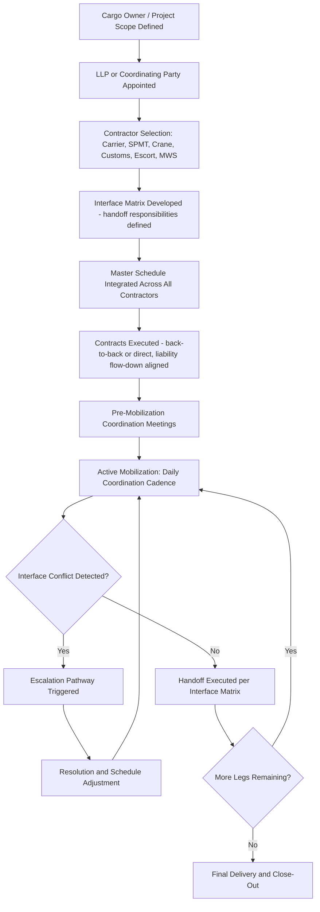

## Coordinating Multiple Contractors and Subcontractors

### Overview

Heavy-lift and project logistics moves rarely involve a single contracting party executing end-to-end. A typical multimodal move assembles a chain of specialist contractors — ocean carrier, stevedoring firm, port agent, SPMT operator, rigging/crane subcontractor, escort/police liaison, engineering surveyor, and customs broker — each with distinct scopes, equipment, and liability regimes. Coordinating this chain so that interfaces align in time, equipment compatibility, and contractual responsibility is a discipline distinct from executing any single leg well.

### The Coordination Problem

**Key Points**

- No single contractor in a typical heavy-lift chain has visibility or authority over the entire route — coordination is therefore a deliberate management function, usually vested in a **lead logistics provider (LLP)**, project forwarder, or the cargo owner's own logistics team.
- Interfaces between contractors (handoff points, shared equipment windows, sequential dependencies) are where risk concentrates, since each contractor optimizes its own scope and has limited incentive to absorb schedule risk originating from another contractor's delay.
- [Inference] The prevalence of a single coordinating LLP role in project logistics likely reflects the fact that fragmented contracting — where the cargo owner holds many direct contracts with no single accountable coordinator — tends to produce disputes over which party bears responsibility when an interface fails, making a designated coordinator function commercially necessary rather than merely convenient.

### Common Contractor Roles in a Multimodal Heavy-Lift Chain

| Role | Typical Scope | Key Interface Risk |
| --- | --- | --- |
| Ocean/heavy-lift carrier | Sea leg transport, vessel loading/discharge | Vessel schedule vs. port/onward transport readiness |
| Stevedoring/terminal operator | Quay handling, crane operations at port | Crane/equipment availability windows |
| Port agent | Customs, port formalities, berth booking | Documentation timing vs. vessel arrival |
| SPMT/heavy haulage contractor | Road transport, rigging for road transfer | Route permit timing vs. cargo readiness |
| Crane/rigging subcontractor | Lifting operations at transfer points | Equipment certification and crew availability |
| Escort/police liaison | Route escort, traffic management | Permit-linked timing windows |
| Marine warranty surveyor (MWS) | Independent approval of lifting/lashing plans | Approval timing gating subsequent operations |
| Customs broker | Import/export clearance | Documentation lead time vs. transport schedule |
| Civil/structural engineer | Bridge/route load assessments | Assessment turnaround vs. permit application deadlines |

### Coordination Mechanisms

**Key Points**

- **Master schedule/critical path**: a single integrated schedule referencing every contractor's committed windows, maintained by the coordinating party and circulated for confirmation rather than each contractor scheduling independently.
- **Interface matrix**: a document explicitly identifying every handoff point between contractors, specifying which party is responsible for what at that boundary (e.g., "SPMT contractor responsible for cargo securing until crane hook-on; crane contractor responsible thereafter").
- **Regular coordination meetings**: typically weekly during planning, escalating to daily during active mobilization/transport, bringing all contractor representatives together to surface schedule conflicts before they materialize.
- **Single point of contact (SPOC) protocol**: each contractor designates one authorized coordination contact to prevent conflicting instructions reaching field crews from multiple cargo-owner or LLP representatives.

### Contractual Structuring for Multi-Contractor Coordination

**Key Points**

- **Back-to-back contracting**: the LLP or main contractor holds a single contract with the cargo owner and separately subcontracts each leg, passing down equivalent liability/schedule obligations to each subcontractor — this concentrates coordination risk and liability in one party rather than fragmenting it across the cargo owner's direct relationships.
- **Direct multi-contracting**: the cargo owner contracts each specialist directly, retaining coordination responsibility itself — offers more control and potentially lower cost but requires the cargo owner to have genuine in-house logistics coordination capability.
- **Liability flow-down**: where an LLP subcontracts, liability caps and consequential loss exclusions in the head contract are typically mirrored (flowed down) into subcontracts to avoid the LLP bearing uncapped exposure to a subcontractor while its own liability to the cargo owner is capped.
- [Inference] Back-to-back contracting is likely more common on complex multimodal moves specifically because it aligns the coordination function with the party bearing schedule risk — an LLP that is contractually exposed to delay damages has a direct incentive to actively manage interface risk, which a purely advisory coordinator would not.

### Interface Risk Management

**Key Points**

- **Equipment mismatch risk**: verifying upfront that lifting points, rigging hardware, and equipment capacities are compatible across the handoff between two contractors' scopes — discovered too late, this forces costly re-engineering at the transfer point itself.
- **Schedule buffer allocation**: deliberately building contingency time into the master schedule at high-risk interfaces (e.g., port-to-road handoff dependent on tide and permit timing simultaneously) rather than assuming each contractor's individually quoted duration will align perfectly with the next.
- **Communication protocol standardization**: establishing a common reporting format/frequency across all contractors (e.g., daily progress reports by a fixed time) so the coordinating party can compare status across the chain rather than reconciling inconsistent formats under time pressure.
- **Escalation pathway**: a pre-agreed process for resolving schedule conflicts between contractors quickly, since ad hoc dispute resolution during active mobilization risks compounding delay.

### Coordination Workflow

### Documentation Standards for Multi-Contractor Projects

**Key Points**

- **Method statements** from each contractor are typically cross-reviewed by the coordinating party and, for high-value moves, an independent MWS, to catch interface incompatibilities before mobilization.
- **RACI-style responsibility assignment** (Responsible, Accountable, Consulted, Informed) is commonly used to formalize the interface matrix, particularly clarifying that "Accountable" for an interface sits with exactly one party even when multiple contractors are "Responsible" for adjacent tasks.
- **Change management protocol**: since abnormal-load projects frequently encounter mid-project scope changes (revised permits, weather delays, equipment substitution), a formal change process ensures all affected contractors are notified and re-confirm their windows rather than one contractor unilaterally adjusting and creating unnoticed downstream conflicts.

### Common Failure Modes

**Key Points**

- **Sequential dependency blind spots**: a delay in an early leg (e.g., customs clearance) not communicated promptly to downstream contractors (SPMT, crane) who continue mobilizing resources against the original schedule, incurring standby costs.
- **Ambiguous handoff responsibility**: disputes over who was responsible for cargo condition/security at the exact moment of transfer, usually traceable to an incomplete or unclear interface matrix.
- **Contractor-level optimization**: each contractor minimizing its own cost/schedule risk in ways that inadvertently shift risk to the interface (e.g., a contractor scheduling its equipment demobilization immediately after its own scope, leaving no buffer if the next contractor's start is delayed).
- [Unverified] The relative frequency of these failure modes as root causes of project logistics disputes is not something with a standardized industry-wide dataset; the ordering above reflects commonly cited categories in project logistics practice rather than a benchmarked ranking.

**Related Topics**

- Lead Logistics Provider (LLP) Roles and Selection Criteria
- Back-to-Back Contracting and Liability Flow-Down Structures
- Critical Path Scheduling for Multimodal Project Cargo Movements
- Marine Warranty Surveys and Conditions Precedent
- Claims, Disputes, and Liability Limitation Clauses
- Change Management Protocols for Abnormal-Load Projects