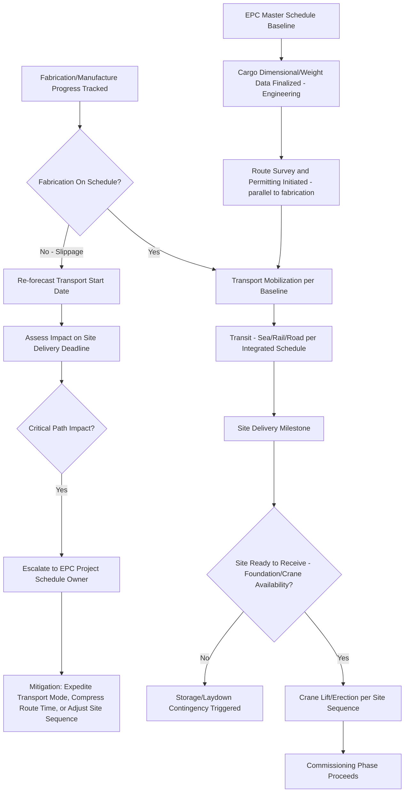

## Schedule Integration with EPC Construction Timelines

### Overview

Heavy-lift and project logistics do not operate as an independent workstream — they are almost always a subordinate, tightly-coupled input to a larger Engineering, Procurement, and Construction (EPC) project schedule. A single delayed module delivery can idle site construction crews, crane rental, and downstream trades at costs that dwarf the transport contract value itself. Schedule integration is the discipline of embedding logistics milestones correctly within the EPC master schedule so that transport risk is visible, tracked, and managed with the same rigor as engineering and construction risk.

### Why Logistics-EPC Integration Matters

**Key Points**

- Heavy-lift cargo (modules, reactors, transformers, turbine components) frequently sits on or near the EPC project's **critical path**, since site construction sequencing (crane mobilization, foundation readiness, site access) is often planned around a specific module's arrival window.
- A logistics delay that appears minor in isolation (a few days) can translate into substantially larger schedule and cost impact on-site if it causes a large mobile/crawler crane — itself on a tight rental and mobilization schedule — to stand idle or be released and re-mobilized later.
- [Inference] The disproportionate downstream cost of logistics delay relative to the delay itself is likely why EPC contracts frequently impose liquidated damages on the logistics/transport scope specifically, rather than treating it as a standard commercial freight arrangement with ordinary market remedies.

### EPC Schedule Structure and Where Logistics Fits

| EPC Phase | Typical Duration Driver | Logistics Integration Point |
| --- | --- | --- |
| Engineering | Design finalization, vendor drawings | Cargo dimensional/weight data finalized, enabling route survey to begin |
| Procurement | Fabrication lead time (often longest phase for heavy equipment) | Fabrication yard readiness date sets earliest possible transport start |
| Fabrication/Manufacture | Vendor shop schedule | Fabrication completion milestone triggers transport mobilization |
| Transport/Logistics | Route survey, permitting, transit | Delivery window must align with site readiness |
| Site Construction | Foundation/civil works, crane availability | Site must be ready to receive and erect cargo on arrival — reverse dependency |
| Commissioning | Systems integration and testing | Downstream of on-time module installation |

**Key Points**

- Logistics has a **dual dependency**: it depends on fabrication completion upstream, and site construction depends on it downstream — making it a genuine schedule pinch-point rather than a parallel, independent activity.
- Route survey and permitting work is frequently started well before fabrication completes, specifically to compress the overall timeline, since permitting for the largest abnormal loads can itself take months and does not need to wait for the physical cargo to exist.

### Critical Path Integration Techniques

**Key Points**

- **Milestone linking**: the EPC master schedule (typically in Primavera P6 or MS Project) includes explicit logistics milestones (fabrication complete, ex-works, vessel departure, vessel arrival, site delivery, crane lift/erection) as discrete, trackable activities rather than a single "transport" bar.
- **Float/buffer allocation**: schedule float is deliberately allocated around logistics activities with the highest uncertainty (weather-dependent sea voyage, permit-dependent road transport) rather than uniformly across the schedule, reflecting that these activities carry disproportionate variance.
- **Reverse scheduling from erection date**: for site-critical lifts, planners frequently work backward from the required crane erection date to derive the latest acceptable fabrication completion date, then flag any fabrication schedule slippage against that logistics-derived deadline as an immediate critical-path risk.
- **4D scheduling (schedule + site sequencing)**: on complex projects, logistics delivery sequencing is modeled against the physical site construction sequence, verifying that module delivery order matches the order the site can actually receive and erect them (e.g., cargo requiring the largest crane reach must not be scheduled to arrive when that crane is committed elsewhere on site).

### Schedule Risk Categories Specific to Logistics

**Key Points**

- **Fabrication slippage risk**: delays at the vendor's fabrication yard directly compress the logistics execution window, since the transport start date shifts but the site delivery deadline often cannot.
- **Weather/seasonal risk**: sea voyage and road transport windows both carry seasonal weather exposure (monsoon, hurricane season, winter road restrictions) that must be modeled into the schedule as probabilistic risk rather than a fixed duration assumption.
- **Permitting/regulatory risk**: abnormal-load road permits and cross-border customs clearance carry approval-timeline uncertainty that is often outside the logistics contractor's direct control, requiring early engagement to avoid becoming a late-discovered critical-path blocker.
- **Interface/handoff risk**: as with multi-contractor coordination generally, each mode-to-mode transfer point introduces schedule variance that compounds across a multi-leg route.

### Schedule Integration Workflow

### Contractual Mechanisms Linking Logistics to EPC Schedule

**Key Points**

- **Delivery window clauses**: transport contracts frequently specify a delivery window (rather than a fixed date) aligned to the EPC schedule's tolerance, with liquidated damages triggered only outside that window rather than for any deviation from a single target date.
- **Notice and re-forecast obligations**: transport contracts commonly require the logistics contractor to issue early-warning notices of anticipated delay as soon as identified, enabling the EPC schedule owner to re-sequence other site activities rather than discovering the delay at the delivery date itself.
- **Liquidated damages for delay**: as referenced in commercial contract structures, delay LDs on the logistics scope are typically calibrated to the actual downstream cost impact (crane standby, site labor idle time) rather than the transport contract value alone, reflecting the asymmetry between logistics cost and logistics-caused project cost.
- **Storage/laydown contingency provisions**: contracts often anticipate the scenario where cargo arrives before the site is ready (or vice versa), pre-agreeing responsibility and cost allocation for interim storage rather than leaving it to be negotiated under time pressure.

### Coordination Cadence with the EPC Project Team

**Key Points**

- Logistics progress is typically reported into the same project controls system and reporting cadence as engineering and construction progress, using comparable percent-complete or milestone-tracking metrics, so the EPC schedule owner can assess logistics risk on equal footing with other workstreams rather than as an opaque external dependency.
- Look-ahead schedules (commonly rolling 2–6 week windows) are used to surface near-term logistics milestones to the site team, enabling site crane and crew mobilization to be timed accurately against realistic (not merely baseline) delivery estimates.
- [Unverified] The specific reporting cadence and look-ahead window length vary considerably by project scale and owner requirements; there is no single fixed industry standard, though rolling multi-week look-aheads are a widely used convention.

**Related Topics**

- Critical Path Scheduling for Multimodal Project Cargo Movements
- Claims, Disputes, and Liability Limitation Clauses
- Coordinating Multiple Contractors and Subcontractors
- Fabrication Yard Selection and Vendor Schedule Risk Management
- Storage and Laydown Contingency Planning for Project Cargo
- Crane Selection and Site Erection Sequencing for Heavy Modules