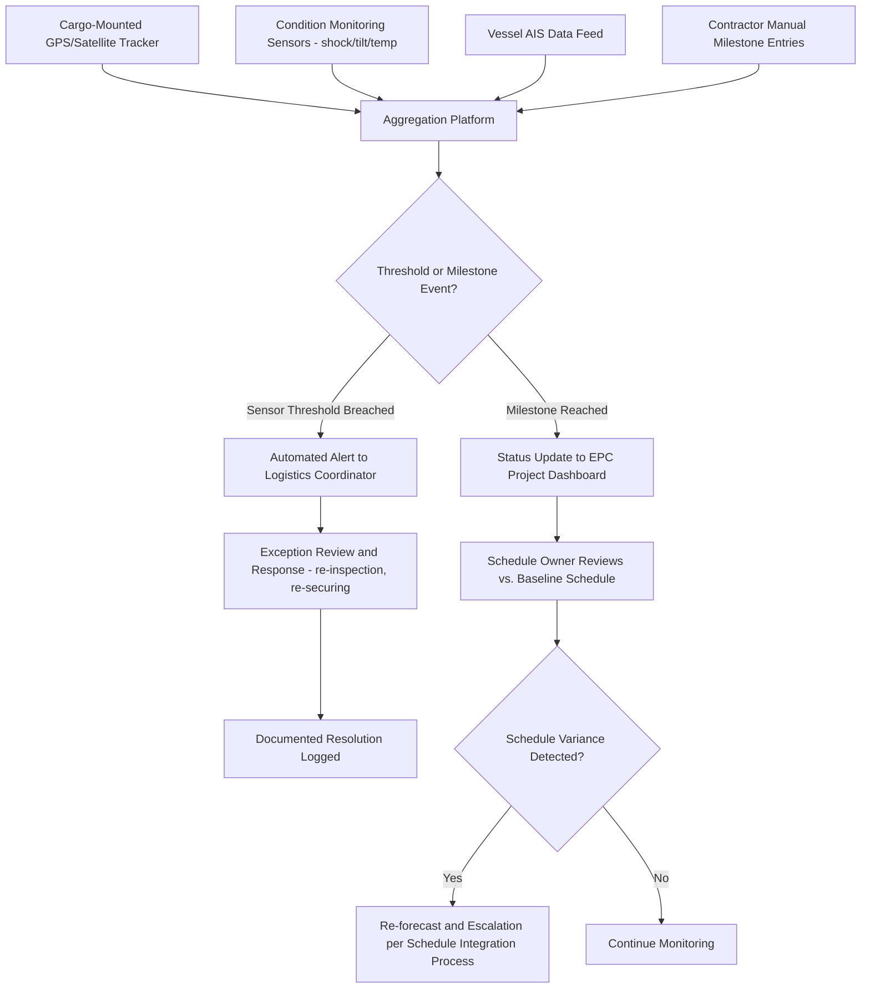

## Cargo Tracking and Real-Time Visibility Systems

### Overview

Cargo tracking and real-time visibility systems provide the positional, condition, and status data needed to monitor heavy-lift and project cargo across a multimodal journey. Unlike containerized freight, where visibility platforms are largely standardized around container/booking IDs, heavy-lift visibility solutions must often be assembled project-by-project, combining GPS/satellite tracking hardware, condition-monitoring sensors, and manual milestone reporting into a single dashboard that both the logistics coordinator and the downstream EPC schedule owner can consult.

### Why Visibility Matters More for Heavy-Lift Cargo

**Key Points**

- Because heavy-lift cargo frequently sits on or near the EPC project's critical path, the cost of *not knowing* a shipment's real status promptly is disproportionately high — a delay discovered late leaves no time to re-sequence site crane and crew mobilization.
- Cargo condition monitoring (shock, tilt, temperature, humidity) is often as important as positional tracking, since a single undetected impact or excessive tilt event during transit can necessitate a costly re-inspection or re-certification before the cargo is cleared for installation.
- [Inference] The emphasis on condition monitoring alongside position tracking in this sector likely reflects the fact that heavy-lift cargo is frequently uninsurable or only conditionally insurable against damage that isn't promptly identified and documented — an undetected shock event discovered only at final inspection is harder to attribute to a specific transit leg or party.

### Core Components of a Visibility System

| Component | Function | Typical Technology |
| --- | --- | --- |
| Positional tracking | Real-time or periodic location reporting | GPS trackers, satellite (Iridium/Inmarsat) for ocean transit, cellular/GSM for road/rail |
| Condition monitoring | Shock, tilt, temperature, humidity detection | Accelerometer/IMU-based data loggers, often battery-powered standalone units |
| Milestone/status reporting | Manual or semi-automated confirmation of key events (departure, arrival, transfer complete) | Web/mobile portal entries by contractors, EDI/API feeds from carriers |
| Document management integration | Linking tracking data to bills of lading, permits, surveys | Cloud-based project logistics platforms |
| Alerting/exception management | Automated notification when thresholds are breached | Rule-based alerts (e.g., tilt > X degrees, schedule variance > Y days) |

### Positional Tracking Technologies

**Key Points**

- **GPS/GNSS trackers**: battery-powered or hardwired units affixed directly to cargo or the transport conveyance, providing periodic or continuous location updates — the standard baseline for road and rail legs where cellular coverage is generally available.
- **Satellite tracking (Iridium, Inmarsat)**: necessary for ocean legs and remote overland routes outside cellular coverage, at higher cost per data transmission, often configured to report at longer intervals (hourly/every few hours) to conserve battery and reduce satellite data costs.
- **AIS (Automatic Identification System)**: for the sea leg specifically, vessel-level AIS tracking (rather than cargo-level) is often sufficient and is widely available via commercial AIS aggregation platforms, avoiding the need for cargo-mounted satellite trackers if only vessel position (not cargo-specific condition) is required.
- **Geofencing**: automated alerts triggered when cargo enters or exits a predefined geographic zone (e.g., port arrival zone, site boundary), used to automatically flag milestone events without requiring manual confirmation.

### Condition Monitoring

**Key Points**

- **Shock/impact sensors**: log peak acceleration events (measured in g-force) that may indicate mishandling, rough seas, or a hard stop during road transport — thresholds are typically calibrated to the cargo's specific fragility rating rather than a generic default.
- **Tilt/inclination sensors**: particularly relevant for cargo with orientation-sensitive components (rotating machinery, certain vessels/tanks) where excessive tilt during transit or lifting can cause internal damage not visible externally.
- **Environmental sensors** (temperature, humidity): relevant for cargo with corrosion-sensitive coatings or electronic/instrumentation components sensitive to condensation during ocean transit.
- Data loggers are typically retrieved and downloaded at key checkpoints (port arrival, site delivery) for detailed post-hoc analysis, while real-time telemetry variants transmit summary alerts continuously — the choice between the two often driven by cost and by whether a real-time response capability (rerouting, re-securing) is actually achievable mid-transit.

### Platform Architecture for Multimodal Visibility

**Key Points**

- Because no single carrier or mode typically has visibility across the full multimodal chain, project logistics visibility platforms are usually built as an **aggregation layer** sitting above individual contractors' own systems, pulling data via API integration where available and manual entry where not.
- **Milestone-based tracking** (rather than continuous positional tracking alone) is often the practical backbone for the overall project dashboard, since EPC stakeholders typically care more about "has the module left the fabrication yard" and "has it cleared customs" than continuous GPS coordinates.
- Dashboards are commonly structured to surface **exceptions** (missed milestones, sensor threshold breaches) rather than requiring the schedule owner to actively monitor continuous data streams — an exception-based design reduces the practical burden of tracking dozens of simultaneous shipments across a large project.

### Visibility System Data Flow

### Integration with Schedule and Claims Processes

**Key Points**

- Visibility data feeds directly into the schedule integration process discussed elsewhere in this chapter — milestone confirmations (fabrication complete, departure, arrival) are the raw inputs that trigger re-forecasting when actual events diverge from baseline.
- Condition monitoring data also serves an evidentiary role in claims and disputes: a documented shock event log or tilt threshold breach can support (or refute) a cargo damage claim by establishing when and where a potential damage-causing event occurred, which is often decisive in apportioning liability across multiple contractors' scopes.
- Time-stamped, geo-tagged sensor data is increasingly treated as part of the claims substantiation package required under standard notification/particulars clauses, since it provides objective evidence independent of any single contractor's own account of events.

### Practical Limitations and Failure Modes

**Key Points**

- **Coverage gaps**: satellite tracker battery life and cellular dead zones (remote road routes, certain rail corridors) can create genuine tracking gaps, particularly on multi-week ocean voyages or remote overland legs.
- **Sensor placement error**: a shock or tilt sensor mounted incorrectly relative to the cargo's actual center of gravity or most fragile component can produce misleading readings, making sensor placement itself a specialist task rather than an afterthought.
- **Integration fragmentation**: where multiple contractors use incompatible proprietary tracking systems, manual reconciliation into a single project dashboard remains common in practice, partially offsetting the efficiency gains automated tracking is intended to provide.
- [Unverified] The degree to which real-time visibility systems are standardized versus assembled ad hoc per project varies considerably across the industry and by project scale; there is no single dominant commercial platform occupying the role that, for example, container tracking platforms occupy in containerized shipping.

**Related Topics**

- Schedule Integration with EPC Construction Timelines
- Claims, Disputes, and Liability Limitation Clauses
- Marine Warranty Surveys and Conditions Precedent
- Coordinating Multiple Contractors and Subcontractors
- Intermodal Transfer Point Design and Sequencing
- Data Logger Deployment and Sensor Threshold Calibration for Project Cargo