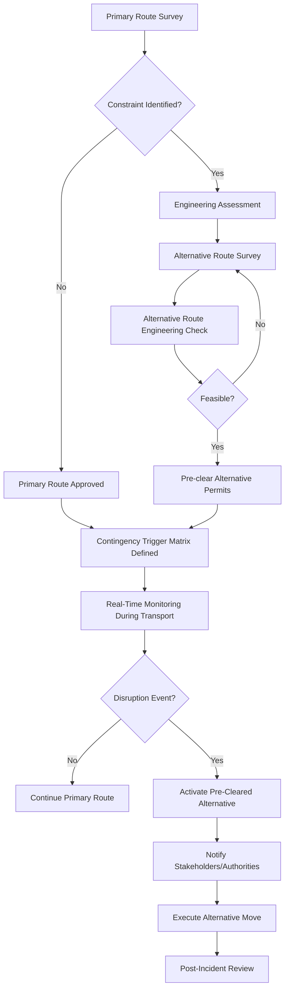

## Contingency and Alternative Routing Strategies

### Definition and Scope

Contingency and alternative routing strategies constitute the systematic pre-planning and real-time re-planning processes used in heavy-lift and specialized (project) logistics to ensure cargo movement continuity when a primary transport plan becomes unviable. Unlike general cargo logistics, where substitute carriers or standard reroutes are often trivial, heavy-lift routing constraints (bridge weight limits, tunnel clearances, vessel availability, permit windows) mean that alternatives must often be engineered and pre-cleared well in advance, not improvised.

This discipline sits at the intersection of route survey engineering, transport engineering, regulatory/permitting management, and risk management, and is a mandatory deliverable in most project logistics tenders for oil & gas, power generation, mining, and infrastructure megaprojects.

### Why Contingency Planning Is Structurally Different in Heavy-Lift

**Key Points**

- A "detour" for a standard 20ft container is a routing inconvenience; a detour for a 400-tonne reactor vessel may be structurally impossible without months of additional engineering.
- Alternative routes for abnormal/indivisible loads (AIL) must satisfy the same physical constraints as the primary route: axle load limits, swept path (turning radius), vertical clearance, bridge/culvert bearing capacity, and overhead utility clearances.
- Because of this, contingency routes are typically surveyed and provisionally approved *simultaneously* with the primary route, not developed reactively after a failure occurs.
- Permit validity windows, police escort scheduling, and utility relocation (temporary removal of power lines, traffic signals) often cannot be replicated quickly on a backup route if that route was not pre-cleared.

### Categories of Contingency Triggers

1. **Infrastructure failure/closure**
   - Bridge load restriction discovered during survey or imposed after survey (seasonal freeze-thaw postings, structural damage)
   - Road closures for repaving, construction, or accidents
   - Tunnel or underpass clearance changes (new utility installation reducing headroom)
2. **Environmental and seasonal disruption**
   - River/canal draft restrictions from drought (barge routes)
   - Ice closure of shipping lanes or river ports
   - Monsoon/flood damage to unpaved haul roads (common in mining and Southeast Asian/African EPC projects)
   - High wind windows preventing crane lifts or barge transits
3. **Port and vessel-related disruptions**
   - Heavy-lift vessel schedule slippage or breakdown
   - Port congestion or industrial action (strikes)
   - Berth unavailability due to draft restrictions
4. **Regulatory and permitting disruptions**
   - Denied or delayed permits from local road authorities
   - Escort/police resource unavailability
   - Election periods, public holidays, or security curfews restricting night moves
5. **Geopolitical and security disruptions**
   - Border closures, sanctions, or customs disputes
   - Regional conflict or civil unrest affecting a corridor
   - Sudden change in import/export regulations
6. **Equipment and mechanical failure**
   - SPMT (Self-Propelled Modular Transporter) breakdown
   - Prime mover or hydraulic system failure mid-transport
   - Vessel mechanical failure during a marine leg

### The Contingency Planning Process

**Step-by-step breakdown**

1. **Primary route survey and engineering**
   - Conducted using LiDAR/photogrammetric survey vehicles, physical measurement teams, or drone-based swept-path analysis
   - Produces a route book documenting every constraint point (bridges, roundabouts, overhead lines, narrow sections)
2. **Constraint and risk identification**
   - Each pinch point is rated by severity and probability of becoming a blocking issue
   - Bridges undergo bearing capacity checks against the cargo's axle loading and transporter configuration
3. **Alternative route identification**
   - Alternatives are sought at the corridor level (a parallel road), not just around a single obstacle, because a single-point workaround may reintroduce the same class of constraint elsewhere
   - Multiple alternative tiers are common: Alternative A (closest equivalent capability), Alternative B (longer but lower-risk), Alternative C (multimodal fallback, e.g., barge instead of road)
4. **Engineering validation of alternatives**
   - Same swept-path, load, and clearance checks applied to primary route
   - May require temporary reinforcement (steel plates, timber matting) to bring a marginal alternative up to the necessary load rating
5. **Pre-clearance and permitting**
   - Where budget allows, alternative routes are permitted in parallel with the primary route so activation requires no lead time
   - Where budget does not allow full pre-clearance, a "shadow permit" application is pre-drafted for rapid submission
6. **Trigger matrix definition**
   - A documented decision table mapping specific trigger events to specific pre-approved responses, removing ambiguity and decision latency during an actual disruption
7. **Real-time monitoring**
   - GPS/telematics tracking of the convoy or vessel
   - Weather, river gauge, and port congestion monitoring feeds
   - Communication protocols with escort police, port agents, and receiving site
8. **Activation and execution**
   - Formal go/no-go decision authority defined in advance (usually the Transport Manager or Logistics Coordinator, not the driver/skipper alone)
   - Stakeholder notification sequence: client, insurer, authorities, receiving terminal
9. **Post-incident review**
   - Root cause analysis and lessons-learned feedback into the route book and trigger matrix for future shipments

### Multimodal Contingency Considerations

Because "Multimodal Project Logistics Coordination" is the chapter context, contingency strategies must account for interface points between modes, which are frequently the weakest links.

**Sea-to-inland interface contingencies**

- Alternative discharge port if primary port is congested or draft-restricted (requires pre-verified quay bearing capacity and heavy-lift crane/SPMT ramp access at the alternate port)
- Barge-based inland movement as a fallback to road haulage where inland waterways parallel the road corridor (common on the Rhine, Mississippi, and Mekong systems)

**Rail-to-road interface contingencies**

- Alternative rail siding or transloading yard if the primary siding cannot handle the load's dimensions (schnabel car clearances, tunnel/bridge diagrams specific to rail)
- Road bridging around a rail service disruption (engineering strikes, derailments)

**Air-to-surface interface contingencies**

- Rare in true heavy-lift (payload limits of An-124 or C-17 type aircraft are far below typical heavy-lift cargo), but relevant for urgent spare parts or critical path components
- Alternative airport with adequate runway load-bearing and ramp space if primary airport handling is disrupted

**Multimodal contingency matrix (illustrative)**

| Primary Mode | Disruption Type | Pre-Planned Alternative | Lead Time to Activate |
| --- | --- | --- | --- |
| Ocean vessel | Port congestion | Divert to secondary port + extended road leg | 5-10 days |
| Barge | Low river draft | Split cargo/lightering + partial road transfer | 3-7 days |
| Road (SPMT) | Bridge load restriction | Pre-cleared bypass route via provincial road | 1-3 days (if pre-permitted) |
| Rail | Track possession/strike | Road haulage substitution | 2-5 days |
| Road (prime mover) | Equipment breakdown | Backup prime mover/SPMT on standby contract | Hours |

### Risk Assessment Framework for Route Alternatives

A standard approach uses a weighted risk score to rank and select among alternatives, rather than qualitative judgment alone.

$$R_i = \sum_{j=1}^{n} w_j \cdot s_{ij}$$

Where $R_i$ is the composite risk score for alternative route $i$, $w_j$ is the weight assigned to risk factor $j$ (e.g., permitting complexity, structural margin, cost delta, time delta), and $s_{ij}$ is the severity score of factor $j$ for route $i$, typically on a 1–5 scale.

**Typical weighted factors**

- Structural margin on critical bridges/culverts (weight: high)
- Permitting/regulatory complexity and lead time (weight: high)
- Incremental cost versus primary route (weight: medium)
- Incremental transit time and schedule impact (weight: medium)
- Community/stakeholder sensitivity (weight: low-medium)
- Historical reliability of the corridor (weight: medium)

Routes are ranked by ascending $R_i$; the lowest-scoring feasible alternative becomes the designated primary contingency.

### Key Contractual and Insurance Dimensions

- **Force majeure clauses**: Contingency routing costs are frequently disputed items in project logistics contracts; well-drafted contracts specify whether alternative routing costs triggered by force majeure events are reimbursable and under what evidentiary standard.
- **Marine and inland transit insurance**: Policies often require pre-notification of any deviation from the surveyed route; unauthorized deviation can void coverage, making pre-approval of contingency routes a insurance-compliance necessity, not just an operational one.
- **Liquidated damages exposure**: Delay caused by contingency activation may still trigger LDs under the main EPC contract unless the logistics contract's force majeure/relief provisions are back-to-back with the EPC contract terms.
- [Inference] In practice, many disputes over contingency cost allocation arise because logistics subcontracts and the parent EPC contract use inconsistent force majeure definitions; aligning these definitions during contract drafting is considered good practice by experienced project logistics counsel, though this is not a universally codified requirement.

### Route Survey Documentation Standard (Illustrative Schematic)

<svg xmlns="http://www.w3.org/2000/svg" viewBox="0 0 800 420">
<rect x="0" y="0" width="800" height="420" fill="#ffffff" />
<text x="400" y="28" font-family="Arial" font-size="18" font-weight="bold" text-anchor="middle" fill="#1a1a1a">Primary vs Alternative Route Corridor (svg_diagram)</text>
<line x1="60" y1="200" x2="740" y2="200" stroke="#2563eb" stroke-width="4" />
<text x="400" y="185" font-family="Arial" font-size="13" fill="#2563eb" text-anchor="middle">Primary Route (Highway 1)</text>
<path d="M 60 200 Q 250 320 460 320 Q 600 320 740 240" stroke="#dc2626" stroke-width="4" fill="none" stroke-dasharray="8,4" />
<text x="400" y="345" font-family="Arial" font-size="13" fill="#dc2626" text-anchor="middle">Alternative Route A (Provincial Bypass)</text>
<path d="M 60 200 Q 200 80 460 80 Q 620 80 740 200" stroke="#16a34a" stroke-width="4" fill="none" stroke-dasharray="2,6" />
<text x="400" y="65" font-family="Arial" font-size="13" fill="#16a34a" text-anchor="middle">Alternative Route B (Riverine/Barge Segment)</text>
<circle cx="60" cy="200" r="10" fill="#1a1a1a" />
<text x="60" y="230" font-family="Arial" font-size="12" text-anchor="middle" fill="#1a1a1a">Origin (Port)</text>
<circle cx="740" cy="200" r="10" fill="#1a1a1a" />
<text x="740" y="230" font-family="Arial" font-size="12" text-anchor="middle" fill="#1a1a1a">Destination (Site)</text>
<rect x="330" y="188" width="24" height="24" fill="#f59e0b" stroke="#92400e" stroke-width="1.5" />
<text x="342" y="250" font-family="Arial" font-size="11" text-anchor="middle" fill="#92400e">Bridge (Load-Restricted)</text>
<rect x="520" y="188" width="24" height="24" fill="#f59e0b" stroke="#92400e" stroke-width="1.5" />
<text x="532" y="250" font-family="Arial" font-size="11" text-anchor="middle" fill="#92400e">Overhead Utility</text>
<rect x="30" y="380" width="18" height="14" fill="#2563eb" />
<text x="55" y="392" font-family="Arial" font-size="11" fill="#1a1a1a">Primary</text>
<rect x="130" y="380" width="18" height="14" fill="#dc2626" />
<text x="155" y="392" font-family="Arial" font-size="11" fill="#1a1a1a">Alt. A (Road)</text>
<rect x="250" y="380" width="18" height="14" fill="#16a34a" />
<text x="275" y="392" font-family="Arial" font-size="11" fill="#1a1a1a">Alt. B (Multimodal)</text>
</svg>

### Practical Example

A 320-tonne gas turbine generator (GTG) is being transported from a discharge port to an inland power plant site, 140 km away, using an SPMT combination.

- **Primary route**: National highway with two river bridges, both rated at 350 tonnes gross vehicle weight, giving a small but acceptable margin.
- **Trigger event**: Two weeks before mobilization, the regional roads authority issues an emergency load restriction of 280 tonnes on Bridge 2 following a seismic inspection.
- **Response**: Because Alternative Route A (a longer provincial road with a Bailey-bridge bypass rated at 400 tonnes) had already been surveyed and provisionally permitted during the original planning phase, the logistics team activates it within 48 hours, at an added cost of transit time (+6 hours) and haulage distance (+35 km), but with zero schedule slippage to the overall project critical path.
- **Counterfactual**: Had Alternative Route A not been pre-surveyed and pre-permitted, the same activation would likely have required a fresh survey, temporary bridge reinforcement design, and a new permit application, a process that [Inference] commonly takes several weeks in jurisdictions with standard municipal permitting timelines, though actual duration varies significantly by jurisdiction and is not a fixed industry figure.

### Common Pitfalls

- Treating contingency planning as a paperwork exercise rather than pre-engineering the alternative to the same rigor as the primary route
- Failing to pre-clear permits, resulting in an alternative that is "theoretically" available but not "operationally" available within the schedule window
- Ignoring interface risk at modal transition points (port, rail siding, barge landing) when only the linear route is assessed
- Not defining clear go/no-go decision authority, causing delay through indecision during an actual disruption
- Assuming insurance coverage automatically extends to deviated routes without contractual confirmation

### Related Topics

- Route Survey and Swept Path Analysis for Abnormal Indivisible Loads
- Permit Management and Escort Coordination for Oversized Cargo
- Heavy-Lift Vessel Chartering and Port Selection Criteria
- Force Majeure and Risk Allocation in Project Logistics Contracts
- SPMT and Modular Transporter Configuration Engineering
- Multimodal Interface Risk Management (Port, Rail, and Barge Transitions)
- Weather Routing and Seasonal Corridor Restrictions in Project Cargo Movement
- Bridge and Culvert Load Rating Assessment Methods