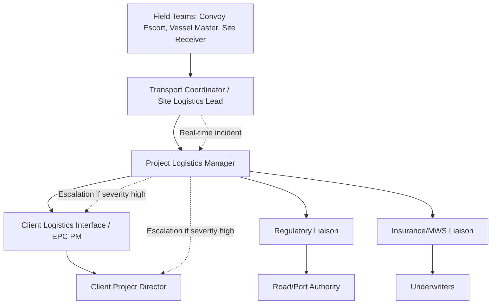

## Stakeholder Communication and Reporting Structures

### Definition and Scope

Stakeholder communication and reporting structures in heavy-lift and specialized (project) logistics refer to the formalized systems, cadences, document formats, and escalation hierarchies used to keep all parties involved in a multimodal cargo movement synchronized on status, risk, and decision-making authority. In project logistics, the stakeholder set is typically larger and more heterogeneous than in general freight forwarding, spanning engineering, procurement, construction (EPC) contractors, vessel owners, port agents, customs brokers, insurers, regulatory authorities, and the end client, often across multiple countries and time zones simultaneously.

Because a single abnormal or indivisible load (AIL) movement may involve marine, rail, and road legs with tightly sequenced interface points, a breakdown in communication at any single node can cascade into schedule and cost impacts across the entire transport chain. Reporting structure design is therefore treated as a core project deliverable, not an administrative afterthought.

### Why This Function Is Structurally Different from General Freight

**Key Points**

- General freight reporting is often transactional (shipment status, ETA); project logistics reporting must additionally convey engineering risk (bridge margins, weather windows, permit status) that directly affects safety and schedule.
- Multiple simultaneous "single points of failure" exist across modes; each interface (port-to-road, road-to-rail, rail-to-site) requires its own confirmation loop.
- Client organizations for megaprojects (power, oil & gas, mining, infrastructure) usually mandate specific reporting formats and escalation matrices as contractual requirements, not optional practice.
- Regulatory and permitting stakeholders (road authorities, port authorities, customs) often require statutory notifications with legal consequences for non-compliance, distinct from purely informational client updates.

### Stakeholder Mapping

A structured stakeholder map is the foundation of the communication plan. Stakeholders are typically classified along two axes: influence over the transport outcome, and interest/impact from the transport outcome.

| Stakeholder Category | Examples | Typical Communication Need |
| --- | --- | --- |
| Client/Owner | End client, client's site logistics team | Milestone status, risk exposure, schedule impact |
| EPC Contractor | Project manager, construction manager | Delivery sequencing, site readiness coordination |
| Transport Operators | Heavy-lift vessel owner, SPMT operator, rail operator | Operational execution details, technical constraints |
| Regulatory Authorities | Road authority, port authority, customs, police escort units | Statutory permits, notifications, compliance confirmations |
| Insurers/Surveyors | Marine cargo insurer, marine warranty surveyor (MWS) | Route deviation approval, loss prevention sign-off, incident reporting |
| Financial/Commercial | Freight forwarder's commercial team, client's finance | Invoicing milestones, demurrage/detention exposure |
| Community/Public | Local authorities, affected residents along route | Traffic disruption notices, safety advisories |

**RACI-style responsibility mapping** is commonly layered on top of the stakeholder map to clarify who is Responsible, Accountable, Consulted, and Informed for each reporting artifact, since project logistics often involves subcontracted transport operators reporting through a lead logistics coordinator rather than directly to the client.

### Reporting Structure Hierarchy

**Layer definitions**

1. **Field-level reporting**: Convoy escort leads, vessel masters, crane supervisors, and site receiving teams generate raw operational data (position, timing, incidents) via radio, telematics, or mobile reporting apps.
2. **Coordination-level reporting**: A Transport Coordinator or Site Logistics Lead consolidates field data into structured updates, typically on a daily or per-movement basis.
3. **Management-level reporting**: The Project Logistics Manager aggregates coordination-level data across all concurrent movements, applies risk judgment, and produces the primary client-facing report.
4. **Executive/client-level reporting**: Summarized status, schedule impact, and risk exposure delivered to the client's project director or steering committee, usually on a weekly or milestone basis.
5. **Regulatory/statutory reporting**: Parallel, often legally mandated, reporting to authorities that is independent of the internal management chain (e.g., pre-move notifications to police escort units, post-incident reports to road authorities).

### Standard Reporting Cadences and Formats

| Report Type | Frequency | Primary Audience | Typical Content |
| --- | --- | --- | --- |
| Daily Transport Status Report (DTSR) | Daily during active movement | Project Logistics Manager, Client Logistics Interface | Position, milestones achieved, deviations, next 24h plan |
| Weekly Progress Report | Weekly | Client Project Director, EPC PM | Cumulative schedule status, risk register update, cost exposure |
| Pre-Movement Briefing | Once, before mobilization | All operational stakeholders | Route confirmation, permit status, weather window, escort plan |
| Incident/Near-Miss Report | Within defined SLA (often 2-24h) | Client, insurer, regulatory authority (as applicable) | Description, root cause (preliminary), immediate corrective action |
| Post-Delivery Completion Report | Once, at delivery | Client, EPC PM, commercial team | Confirmation of delivery, final POD (proof of delivery), any residual claims |
| Monthly Steering Committee Report | Monthly (for multi-shipment programs) | Executive stakeholders | Program-level KPI trends, cumulative risk themes |

**[Inference]** Exact SLA windows for incident reporting (e.g., 2 hours vs. 24 hours) vary by contract and jurisdiction; the ranges shown reflect common industry practice rather than a universal standard.

### Escalation Matrix Design

An escalation matrix defines, in advance, who must be notified, by what channel, and within what time window, based on the severity of a deviation or incident. This removes ambiguity during time-pressured situations.

**Typical severity tiers**

- **Tier 1 (Informational)**: Minor schedule variance (<4 hours), routine weather delay. Notification: next scheduled DTSR, no immediate escalation.
- **Tier 2 (Operational)**: Route deviation activated, permit renewal required, moderate schedule impact (4-24 hours). Notification: same-day notice to Project Logistics Manager and Client Logistics Interface.
- **Tier 3 (Critical)**: Safety incident, cargo damage, major schedule impact (>24 hours), contingency route failure. Notification: immediate (within defined SLA, often 1-2 hours) to Client Project Director, insurer, and relevant regulatory authority.
- **Tier 4 (Crisis)**: Loss of cargo, fatality/serious injury, environmental incident. Notification: immediate, multi-channel (phone plus written follow-up), often triggering formal crisis management protocols and, depending on jurisdiction, mandatory regulatory reporting timelines.

### Communication Channels and Technology

- **Telematics/GPS tracking platforms**: Provide real-time position data feeding automatically into DTSRs, reducing manual reporting burden and latency
- **Mobile field reporting apps**: Allow escort leads and site receivers to log timestamped photos, GPS-tagged incident reports, and checklist confirmations
- **Structured email/EDI updates**: Common for formal, auditable client reporting where a paper trail is contractually required
- **Dedicated WhatsApp/Teams operational channels**: Widely used in practice for real-time coordination during active movements, though typically supplemented by a formal written report to maintain an auditable record
- **Control tower / project logistics dashboards**: Centralized platforms (e.g., built on Power BI, Tableau, or bespoke client portals) aggregating multi-shipment status for program-level visibility

[Inference] The specific technology stack varies considerably by logistics provider and client requirement; no single platform is an industry-wide standard, though centralized "control tower" visibility is increasingly expected on large multimodal programs.

### Multimodal-Specific Reporting Considerations

Because this topic sits within "Multimodal Project Logistics Coordination," reporting structures must explicitly bridge the reporting conventions of each mode, which often differ in terminology and cadence.

- **Marine leg**: Vessel position reports (noon reports), port agent updates on berthing/discharge windows, marine warranty surveyor sign-offs before load-out and sail-away
- **Rail leg**: Consist composition confirmations, siding/yard handover reports, rail operator's own scheduling system updates (which may need manual translation into the project's standard report format)
- **Road leg**: Convoy position updates, escort police liaison confirmations, permit compliance checks at each jurisdictional boundary
- **Interface handovers**: A dedicated "Transfer of Custody" or "Handover Confirmation" report at each modal transition point, typically requiring signature/acknowledgment from both the outgoing and incoming operator, since liability and insurance responsibility often shift at these exact points

### Practical Example

A 280-tonne transformer moves from an origin port (marine leg) to an inland substation (road leg via SPMT), a 90 km journey through two provincial jurisdictions.

- **Pre-movement**: A Pre-Movement Briefing is issued 5 days prior, consolidating vessel discharge schedule, SPMT mobilization plan, and confirmed police escort windows for both jurisdictions.
- **Day of movement**: The convoy escort lead files hourly position updates via a mobile app; a minor 3-hour delay occurs at a level crossing due to unscheduled rail traffic. This is logged as Tier 1 and included in that day's DTSR without special escalation.
- **Unplanned event**: While crossing into the second jurisdiction, the convoy is stopped because the police escort unit was not pre-notified of a schedule shift from the earlier delay. This becomes a Tier 2 event: the Transport Coordinator immediately notifies the Project Logistics Manager, who liaises directly with the second jurisdiction's traffic authority to resume escort coverage within the hour.
- **Handover**: On arrival at the substation, a Transfer of Custody report is signed jointly by the SPMT operator's site supervisor and the client's site receiving engineer, formally closing out the road leg and transferring risk to the client's site team.
- **Reporting outcome**: The Weekly Progress Report to the client's Project Director notes the completed delivery, references the Tier 2 escort delay as a resolved risk item, and updates the program risk register accordingly.

### Common Pitfalls

- Relying solely on informal channels (calls, chat apps) without a parallel formal written record, creating auditability gaps for insurance or contractual disputes
- Undefined escalation thresholds, causing either alarm fatigue (over-escalation of minor issues) or dangerous under-escalation of genuine risks
- Treating regulatory/statutory reporting obligations as equivalent to internal client reporting, when the two often have different legal triggers, formats, and deadlines
- Failing to define handover/custody transfer documentation at modal interface points, leaving liability and responsibility ambiguous during disputes
- Reporting structures designed around a single shipment that do not scale to multi-shipment, program-level visibility needs

### Related Topics

- Risk Register Development and Maintenance for Project Cargo Movements
- Marine Warranty Surveyor (MWS) Role and Sign-Off Requirements
- Control Tower Platforms for Multi-Shipment Program Visibility
- Transfer of Custody and Liability Allocation at Modal Interfaces
- Incident Investigation and Root Cause Analysis in Heavy-Lift Transport
- Client Reporting Requirements in EPC Contract Logistics Clauses
- Crisis Management Protocols for Cargo Loss or Safety Incidents