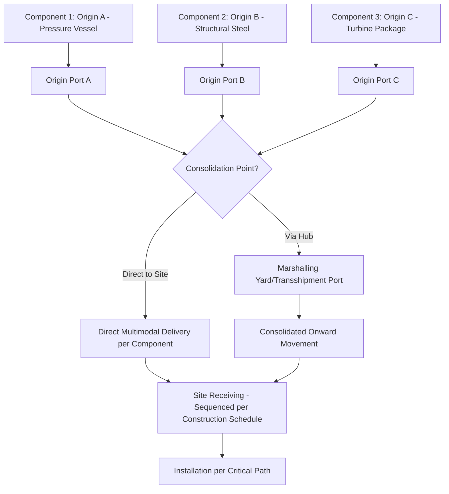

## Managing Multi-Origin Consolidation Projects

### Definition and Scope

Multi-origin consolidation in heavy-lift and specialized (project) logistics refers to the coordinated procurement, tracking, and physical assembly of project cargo components manufactured or sourced across multiple geographically dispersed origins, into a unified delivery sequence at a single destination site. This is distinct from standard freight consolidation (combining multiple small shipments into one container) because project cargo components are frequently interdependent, oversized, and manufactured on independent, non-synchronized production schedules by different fabricators across different countries.

A single power plant, refinery module, or mining processing line may involve a pressure vessel from South Korea, structural steel from India, instrumentation packages from Germany, and a gas turbine from the United States, all needing to arrive at site in a specific sequence dictated by the construction schedule, not simply by shipping convenience.

### Why Multi-Origin Consolidation Is a Distinct Discipline

**Key Points**

- Individual component delays at any single origin can cascade into site construction delays if the component is on the critical path, even when all other components arrive on time.
- Components often require different transport modes and equipment (breakbulk vessel, heavy-lift vessel, RoRo, project cargo rail), each with different scheduling lead times and booking windows.
- Consolidation decisions must balance transport cost efficiency (combining shipments where possible) against schedule risk (waiting for a slower origin delays everything consolidated with it).
- Customs, documentation, and certification requirements often differ by origin country and must be harmonized for a coherent site delivery and installation sequence.

### Core Planning Dimensions

1. **Manufacturing schedule integration**
   - Each origin's fabrication/manufacturing schedule must be tracked against the site's construction schedule, not treated as an independent logistics variable
   - Expediting visits and fabrication progress reporting are often logistics-adjacent responsibilities in project cargo, since late fabrication directly drives transport timing
2. **Site delivery sequencing (Just-in-Time vs. buffered delivery)**
   - Construction sequences typically dictate a required-on-site date range for each component, not simply "as soon as possible"
   - Premature arrival can create site congestion, laydown yard costs, and potential component degradation (corrosion, UV damage) from prolonged outdoor storage
   - Late arrival can idle expensive site labor and cranage resources, often at higher cost than transport acceleration would have been
3. **Consolidation point strategy**
   - A transshipment or marshalling hub (port or inland yard) may be used to stage components from multiple origins before a final consolidated move to site
   - Reduces the number of separate site mobilizations (each heavy-lift delivery to site often requires its own escort, permit, and crane mobilization)
   - Introduces an additional handling and storage cost layer that must be weighed against the mobilization savings
4. **Mode and carrier optimization per origin**
   - Different origins may favor different optimal modes: an origin with strong project cargo vessel service may ship direct breakbulk, while an origin without such service may require inland trucking to a nearby consolidation port first
5. **Documentation and customs harmonization**
   - Certificates of origin, material test certificates, and export documentation formats vary by country
   - Import customs clearance planning must account for components arriving on different vessels/dates but potentially needing to clear as a coordinated set for site scheduling

### Multi-Origin Consolidation Workflow

### Critical Path Scheduling for Consolidated Deliveries

Multi-origin projects require integration of the transport schedule into the overall project critical path method (CPM) schedule, typically using standard project scheduling tools (Primavera P6, MS Project) with logistics milestones as discrete activities.

$$T_{site} = \max(T_{A} + L_{A},\ T_{B} + L_{B},\ \dots,\ T_{N} + L_{N})$$

Where $T_{site}$ is the earliest feasible consolidated site-ready date, $T_i$ is the manufacturing completion date at origin $i$, and $L_i$ is the transport lead time (including any consolidation dwell time) from origin $i$ to site. This makes explicit that the slowest origin-plus-transport combination governs the overall schedule, a principle directly analogous to critical path logic in project scheduling.

**Practical implication**: Logistics planners must identify which origin is likely to be the "long pole" early, and apply expediting, schedule buffer, or premium transport mode selection preferentially to that origin rather than uniformly across all origins.

### Risk Categories Specific to Multi-Origin Projects

| Risk Category | Description | Typical Mitigation |
| --- | --- | --- |
| Fabrication schedule slippage | One origin's manufacturing runs late, threatening the consolidated delivery date | Buffer scheduling, expediting visits, alternative fabricator qualification |
| Currency and cost exposure | Multiple origins mean multiple currency and freight market exposures | Forward currency contracts, fixed-rate freight agreements where feasible |
| Customs/documentation mismatch | Differing export documentation standards delay import clearance | Standardized documentation checklist per origin, pre-clearance where possible |
| Consolidation point congestion | Marshalling yard receives components faster than it can process/forward them | Yard capacity planning, staggered arrival scheduling |
| Mode availability mismatch | One origin lacks direct heavy-lift vessel service, requiring an extra transshipment leg | Early route engineering identifying feasible mode chains per origin |
| Component damage during extended dwell | Components awaiting consolidation are exposed to weather/handling risk | Preservation and lay-up procedures, covered storage where cargo value justifies it |

### Vendor and Freight Forwarder Coordination Structures

- **Single Lead Logistics Provider (LLP) model**: One forwarder or logistics coordinator manages all origins under a unified contract, providing consolidated visibility but concentrating execution risk with one provider
- **Multi-forwarder model with central coordination**: Each origin uses a locally optimal forwarder (often the manufacturer's preferred/incumbent agent), with a central project logistics coordinator aggregating status and managing the consolidation point
- **EPC-managed logistics**: The EPC contractor's own logistics department manages coordination directly, often used when the EPC has strong in-house project cargo capability

[Inference] The choice among these models is generally driven by project scale, the EPC's internal logistics capability, and contractual risk allocation preferences; no single model is universally preferred across the industry, and large programs sometimes use a hybrid of the LLP and multi-forwarder approaches.

### Practical Example

An EPC contractor is building a combined-cycle power plant with components from three origins:

- Gas turbine generator (320 tonnes) from a fabricator in South Korea, with a confirmed manufacturing completion date and direct heavy-lift vessel service to the destination region
- Heat recovery steam generator (HRSG) modules (four modules, 90 tonnes each) from a fabricator in India, requiring inland trucking to a port with less frequent project cargo vessel service
- Structural steel and piping spools from a regional fabricator in Vietnam, close to the destination but with a schedule prone to slippage due to high regional demand

**Planning outcome**: The critical path analysis identifies the HRSG modules from India as the long pole, due to the combination of inland trucking lead time and less frequent vessel service. The logistics team books a dedicated part-charter breakbulk vessel for the HRSG modules with a earlier sailing date to compensate, while the gas turbine (on a faster, more frequent vessel service) is scheduled with standard lead time. Vietnam-origin steel, being closest to site and most schedule-flexible, is held to the latest booking commitment, allowing the fabricator maximum production flexibility without threatening the overall site delivery sequence. All three components are planned to arrive at site within a 3-week window matching the construction schedule's erection sequence, avoiding both premature laydown costs and idle crane time.

### Common Pitfalls

- Optimizing each origin's transport independently for cost, without reference to the overall site delivery sequence, resulting in either premature arrivals (storage cost) or late arrivals (construction delay)
- Underestimating consolidation point dwell time when a marshalling yard or transshipment port is used, particularly during peak shipping seasons
- Inconsistent documentation standards across origins causing customs delays that were not accounted for in the schedule
- Treating all origins as equal priority for expediting resources, rather than focusing on the identified critical-path origin
- Insufficient visibility into manufacturing progress at each origin, discovering fabrication delays too late to adjust transport booking

### Related Topics

- Critical Path Method (CPM) Integration with Project Logistics Scheduling
- Expediting and Manufacturing Progress Monitoring for Project Cargo
- Marshalling Yard and Transshipment Hub Selection Criteria
- Lead Logistics Provider (LLP) vs. Multi-Forwarder Contracting Models
- Preservation and Lay-Up Procedures for Extended Cargo Dwell Time
- Cross-Border Customs Harmonization for Multi-Origin Project Shipments
- Site Laydown Yard Planning and Construction Sequencing Coordination