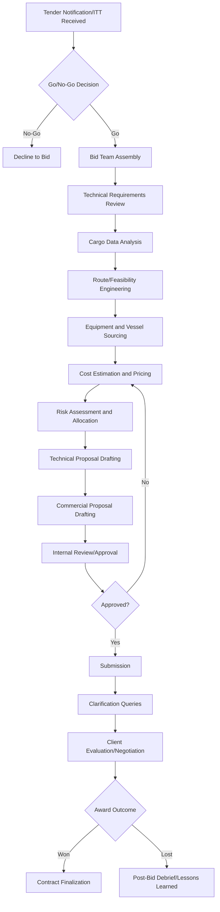

## Request for Quotation and Tender Response Development

### Definition and Scope

Request for Quotation (RFQ) and tender response development in heavy-lift and specialized (project) logistics refers to the structured commercial and technical process by which a logistics provider evaluates a client's cargo movement requirements and produces a competitive, executable proposal. Unlike general freight quoting, heavy-lift tender responses require integrated engineering feasibility assessment (can this cargo physically move via the proposed method at all) alongside commercial pricing, because failure to verify feasibility before quoting can result in either an unwinnable bid (over-conservative pricing) or a contractually binding commitment to an operation that turns out to be technically impossible or unsafe.

This process typically spans pre-tender qualification, technical proposal development, commercial pricing, risk allocation negotiation, and final submission, often under significant time pressure given typical tender response windows of 2-6 weeks for complex multimodal projects.

### Why Heavy-Lift Tendering Differs from Standard Freight Quoting

**Key Points**

- Engineering feasibility must often be assessed before a price can be responsibly quoted, since route/vessel/equipment constraints directly drive cost and risk.
- Tender documents (Invitation to Tender/ITT, RFQ, RFP) for major projects frequently run to hundreds of pages including technical specifications, cargo lists, general terms and conditions, and required certifications.
- Bids commonly require substantial upfront investment (survey costs, engineering studies, vessel option fees) before any contract is secured, unlike low-cost general freight quotes.
- Client evaluation criteria typically weight technical competence and risk management approach alongside price, meaning the lowest bid does not automatically win.

### The Tender Response Lifecycle

### Stage-by-Stage Breakdown

1. **Go/No-Go decision**
   - Preliminary screening against the firm's capability, capacity, risk appetite, and strategic fit
   - Key factors: cargo type familiarity, geographic experience, competitive positioning, client relationship history, bid cost versus probability of win
   - [Inference] Many established heavy-lift providers apply a formal weighted scoring matrix at this stage, though the specific criteria and weightings are firm-proprietary and not standardized industry-wide
2. **Bid team assembly**
   - Typically cross-functional: commercial/sales lead, project engineer, operations manager, and often a dedicated bid/proposal writer for complex tenders
   - Clear internal accountability assigned for technical accuracy versus commercial competitiveness
3. **Technical requirements review**
   - Parsing the ITT/RFQ for scope of work, cargo specifications, required delivery windows, mandatory certifications (ISO, OHSAS/ISO 45001, marine warranty survey requirements), and evaluation criteria
   - Identifying any ambiguities requiring formal clarification queries to the client
4. **Cargo data analysis**
   - Reviewing dimensional data, weight, center of gravity, lifting point locations, and fragility/sensitivity requirements for each cargo item
   - Cross-referencing against the firm's available or accessible equipment inventory (SPMTs, cranes, vessels)
5. **Route and feasibility engineering**
   - Preliminary desktop route survey (satellite imagery, existing infrastructure databases) to identify obvious constraints before committing to a full physical survey
   - For competitive but high-value tenders, a limited physical survey of critical pinch points may be commissioned even before contract award
6. **Equipment and vessel sourcing**
   - Confirming availability and indicative pricing from owned fleet or third-party providers (heavy-lift vessel charter brokers, SPMT rental companies, crane subcontractors)
   - Securing non-binding options or holds on critical path equipment where the bid timeline allows
7. **Cost estimation and pricing**
   - Building a cost model incorporating: transport/freight costs, equipment mobilization/demobilization, permits and escorts, insurance, engineering/survey costs, contingency allowance, and margin
   - Applying appropriate Incoterms understanding to ensure scope boundaries (who bears which cost/risk from which point) are correctly reflected in the quoted price
8. **Risk assessment and allocation**
   - Identifying project-specific risks (route uncertainty, permit timelines, force majeure exposure) and determining which risks the bid price should absorb versus which should be contractually allocated to the client or covered by exclusions/qualifications
   - Drafting clear qualifications and exclusions to protect the bidder from unpriced risk
9. **Technical proposal drafting**
   - Method statements describing the proposed transport methodology for each cargo item or cargo category
   - Route description, equipment specification, safety management approach, and relevant track record/case studies
10. **Commercial proposal drafting**
    - Pricing schedule structured per the tender's required format (often line-item by cargo piece, by route segment, or by lump-sum milestone)
    - Payment terms, validity period, and commercial qualifications
11. **Internal review and approval**
    - Technical review for feasibility accuracy, commercial review for margin and risk exposure, often requiring sign-off from senior management for high-value or high-risk bids
12. **Submission and post-submission engagement**
    - Formal submission per the ITT's specified format and channel
    - Responding to client clarification queries, which may themselves reveal scope changes requiring price/technical revision

### Key Components of a Heavy-Lift Tender Response Document

| Section | Purpose | Typical Content |
| --- | --- | --- |
| Executive Summary | High-level overview for client decision-makers | Company credentials, proposed approach summary, key differentiators |
| Technical Proposal / Method Statement | Demonstrates feasibility and safety approach | Route description, equipment selection, engineering calculations, HSE approach |
| Cargo-Specific Transport Plans | Shows understanding of individual cargo requirements | Lifting plans, lashing/securing methodology, transport configuration per item |
| Commercial Proposal | Pricing and commercial terms | Pricing schedule, payment terms, validity, currency, escalation clauses |
| Risk Register / Qualifications | Manages liability and unpriced risk | Assumptions, exclusions, force majeure position, client-dependency items |
| Company Credentials | Establishes credibility | Track record, similar project references, certifications, fleet/equipment list |
| Compliance Matrix | Demonstrates point-by-point ITT compliance | Cross-reference table mapping each ITT requirement to the proposal section addressing it |

### Cost Estimation Structure (Illustrative)

A simplified cost buildup for a heavy-lift tender line item typically follows:

$$C_{total} = C_{freight} + C_{equipment} + C_{permits} + C_{insurance} + C_{engineering} + C_{contingency} + M$$

Where $C_{freight}$ covers vessel/transport charter or line-haul costs, $C_{equipment}$ covers SPMT/crane mobilization and rental, $C_{permits}$ covers permit fees and escort costs, $C_{insurance}$ covers marine cargo and liability coverage, $C_{engineering}$ covers survey and lifting/transport engineering studies, $C_{contingency}$ is a risk-based allowance (commonly derived from the risk assessment stage), and $M$ is the applied margin.

**[Inference]** Contingency allowance percentages vary considerably by project risk profile and company policy (commonly cited informally in the range of 5-15% of base cost for well-defined scopes, higher for scopes with significant route or permitting uncertainty), but there is no fixed industry-standard percentage.

### Compliance Matrix Example

A compliance matrix is a near-universal requirement in formal tenders and directly maps ITT clauses to proposal responses, reducing the risk of technical disqualification for incompleteness.

| ITT Clause Ref | Requirement | Proposal Section | Compliance Status |
| --- | --- | --- | --- |
| 4.2.1 | Method statement for each cargo >100t | Section 3.2 | Fully Compliant |
| 4.3.5 | Marine warranty survey to be arranged by contractor | Section 3.4 | Fully Compliant |
| 5.1.2 | Delivery within 45 days of contract award | Section 5.1 | Compliant with Qualification (weather contingency noted) |
| 6.4.0 | ISO 9001 certification | Section 6.1 (Appendix A) | Fully Compliant |

### Risk Allocation and Qualification Language

Careful drafting of qualifications and exclusions is a critical risk management tool, distinguishing a professionally managed bid from one that unknowingly assumes uncosted risk.

**Common qualification categories**

- Client-dependent items (site readiness, permit sponsorship by client, provision of accurate cargo data)
- Force majeure and external events beyond the bidder's control (see related contingency routing content for detail)
- Assumptions made in the absence of complete information at bid stage (e.g., "assumes ground bearing capacity of X kPa pending geotechnical confirmation")
- Price validity period and currency/fuel escalation triggers

### Practical Example

A logistics provider receives an ITT for transporting six reactor vessels (180 tonnes each) from a fabrication yard to an inland refinery site, with a 6-week tender response window.

- **Go/No-Go**: The firm has relevant experience with similar vessel dimensions and an existing relationship with the client's EPC contractor, resulting in a Go decision.
- **Feasibility engineering**: A desktop route review using available infrastructure databases identifies one bridge with an unconfirmed load rating on the only viable road corridor. Given the bid's value, the firm commissions a limited physical survey of that single bridge (rather than the full route) to resolve the uncertainty before pricing.
- **Survey outcome**: The bridge is confirmed adequate with a standard SPMT configuration, avoiding the need to price a costly bridge reinforcement contingency.
- **Pricing**: The cost model incorporates confirmed vessel charter rates (obtained via a non-binding hold from a heavy-lift vessel broker), SPMT rental, permit fee estimates based on the relevant road authority's published schedule, and a 10% contingency reflecting moderate remaining route uncertainty on secondary road segments not physically surveyed.
- **Qualification drafted**: The proposal explicitly qualifies that permit approval timelines are assumed based on the road authority's stated standard processing time, with a caveat that unusual delays may require schedule and cost renegotiation.
- **Outcome**: The compliance matrix confirms full coverage of all 40+ ITT clauses; the bid is submitted with a validity period of 60 days and is subsequently shortlisted for client clarification queries regarding the bridge survey methodology, which the firm is able to answer confidently due to the completed limited survey.

### Common Pitfalls

- Pricing a bid before feasibility is confirmed, resulting in either an unrealistically low (unprofitable or unsafe) price or losing the tender due to excessive built-in risk premium
- Vague or missing qualifications, causing the bidder to unknowingly accept risks (permitting delays, site readiness issues) that should contractually sit with the client
- Incomplete compliance matrices, leading to technical disqualification even when the underlying proposal is competitive
- Underestimating bid costs (survey, engineering studies) relative to the probability of winning, eroding overall commercial bid economics across a portfolio of tenders
- Failing to align technical and commercial proposal sections, creating internal inconsistencies that undermine client confidence during evaluation

### Related Topics

- Route Survey and Swept Path Analysis for Abnormal Indivisible Loads
- Contingency and Alternative Routing Strategies
- Heavy-Lift Vessel Chartering and Freight Market Dynamics
- Incoterms Application in Project Cargo Contracts
- Risk Register Development and Maintenance for Project Cargo Movements
- Marine Warranty Surveyor (MWS) Role and Sign-Off Requirements
- Contract Negotiation and Risk Allocation in Project Logistics Agreements