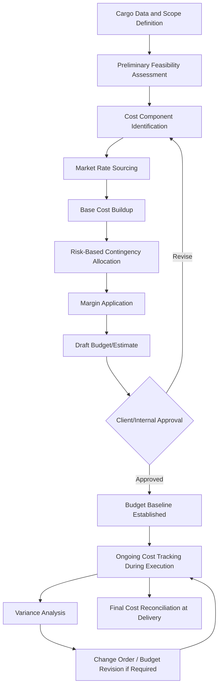

## Cost Estimation and Budgeting for Project Cargo

### Definition and Scope

Cost estimation and budgeting for project cargo is the discipline of forecasting, structuring, and controlling the full financial scope of a heavy-lift or specialized logistics operation, from initial feasibility through final delivery. Unlike standard freight costing, which often relies on published tariffs and relatively stable rate cards, project cargo cost estimation must account for bespoke engineering studies, non-standardized equipment mobilization, route-specific permitting, and significant schedule and risk contingencies, because no two abnormal/indivisible load (AIL) movements are commercially identical even when cargo specifications appear similar.

This discipline underpins both the tender/RFQ pricing process (see related tendering content) and ongoing project cost control once a contract is awarded, and is typically owned jointly by a project logistics manager and a commercial/finance function.

### Why Project Cargo Costing Differs from Standard Freight

**Key Points**

- Many cost components (permits, escort fees, route reinforcement, engineering studies) are route- and jurisdiction-specific and cannot be estimated from generic freight rate tables.
- Equipment costs (SPMTs, heavy-lift cranes, barges) are often sourced through spot-market charter or rental rather than fixed contract rates, introducing market volatility into the estimate.
- A meaningful share of total project cost can be contingency and risk allowance rather than base operational cost, given the higher variability of heavy-lift operations compared to containerized freight.
- Cost estimates must integrate engineering feasibility findings (see route survey and contingency routing content), since infeasible routes or under-specified equipment can invalidate a cost estimate entirely, not just make it inaccurate.

### Cost Estimation Lifecycle

### Major Cost Components

1. **Freight and transport line-haul costs**
   - Marine leg: heavy-lift vessel charter (full charter, part-charter, or liner service booking), barge charter for inland waterway segments
   - Road leg: prime mover and trailer/SPMT rental or owned-fleet allocated cost, fuel
   - Rail leg: wagon/schnabel car rental, rail operator haulage fees
2. **Equipment mobilization and demobilization**
   - Positioning cost of specialized equipment (SPMTs, cranes) to the origin point and return/repositioning after use
   - Often a significant fixed cost component that does not scale linearly with distance, making equipment selection and routing efficiency directly cost-relevant
3. **Engineering and survey costs**
   - Route survey (desktop and physical), swept-path analysis, bridge/culvert load assessment
   - Lifting plan and rigging engineering, transport engineering (weight distribution, SPMT axle load calculations)
4. **Permits, escorts, and regulatory fees**
   - Road authority permit fees, which vary by jurisdiction and load dimensions
   - Police or private escort costs, often charged per movement or per hour
   - Utility relocation costs (temporary removal of overhead lines, traffic signal masts) where required
5. **Port and terminal charges**
   - Berthing fees, wharfage, heavy-lift crane usage (or use of the vessel's own gear)
   - Terminal handling charges, storage/demurrage if cargo dwells beyond free time
6. **Insurance**
   - Marine cargo insurance (typically valued on an "all risks" basis for high-value project cargo)
   - Marine warranty surveyor (MWS) fees, often a precondition of insurance coverage for heavy-lift marine moves
   - Liability insurance for the transport operation itself
7. **Customs and documentation**
   - Customs brokerage fees, duty/tax where applicable (though project cargo often qualifies for temporary import or project-specific exemptions depending on jurisdiction)
   - Certificate of origin, inspection, and other documentation processing costs
8. **Contingency allowance**
   - Risk-based buffer for schedule delay, alternative routing activation, weather downtime, and unforeseen technical issues
   - Directly informed by the risk assessment conducted during tender development or project planning
9. **Overhead and margin**
   - Project management, coordination, and administrative overhead allocated to the project
   - Commercial margin applied per company policy and competitive positioning

### Cost Estimation Methodologies

| Methodology | Description | Typical Use Case |
| --- | --- | --- |
| Parametric estimation | Uses historical cost-per-tonne or cost-per-km ratios from comparable past projects | Early-stage/conceptual estimates before detailed engineering |
| Bottom-up (detailed) estimation | Builds cost from itemized quotes for each component (charter rates, permit fees, etc.) | Tender-stage and contract-stage estimates requiring high accuracy |
| Three-point (PERT-style) estimation | Combines optimistic, most likely, and pessimistic cost scenarios into a weighted estimate | Estimating cost components with high uncertainty (e.g., permit timelines, weather-dependent legs) |
| Analogous estimation | Bases the estimate on a similar completed project, scaled for size/complexity differences | Rapid rough-order-of-magnitude (ROM) estimates for early client discussions |

**Three-point estimation formula**, commonly used for cost items with significant uncertainty:

$$E = \frac{O + 4M + P}{6}$$

Where $E$ is the expected cost, $O$ is the optimistic cost estimate, $M$ is the most likely cost estimate, and $P$ is the pessimistic cost estimate. This weighted average gives more influence to the most-likely scenario while still accounting for the range of outcomes, a standard technique adapted from PERT (Program Evaluation and Review Technique) scheduling into cost estimation.

### Contingency Allocation Approaches

- **Percentage-based contingency**: A flat percentage (commonly informally cited in ranges of 5-20% depending on project risk profile) applied to the base cost estimate
- **Risk-register-driven contingency**: Contingency derived bottom-up by summing the probability-weighted cost impact of each identified risk item in the project risk register, generally considered more defensible and precise than a flat percentage, particularly for high-value or high-complexity projects
- **Monte Carlo simulation**: For very large or complex programs, probabilistic simulation across multiple correlated risk variables (weather delay, permit delay, equipment breakdown) to generate a cost distribution rather than a single-point estimate

[Inference] The choice between these approaches is generally driven by project value and client sophistication; Monte Carlo simulation is more common on very large capital projects with dedicated cost engineering functions, while percentage-based contingency remains common for smaller or more routine project cargo movements, though no fixed threshold universally separates when one approach is used over another.

### Budget Structure Example (Illustrative)

| Cost Category | Estimated Cost | % of Base | Notes |
| --- | --- | --- | --- |
| Marine freight (part-charter) | $1,850,000 | 42% | Based on broker-indicated rate, subject to market confirmation |
| SPMT mobilization/demobilization | $620,000 | 14% | Includes positioning from nearest depot |
| Road haulage and escorts | $380,000 | 9% | Includes two-jurisdiction permit fees |
| Engineering and survey | $210,000 | 5% | Route survey, lifting plan, bridge assessment |
| Port charges | $340,000 | 8% | Berthing, heavy-lift crane usage |
| Insurance (marine cargo + MWS) | $290,000 | 7% | Based on declared cargo value |
| Customs and documentation | $95,000 | 2% |  |
| **Base Cost Subtotal** | **$3,785,000** | **87%** |  |
| Contingency (12%, risk-register-driven) | $454,200 | 10% |  |
| **Total Estimated Cost** | **$4,239,200** | **97%** |  |
| Margin | $127,000 | 3% |  |
| **Total Quoted Price** | **$4,366,200** | **100%** |  |

Note that dollar figures above are illustrative only and do not represent actual market rates, which vary significantly by region, market conditions, and specific cargo characteristics.

### Cost Control During Execution

Once a budget baseline is established, ongoing cost control typically follows a variance analysis discipline:

$$CV = BAC_{to\ date} - AC$$

Where $CV$ is the cost variance, $BAC_{to\ date}$ is the budgeted cost of work performed to date, and $AC$ is the actual cost incurred to date. A negative $CV$ indicates a cost overrun relative to budget, prompting investigation and, where necessary, a formal change order or budget revision process, particularly when the overrun stems from a scope change or a triggered contingency event (such as an activated alternative route) rather than simple cost estimation error.

**Common triggers for budget revision**

- Activation of a pre-planned contingency route with different cost profile (see related contingency routing content)
- Vessel charter market rate changes between quotation and booking confirmation
- Scope changes initiated by the client (additional cargo items, revised delivery schedule)
- Permit or regulatory fee changes discovered during execution that were not reflected in the original estimate

### Practical Example

A logistics provider is estimating costs for transporting a 250-tonne desalination plant module via a combined marine and road route.

- **Parametric first pass**: Using historical cost-per-tonne data from three comparable past projects, an initial rough-order-of-magnitude estimate of approximately $3.2M is generated for early client discussion, clearly labeled as preliminary and subject to detailed engineering.
- **Bottom-up refinement**: Following a limited route survey, detailed quotes are obtained: vessel part-charter ($1.1M, subject to market confirmation closer to sailing date), SPMT rental and mobilization ($450,000), and permit/escort costs across two jurisdictions ($180,000, based on published fee schedules).
- **Uncertain cost item**: Bridge reinforcement may or may not be required depending on final engineering confirmation of a marginal bridge's load rating. Using three-point estimation: optimistic ($0, if bridge passes assessment), most likely ($150,000, minor timber matting reinforcement), pessimistic ($400,000, if temporary steel bridging is required). Applying the formula: $E = (0 + 4(150{,}000) + 400{,}000)/6 = \$166{,}667$, which is incorporated into the base estimate as the expected value for this line item.
- **Contingency**: A risk-register-driven contingency of 11% is applied, reflecting moderate residual uncertainty in permit timeline and weather window for the marine leg.
- **Outcome**: The refined bottom-up estimate of approximately $3.6M (including contingency and margin) is presented as the firm quotation, with the bridge reinforcement line item flagged as an estimate pending final engineering confirmation, and a corresponding qualification included in the commercial proposal.

### Common Pitfalls

- Relying on parametric/analogous estimates at the firm quotation stage rather than refining to bottom-up detail, resulting in inaccurate pricing that surfaces as cost overruns during execution
- Applying a flat contingency percentage without reference to the actual risk register, either overpricing (losing competitiveness) or underpricing (creating unfunded risk exposure) the bid
- Failing to account for equipment mobilization/demobilization as a largely fixed cost, leading to inefficient routing or equipment selection that does not minimize total cost
- Treating vessel charter market rates as fixed at the estimation stage without securing a rate hold or clear rate validity window, exposing the budget to market volatility between quotation and execution
- Inadequate variance tracking during execution, meaning cost overruns are only identified at final reconciliation rather than early enough to take corrective action

### Related Topics

- Request for Quotation and Tender Response Development
- Risk Register Development and Maintenance for Project Cargo Movements
- Heavy-Lift Vessel Chartering and Freight Market Dynamics
- Contingency and Alternative Routing Strategies
- Contract Negotiation and Risk Allocation in Project Logistics Agreements
- Marine Cargo Insurance Valuation and Claims Fundamentals
- Earned Value Management Applied to Project Logistics Execution